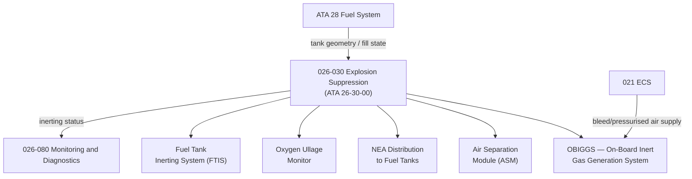

# ATLAS 020-029 · 02.026 · 026-030 — Explosion Suppression

## 1. Purpose

Define the architecture boundary for *Explosion Suppression* (ATA 26-30-00) within ATLAS subsection `026`. This section covers fuel tank inerting, centre-wing tank explosion prevention, nitrogen-enriched air (NEA) generation, and flammability reduction systems.

## 2. Scope

- Aligned to ATA SNS `26-30-00 Explosion Suppression`.
- Covers Fuel Tank Inerting System (FTIS), nitrogen-enriched air (NEA) generation via on-board inert gas generation system (OBIGGS), air separation module (ASM), NEA distribution to fuel tanks, oxygen ullage monitoring, and flammability reduction compliance per FAR/CS 25.981 and SFAR 88/EASA ALT.
- Includes fuel tank explosion prevention architecture for centre-wing, main wing, and auxiliary fuel tanks.
- Does not cover fire extinguishing agents (see `026-020`) or propulsion-specific flammability interfaces (see `026-070`).

**Safety boundary:** Fuel tank flammability and explosion suppression are safety-critical. OBIGGS/FTIS integrity, NEA concentration levels, ASM serviceability, and airworthiness evidence must be maintained with full lifecycle traceability.

## 3. System Architecture

## 4. Footprint

| Metric | Value |
|---|---|
| Architecture | `ATLAS` — Aircraft Top Level Architecture Schema/System |
| Master range | `000–099` |
| Code range | `020-029` |
| Section | `02` — Sistemas Core de Aeronave |
| Subsection | `026` — Fire Protection |
| Local section code | `026-030` |
| ATA SNS | `26-30-00` |
| Primary Q-Division | Q-AIR |
| Support Q-Divisions | Q-MECHANICS, Q-DATAGOV, Q-GREENTECH, Q-GROUND, Q-INDUSTRY |
| Governance class | `baseline` |
| Folder path | `Q+ATLANTIDE/000-099_ATLAS/020-029_Sistemas-Core-de-Aeronave/026_Fire-Protection/` |
| Document | `026-030-Explosion-Suppression.md` |
| Parent subsection | [`README.md`](./README.md) |

## 5. References

- ATA iSpec 2200 — Chapter 26-30, Explosion Suppression
- FAR/CS 25.981 — Fuel Tank Flammability Reduction
- SFAR 88 / EASA ALT — Fuel Tank Safety
- Q+ATLANTIDE controlled baseline [`organization/Q+ATLANTIDE.md`](../../../../organization/Q+ATLANTIDE.md)
- Subsection index [`./README.md`](./README.md)
- `026-020` Fire Extinguishing [`./026-020-Fire-Extinguishing.md`](./026-020-Fire-Extinguishing.md)
- `026-070` Hydrogen and Electric Propulsion Fire Safety Interfaces [`./026-070-Hydrogen-and-Electric-Propulsion-Fire-Safety-Interfaces.md`](./026-070-Hydrogen-and-Electric-Propulsion-Fire-Safety-Interfaces.md)
