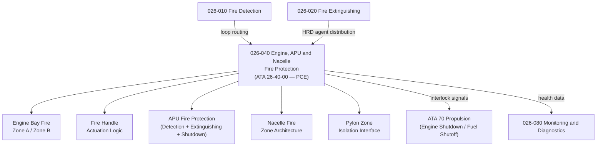

# ATLAS 020-029 · 02.026 · 026-040 — Engine, APU and Nacelle Fire Protection

## 1. Purpose

Define the architecture boundary for *Engine, APU and Nacelle Fire Protection* (ATA 26-40-00) within ATLAS subsection `026`. This section covers fire zone definitions for engine bays and nacelles, APU fire protection, fire handle actuation logic, drain mast fire protection, and pylon fire protection interfaces.

> **Programme-controlled extension.** This section covers engine/APU zone fire architecture and fire handle integration activated under programme authority. Architecture boundary and Q-Division assignments require formal programme review before population of detailed design data modules.

## 2. Scope

- Aligned to ATA SNS `26-40-00 Engine/APU/Nacelle Fire Protection` (programme-controlled extension of baseline ATA 26 scope).
- Covers engine bay fire zone definitions (A-zone/B-zone), overheat detection loop routing, fire handle interlocks (engine shutdown, fuel shutoff, hydraulic shutoff, extinguisher discharge), APU fire protection (detection, extinguishing, APU shutdown interlock), nacelle fire protection architecture, drain mast fire protection, and pylon zone isolation.
- Does not cover core detection loop hardware (see `026-010`), extinguishing bottles (see `026-020`), or hydrogen/electric propulsion specifics (see `026-070`).

**Safety boundary:** Engine and APU fire protection are safety-critical. Fire handle authority, zone isolation logic, agent discharge sequencing, and APU shutdown interlocks require certified design data modules and full maintenance evidence.

## 3. System Architecture

## 4. Footprint

| Metric | Value |
|---|---|
| Architecture | `ATLAS` — Aircraft Top Level Architecture Schema/System |
| Master range | `000–099` |
| Code range | `020-029` |
| Section | `02` — Sistemas Core de Aeronave |
| Subsection | `026` — Fire Protection |
| Local section code | `026-040` |
| ATA SNS | `26-40-00` |
| Status | `programme-controlled-extension` |
| Primary Q-Division | Q-AIR |
| Support Q-Divisions | Q-MECHANICS, Q-DATAGOV, Q-GREENTECH, Q-GROUND, Q-INDUSTRY |
| Governance class | `baseline` |
| Folder path | `Q+ATLANTIDE/000-099_ATLAS/020-029_Sistemas-Core-de-Aeronave/026_Fire-Protection/` |
| Document | `026-040-Engine-APU-and-Nacelle-Fire-Protection.md` |
| Parent subsection | [`README.md`](./README.md) |

## 5. References

- ATA iSpec 2200 — Chapter 26-40, Engine / APU Fire Protection
- CS/FAR 25 — Engine Fire Protection Requirements
- Q+ATLANTIDE controlled baseline [`organization/Q+ATLANTIDE.md`](../../../../organization/Q+ATLANTIDE.md)
- Subsection index [`./README.md`](./README.md)
- `026-010` Fire and Smoke Detection [`./026-010-Fire-and-Smoke-Detection.md`](./026-010-Fire-and-Smoke-Detection.md)
- `026-020` Fire Extinguishing [`./026-020-Fire-Extinguishing.md`](./026-020-Fire-Extinguishing.md)
- `026-070` Hydrogen and Electric Propulsion Fire Safety Interfaces [`./026-070-Hydrogen-and-Electric-Propulsion-Fire-Safety-Interfaces.md`](./026-070-Hydrogen-and-Electric-Propulsion-Fire-Safety-Interfaces.md)
