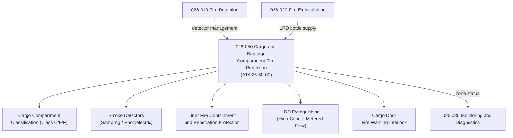

# ATLAS 020-029 · 02.026 · 026-050 — Cargo and Baggage Compartment Fire Protection

## 1. Purpose

Define the architecture boundary for *Cargo and Baggage Compartment Fire Protection* (ATA 26-50-00) within ATLAS subsection `026`. This section covers cargo compartment classification (Class C/E/F), smoke detection, fire suppression (high-concentration and metered discharge), liner integrity, and cargo door interlock interfaces.

## 2. Scope

- Aligned to ATA SNS `26-50-00 Cargo and Baggage Compartment Fire Protection`.
- Covers cargo compartment fire class definitions (Class C/E/F per CS/FAR 25.857), smoke detectors (photoelectric, sampling), liner fire containment and penetration protection, LRD extinguishing system (Halon 1301 or approved replacement), high-concentration initial shot and metered flow modes, cargo door fire warning interlock, and zonal isolation interfaces.
- Includes bulk cargo area and lower deck cargo zone protection architecture.
- Does not cover baggage-handling equipment fire hazards (see ATA 10/Q-GROUND), or cabin overhead bin smoke detection (see `026-060`).

**Safety boundary:** Cargo compartment fire protection is safety-critical. Detector sampling rates, liner integrity, extinguishing agent concentrations, and door interlock logic require certified data modules and full lifecycle evidence.

## 3. System Architecture

## 4. Footprint

| Metric | Value |
|---|---|
| Architecture | `ATLAS` — Aircraft Top Level Architecture Schema/System |
| Master range | `000–099` |
| Code range | `020-029` |
| Section | `02` — Sistemas Core de Aeronave |
| Subsection | `026` — Fire Protection |
| Local section code | `026-050` |
| ATA SNS | `26-50-00` |
| Primary Q-Division | Q-AIR |
| Support Q-Divisions | Q-MECHANICS, Q-DATAGOV, Q-GREENTECH, Q-GROUND, Q-INDUSTRY |
| Governance class | `baseline` |
| Folder path | `Q+ATLANTIDE/000-099_ATLAS/020-029_Sistemas-Core-de-Aeronave/026_Fire-Protection/` |
| Document | `026-050-Cargo-and-Baggage-Compartment-Fire-Protection.md` |
| Parent subsection | [`README.md`](./README.md) |

## 5. References

- ATA iSpec 2200 — Chapter 26-50, Cargo / Baggage Compartment Fire Protection
- CS/FAR 25.857 — Cargo Compartment Classification
- Q+ATLANTIDE controlled baseline [`organization/Q+ATLANTIDE.md`](../../../../organization/Q+ATLANTIDE.md)
- Subsection index [`./README.md`](./README.md)
- `026-010` Fire and Smoke Detection [`./026-010-Fire-and-Smoke-Detection.md`](./026-010-Fire-and-Smoke-Detection.md)
- `026-020` Fire Extinguishing [`./026-020-Fire-Extinguishing.md`](./026-020-Fire-Extinguishing.md)
- `026-060` Cabin, Lavatory and Equipment Bay Fire Protection [`./026-060-Cabin-Lavatory-and-Equipment-Bay-Fire-Protection.md`](./026-060-Cabin-Lavatory-and-Equipment-Bay-Fire-Protection.md)
