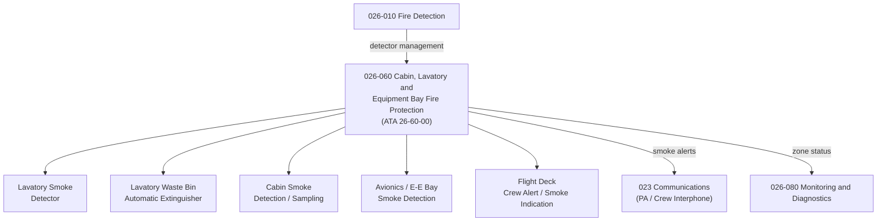

# ATLAS 020-029 · 02.026 · 026-060 — Cabin, Lavatory and Equipment Bay Fire Protection

## 1. Purpose

Define the architecture boundary for *Cabin, Lavatory and Equipment Bay Fire Protection* (ATA 26-60-00) within ATLAS subsection `026`. This section covers lavatory smoke detectors, automatic waste bin extinguishers, cabin smoke detection, avionics/equipment bay smoke detection, and fire containment boundaries within the pressurised cabin zone.

## 2. Scope

- Aligned to ATA SNS `26-60-00 Cabin/Lavatory/Equipment Bay Fire Protection`.
- Covers lavatory automatic extinguisher (waste bin), lavatory smoke detector, cabin smoke sampling/detection architecture, overhead bin fire containment, avionics equipment bay smoke detection (E/E bay), air conditioning bay smoke detection, and fire-resistant cabin material interfaces.
- Includes crew alerting and smoke indication on flight deck for cabin/lavatory smoke events.
- Does not cover cargo compartment protection (see `026-050`) or engine/APU zone protection (see `026-040`).

**Safety boundary:** Cabin and lavatory fire protection are safety-critical. Lavatory extinguisher serviceability, smoke detector coverage zones, and crew alerting integrity require certified data modules and full lifecycle evidence.

## 3. System Architecture

## 4. Footprint

| Metric | Value |
|---|---|
| Architecture | `ATLAS` — Aircraft Top Level Architecture Schema/System |
| Master range | `000–099` |
| Code range | `020-029` |
| Section | `02` — Sistemas Core de Aeronave |
| Subsection | `026` — Fire Protection |
| Local section code | `026-060` |
| ATA SNS | `26-60-00` |
| Primary Q-Division | Q-AIR |
| Support Q-Divisions | Q-MECHANICS, Q-DATAGOV, Q-GREENTECH, Q-GROUND, Q-INDUSTRY |
| Governance class | `baseline` |
| Folder path | `Q+ATLANTIDE/000-099_ATLAS/020-029_Sistemas-Core-de-Aeronave/026_Fire-Protection/` |
| Document | `026-060-Cabin-Lavatory-and-Equipment-Bay-Fire-Protection.md` |
| Parent subsection | [`README.md`](./README.md) |

## 5. References

- ATA iSpec 2200 — Chapter 26-60, Cabin / Lavatory Fire Protection
- CS/FAR 25.853 — Cabin Interior Fire Protection Requirements
- Q+ATLANTIDE controlled baseline [`organization/Q+ATLANTIDE.md`](../../../../organization/Q+ATLANTIDE.md)
- Subsection index [`./README.md`](./README.md)
- `026-010` Fire and Smoke Detection [`./026-010-Fire-and-Smoke-Detection.md`](./026-010-Fire-and-Smoke-Detection.md)
- `026-050` Cargo and Baggage Compartment Fire Protection [`./026-050-Cargo-and-Baggage-Compartment-Fire-Protection.md`](./026-050-Cargo-and-Baggage-Compartment-Fire-Protection.md)
- Section `023` Communications — Cabin PA Interface [`../023_Communications/README.md`](../023_Communications/README.md)
