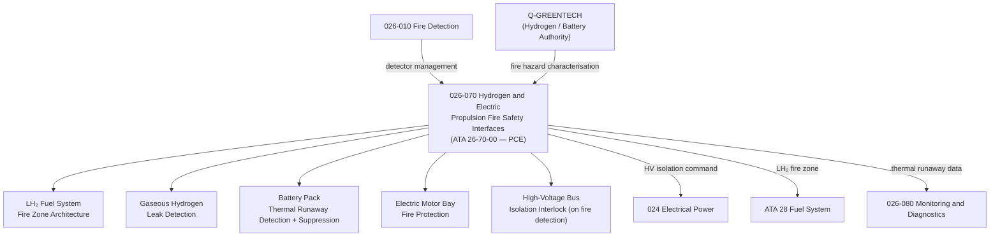

# ATLAS 020-029 · 02.026 · 026-070 — Hydrogen and Electric Propulsion Fire Safety Interfaces

## 1. Purpose

Define the architecture boundary for *Hydrogen and Electric Propulsion Fire Safety Interfaces* (ATA 26-70-00) within ATLAS subsection `026`. This section covers fire and explosion hazard mitigation for liquid/gaseous hydrogen fuel systems, high-energy battery packs, electric motor and power electronics fire safety zones, and thermal runaway detection and suppression interfaces.

> **Programme-controlled extension.** This section covers fire safety for novel propulsion systems (hydrogen and high-power electric drive) activated under programme authority. Architecture boundary and Q-Division assignments require formal programme review. Q-GREENTECH provides primary input on hydrogen and battery fire hazard characterisation; Q-AIR retains aircraft-level fire safety authority.

## 2. Scope

- Aligned to ATA SNS `26-70-00 Hydrogen / Electric Propulsion Fire Safety` (programme-controlled extension of baseline ATA 26 scope).
- Covers liquid hydrogen (LH₂) fuel system fire zone architecture, cryogenic vent fire risk interfaces, gaseous hydrogen leak detection, high-voltage battery pack thermal runaway detection and fire suppression, electric motor bay fire protection, power electronics thermal fire risk, and cross-system isolation interlocks for hydrogen and electric propulsion.
- Includes interfaces with ATA 28 (Fuel System) for LH₂ fuelling fire safety and with ATA 24 (Electrical Power) for high-voltage bus isolation on fire detection.
- Does not cover conventional engine/APU fire protection (see `026-040`) or standard fuel tank inerting (see `026-030`).

**Safety boundary:** Hydrogen and high-energy electric propulsion fire safety are safety-critical. Cryogenic vent hazard zones, thermal runaway suppression response times, high-voltage isolation interlocks, and novel extinguishing agent compatibility require certified design data modules and full airworthiness evidence.

## 3. System Architecture

## 4. Footprint

| Metric | Value |
|---|---|
| Architecture | `ATLAS` — Aircraft Top Level Architecture Schema/System |
| Master range | `000–099` |
| Code range | `020-029` |
| Section | `02` — Sistemas Core de Aeronave |
| Subsection | `026` — Fire Protection |
| Local section code | `026-070` |
| ATA SNS | `26-70-00` |
| Status | `programme-controlled-extension` |
| Primary Q-Division | Q-AIR |
| Support Q-Divisions | Q-MECHANICS, Q-DATAGOV, Q-GREENTECH, Q-GROUND, Q-INDUSTRY |
| Governance class | `baseline` |
| Folder path | `Q+ATLANTIDE/000-099_ATLAS/020-029_Sistemas-Core-de-Aeronave/026_Fire-Protection/` |
| Document | `026-070-Hydrogen-and-Electric-Propulsion-Fire-Safety-Interfaces.md` |
| Parent subsection | [`README.md`](./README.md) |

## 5. References

- ATA iSpec 2200 — Chapter 26, Fire Protection (extension for novel propulsion)
- CS-25 / AMC 20 — Hydrogen Aircraft Fire Safety (EASA emerging regulations)
- CS/FAR 25.863 — Flammable Fluid Fire Protection
- Q+ATLANTIDE controlled baseline [`organization/Q+ATLANTIDE.md`](../../../../organization/Q+ATLANTIDE.md)
- Subsection index [`./README.md`](./README.md)
- `026-030` Explosion Suppression [`./026-030-Explosion-Suppression.md`](./026-030-Explosion-Suppression.md)
- `026-040` Engine, APU and Nacelle Fire Protection [`./026-040-Engine-APU-and-Nacelle-Fire-Protection.md`](./026-040-Engine-APU-and-Nacelle-Fire-Protection.md)
- Section `024` Electrical Power — HV bus isolation [`../024_Electrical-Power/README.md`](../024_Electrical-Power/README.md)
