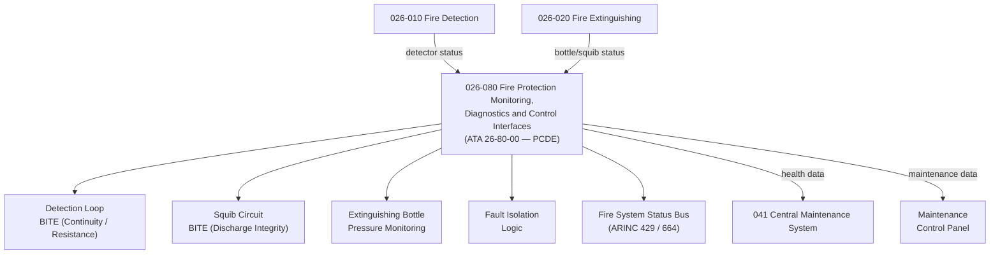

# ATLAS 020-029 · 02.026 · 026-080 — Fire Protection Monitoring, Diagnostics and Control Interfaces

## 1. Purpose

Define the architecture boundary for *Fire Protection Monitoring, Diagnostics and Control Interfaces* (ATA 26-80-00) within ATLAS subsection `026`. This section covers fire protection system health monitoring, BITE for detection loops and extinguishing squib circuits, centralised fault isolation logic, ARINC data bus interfaces for fire system status, and the Central Maintenance System (CMS) health data output.

> **Programme-controlled diagnostics extension.** This section covers monitoring, health management, and advanced diagnostics interfaces activated under programme authority. Architecture boundary and Q-Division assignments require formal programme review before population of detailed design data modules.

## 2. Scope

- Aligned to ATA SNS `26-80-00 Fire Protection Monitoring and Diagnostics` (programme-controlled diagnostics extension of baseline ATA 26 scope).
- Covers fire loop BITE (loop continuity, open/short circuit detection), extinguishing squib BITE (squib resistance monitoring, discharge circuit integrity), bottle pressure monitoring, smoke detector response time and sensitivity validation, centralised fire system status bus (ARINC 429/664), fault isolation logic, CMS health data interface, and maintenance control panel.
- Does not cover core detection hardware (see `026-010`), extinguishing bottles (see `026-020`), or zone-specific protection architecture.

## 3. System Architecture

## 4. Footprint

| Metric | Value |
|---|---|
| Architecture | `ATLAS` — Aircraft Top Level Architecture Schema/System |
| Master range | `000–099` |
| Code range | `020-029` |
| Section | `02` — Sistemas Core de Aeronave |
| Subsection | `026` — Fire Protection |
| Local section code | `026-080` |
| ATA SNS | `26-80-00` |
| Status | `programme-controlled-diagnostics-extension` |
| Primary Q-Division | Q-AIR |
| Support Q-Divisions | Q-MECHANICS, Q-DATAGOV, Q-GREENTECH, Q-GROUND, Q-INDUSTRY |
| Governance class | `baseline` |
| Folder path | `Q+ATLANTIDE/000-099_ATLAS/020-029_Sistemas-Core-de-Aeronave/026_Fire-Protection/` |
| Document | `026-080-Fire-Protection-Monitoring-Diagnostics-and-Control-Interfaces.md` |
| Parent subsection | [`README.md`](./README.md) |

## 5. References

- ATA iSpec 2200 — Chapter 26-80, Fire Protection Monitoring
- Q+ATLANTIDE controlled baseline [`organization/Q+ATLANTIDE.md`](../../../../organization/Q+ATLANTIDE.md)
- Subsection index [`./README.md`](./README.md)
- `026-010` Fire and Smoke Detection [`./026-010-Fire-and-Smoke-Detection.md`](./026-010-Fire-and-Smoke-Detection.md)
- `026-020` Fire Extinguishing [`./026-020-Fire-Extinguishing.md`](./026-020-Fire-Extinguishing.md)
- ATA 41 — Central Maintenance System (CMS)
