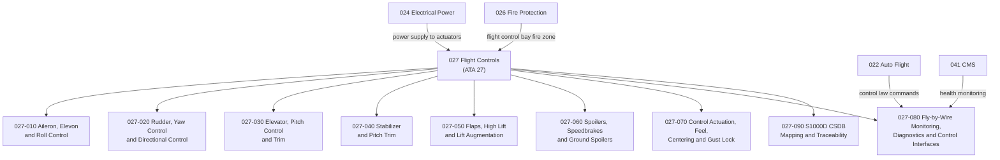

# ATLAS 020-029 · 02.027 · 027-000 — General

## 1. Purpose

Provide the general architectural definition for *Flight Controls* (ATA 27) within ATLAS subsection `027`. This section establishes the scope boundary, system family, Q-Division authority, and top-level structural context for all flight controls sections `027-010` through `027-090`.

## 2. Scope

- Defines the flight controls system family within the ATLAS-1000 register, aligned to ATA SNS `27-00-00 General`.
- Covers the architectural authority of `primary_q_division: Q-AIR` with support from Q-MECHANICS, Q-DATAGOV, Q-GREENTECH, Q-HPC, and Q-INDUSTRY.
- Applies to all aircraft-level flight control functions including aileron and roll control, rudder and yaw control, elevator and pitch control, stabilizer and pitch trim, flaps and high lift, spoilers and speedbrakes, control actuation and feel systems, fly-by-wire monitoring and diagnostics, and publication traceability.
- Does not replace certified ATA/S1000D task-specific maintenance, troubleshooting, operational, or software assurance data modules.

**Scope boundary:** This node covers aircraft flight control architecture across all primary and secondary control surfaces, fly-by-wire actuation, and control law interfaces. It does not replace certified ATA/S1000D task-specific maintenance, troubleshooting, or operational data modules.

**Safety boundary:** Flight controls are safety-critical. Any artefact derived from this node requires correct aircraft effectivity, fly-by-wire certification evidence, flight-control authority limits, actuator maintenance sign-off, control surface rigging data, and full lifecycle traceability.

## 3. System Architecture

## 4. Footprint

| Metric | Value |
|---|---|
| Architecture | `ATLAS` — Aircraft Top Level Architecture Schema/System |
| Master range | `000–099` |
| Code range | `020-029` |
| Section | `02` — Sistemas Core de Aeronave |
| Subsection | `027` — Flight Controls |
| Local section code | `027-000` |
| ATA SNS | `27-00-00` |
| Primary Q-Division | Q-AIR |
| Support Q-Divisions | Q-MECHANICS, Q-DATAGOV, Q-GREENTECH, Q-HPC, Q-INDUSTRY |
| Governance class | `baseline` |
| Folder path | `Q+ATLANTIDE/000-099_ATLAS/020-029_Sistemas-Core-de-Aeronave/027_Flight-Controls/` |
| Document | `027-000-General.md` |
| Parent subsection | [`README.md`](./README.md) |
| Parent section | [`../README.md`](../README.md) |
| Parent baseline | [`organization/Q+ATLANTIDE.md`](../../../../organization/Q+ATLANTIDE.md) |

## 5. References

- ATA iSpec 2200 — Chapter 27, Flight Controls
- Q+ATLANTIDE controlled baseline [`organization/Q+ATLANTIDE.md`](../../../../organization/Q+ATLANTIDE.md)
- ATLAS section index [`../README.md`](../README.md)
- Subsection index [`./README.md`](./README.md)
- Section `026-000` General — Fire Protection [`../026_Fire-Protection/026-000-General.md`](../026_Fire-Protection/026-000-General.md)
- Section `028-000` General — Fuel and Energy Storage [`../028_Fuel-and-Energy-Storage/028-000-General.md`](../028_Fuel-and-Energy-Storage/028-000-General.md)
