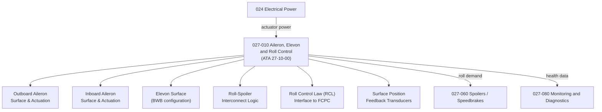

# ATLAS 020-029 · 02.027 · 027-010 — Aileron, Elevon and Roll Control

## 1. Purpose

Define the architecture boundary for *Aileron, Elevon and Roll Control* (ATA 27-10-00) within ATLAS subsection `027`. This section covers aileron and elevon surface architecture, roll control actuation, differential spoiler coordination, roll control law interfaces, and surface rigging and limit definitions for both conventional and blended-wing configurations.

## 2. Scope

- Aligned to ATA SNS `27-10-00 Aileron and Roll Control`.
- Covers inboard and outboard ailerons, elevon surfaces (blended-wing body configurations), roll control actuation systems (hydraulic, electro-hydraulic, electromechanical), aileron droop scheduling, roll-spoiler interconnect logic, roll control law (RCL) interface to the fly-by-wire flight control computer (FCPC), and surface position feedback transducers.
- Includes BITE for aileron actuator integrity and surface position monitoring.
- Does not cover lateral directional coupling (see `027-020`), high-lift roll assistance (see `027-050`), or roll spoiler actuation (see `027-060`).

**Safety boundary:** Aileron and roll control systems are safety-critical. Actuator serviceability, surface travel limits, rigging tolerances, fly-by-wire certification evidence, and maintenance sign-off must be preserved with full lifecycle evidence.

## 3. System Architecture

## 4. Footprint

| Metric | Value |
|---|---|
| Architecture | `ATLAS` — Aircraft Top Level Architecture Schema/System |
| Master range | `000–099` |
| Code range | `020-029` |
| Section | `02` — Sistemas Core de Aeronave |
| Subsection | `027` — Flight Controls |
| Local section code | `027-010` |
| ATA SNS | `27-10-00` |
| Primary Q-Division | Q-AIR |
| Support Q-Divisions | Q-MECHANICS, Q-DATAGOV, Q-GREENTECH, Q-HPC, Q-INDUSTRY |
| Governance class | `baseline` |
| Folder path | `Q+ATLANTIDE/000-099_ATLAS/020-029_Sistemas-Core-de-Aeronave/027_Flight-Controls/` |
| Document | `027-010-Aileron-Elevon-and-Roll-Control.md` |
| Parent subsection | [`README.md`](./README.md) |

## 5. References

- ATA iSpec 2200 — Chapter 27-10, Aileron and Roll Control
- Q+ATLANTIDE controlled baseline [`organization/Q+ATLANTIDE.md`](../../../../organization/Q+ATLANTIDE.md)
- Subsection index [`./README.md`](./README.md)
- `027-000` General [`./027-000-General.md`](./027-000-General.md)
- `027-060` Spoilers, Speedbrakes and Ground Spoilers [`./027-060-Spoilers-Speedbrakes-and-Ground-Spoilers.md`](./027-060-Spoilers-Speedbrakes-and-Ground-Spoilers.md)
- `027-080` Fly-by-Wire Monitoring, Diagnostics and Control Interfaces [`./027-080-Fly-by-Wire-Monitoring-Diagnostics-and-Control-Interfaces.md`](./027-080-Fly-by-Wire-Monitoring-Diagnostics-and-Control-Interfaces.md)
