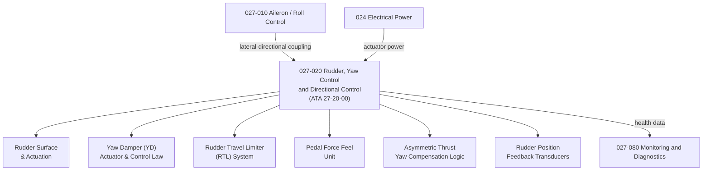

# ATLAS 020-029 · 02.027 · 027-020 — Rudder, Yaw Control and Directional Control

## 1. Purpose

Define the architecture boundary for *Rudder, Yaw Control and Directional Control* (ATA 27-20-00) within ATLAS subsection `027`. This section covers rudder surface architecture, yaw control actuation, yaw damper systems, asymmetric thrust compensation, directional control law interfaces, and rudder travel limiting systems.

## 2. Scope

- Aligned to ATA SNS `27-20-00 Rudder`.
- Covers upper and lower rudder panels (where applicable), rudder actuation (hydraulic and electromechanical), yaw damper (YD) actuators and control law, rudder travel limiter (RTL) and pedal force feel units, asymmetric thrust yaw compensation logic, crosswind ground handling control, and rudder position feedback transducers.
- Includes BITE for rudder actuator and yaw damper integrity.
- Does not cover lateral roll coupling (see `027-010`), Dutch roll damping in the pitch axis (see `027-030`), or directional trim in the stabilizer (see `027-040`).

**Safety boundary:** Rudder and yaw control systems are safety-critical. Rudder travel limits, yaw damper authority, actuator serviceability, fly-by-wire certification evidence, and maintenance sign-off must be preserved with full lifecycle evidence.

## 3. System Architecture

## 4. Footprint

| Metric | Value |
|---|---|
| Architecture | `ATLAS` — Aircraft Top Level Architecture Schema/System |
| Master range | `000–099` |
| Code range | `020-029` |
| Section | `02` — Sistemas Core de Aeronave |
| Subsection | `027` — Flight Controls |
| Local section code | `027-020` |
| ATA SNS | `27-20-00` |
| Primary Q-Division | Q-AIR |
| Support Q-Divisions | Q-MECHANICS, Q-DATAGOV, Q-GREENTECH, Q-HPC, Q-INDUSTRY |
| Governance class | `baseline` |
| Folder path | `Q+ATLANTIDE/000-099_ATLAS/020-029_Sistemas-Core-de-Aeronave/027_Flight-Controls/` |
| Document | `027-020-Rudder-Yaw-Control-and-Directional-Control.md` |
| Parent subsection | [`README.md`](./README.md) |

## 5. References

- ATA iSpec 2200 — Chapter 27-20, Rudder
- Q+ATLANTIDE controlled baseline [`organization/Q+ATLANTIDE.md`](../../../../organization/Q+ATLANTIDE.md)
- Subsection index [`./README.md`](./README.md)
- `027-000` General [`./027-000-General.md`](./027-000-General.md)
- `027-010` Aileron, Elevon and Roll Control [`./027-010-Aileron-Elevon-and-Roll-Control.md`](./027-010-Aileron-Elevon-and-Roll-Control.md)
- `027-080` Fly-by-Wire Monitoring, Diagnostics and Control Interfaces [`./027-080-Fly-by-Wire-Monitoring-Diagnostics-and-Control-Interfaces.md`](./027-080-Fly-by-Wire-Monitoring-Diagnostics-and-Control-Interfaces.md)
