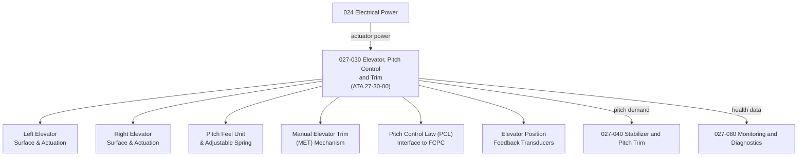

# ATLAS 020-029 · 02.027 · 027-030 — Elevator, Pitch Control and Trim

## 1. Purpose

Define the architecture boundary for *Elevator, Pitch Control and Trim* (ATA 27-30-00) within ATLAS subsection `027`. This section covers elevator surface architecture, pitch control actuation, elevator feel systems, pitch trim actuation, pitch control law interfaces, and surface position feedback for both conventional tail and canard configurations.

## 2. Scope

- Aligned to ATA SNS `27-30-00 Elevator`.
- Covers left and right elevator panels, elevator actuation (hydraulic and electromechanical), pitch feel unit and adjustable feel spring system, manual elevator trim (MET) wheel mechanism, autotrim function interface, pitch control law (PCL) interface to the fly-by-wire flight control primary computer (FCPC), elevator droop scheduling, and surface position feedback transducers.
- Includes BITE for elevator actuator integrity and trim runaway detection.
- Does not cover horizontal stabilizer trim (see `027-040`), canard pitch control where configured as an independent axis, or high-lift pitch effect (see `027-050`).

**Safety boundary:** Elevator and pitch control systems are safety-critical. Actuator serviceability, trim authority limits, runaway protection, fly-by-wire certification evidence, and maintenance sign-off must be preserved with full lifecycle evidence.

## 3. System Architecture

## 4. Footprint

| Metric | Value |
|---|---|
| Architecture | `ATLAS` — Aircraft Top Level Architecture Schema/System |
| Master range | `000–099` |
| Code range | `020-029` |
| Section | `02` — Sistemas Core de Aeronave |
| Subsection | `027` — Flight Controls |
| Local section code | `027-030` |
| ATA SNS | `27-30-00` |
| Primary Q-Division | Q-AIR |
| Support Q-Divisions | Q-MECHANICS, Q-DATAGOV, Q-GREENTECH, Q-HPC, Q-INDUSTRY |
| Governance class | `baseline` |
| Folder path | `Q+ATLANTIDE/000-099_ATLAS/020-029_Sistemas-Core-de-Aeronave/027_Flight-Controls/` |
| Document | `027-030-Elevator-Pitch-Control-and-Trim.md` |
| Parent subsection | [`README.md`](./README.md) |

## 5. References

- ATA iSpec 2200 — Chapter 27-30, Elevator
- Q+ATLANTIDE controlled baseline [`organization/Q+ATLANTIDE.md`](../../../../organization/Q+ATLANTIDE.md)
- Subsection index [`./README.md`](./README.md)
- `027-000` General [`./027-000-General.md`](./027-000-General.md)
- `027-040` Stabilizer and Pitch Trim [`./027-040-Stabilizer-and-Pitch-Trim.md`](./027-040-Stabilizer-and-Pitch-Trim.md)
- `027-080` Fly-by-Wire Monitoring, Diagnostics and Control Interfaces [`./027-080-Fly-by-Wire-Monitoring-Diagnostics-and-Control-Interfaces.md`](./027-080-Fly-by-Wire-Monitoring-Diagnostics-and-Control-Interfaces.md)
