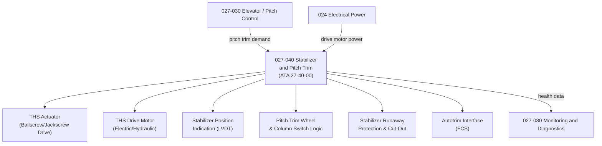

# ATLAS 020-029 · 02.027 · 027-040 — Stabilizer and Pitch Trim

## 1. Purpose

Define the architecture boundary for *Stabilizer and Pitch Trim* (ATA 27-40-00) within ATLAS subsection `027`. This section covers horizontal stabilizer structure and actuation, trimmable horizontal stabilizer (THS) drive mechanism, stabilizer position indication, pitch trim control interfaces, runaway protection, and stabilizer cut-out systems.

## 2. Scope

- Aligned to ATA SNS `27-40-00 Horizontal Stabilizer`.
- Covers the trimmable horizontal stabilizer (THS) assembly, THS actuator (ballscrew and jackscrew drive), stabilizer drive motor (electric or hydraulic), THS position indication and LVDT, pitch trim wheel and control column switch logic, autotrim interface from flight control system, stabilizer runaway protection and cut-out switch, and stabilizer structural attachment fittings.
- Includes BITE for THS actuator integrity and runaway detection logic.
- Does not cover elevator surface actuation (see `027-030`) or autopilot pitch authority (see `022 Auto Flight`).

**Safety boundary:** Horizontal stabilizer and pitch trim systems are safety-critical. Stabilizer runaway protection, trim authority limits, actuator serviceability, fly-by-wire certification evidence, and maintenance sign-off must be preserved with full lifecycle evidence.

## 3. System Architecture

## 4. Footprint

| Metric | Value |
|---|---|
| Architecture | `ATLAS` — Aircraft Top Level Architecture Schema/System |
| Master range | `000–099` |
| Code range | `020-029` |
| Section | `02` — Sistemas Core de Aeronave |
| Subsection | `027` — Flight Controls |
| Local section code | `027-040` |
| ATA SNS | `27-40-00` |
| Primary Q-Division | Q-AIR |
| Support Q-Divisions | Q-MECHANICS, Q-DATAGOV, Q-GREENTECH, Q-HPC, Q-INDUSTRY |
| Governance class | `baseline` |
| Folder path | `Q+ATLANTIDE/000-099_ATLAS/020-029_Sistemas-Core-de-Aeronave/027_Flight-Controls/` |
| Document | `027-040-Stabilizer-and-Pitch-Trim.md` |
| Parent subsection | [`README.md`](./README.md) |

## 5. References

- ATA iSpec 2200 — Chapter 27-40, Horizontal Stabilizer
- Q+ATLANTIDE controlled baseline [`organization/Q+ATLANTIDE.md`](../../../../organization/Q+ATLANTIDE.md)
- Subsection index [`./README.md`](./README.md)
- `027-000` General [`./027-000-General.md`](./027-000-General.md)
- `027-030` Elevator, Pitch Control and Trim [`./027-030-Elevator-Pitch-Control-and-Trim.md`](./027-030-Elevator-Pitch-Control-and-Trim.md)
- `027-080` Fly-by-Wire Monitoring, Diagnostics and Control Interfaces [`./027-080-Fly-by-Wire-Monitoring-Diagnostics-and-Control-Interfaces.md`](./027-080-Fly-by-Wire-Monitoring-Diagnostics-and-Control-Interfaces.md)
