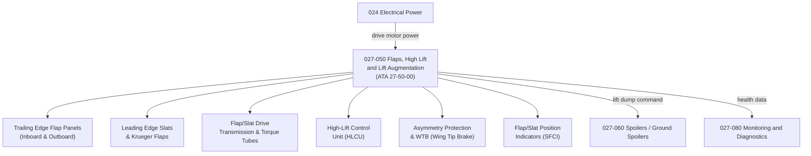

# ATLAS 020-029 · 02.027 · 027-050 — Flaps, High Lift and Lift Augmentation

## 1. Purpose

Define the architecture boundary for *Flaps, High Lift and Lift Augmentation* (ATA 27-50-00) within ATLAS subsection `027`. This section covers trailing edge flap and leading edge slat/krueger systems, flap/slat drive mechanisms, asymmetry protection, high-lift control unit (HLCU) logic, and flap position indication and scheduling.

## 2. Scope

- Aligned to ATA SNS `27-50-00 Trailing Edge Flaps`.
- Covers trailing edge flap panels (inboard and outboard), flap drive transmission and torque tubes, leading edge slats and Krueger flaps, high-lift control unit (HLCU), flap/slat asymmetry protection and WTB (Wing Tip Brake), flap lever position transducer, flap schedule (detents and continuous travel), flap load relief function, and slat/flap position indicators (SFCIs).
- Includes BITE for drive motor and asymmetry detection.
- Does not cover spoilers deployed for lift dump after landing (see `027-060`) or aileron droop scheduling interaction (see `027-010`).

**Safety boundary:** Flap and high-lift systems are safety-critical. Asymmetry protection, WTB functionality, drive motor serviceability, fly-by-wire certification evidence, and maintenance sign-off must be preserved with full lifecycle evidence.

## 3. System Architecture

## 4. Footprint

| Metric | Value |
|---|---|
| Architecture | `ATLAS` — Aircraft Top Level Architecture Schema/System |
| Master range | `000–099` |
| Code range | `020-029` |
| Section | `02` — Sistemas Core de Aeronave |
| Subsection | `027` — Flight Controls |
| Local section code | `027-050` |
| ATA SNS | `27-50-00` |
| Primary Q-Division | Q-AIR |
| Support Q-Divisions | Q-MECHANICS, Q-DATAGOV, Q-GREENTECH, Q-HPC, Q-INDUSTRY |
| Governance class | `baseline` |
| Folder path | `Q+ATLANTIDE/000-099_ATLAS/020-029_Sistemas-Core-de-Aeronave/027_Flight-Controls/` |
| Document | `027-050-Flaps-High-Lift-and-Lift-Augmentation.md` |
| Parent subsection | [`README.md`](./README.md) |

## 5. References

- ATA iSpec 2200 — Chapter 27-50, Trailing Edge Flaps
- Q+ATLANTIDE controlled baseline [`organization/Q+ATLANTIDE.md`](../../../../organization/Q+ATLANTIDE.md)
- Subsection index [`./README.md`](./README.md)
- `027-000` General [`./027-000-General.md`](./027-000-General.md)
- `027-060` Spoilers, Speedbrakes and Ground Spoilers [`./027-060-Spoilers-Speedbrakes-and-Ground-Spoilers.md`](./027-060-Spoilers-Speedbrakes-and-Ground-Spoilers.md)
- `027-080` Fly-by-Wire Monitoring, Diagnostics and Control Interfaces [`./027-080-Fly-by-Wire-Monitoring-Diagnostics-and-Control-Interfaces.md`](./027-080-Fly-by-Wire-Monitoring-Diagnostics-and-Control-Interfaces.md)
