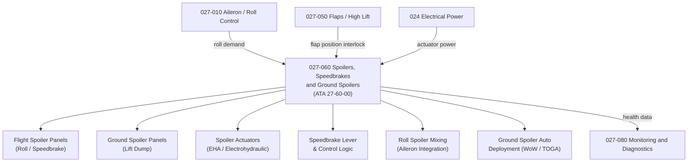

# ATLAS 020-029 · 02.027 · 027-060 — Spoilers, Speedbrakes and Ground Spoilers

## 1. Purpose

Define the architecture boundary for *Spoilers, Speedbrakes and Ground Spoilers* (ATA 27-60-00) within ATLAS subsection `027`. This section covers spoiler panel architecture, speedbrake actuation and control, roll spoiler scheduling, ground spoiler automatic deployment logic, and spoiler position indication.

## 2. Scope

- Aligned to ATA SNS `27-60-00 Drag Devices`.
- Covers flight spoiler panels (roll assistance and speedbrake), ground spoiler panels (lift dump), spoiler actuators (electrohydraulic servo actuators), speedbrake lever and control logic, roll spoiler mixing (aileron demand integration), ground spoiler automatic deployment (TOGA protection, main gear weight-on-wheels WoW), speedbrake limiting (with flap position interlock), and spoiler panel position feedback.
- Includes BITE for spoiler actuator and speedbrake lever switch integrity.
- Does not cover trailing edge flaps (see `027-050`) or aileron primary roll control (see `027-010`).

**Safety boundary:** Spoiler and speedbrake systems are safety-critical. Ground spoiler arming and automatic deployment logic, speedbrake flap interlocks, actuator serviceability, fly-by-wire certification evidence, and maintenance sign-off must be preserved with full lifecycle evidence.

## 3. System Architecture

## 4. Footprint

| Metric | Value |
|---|---|
| Architecture | `ATLAS` — Aircraft Top Level Architecture Schema/System |
| Master range | `000–099` |
| Code range | `020-029` |
| Section | `02` — Sistemas Core de Aeronave |
| Subsection | `027` — Flight Controls |
| Local section code | `027-060` |
| ATA SNS | `27-60-00` |
| Primary Q-Division | Q-AIR |
| Support Q-Divisions | Q-MECHANICS, Q-DATAGOV, Q-GREENTECH, Q-HPC, Q-INDUSTRY |
| Governance class | `baseline` |
| Folder path | `Q+ATLANTIDE/000-099_ATLAS/020-029_Sistemas-Core-de-Aeronave/027_Flight-Controls/` |
| Document | `027-060-Spoilers-Speedbrakes-and-Ground-Spoilers.md` |
| Parent subsection | [`README.md`](./README.md) |

## 5. References

- ATA iSpec 2200 — Chapter 27-60, Drag Devices
- Q+ATLANTIDE controlled baseline [`organization/Q+ATLANTIDE.md`](../../../../organization/Q+ATLANTIDE.md)
- Subsection index [`./README.md`](./README.md)
- `027-000` General [`./027-000-General.md`](./027-000-General.md)
- `027-010` Aileron, Elevon and Roll Control [`./027-010-Aileron-Elevon-and-Roll-Control.md`](./027-010-Aileron-Elevon-and-Roll-Control.md)
- `027-050` Flaps, High Lift and Lift Augmentation [`./027-050-Flaps-High-Lift-and-Lift-Augmentation.md`](./027-050-Flaps-High-Lift-and-Lift-Augmentation.md)
- `027-080` Fly-by-Wire Monitoring, Diagnostics and Control Interfaces [`./027-080-Fly-by-Wire-Monitoring-Diagnostics-and-Control-Interfaces.md`](./027-080-Fly-by-Wire-Monitoring-Diagnostics-and-Control-Interfaces.md)
