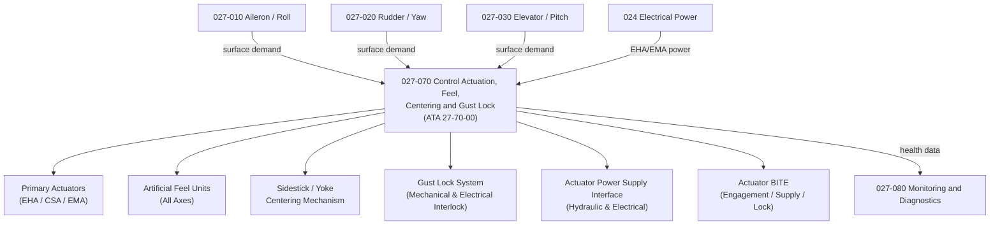

# ATLAS 020-029 · 02.027 · 027-070 — Control Actuation, Feel, Centering and Gust Lock

## 1. Purpose

Define the architecture boundary for *Control Actuation, Feel, Centering and Gust Lock* (ATA 27-70-00) within ATLAS subsection `027`. This section covers the primary flight control actuation architecture, artificial feel systems, centering mechanisms for sidestick or yoke, gust lock system, and the servo-actuation power supply envelope applicable to all primary flight control surfaces.

## 2. Scope

- Aligned to ATA SNS `27-70-00 Gust Lock and Damper System`.
- Covers primary flight control actuation (Electro-Hydraulic Actuators EHA, conventional hydraulic servo actuators CSA, electromechanical actuators EMA), artificial feel units for all axes, sidestick controller or control column centering and coupling, gust lock mechanical and electrical interlocks, actuator power supply interface (hydraulic and electrical), and actuator position transducers across all primary surfaces.
- Includes BITE for actuator engagement, hydraulic supply, and gust lock arming status.
- Does not cover secondary surface actuation (flaps, spoilers) which are addressed in `027-050` and `027-060`.

**Safety boundary:** Primary control actuation is safety-critical. Gust lock release interlocks, actuator authority limits, power supply integrity, fly-by-wire certification evidence, and maintenance sign-off must be preserved with full lifecycle evidence.

## 3. System Architecture

## 4. Footprint

| Metric | Value |
|---|---|
| Architecture | `ATLAS` — Aircraft Top Level Architecture Schema/System |
| Master range | `000–099` |
| Code range | `020-029` |
| Section | `02` — Sistemas Core de Aeronave |
| Subsection | `027` — Flight Controls |
| Local section code | `027-070` |
| ATA SNS | `27-70-00` |
| Primary Q-Division | Q-AIR |
| Support Q-Divisions | Q-MECHANICS, Q-DATAGOV, Q-GREENTECH, Q-HPC, Q-INDUSTRY |
| Governance class | `baseline` |
| Folder path | `Q+ATLANTIDE/000-099_ATLAS/020-029_Sistemas-Core-de-Aeronave/027_Flight-Controls/` |
| Document | `027-070-Control-Actuation-Feel-Centering-and-Gust-Lock.md` |
| Parent subsection | [`README.md`](./README.md) |

## 5. References

- ATA iSpec 2200 — Chapter 27-70, Gust Lock and Damper System
- Q+ATLANTIDE controlled baseline [`organization/Q+ATLANTIDE.md`](../../../../organization/Q+ATLANTIDE.md)
- Subsection index [`./README.md`](./README.md)
- `027-000` General [`./027-000-General.md`](./027-000-General.md)
- `027-010` Aileron, Elevon and Roll Control [`./027-010-Aileron-Elevon-and-Roll-Control.md`](./027-010-Aileron-Elevon-and-Roll-Control.md)
- `027-020` Rudder, Yaw Control and Directional Control [`./027-020-Rudder-Yaw-Control-and-Directional-Control.md`](./027-020-Rudder-Yaw-Control-and-Directional-Control.md)
- `027-030` Elevator, Pitch Control and Trim [`./027-030-Elevator-Pitch-Control-and-Trim.md`](./027-030-Elevator-Pitch-Control-and-Trim.md)
- `027-080` Fly-by-Wire Monitoring, Diagnostics and Control Interfaces [`./027-080-Fly-by-Wire-Monitoring-Diagnostics-and-Control-Interfaces.md`](./027-080-Fly-by-Wire-Monitoring-Diagnostics-and-Control-Interfaces.md)
