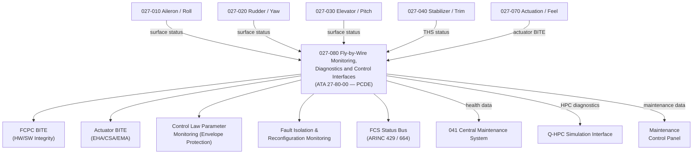

# ATLAS 020-029 · 02.027 · 027-080 — Fly-by-Wire Monitoring, Diagnostics and Control Interfaces

## 1. Purpose

Define the architecture boundary for *Fly-by-Wire Monitoring, Diagnostics and Control Interfaces* (ATA 27-80-00) within ATLAS subsection `027`. This section covers FBW flight control system health monitoring, BITE for flight control primary computers (FCPCs) and actuators, control law parameter monitoring, ARINC data bus interfaces for flight control system status, and the Central Maintenance System (CMS) health data output.

> **Programme-controlled diagnostics extension.** This section covers monitoring, health management, and advanced diagnostics interfaces activated under programme authority. Architecture boundary and Q-Division assignments require formal programme review before population of detailed design data modules.

## 2. Scope

- Aligned to ATA SNS `27-80-00 Fly-by-Wire Monitoring and Diagnostics` (programme-controlled diagnostics extension of baseline ATA 27 scope).
- Covers FCPC (Flight Control Primary Computer) BITE (hardware and software integrity monitoring), actuator BITE (EHA, CSA, EMA engagement, hydraulic supply, position feedback), control law parameter monitoring (envelope protection, alpha and load factor limits), ARINC 429/664 flight control status data bus, fault isolation and reconfiguration monitoring, CMS health data interface, maintenance control panel, and HPC-assisted control law simulation diagnostics interface.
- Does not cover core surface hardware (see `027-010` through `027-070`) or autopilot authority (see `022 Auto Flight`).

## 3. System Architecture

## 4. Footprint

| Metric | Value |
|---|---|
| Architecture | `ATLAS` — Aircraft Top Level Architecture Schema/System |
| Master range | `000–099` |
| Code range | `020-029` |
| Section | `02` — Sistemas Core de Aeronave |
| Subsection | `027` — Flight Controls |
| Local section code | `027-080` |
| ATA SNS | `27-80-00` |
| Status | `programme-controlled-diagnostics-extension` |
| Primary Q-Division | Q-AIR |
| Support Q-Divisions | Q-MECHANICS, Q-DATAGOV, Q-GREENTECH, Q-HPC, Q-INDUSTRY |
| Governance class | `baseline` |
| Folder path | `Q+ATLANTIDE/000-099_ATLAS/020-029_Sistemas-Core-de-Aeronave/027_Flight-Controls/` |
| Document | `027-080-Fly-by-Wire-Monitoring-Diagnostics-and-Control-Interfaces.md` |
| Parent subsection | [`README.md`](./README.md) |

## 5. References

- ATA iSpec 2200 — Chapter 27-80, Fly-by-Wire Monitoring
- Q+ATLANTIDE controlled baseline [`organization/Q+ATLANTIDE.md`](../../../../organization/Q+ATLANTIDE.md)
- Subsection index [`./README.md`](./README.md)
- `027-010` Aileron, Elevon and Roll Control [`./027-010-Aileron-Elevon-and-Roll-Control.md`](./027-010-Aileron-Elevon-and-Roll-Control.md)
- `027-070` Control Actuation, Feel, Centering and Gust Lock [`./027-070-Control-Actuation-Feel-Centering-and-Gust-Lock.md`](./027-070-Control-Actuation-Feel-Centering-and-Gust-Lock.md)
- ATA 41 — Central Maintenance System (CMS)
