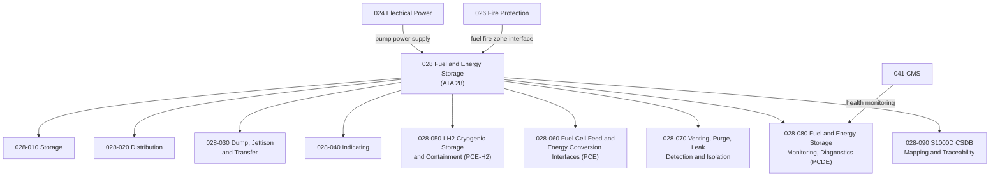

# ATLAS 020-029 · 02.028 · 028-000 — General

## 1. Purpose

Provide the general architectural definition for *Fuel and Energy Storage* (ATA 28) within ATLAS subsection `028`. This section establishes the scope boundary, system family, Q-Division authority, and top-level structural context for all fuel and energy storage sections `028-010` through `028-090`, including conventional Jet-A storage and the extended H₂ cryogenic and fuel cell architectures.

## 2. Scope

- Defines the fuel and energy storage system family within the ATLAS-1000 register, aligned to ATA SNS `28-00-00 General`.
- Covers the architectural authority of `primary_q_division: Q-AIR` with support from Q-MECHANICS, Q-DATAGOV, Q-GREENTECH, Q-GROUND, and Q-INDUSTRY.
- Applies to all aircraft-level fuel and energy storage functions including conventional fuel storage and distribution, fuel transfer, dump and jettison, fuel quantity indication, LH₂ cryogenic storage, fuel cell energy conversion interfaces, venting and leak detection, monitoring and diagnostics, and publication traceability.
- Does not replace certified ATA/S1000D task-specific maintenance, troubleshooting, operational, or software assurance data modules.

**Scope boundary:** This node covers aircraft fuel and energy storage architecture across all tank configurations (wing, centre, trim, belly), conventional and cryogenic propellant storage, and fuel cell energy interfaces. It does not replace certified ATA/S1000D task-specific maintenance, troubleshooting, or operational data modules.

**Safety boundary:** Fuel and energy storage is safety-critical. Any artefact derived from this node requires correct aircraft effectivity, fuel system certification evidence, fire hazard zone definitions, H₂ cryogenic safety compliance, tank structural integrity data, maintenance sign-off evidence, and lifecycle traceability.

## 3. System Architecture

## 4. Footprint

| Metric | Value |
|---|---|
| Architecture | `ATLAS` — Aircraft Top Level Architecture Schema/System |
| Master range | `000–099` |
| Code range | `020-029` |
| Section | `02` — Sistemas Core de Aeronave |
| Subsection | `028` — Fuel and Energy Storage |
| Local section code | `028-000` |
| ATA SNS | `28-00-00` |
| Primary Q-Division | Q-AIR |
| Support Q-Divisions | Q-MECHANICS, Q-DATAGOV, Q-GREENTECH, Q-GROUND, Q-INDUSTRY |
| Governance class | `baseline` |
| Folder path | `Q+ATLANTIDE/000-099_ATLAS/020-029_Sistemas-Core-de-Aeronave/028_Fuel-and-Energy-Storage/` |
| Document | `028-000-General.md` |
| Parent subsection | [`README.md`](./README.md) |
| Parent section | [`../README.md`](../README.md) |
| Parent baseline | [`organization/Q+ATLANTIDE.md`](../../../../organization/Q+ATLANTIDE.md) |

## 5. References

- ATA iSpec 2200 — Chapter 28, Fuel
- Q+ATLANTIDE controlled baseline [`organization/Q+ATLANTIDE.md`](../../../../organization/Q+ATLANTIDE.md)
- ATLAS section index [`../README.md`](../README.md)
- Subsection index [`./README.md`](./README.md)
- Section `027-000` General — Flight Controls [`../027_Flight-Controls/027-000-General.md`](../027_Flight-Controls/027-000-General.md)
- Section `026-000` General — Fire Protection [`../026_Fire-Protection/026-000-General.md`](../026_Fire-Protection/026-000-General.md)
