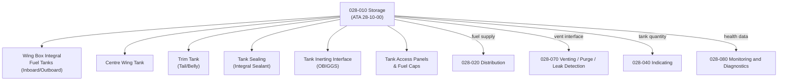

# ATLAS 020-029 · 02.028 · 028-010 — Storage

## 1. Purpose

Define the architecture boundary for *Fuel Storage* (ATA 28-10-00) within ATLAS subsection `028`. This section covers conventional Jet-A fuel tank structure, tank bay configuration, integral and bladder tank types, tank sealing and access provisions, and the fuel tank structural attachment interfaces within the wing and fuselage.

## 2. Scope

- Aligned to ATA SNS `28-10-00 Storage`.
- Covers wing box integral fuel tanks (inboard and outboard), centre wing tank, trim tank (tail or belly), tank sump and drain points, tank bay access panels and fuel caps, fuel tank sealing (integral sealant application), tank pressurisation and inerting interface (OBIGGS), fuel tank structural stiffeners and rib interfaces, and fuel tank capacity and usable volume data.
- Includes structural interface definitions for Q-MECHANICS and ground fuelling infrastructure for Q-GROUND.
- Does not cover fuel distribution piping and valves (see `028-020`), LH₂ cryogenic storage (see `028-050`), or venting systems (see `028-070`).

**Safety boundary:** Fuel storage is safety-critical. Tank structural integrity, sealing compliance, inerting system serviceability, fire hazard zone proximity, maintenance sign-off, and lifecycle traceability must be preserved with full certification evidence.

## 3. System Architecture

## 4. Footprint

| Metric | Value |
|---|---|
| Architecture | `ATLAS` — Aircraft Top Level Architecture Schema/System |
| Master range | `000–099` |
| Code range | `020-029` |
| Section | `02` — Sistemas Core de Aeronave |
| Subsection | `028` — Fuel and Energy Storage |
| Local section code | `028-010` |
| ATA SNS | `28-10-00` |
| Primary Q-Division | Q-AIR |
| Support Q-Divisions | Q-MECHANICS, Q-DATAGOV, Q-GREENTECH, Q-GROUND, Q-INDUSTRY |
| Governance class | `baseline` |
| Folder path | `Q+ATLANTIDE/000-099_ATLAS/020-029_Sistemas-Core-de-Aeronave/028_Fuel-and-Energy-Storage/` |
| Document | `028-010-Storage.md` |
| Parent subsection | [`README.md`](./README.md) |

## 5. References

- ATA iSpec 2200 — Chapter 28-10, Storage
- Q+ATLANTIDE controlled baseline [`organization/Q+ATLANTIDE.md`](../../../../organization/Q+ATLANTIDE.md)
- Subsection index [`./README.md`](./README.md)
- `028-000` General [`./028-000-General.md`](./028-000-General.md)
- `028-020` Distribution [`./028-020-Distribution.md`](./028-020-Distribution.md)
- `028-070` Venting, Purge, Leak Detection and Isolation [`./028-070-Venting-Purge-Leak-Detection-and-Isolation.md`](./028-070-Venting-Purge-Leak-Detection-and-Isolation.md)
- `028-080` Fuel and Energy Storage Monitoring, Diagnostics and Control Interfaces [`./028-080-Fuel-and-Energy-Storage-Monitoring-Diagnostics-and-Control-Interfaces.md`](./028-080-Fuel-and-Energy-Storage-Monitoring-Diagnostics-and-Control-Interfaces.md)
