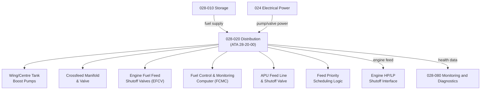

# ATLAS 020-029 · 02.028 · 028-020 — Distribution

## 1. Purpose

Define the architecture boundary for *Fuel Distribution* (ATA 28-20-00) within ATLAS subsection `028`. This section covers fuel feed and distribution piping, boost pumps, crossfeed valves, engine feed valves, fuel manifold architecture, and the fuel control system logic governing fuel routing from tanks to engines under normal, abnormal and emergency conditions.

## 2. Scope

- Aligned to ATA SNS `28-20-00 Distribution`.
- Covers wing tank boost pumps (inboard and outboard), centre tank boost pumps, crossfeed manifold and crossfeed valve, engine fuel feed lines and shutoff valves (EFCV), fuel control and monitoring computer (FCMC) distribution logic, APU feed line and shutoff valve, fuel feed priority scheduling, and LP/HP fuel shutoff interfaces to engines.
- Includes BITE for pump run status, valve position feedback, and crossfeed valve integrity.
- Does not cover fuel quantity measurement (see `028-040`), transfer and jettison (see `028-030`), or fuel cell feed interfaces (see `028-060`).

**Safety boundary:** Fuel distribution is safety-critical. Engine feed valve positions, boost pump serviceability, crossfeed logic, fire shutoff valve function, maintenance sign-off, and lifecycle traceability must be preserved with full certification evidence.

## 3. System Architecture

## 4. Footprint

| Metric | Value |
|---|---|
| Architecture | `ATLAS` — Aircraft Top Level Architecture Schema/System |
| Master range | `000–099` |
| Code range | `020-029` |
| Section | `02` — Sistemas Core de Aeronave |
| Subsection | `028` — Fuel and Energy Storage |
| Local section code | `028-020` |
| ATA SNS | `28-20-00` |
| Primary Q-Division | Q-AIR |
| Support Q-Divisions | Q-MECHANICS, Q-DATAGOV, Q-GREENTECH, Q-GROUND, Q-INDUSTRY |
| Governance class | `baseline` |
| Folder path | `Q+ATLANTIDE/000-099_ATLAS/020-029_Sistemas-Core-de-Aeronave/028_Fuel-and-Energy-Storage/` |
| Document | `028-020-Distribution.md` |
| Parent subsection | [`README.md`](./README.md) |

## 5. References

- ATA iSpec 2200 — Chapter 28-20, Distribution
- Q+ATLANTIDE controlled baseline [`organization/Q+ATLANTIDE.md`](../../../../organization/Q+ATLANTIDE.md)
- Subsection index [`./README.md`](./README.md)
- `028-000` General [`./028-000-General.md`](./028-000-General.md)
- `028-010` Storage [`./028-010-Storage.md`](./028-010-Storage.md)
- `028-030` Dump, Jettison and Transfer [`./028-030-Dump-Jettison-and-Transfer.md`](./028-030-Dump-Jettison-and-Transfer.md)
- `028-080` Fuel and Energy Storage Monitoring, Diagnostics and Control Interfaces [`./028-080-Fuel-and-Energy-Storage-Monitoring-Diagnostics-and-Control-Interfaces.md`](./028-080-Fuel-and-Energy-Storage-Monitoring-Diagnostics-and-Control-Interfaces.md)
