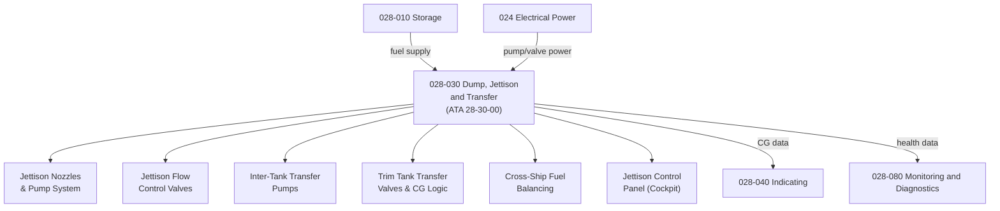

# ATLAS 020-029 · 02.028 · 028-030 — Dump, Jettison and Transfer

## 1. Purpose

Define the architecture boundary for *Fuel Dump, Jettison and Transfer* (ATA 28-30-00) within ATLAS subsection `028`. This section covers fuel jettison system architecture, fuel transfer between tanks, tank-to-tank balancing logic, centre of gravity (CG) fuel management, and jettison control panel and valve interfaces.

## 2. Scope

- Aligned to ATA SNS `28-30-00 Dump`.
- Covers fuel jettison nozzles and jettison pump architecture, jettison flow control valves, jettison rate control and minimum fuel protection, inter-tank transfer pumps, trim tank transfer valves and CG management logic, cross-ship fuel balancing, jettison control panel (cockpit), FCMC transfer and jettison logic, and over-wing and under-wing gravity transfer provisions.
- Includes BITE for jettison valve position and transfer pump run status.
- Does not cover fuel distribution to engines (see `028-020`) or tank storage design (see `028-010`).

**Safety boundary:** Fuel jettison and transfer are safety-critical operations. Minimum fuel protection logic, jettison valve arming, transfer pump serviceability, CG limits, maintenance sign-off, and lifecycle traceability must be preserved with full certification evidence.

## 3. System Architecture

## 4. Footprint

| Metric | Value |
|---|---|
| Architecture | `ATLAS` — Aircraft Top Level Architecture Schema/System |
| Master range | `000–099` |
| Code range | `020-029` |
| Section | `02` — Sistemas Core de Aeronave |
| Subsection | `028` — Fuel and Energy Storage |
| Local section code | `028-030` |
| ATA SNS | `28-30-00` |
| Primary Q-Division | Q-AIR |
| Support Q-Divisions | Q-MECHANICS, Q-DATAGOV, Q-GREENTECH, Q-GROUND, Q-INDUSTRY |
| Governance class | `baseline` |
| Folder path | `Q+ATLANTIDE/000-099_ATLAS/020-029_Sistemas-Core-de-Aeronave/028_Fuel-and-Energy-Storage/` |
| Document | `028-030-Dump-Jettison-and-Transfer.md` |
| Parent subsection | [`README.md`](./README.md) |

## 5. References

- ATA iSpec 2200 — Chapter 28-30, Dump
- Q+ATLANTIDE controlled baseline [`organization/Q+ATLANTIDE.md`](../../../../organization/Q+ATLANTIDE.md)
- Subsection index [`./README.md`](./README.md)
- `028-000` General [`./028-000-General.md`](./028-000-General.md)
- `028-010` Storage [`./028-010-Storage.md`](./028-010-Storage.md)
- `028-040` Indicating [`./028-040-Indicating.md`](./028-040-Indicating.md)
- `028-080` Fuel and Energy Storage Monitoring, Diagnostics and Control Interfaces [`./028-080-Fuel-and-Energy-Storage-Monitoring-Diagnostics-and-Control-Interfaces.md`](./028-080-Fuel-and-Energy-Storage-Monitoring-Diagnostics-and-Control-Interfaces.md)
