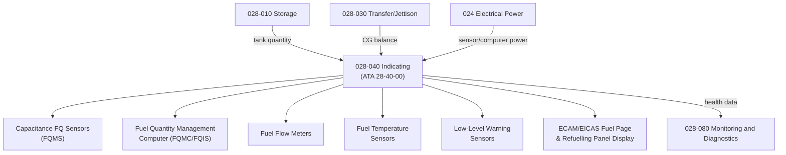

# ATLAS 020-029 · 02.028 · 028-040 — Indicating

## 1. Purpose

Define the architecture boundary for *Fuel Indicating* (ATA 28-40-00) within ATLAS subsection `028`. This section covers fuel quantity measurement and indication, fuel flow measurement, fuel temperature sensors, CG fuel balance indication, and fuel management computer display interfaces for conventional Jet-A fuel systems.

## 2. Scope

- Aligned to ATA SNS `28-40-00 Indicating`.
- Covers capacitance fuel quantity sensors (FQMS), fuel quantity management computer (FQMC/FQIS), fuel flow meters, fuel temperature sensors, low-level warning sensors, cockpit ECAM/EICAS fuel page displays, refuelling panel quantity indication, CG fuel balance display and alerting, BITE for sensor and FQMS integrity, and ground refuelling quantity pre-selection.
- Does not cover fuel distribution valves and pumps (see `028-020`), transfer logic (see `028-030`), or LH₂ quantity measurement (see `028-050`).

**Safety boundary:** Fuel quantity measurement is safety-critical. Sensor calibration, FQMS integrity, low-level warnings, maintenance sign-off, and lifecycle traceability must be preserved with full certification evidence.

## 3. System Architecture

## 4. Footprint

| Metric | Value |
|---|---|
| Architecture | `ATLAS` — Aircraft Top Level Architecture Schema/System |
| Master range | `000–099` |
| Code range | `020-029` |
| Section | `02` — Sistemas Core de Aeronave |
| Subsection | `028` — Fuel and Energy Storage |
| Local section code | `028-040` |
| ATA SNS | `28-40-00` |
| Primary Q-Division | Q-AIR |
| Support Q-Divisions | Q-MECHANICS, Q-DATAGOV, Q-GREENTECH, Q-GROUND, Q-INDUSTRY |
| Governance class | `baseline` |
| Folder path | `Q+ATLANTIDE/000-099_ATLAS/020-029_Sistemas-Core-de-Aeronave/028_Fuel-and-Energy-Storage/` |
| Document | `028-040-Indicating.md` |
| Parent subsection | [`README.md`](./README.md) |

## 5. References

- ATA iSpec 2200 — Chapter 28-40, Indicating
- Q+ATLANTIDE controlled baseline [`organization/Q+ATLANTIDE.md`](../../../../organization/Q+ATLANTIDE.md)
- Subsection index [`./README.md`](./README.md)
- `028-000` General [`./028-000-General.md`](./028-000-General.md)
- `028-010` Storage [`./028-010-Storage.md`](./028-010-Storage.md)
- `028-080` Fuel and Energy Storage Monitoring, Diagnostics and Control Interfaces [`./028-080-Fuel-and-Energy-Storage-Monitoring-Diagnostics-and-Control-Interfaces.md`](./028-080-Fuel-and-Energy-Storage-Monitoring-Diagnostics-and-Control-Interfaces.md)
