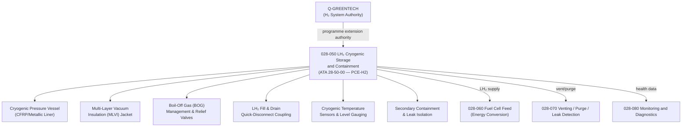

# ATLAS 020-029 · 02.028 · 028-050 — LH2 Cryogenic Storage and Containment

## 1. Purpose

Define the architecture boundary for *LH₂ Cryogenic Storage and Containment* (ATA 28-50-00) within ATLAS subsection `028`. This section covers liquid hydrogen cryogenic tank vessel design, multi-layer vacuum insulation (MLVI), pressure vessel certification, cryogenic boil-off management, fill and drain systems, and the containment safety architecture for aircraft-integrated LH₂ storage.

> **Programme-controlled H2 storage extension.** This section covers LH₂ cryogenic storage architecture activated under programme authority. Architecture boundary and Q-Division assignments require formal programme review and H₂ safety authority approval before population of detailed design data modules.

## 2. Scope

- Aligned to ATA SNS `28-50-00 LH₂ Cryogenic Storage` (programme-controlled H2 storage extension of baseline ATA 28 scope).
- Covers cryogenic pressure vessel (CFRP or metallic liner), multi-layer vacuum insulation (MLVI) and vacuum jacket, boil-off gas (BOG) management and relief valves, LH₂ fill and drain quick-disconnect coupling, tank inner vessel and outer jacket pressure relief, cryogenic temperature sensors and liquid level gauging, structural mounting and thermal break interfaces, and secondary containment for LH₂ leak isolation.
- Does not cover conventional Jet-A storage (see `028-010`), LH₂ feed to fuel cells (see `028-060`), or venting architecture (see `028-070`).

**Safety boundary:** LH₂ cryogenic storage is safety-critical and subject to H₂ hazardous material regulations. Cryogenic pressure vessel certification, vacuum integrity, boil-off management, fire and explosion hazard zones, cryogenic safety compliance (EASA CS-25 / special conditions), maintenance sign-off, and lifecycle traceability must be preserved with full certification evidence.

## 3. System Architecture

## 4. Footprint

| Metric | Value |
|---|---|
| Architecture | `ATLAS` — Aircraft Top Level Architecture Schema/System |
| Master range | `000–099` |
| Code range | `020-029` |
| Section | `02` — Sistemas Core de Aeronave |
| Subsection | `028` — Fuel and Energy Storage |
| Local section code | `028-050` |
| ATA SNS | `28-50-00` |
| Status | `programme-controlled-H2-storage-extension` |
| Primary Q-Division | Q-AIR |
| Support Q-Divisions | Q-MECHANICS, Q-DATAGOV, Q-GREENTECH, Q-GROUND, Q-INDUSTRY |
| Governance class | `baseline` |
| Folder path | `Q+ATLANTIDE/000-099_ATLAS/020-029_Sistemas-Core-de-Aeronave/028_Fuel-and-Energy-Storage/` |
| Document | `028-050-LH2-Cryogenic-Storage-and-Containment.md` |
| Parent subsection | [`README.md`](./README.md) |

## 5. References

- ATA iSpec 2200 — Chapter 28-50 (extended for H₂)
- EASA CS-25 Special Conditions — Hydrogen Fuel Systems
- Q+ATLANTIDE controlled baseline [`organization/Q+ATLANTIDE.md`](../../../../organization/Q+ATLANTIDE.md)
- Subsection index [`./README.md`](./README.md)
- `028-000` General [`./028-000-General.md`](./028-000-General.md)
- `028-060` Fuel Cell Feed and Energy Conversion Interfaces [`./028-060-Fuel-Cell-Feed-and-Energy-Conversion-Interfaces.md`](./028-060-Fuel-Cell-Feed-and-Energy-Conversion-Interfaces.md)
- `028-070` Venting, Purge, Leak Detection and Isolation [`./028-070-Venting-Purge-Leak-Detection-and-Isolation.md`](./028-070-Venting-Purge-Leak-Detection-and-Isolation.md)
- `028-080` Fuel and Energy Storage Monitoring, Diagnostics and Control Interfaces [`./028-080-Fuel-and-Energy-Storage-Monitoring-Diagnostics-and-Control-Interfaces.md`](./028-080-Fuel-and-Energy-Storage-Monitoring-Diagnostics-and-Control-Interfaces.md)
