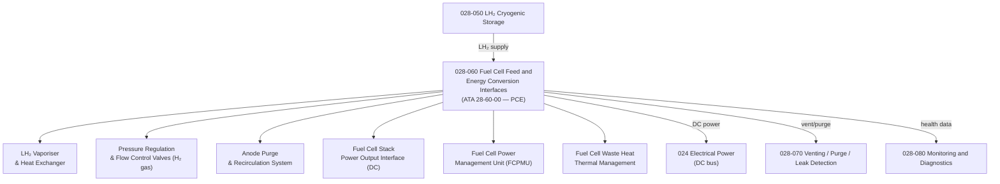

# ATLAS 020-029 · 02.028 · 028-060 — Fuel Cell Feed and Energy Conversion Interfaces

## 1. Purpose

Define the architecture boundary for *Fuel Cell Feed and Energy Conversion Interfaces* (ATA 28-60-00) within ATLAS subsection `028`. This section covers the hydrogen gas conditioning and feed system from LH₂ cryogenic storage to the fuel cell stack, heat exchanger vaporisation, pressure regulation, fuel cell power output interfaces, and the energy management system integration for H₂-electric propulsion architectures.

> **Programme-controlled extension.** This section covers LH₂ fuel cell feed and energy conversion interfaces activated under programme authority. Architecture boundary and Q-Division assignments require formal programme review and H₂ safety authority approval before population of detailed design data modules.

## 2. Scope

- Aligned to ATA SNS `28-60-00 Fuel Cell Feed and Energy Conversion` (programme-controlled extension of baseline ATA 28 scope).
- Covers LH₂ vaporiser and heat exchanger (cryogenic-to-gaseous H₂), pressure regulation and flow control valves (H₂ gas supply), purge and recirculation system for fuel cell anode, fuel cell stack power output interface (DC bus), fuel cell power management unit (FCPMU), thermal management of fuel cell waste heat, and energy management system (EMS) interface for H₂-electric hybrid architectures.
- Does not cover LH₂ cryogenic tank vessel design (see `028-050`), venting and purge safety architecture (see `028-070`), or aircraft electrical power distribution (see `024`).

**Safety boundary:** Fuel cell feed and energy conversion are safety-critical. H₂ gas pressure regulation, flow control valve integrity, fuel cell stack isolation, thermal management, H₂ explosion hazard zone compliance, maintenance sign-off, and lifecycle traceability must be preserved with full certification evidence.

## 3. System Architecture

## 4. Footprint

| Metric | Value |
|---|---|
| Architecture | `ATLAS` — Aircraft Top Level Architecture Schema/System |
| Master range | `000–099` |
| Code range | `020-029` |
| Section | `02` — Sistemas Core de Aeronave |
| Subsection | `028` — Fuel and Energy Storage |
| Local section code | `028-060` |
| ATA SNS | `28-60-00` |
| Status | `programme-controlled-extension` |
| Primary Q-Division | Q-AIR |
| Support Q-Divisions | Q-MECHANICS, Q-DATAGOV, Q-GREENTECH, Q-GROUND, Q-INDUSTRY |
| Governance class | `baseline` |
| Folder path | `Q+ATLANTIDE/000-099_ATLAS/020-029_Sistemas-Core-de-Aeronave/028_Fuel-and-Energy-Storage/` |
| Document | `028-060-Fuel-Cell-Feed-and-Energy-Conversion-Interfaces.md` |
| Parent subsection | [`README.md`](./README.md) |

## 5. References

- ATA iSpec 2200 — Chapter 28-60 (extended for H₂ fuel cell)
- EASA CS-25 Special Conditions — Hydrogen Fuel Systems
- Q+ATLANTIDE controlled baseline [`organization/Q+ATLANTIDE.md`](../../../../organization/Q+ATLANTIDE.md)
- Subsection index [`./README.md`](./README.md)
- `028-000` General [`./028-000-General.md`](./028-000-General.md)
- `028-050` LH₂ Cryogenic Storage and Containment [`./028-050-LH2-Cryogenic-Storage-and-Containment.md`](./028-050-LH2-Cryogenic-Storage-and-Containment.md)
- `028-070` Venting, Purge, Leak Detection and Isolation [`./028-070-Venting-Purge-Leak-Detection-and-Isolation.md`](./028-070-Venting-Purge-Leak-Detection-and-Isolation.md)
- `028-080` Fuel and Energy Storage Monitoring, Diagnostics and Control Interfaces [`./028-080-Fuel-and-Energy-Storage-Monitoring-Diagnostics-and-Control-Interfaces.md`](./028-080-Fuel-and-Energy-Storage-Monitoring-Diagnostics-and-Control-Interfaces.md)
- Section `024` — Electrical Power [`../024_Electrical-Power/024-000-General.md`](../024_Electrical-Power/024-000-General.md)
