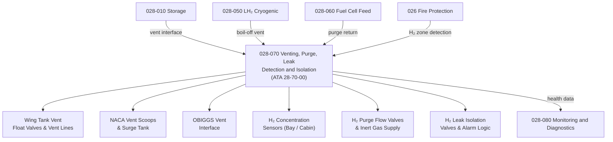

# ATLAS 020-029 · 02.028 · 028-070 — Venting, Purge, Leak Detection and Isolation

## 1. Purpose

Define the architecture boundary for *Venting, Purge, Leak Detection and Isolation* (ATA 28-70-00) within ATLAS subsection `028`. This section covers conventional fuel tank venting, vent float valves, NACA vent scoops, fuel vapour inerting (OBIGGS interface), and for H₂-extended architectures: gaseous hydrogen leak detection, H₂ concentration sensors, purge system for fuel cell anode and cryogenic lines, and isolation valve actuation on leak detection.

## 2. Scope

- Aligned to ATA SNS `28-70-00 Venting` (baseline, extended for H₂ leak detection where applicable).
- Covers wing tank vent float valves and vent lines, NACA inlet vent scoops, NACA surge tank and overboard vent, OBIGGS (On-Board Inert Gas Generation System) vent interface, gaseous H₂ concentration sensors (cabin, fuel cell bay, equipment zones), H₂ purge flow valves and inert gas purge supply, H₂ leak isolation valves, and leak detection alarm logic.
- Includes BITE for H₂ sensor calibration status and isolation valve position.
- Does not cover LH₂ tank vessel design (see `028-050`) or fuel distribution valves (see `028-020`).

**Safety boundary:** Fuel venting, H₂ purge, and leak detection are safety-critical functions with fire and explosion hazard implications. Sensor calibration, isolation valve function, H₂ concentration alarm thresholds, maintenance sign-off, and lifecycle traceability must be preserved with full certification evidence.

## 3. System Architecture

## 4. Footprint

| Metric | Value |
|---|---|
| Architecture | `ATLAS` — Aircraft Top Level Architecture Schema/System |
| Master range | `000–099` |
| Code range | `020-029` |
| Section | `02` — Sistemas Core de Aeronave |
| Subsection | `028` — Fuel and Energy Storage |
| Local section code | `028-070` |
| ATA SNS | `28-70-00` |
| Primary Q-Division | Q-AIR |
| Support Q-Divisions | Q-MECHANICS, Q-DATAGOV, Q-GREENTECH, Q-GROUND, Q-INDUSTRY |
| Governance class | `baseline` |
| Folder path | `Q+ATLANTIDE/000-099_ATLAS/020-029_Sistemas-Core-de-Aeronave/028_Fuel-and-Energy-Storage/` |
| Document | `028-070-Venting-Purge-Leak-Detection-and-Isolation.md` |
| Parent subsection | [`README.md`](./README.md) |

## 5. References

- ATA iSpec 2200 — Chapter 28-70, Venting
- EASA CS-25 Special Conditions — Hydrogen Fuel Systems (vent and purge provisions)
- Q+ATLANTIDE controlled baseline [`organization/Q+ATLANTIDE.md`](../../../../organization/Q+ATLANTIDE.md)
- Subsection index [`./README.md`](./README.md)
- `028-000` General [`./028-000-General.md`](./028-000-General.md)
- `028-010` Storage [`./028-010-Storage.md`](./028-010-Storage.md)
- `028-050` LH₂ Cryogenic Storage and Containment [`./028-050-LH2-Cryogenic-Storage-and-Containment.md`](./028-050-LH2-Cryogenic-Storage-and-Containment.md)
- `028-080` Fuel and Energy Storage Monitoring, Diagnostics and Control Interfaces [`./028-080-Fuel-and-Energy-Storage-Monitoring-Diagnostics-and-Control-Interfaces.md`](./028-080-Fuel-and-Energy-Storage-Monitoring-Diagnostics-and-Control-Interfaces.md)
- `026` Fire Protection — H₂ fire zone interface [`../026_Fire-Protection/026-000-General.md`](../026_Fire-Protection/026-000-General.md)
