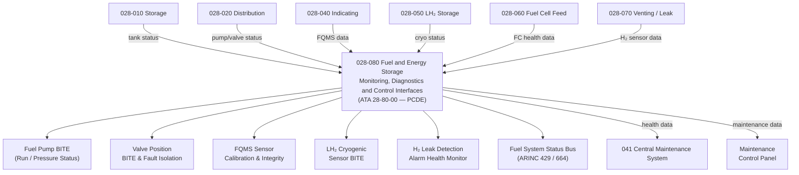

# ATLAS 020-029 · 02.028 · 028-080 — Fuel and Energy Storage Monitoring, Diagnostics and Control Interfaces

## 1. Purpose

Define the architecture boundary for *Fuel and Energy Storage Monitoring, Diagnostics and Control Interfaces* (ATA 28-80-00) within ATLAS subsection `028`. This section covers fuel system health monitoring, BITE for pumps, valves, FQMS sensors and cryogenic systems, centralised fault isolation logic, ARINC data bus interfaces for fuel system status, H₂ system health data, and the Central Maintenance System (CMS) health data output.

> **Programme-controlled diagnostics extension.** This section covers monitoring, health management, and advanced diagnostics interfaces activated under programme authority. Architecture boundary and Q-Division assignments require formal programme review before population of detailed design data modules.

## 2. Scope

- Aligned to ATA SNS `28-80-00 Fuel and Energy Storage Monitoring and Diagnostics` (programme-controlled diagnostics extension of baseline ATA 28 scope).
- Covers fuel pump run and pressure BITE, fuel valve position feedback and fault isolation, FQMS sensor calibration and integrity monitoring, LH₂ cryogenic sensor BITE (temperature, level, pressure), H₂ leak detection alarm health monitoring, fuel cell feed system diagnostic interface, ARINC 429/664 fuel system status data bus, fault isolation logic, CMS health data interface, and maintenance control panel.
- Does not cover core fuel tank hardware (see `028-010`), distribution valves and pumps (see `028-020`), or cryogenic vessel design (see `028-050`).

## 3. System Architecture

## 4. Footprint

| Metric | Value |
|---|---|
| Architecture | `ATLAS` — Aircraft Top Level Architecture Schema/System |
| Master range | `000–099` |
| Code range | `020-029` |
| Section | `02` — Sistemas Core de Aeronave |
| Subsection | `028` — Fuel and Energy Storage |
| Local section code | `028-080` |
| ATA SNS | `28-80-00` |
| Status | `programme-controlled-diagnostics-extension` |
| Primary Q-Division | Q-AIR |
| Support Q-Divisions | Q-MECHANICS, Q-DATAGOV, Q-GREENTECH, Q-GROUND, Q-INDUSTRY |
| Governance class | `baseline` |
| Folder path | `Q+ATLANTIDE/000-099_ATLAS/020-029_Sistemas-Core-de-Aeronave/028_Fuel-and-Energy-Storage/` |
| Document | `028-080-Fuel-and-Energy-Storage-Monitoring-Diagnostics-and-Control-Interfaces.md` |
| Parent subsection | [`README.md`](./README.md) |

## 5. References

- ATA iSpec 2200 — Chapter 28-80, Fuel Monitoring
- Q+ATLANTIDE controlled baseline [`organization/Q+ATLANTIDE.md`](../../../../organization/Q+ATLANTIDE.md)
- Subsection index [`./README.md`](./README.md)
- `028-010` Storage [`./028-010-Storage.md`](./028-010-Storage.md)
- `028-050` LH₂ Cryogenic Storage and Containment [`./028-050-LH2-Cryogenic-Storage-and-Containment.md`](./028-050-LH2-Cryogenic-Storage-and-Containment.md)
- `028-060` Fuel Cell Feed and Energy Conversion Interfaces [`./028-060-Fuel-Cell-Feed-and-Energy-Conversion-Interfaces.md`](./028-060-Fuel-Cell-Feed-and-Energy-Conversion-Interfaces.md)
- ATA 41 — Central Maintenance System (CMS)
