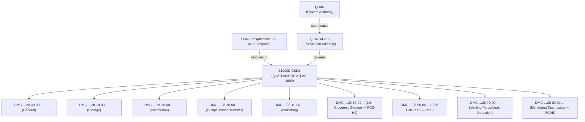

# ATLAS 020-029 · 02.028 · 028-090 — S1000D CSDB Mapping and Traceability

## 1. Purpose

Provide the complete S1000D CSDB Data Module Code (DMC) mapping for all sections within ATLAS subsection `028` — *Fuel and Energy Storage*, and define the Q+ATLANTIDE URN scheme for this subsection. This section enables bidirectional traceability between the ATLAS taxonomy and the S1000D-compliant Common Source Database (CSDB).

> **Programme-controlled publication and traceability extension.** This section is managed by Q-AIR in coordination with Q-DATAGOV and requires programme publication authority before CSDB records are issued.

## 2. Scope

- Provides the full ATA SNS-to-DMC mapping table for sections `028-000` through `028-080`.
- Defines the Q+ATLANTIDE URN scheme: `urn:qatl:atlas:020-029:028:{section-code}`.
- Establishes information type codes (IMC) and applicable information sets (Info Code) for each section.
- Does not contain narrative technical content — section files `028-000` through `028-080` carry the substantive architecture content.

## 3. CSDB Mapping Table

| Section | ATA SNS | DMC (example schema) | IMC | Info Code | Q+ATLANTIDE URN |
|---|---|---|---|---|---|
| 028-000 | 28-00-00 | DMC-QATL-A-28-00-00-00A-018A-A | 018 | General | `urn:qatl:atlas:020-029:028:000` |
| 028-010 | 28-10-00 | DMC-QATL-A-28-10-00-00A-018A-A | 018 | General | `urn:qatl:atlas:020-029:028:010` |
| 028-020 | 28-20-00 | DMC-QATL-A-28-20-00-00A-018A-A | 018 | General | `urn:qatl:atlas:020-029:028:020` |
| 028-030 | 28-30-00 | DMC-QATL-A-28-30-00-00A-018A-A | 018 | General | `urn:qatl:atlas:020-029:028:030` |
| 028-040 | 28-40-00 | DMC-QATL-A-28-40-00-00A-018A-A | 018 | General | `urn:qatl:atlas:020-029:028:040` |
| 028-050 | 28-50-00 | DMC-QATL-A-28-50-00-00A-018A-A | 018 | General (PCE-H2) | `urn:qatl:atlas:020-029:028:050` |
| 028-060 | 28-60-00 | DMC-QATL-A-28-60-00-00A-018A-A | 018 | General (PCE) | `urn:qatl:atlas:020-029:028:060` |
| 028-070 | 28-70-00 | DMC-QATL-A-28-70-00-00A-018A-A | 018 | General | `urn:qatl:atlas:020-029:028:070` |
| 028-080 | 28-80-00 | DMC-QATL-A-28-80-00-00A-018A-A | 018 | General (PCDE) | `urn:qatl:atlas:020-029:028:080` |

**URN scheme:** `urn:qatl:atlas:020-029:028:{section-code}`

**DMC schema note:** `DMC-QATL-A-{ATA-chapter}-{subsystem}-{subject}-{unit}-{DM-code}-{variant}-{applicability}` — schema instance codes are illustrative; final codes require CSDB configuration authority sign-off.

## 4. Traceability Architecture

## 5. Footprint

| Metric | Value |
|---|---|
| Architecture | `ATLAS` — Aircraft Top Level Architecture Schema/System |
| Master range | `000–099` |
| Code range | `020-029` |
| Section | `02` — Sistemas Core de Aeronave |
| Subsection | `028` — Fuel and Energy Storage |
| Local section code | `028-090` |
| ATA SNS | `28-90-00` |
| Status | `programme-controlled-publication-and-traceability-extension` |
| Primary Q-Division | Q-AIR |
| Support Q-Divisions | Q-MECHANICS, Q-DATAGOV, Q-GREENTECH, Q-GROUND, Q-INDUSTRY |
| Governance class | `baseline` |
| URN base | `urn:qatl:atlas:020-029:028:` |
| Folder path | `Q+ATLANTIDE/000-099_ATLAS/020-029_Sistemas-Core-de-Aeronave/028_Fuel-and-Energy-Storage/` |
| Document | `028-090-S1000D-CSDB-Mapping-and-Traceability.md` |
| Parent subsection | [`README.md`](./README.md) |
| Parent baseline | [`organization/Q+ATLANTIDE.md`](../../../../organization/Q+ATLANTIDE.md) |

## 6. References

- S1000D Issue 5.0 — Data Module Code structure and CSDB configuration management
- ATA iSpec 2200 — Chapter 28, Fuel
- Q+ATLANTIDE controlled baseline [`organization/Q+ATLANTIDE.md`](../../../../organization/Q+ATLANTIDE.md)
- Subsection index [`./README.md`](./README.md)
- `028-000` General [`./028-000-General.md`](./028-000-General.md)
- `027-090` S1000D CSDB Mapping (027) [`../027_Flight-Controls/027-090-S1000D-CSDB-Mapping-and-Traceability.md`](../027_Flight-Controls/027-090-S1000D-CSDB-Mapping-and-Traceability.md)
- `026-090` S1000D CSDB Mapping (026) [`../026_Fire-Protection/026-090-S1000D-CSDB-Mapping-and-Traceability.md`](../026_Fire-Protection/026-090-S1000D-CSDB-Mapping-and-Traceability.md)
