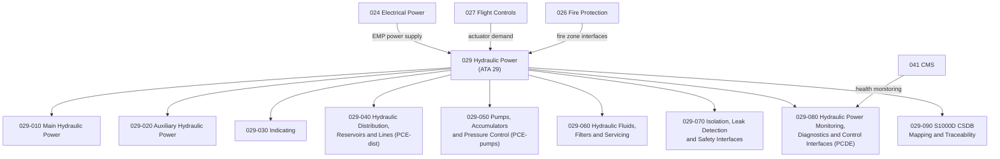

# ATLAS 020-029 · 02.029 · 029-000 — General

## 1. Purpose

Provide the general architectural definition for *Hydraulic Power* (ATA 29) within ATLAS subsection `029`. This section establishes the scope boundary, system family, Q-Division authority, and top-level structural context for all hydraulic power sections `029-010` through `029-090`, covering main and auxiliary hydraulic generation, distribution, servicing, and extended monitoring architectures.

## 2. Scope

- Defines the hydraulic power system family within the ATLAS-1000 register, aligned to ATA SNS `29-00-00 General`.
- Covers the architectural authority of `primary_q_division: Q-AIR` with support from Q-MECHANICS, Q-DATAGOV, Q-GREENTECH, Q-GROUND, and Q-INDUSTRY.
- Applies to all aircraft-level hydraulic power functions including main hydraulic generation, auxiliary hydraulic power, hydraulic indicating and quantity, distribution reservoirs and lines, pumps and accumulators, fluid servicing, isolation and leak detection, and monitoring and diagnostics.
- Does not replace certified ATA/S1000D task-specific maintenance, troubleshooting, operational, or software assurance data modules.

**Scope boundary:** This node covers aircraft hydraulic power architecture across engine-driven pumps, electric motor pumps, ram air turbine hydraulic power, auxiliary power unit hydraulic outputs, and ground servicing connections. It does not replace certified ATA/S1000D task-specific maintenance, troubleshooting, or operational data modules.

**Safety boundary:** Hydraulic power is flight-critical. Any artefact derived from this node requires correct aircraft effectivity, hydraulic system certification evidence, fire hazard zone definitions, structural load data for actuator pressure classes, maintenance sign-off evidence, and lifecycle traceability.

## 3. System Architecture

## 4. Footprint

| Metric | Value |
|---|---|
| Architecture | `ATLAS` — Aircraft Top Level Architecture Schema/System |
| Master range | `000–099` |
| Code range | `020-029` |
| Section | `02` — Sistemas Core de Aeronave |
| Subsection | `029` — Hydraulic Power |
| Local section code | `029-000` |
| ATA SNS | `29-00-00` |
| Primary Q-Division | Q-AIR |
| Support Q-Divisions | Q-MECHANICS, Q-DATAGOV, Q-GREENTECH, Q-GROUND, Q-INDUSTRY |
| Governance class | `baseline` |
| Folder path | `Q+ATLANTIDE/000-099_ATLAS/020-029_Sistemas-Core-de-Aeronave/029_Hydraulic-Power/` |
| Document | `029-000-General.md` |
| Parent subsection | [`README.md`](./README.md) |
| Parent section | [`../README.md`](../README.md) |
| Parent baseline | [`organization/Q+ATLANTIDE.md`](../../../../organization/Q+ATLANTIDE.md) |

## 5. References

- ATA iSpec 2200 — Chapter 29, Hydraulic Power
- Q+ATLANTIDE controlled baseline [`organization/Q+ATLANTIDE.md`](../../../../organization/Q+ATLANTIDE.md)
- ATLAS section index [`../README.md`](../README.md)
- Subsection index [`./README.md`](./README.md)
- Section `027-000` General — Flight Controls [`../027_Flight-Controls/027-000-General.md`](../027_Flight-Controls/027-000-General.md)
- Section `028-000` General — Fuel and Energy Storage [`../028_Fuel-and-Energy-Storage/028-000-General.md`](../028_Fuel-and-Energy-Storage/028-000-General.md)
