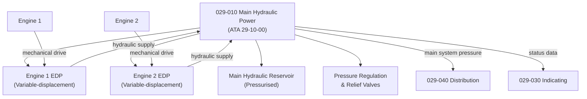

# ATLAS 020-029 · 02.029 · 029-010 — Main Hydraulic Power

## 1. Purpose

Define the architecture boundary for *Main Hydraulic Power* (ATA 29-10-00) within ATLAS subsection `029`. This section covers engine-driven hydraulic pump systems, main hydraulic circuit generation, system pressure regulation, and the primary hydraulic power architecture serving flight control actuators and primary aircraft systems.

## 2. Scope

- Aligned to ATA SNS `29-10-00 Main Hydraulic Power`.
- Covers engine-driven hydraulic pumps (EDPs), main hydraulic system pressure limits, variable-displacement pump control, main reservoir circuits, hydraulic pressure switches and relief valves, and primary circuit suction and return lines.
- Does not cover auxiliary hydraulic power sources (see `029-020`), distribution routing (see `029-040`), or pump diagnostics beyond the main generation boundary (see `029-080`).

## 3. System Architecture

## 4. Footprint

| Metric | Value |
|---|---|
| Architecture | `ATLAS` — Aircraft Top Level Architecture Schema/System |
| Master range | `000–099` |
| Code range | `020-029` |
| Section | `02` — Sistemas Core de Aeronave |
| Subsection | `029` — Hydraulic Power |
| Local section code | `029-010` |
| ATA SNS | `29-10-00` |
| Primary Q-Division | Q-AIR |
| Support Q-Divisions | Q-MECHANICS, Q-DATAGOV, Q-GREENTECH, Q-GROUND, Q-INDUSTRY |
| Governance class | `baseline` |
| Folder path | `Q+ATLANTIDE/000-099_ATLAS/020-029_Sistemas-Core-de-Aeronave/029_Hydraulic-Power/` |
| Document | `029-010-Main-Hydraulic-Power.md` |
| Parent subsection | [`README.md`](./README.md) |

## 5. References

- ATA iSpec 2200 — Chapter 29-10, Main Hydraulic Power
- Q+ATLANTIDE controlled baseline [`organization/Q+ATLANTIDE.md`](../../../../organization/Q+ATLANTIDE.md)
- Subsection index [`./README.md`](./README.md)
- `029-000` General [`./029-000-General.md`](./029-000-General.md)
- `029-020` Auxiliary Hydraulic Power [`./029-020-Auxiliary-Hydraulic-Power.md`](./029-020-Auxiliary-Hydraulic-Power.md)
