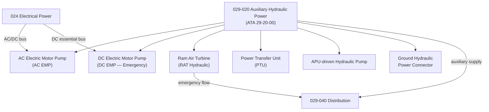

# ATLAS 020-029 · 02.029 · 029-020 — Auxiliary Hydraulic Power

## 1. Purpose

Define the architecture boundary for *Auxiliary Hydraulic Power* (ATA 29-20-00) within ATLAS subsection `029`. This section covers electric motor pumps (EMPs), ram air turbine (RAT) hydraulic power, APU-driven hydraulic generation, and power transfer units (PTUs) that supplement main hydraulic generation under degraded or emergency conditions.

## 2. Scope

- Aligned to ATA SNS `29-20-00 Auxiliary Hydraulic Power`.
- Covers electric motor-driven pumps (AC and DC), ram air turbine hydraulic output, APU-driven hydraulic pump, power transfer unit between hydraulic systems, ground hydraulic power connector, and priority valve logic for auxiliary supply sequencing.
- Does not cover main engine-driven pump systems (see `029-010`), distribution routing (see `029-040`), or extended EMP monitoring beyond auxiliary generation boundary (see `029-080`).

## 3. System Architecture

## 4. Footprint

| Metric | Value |
|---|---|
| Architecture | `ATLAS` — Aircraft Top Level Architecture Schema/System |
| Master range | `000–099` |
| Code range | `020-029` |
| Section | `02` — Sistemas Core de Aeronave |
| Subsection | `029` — Hydraulic Power |
| Local section code | `029-020` |
| ATA SNS | `29-20-00` |
| Primary Q-Division | Q-AIR |
| Support Q-Divisions | Q-MECHANICS, Q-DATAGOV, Q-GREENTECH, Q-GROUND, Q-INDUSTRY |
| Governance class | `baseline` |
| Folder path | `Q+ATLANTIDE/000-099_ATLAS/020-029_Sistemas-Core-de-Aeronave/029_Hydraulic-Power/` |
| Document | `029-020-Auxiliary-Hydraulic-Power.md` |
| Parent subsection | [`README.md`](./README.md) |

## 5. References

- ATA iSpec 2200 — Chapter 29-20, Auxiliary Hydraulic Power
- Q+ATLANTIDE controlled baseline [`organization/Q+ATLANTIDE.md`](../../../../organization/Q+ATLANTIDE.md)
- Subsection index [`./README.md`](./README.md)
- `029-000` General [`./029-000-General.md`](./029-000-General.md)
- `029-010` Main Hydraulic Power [`./029-010-Main-Hydraulic-Power.md`](./029-010-Main-Hydraulic-Power.md)
