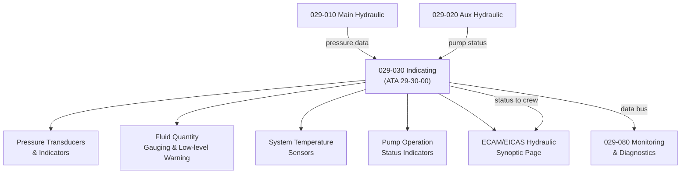

# ATLAS 020-029 · 02.029 · 029-030 — Indicating

## 1. Purpose

Define the architecture boundary for *Hydraulic Power Indicating* (ATA 29-30-00) within ATLAS subsection `029`. This section covers pressure indication, fluid quantity gauging, temperature monitoring, pump operation status, and cockpit display interfaces for hydraulic system status.

## 2. Scope

- Aligned to ATA SNS `29-30-00 Indicating`.
- Covers hydraulic pressure transducers, fluid quantity sensors and low-level warnings, system temperature sensors, pump pressure-off indicators, low-pressure warning lights, EDP/EMP operation indicators, ECAM/EICAS hydraulic synoptic page, and maintenance panel hydraulic status displays.
- Does not cover pump hardware design (see `029-010`, `029-020`), distribution design (see `029-040`), or advanced monitoring/BITE functions (see `029-080`).

## 3. System Architecture

## 4. Footprint

| Metric | Value |
|---|---|
| Architecture | `ATLAS` — Aircraft Top Level Architecture Schema/System |
| Master range | `000–099` |
| Code range | `020-029` |
| Section | `02` — Sistemas Core de Aeronave |
| Subsection | `029` — Hydraulic Power |
| Local section code | `029-030` |
| ATA SNS | `29-30-00` |
| Primary Q-Division | Q-AIR |
| Support Q-Divisions | Q-MECHANICS, Q-DATAGOV, Q-GREENTECH, Q-GROUND, Q-INDUSTRY |
| Governance class | `baseline` |
| Folder path | `Q+ATLANTIDE/000-099_ATLAS/020-029_Sistemas-Core-de-Aeronave/029_Hydraulic-Power/` |
| Document | `029-030-Indicating.md` |
| Parent subsection | [`README.md`](./README.md) |

## 5. References

- ATA iSpec 2200 — Chapter 29-30, Hydraulic Indicating
- Q+ATLANTIDE controlled baseline [`organization/Q+ATLANTIDE.md`](../../../../organization/Q+ATLANTIDE.md)
- Subsection index [`./README.md`](./README.md)
- `029-000` General [`./029-000-General.md`](./029-000-General.md)
- `029-080` Hydraulic Power Monitoring, Diagnostics and Control Interfaces [`./029-080-Hydraulic-Power-Monitoring-Diagnostics-and-Control-Interfaces.md`](./029-080-Hydraulic-Power-Monitoring-Diagnostics-and-Control-Interfaces.md)
