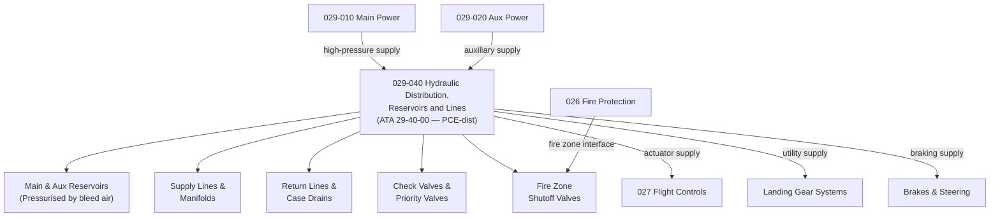

# ATLAS 020-029 · 02.029 · 029-040 — Hydraulic Distribution, Reservoirs and Lines

## 1. Purpose

Define the architecture boundary for *Hydraulic Distribution, Reservoirs and Lines* (ATA 29-40-00) within ATLAS subsection `029`. This section covers reservoir design, pressurisation interfaces, distribution line routing, check valves, priority valves, selector valves, return lines, case drain lines, and the structural routing interfaces for hydraulic supply to all consumer systems.

> **Programme-controlled distribution extension.** This section covers detailed hydraulic distribution architecture requiring programme-level authority for line routing design, structural integration, and fire zone penetration definition. Architecture boundary and Q-Division assignments require formal programme review before population of detailed design data modules.

## 2. Scope

- Aligned to ATA SNS `29-40-00 Hydraulic Distribution` (programme-controlled distribution extension of baseline ATA 29 scope).
- Covers main and auxiliary reservoirs, reservoir pressurisation by bleed air, hydraulic supply lines to actuators and services, return lines and manifolds, case drain lines, check valves, priority valves and selector valves, ground service panel connections, fire zone hydraulic line shutoff valves, and structural clamp and bracket interfaces.
- Does not cover pump hardware (see `029-010`, `029-020`), fluid servicing procedures (see `029-060`), or isolation and leak detection logic (see `029-070`).

## 3. System Architecture

## 4. Footprint

| Metric | Value |
|---|---|
| Architecture | `ATLAS` — Aircraft Top Level Architecture Schema/System |
| Master range | `000–099` |
| Code range | `020-029` |
| Section | `02` — Sistemas Core de Aeronave |
| Subsection | `029` — Hydraulic Power |
| Local section code | `029-040` |
| ATA SNS | `29-40-00` |
| Status | `programme-controlled-distribution-extension` |
| Primary Q-Division | Q-AIR |
| Support Q-Divisions | Q-MECHANICS, Q-DATAGOV, Q-GREENTECH, Q-GROUND, Q-INDUSTRY |
| Governance class | `baseline` |
| Folder path | `Q+ATLANTIDE/000-099_ATLAS/020-029_Sistemas-Core-de-Aeronave/029_Hydraulic-Power/` |
| Document | `029-040-Hydraulic-Distribution-Reservoirs-and-Lines.md` |
| Parent subsection | [`README.md`](./README.md) |

## 5. References

- ATA iSpec 2200 — Chapter 29-40, Hydraulic Distribution
- Q+ATLANTIDE controlled baseline [`organization/Q+ATLANTIDE.md`](../../../../organization/Q+ATLANTIDE.md)
- Subsection index [`./README.md`](./README.md)
- `029-000` General [`./029-000-General.md`](./029-000-General.md)
- `029-010` Main Hydraulic Power [`./029-010-Main-Hydraulic-Power.md`](./029-010-Main-Hydraulic-Power.md)
- `029-070` Isolation, Leak Detection and Safety Interfaces [`./029-070-Isolation-Leak-Detection-and-Safety-Interfaces.md`](./029-070-Isolation-Leak-Detection-and-Safety-Interfaces.md)
