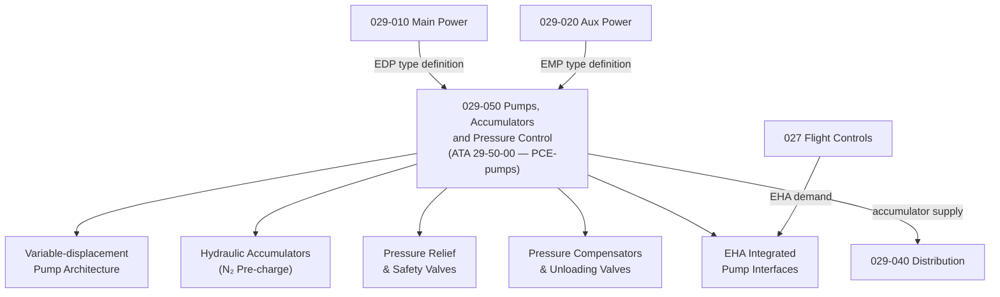

# ATLAS 020-029 · 02.029 · 029-050 — Pumps, Accumulators and Pressure Control

## 1. Purpose

Define the architecture boundary for *Pumps, Accumulators and Pressure Control* (ATA 29-50-00) within ATLAS subsection `029`. This section covers hydraulic pump technology selection (fixed vs. variable displacement), accumulator design and pre-charge pressure, pressure relief and safety valves, unloading valves, system pressure switch settings, electrohydrostatic actuator (EHA) integrated pump interfaces, and advanced pressure control logic.

> **Programme-controlled pumps extension.** This section covers detailed pump technology, accumulator design parameters, and EHA pump interfaces requiring programme-level authority for definition. Architecture boundary and Q-Division assignments require formal programme review before population of detailed design data modules.

## 2. Scope

- Aligned to ATA SNS `29-50-00 Pumps, Accumulators and Pressure Control` (programme-controlled pumps extension of baseline ATA 29 scope).
- Covers fixed-displacement and variable-displacement pump design parameters, accumulator sizing and nitrogen pre-charge, system pressure relief valves, pressure compensators, thermal relief valves, bypass check valves, EHA pump integration interfaces, and pressure control logic for multi-system hydraulic architectures.
- Does not cover main and auxiliary pump installation boundary (see `029-010`, `029-020`), distribution line routing (see `029-040`), or pump health monitoring (see `029-080`).

## 3. System Architecture

## 4. Footprint

| Metric | Value |
|---|---|
| Architecture | `ATLAS` — Aircraft Top Level Architecture Schema/System |
| Master range | `000–099` |
| Code range | `020-029` |
| Section | `02` — Sistemas Core de Aeronave |
| Subsection | `029` — Hydraulic Power |
| Local section code | `029-050` |
| ATA SNS | `29-50-00` |
| Status | `programme-controlled-pumps-extension` |
| Primary Q-Division | Q-AIR |
| Support Q-Divisions | Q-MECHANICS, Q-DATAGOV, Q-GREENTECH, Q-GROUND, Q-INDUSTRY |
| Governance class | `baseline` |
| Folder path | `Q+ATLANTIDE/000-099_ATLAS/020-029_Sistemas-Core-de-Aeronave/029_Hydraulic-Power/` |
| Document | `029-050-Pumps-Accumulators-and-Pressure-Control.md` |
| Parent subsection | [`README.md`](./README.md) |

## 5. References

- ATA iSpec 2200 — Chapter 29-50, Pumps and Accumulators
- Q+ATLANTIDE controlled baseline [`organization/Q+ATLANTIDE.md`](../../../../organization/Q+ATLANTIDE.md)
- Subsection index [`./README.md`](./README.md)
- `029-000` General [`./029-000-General.md`](./029-000-General.md)
- `029-010` Main Hydraulic Power [`./029-010-Main-Hydraulic-Power.md`](./029-010-Main-Hydraulic-Power.md)
- `029-080` Hydraulic Power Monitoring, Diagnostics and Control Interfaces [`./029-080-Hydraulic-Power-Monitoring-Diagnostics-and-Control-Interfaces.md`](./029-080-Hydraulic-Power-Monitoring-Diagnostics-and-Control-Interfaces.md)
