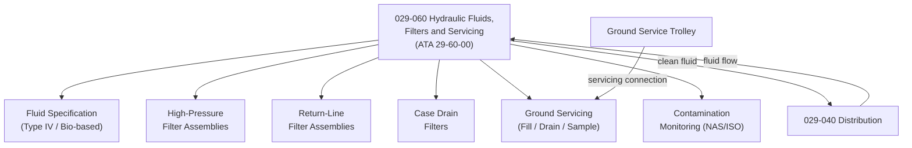

# ATLAS 020-029 · 02.029 · 029-060 — Hydraulic Fluids, Filters and Servicing

## 1. Purpose

Define the architecture boundary for *Hydraulic Fluids, Filters and Servicing* (ATA 29-60-00) within ATLAS subsection `029`. This section covers hydraulic fluid type specification, contamination monitoring, filtration architecture, case drain filters, return line filters, ground servicing procedures, fluid sampling, fluid replacement specifications, and ground service trolley interfaces.

## 2. Scope

- Aligned to ATA SNS `29-60-00 Hydraulic Fluids, Filters and Servicing`.
- Covers hydraulic fluid specification (type IV phosphate ester or bio-based), particle contamination monitoring (NAS/ISO cleanliness levels), high-pressure and return-line filter assemblies, case drain filters, filter bypass indicators, ground service fill and drain connections, fluid sampling ports, and fluid compatibility requirements.
- Does not cover reservoir design (see `029-040`), pump architecture (see `029-010`, `029-020`), or fluid contamination monitoring BITE (see `029-080`).

## 3. System Architecture

## 4. Footprint

| Metric | Value |
|---|---|
| Architecture | `ATLAS` — Aircraft Top Level Architecture Schema/System |
| Master range | `000–099` |
| Code range | `020-029` |
| Section | `02` — Sistemas Core de Aeronave |
| Subsection | `029` — Hydraulic Power |
| Local section code | `029-060` |
| ATA SNS | `29-60-00` |
| Primary Q-Division | Q-AIR |
| Support Q-Divisions | Q-MECHANICS, Q-DATAGOV, Q-GREENTECH, Q-GROUND, Q-INDUSTRY |
| Governance class | `baseline` |
| Folder path | `Q+ATLANTIDE/000-099_ATLAS/020-029_Sistemas-Core-de-Aeronave/029_Hydraulic-Power/` |
| Document | `029-060-Hydraulic-Fluids-Filters-and-Servicing.md` |
| Parent subsection | [`README.md`](./README.md) |

## 5. References

- ATA iSpec 2200 — Chapter 29-60, Hydraulic Fluids and Filters
- Q+ATLANTIDE controlled baseline [`organization/Q+ATLANTIDE.md`](../../../../organization/Q+ATLANTIDE.md)
- Subsection index [`./README.md`](./README.md)
- `029-000` General [`./029-000-General.md`](./029-000-General.md)
- `029-040` Hydraulic Distribution, Reservoirs and Lines [`./029-040-Hydraulic-Distribution-Reservoirs-and-Lines.md`](./029-040-Hydraulic-Distribution-Reservoirs-and-Lines.md)
