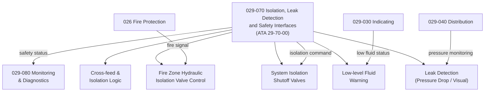

# ATLAS 020-029 · 02.029 · 029-070 — Isolation, Leak Detection and Safety Interfaces

## 1. Purpose

Define the architecture boundary for *Hydraulic Power Isolation, Leak Detection and Safety Interfaces* (ATA 29-70-00) within ATLAS subsection `029`. This section covers hydraulic system isolation valves, fire zone shutoff valve logic, hydraulic leak detection sensors, low-fluid-level warnings, cross-feed and isolation logic, and safety interfaces to fire protection and emergency power systems.

## 2. Scope

- Aligned to ATA SNS `29-70-00 Isolation, Leak Detection and Safety Interfaces`.
- Covers system isolation shutoff valves, fire zone hydraulic isolation valve control, hydraulic fluid leak detection (pressure drop monitoring, visual inspection access panels), low-level fluid warnings, cross-feed isolation logic between hydraulic systems, ground isolation valve for maintenance, and interfaces to fire protection (ATA 26) and emergency electrical power (ATA 24).
- Does not cover main line routing (see `029-040`), pump monitoring (see `029-080`), or fire extinguishing hardware (see `026-020`).

## 3. System Architecture

## 4. Footprint

| Metric | Value |
|---|---|
| Architecture | `ATLAS` — Aircraft Top Level Architecture Schema/System |
| Master range | `000–099` |
| Code range | `020-029` |
| Section | `02` — Sistemas Core de Aeronave |
| Subsection | `029` — Hydraulic Power |
| Local section code | `029-070` |
| ATA SNS | `29-70-00` |
| Primary Q-Division | Q-AIR |
| Support Q-Divisions | Q-MECHANICS, Q-DATAGOV, Q-GREENTECH, Q-GROUND, Q-INDUSTRY |
| Governance class | `baseline` |
| Folder path | `Q+ATLANTIDE/000-099_ATLAS/020-029_Sistemas-Core-de-Aeronave/029_Hydraulic-Power/` |
| Document | `029-070-Isolation-Leak-Detection-and-Safety-Interfaces.md` |
| Parent subsection | [`README.md`](./README.md) |

## 5. References

- ATA iSpec 2200 — Chapter 29-70, Hydraulic Isolation and Leak Detection
- Q+ATLANTIDE controlled baseline [`organization/Q+ATLANTIDE.md`](../../../../organization/Q+ATLANTIDE.md)
- Subsection index [`./README.md`](./README.md)
- `029-000` General [`./029-000-General.md`](./029-000-General.md)
- `029-040` Hydraulic Distribution, Reservoirs and Lines [`./029-040-Hydraulic-Distribution-Reservoirs-and-Lines.md`](./029-040-Hydraulic-Distribution-Reservoirs-and-Lines.md)
- Section `026-010` Fire and Smoke Detection [`../026_Fire-Protection/026-010-Fire-and-Smoke-Detection.md`](../026_Fire-Protection/026-010-Fire-and-Smoke-Detection.md)
