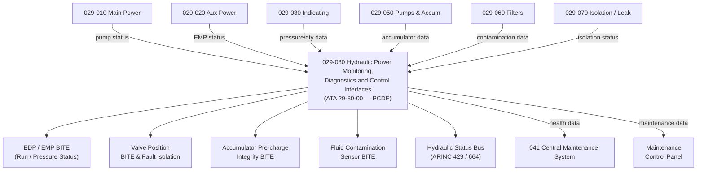

# ATLAS 020-029 · 02.029 · 029-080 — Hydraulic Power Monitoring, Diagnostics and Control Interfaces

## 1. Purpose

Define the architecture boundary for *Hydraulic Power Monitoring, Diagnostics and Control Interfaces* (ATA 29-80-00) within ATLAS subsection `029`. This section covers hydraulic system health monitoring, BITE for pumps, valves, and accumulators, contamination monitoring BITE, centralised fault isolation logic, ARINC data bus interfaces for hydraulic system status, and the Central Maintenance System (CMS) health data output.

> **Programme-controlled diagnostics extension.** This section covers monitoring, health management, and advanced diagnostics interfaces activated under programme authority. Architecture boundary and Q-Division assignments require formal programme review before population of detailed design data modules.

## 2. Scope

- Aligned to ATA SNS `29-80-00 Hydraulic Power Monitoring and Diagnostics` (programme-controlled diagnostics extension of baseline ATA 29 scope).
- Covers EDP and EMP pump BITE, hydraulic valve position feedback and fault isolation, pressure switch and transducer calibration monitoring, accumulator pre-charge integrity BITE, fluid contamination sensor monitoring, filter bypass status monitoring, ARINC 429/664 hydraulic system status bus, fault isolation logic, CMS health data interface, and maintenance control panel hydraulic status.
- Does not cover core pump installation (see `029-010`/`029-020`), distribution hardware (see `029-040`), or isolation valve hardware (see `029-070`).

## 3. System Architecture

## 4. Footprint

| Metric | Value |
|---|---|
| Architecture | `ATLAS` — Aircraft Top Level Architecture Schema/System |
| Master range | `000–099` |
| Code range | `020-029` |
| Section | `02` — Sistemas Core de Aeronave |
| Subsection | `029` — Hydraulic Power |
| Local section code | `029-080` |
| ATA SNS | `29-80-00` |
| Status | `programme-controlled-diagnostics-extension` |
| Primary Q-Division | Q-AIR |
| Support Q-Divisions | Q-MECHANICS, Q-DATAGOV, Q-GREENTECH, Q-GROUND, Q-INDUSTRY |
| Governance class | `baseline` |
| Folder path | `Q+ATLANTIDE/000-099_ATLAS/020-029_Sistemas-Core-de-Aeronave/029_Hydraulic-Power/` |
| Document | `029-080-Hydraulic-Power-Monitoring-Diagnostics-and-Control-Interfaces.md` |
| Parent subsection | [`README.md`](./README.md) |

## 5. References

- ATA iSpec 2200 — Chapter 29-80, Hydraulic Monitoring
- Q+ATLANTIDE controlled baseline [`organization/Q+ATLANTIDE.md`](../../../../organization/Q+ATLANTIDE.md)
- Subsection index [`./README.md`](./README.md)
- `029-010` Main Hydraulic Power [`./029-010-Main-Hydraulic-Power.md`](./029-010-Main-Hydraulic-Power.md)
- `029-050` Pumps, Accumulators and Pressure Control [`./029-050-Pumps-Accumulators-and-Pressure-Control.md`](./029-050-Pumps-Accumulators-and-Pressure-Control.md)
- `029-070` Isolation, Leak Detection and Safety Interfaces [`./029-070-Isolation-Leak-Detection-and-Safety-Interfaces.md`](./029-070-Isolation-Leak-Detection-and-Safety-Interfaces.md)
- ATA 41 — Central Maintenance System (CMS)
