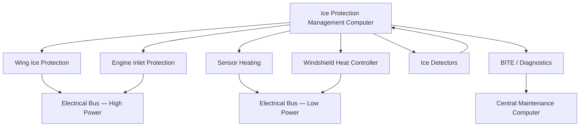
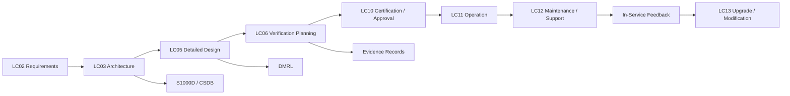

# 030-000 — Ice and Rain Protection General
### [PROGRAMME-AIRCRAFT] [PROGRAMME-VARIANT] · ATA 30 · Q+ATLANTIDE ATLAS Scaffold

---

## §0 Hyperlink Policy

All hyperlinks in this document are **relative links** unless they point to a published external standard (in which case the full URL is provided). Links marked **TBD** indicate targets not yet assigned a stable path within the Q+ATLANTIDE repository; these will be resolved as the programme matures. Do not invent or guess link targets. Cross-references to sibling documents within the `030_Ice-and-Rain-Protection/` directory use file-name anchors only.

---

## §1 Purpose

This document defines the agnostic ATLAS standard-level architecture context for `030-000 — Ice and Rain Protection General`.

It describes the controlled scope, functions, interfaces, safety considerations, lifecycle traceability, and S1000D/CSDB mapping logic that programme implementations shall instantiate when this node is applicable.

This document is not a programme design baseline. Programme-specific capacities, locations, part numbers, effectivity, operating limits, maintenance references, and data module codes shall be defined only inside the applicable programme implementation branch.
## §2 Applicability

| Applicability Level | Rule |
|---|---|
| Standard taxonomy | Applies to the ATLAS node `<NODE>` |
| Programme implementation | Conditional; determined by programme architecture, trade studies, certification basis, and applicability model |
| Product configuration | Defined in the programme-specific configuration baseline |
| Effectivity | Defined in the programme CSDB / applicability layer |
| Non-applicability | Must be explicitly stated in the programme impact-study branch when excluded |
## §3 System / Function Overview

The [PROGRAMME-AIRCRAFT] [PROGRAMME-VARIANT] Ice and Rain Protection system (ATA 30) covers all aircraft surfaces and components susceptible to ice accretion or rain impingement that could degrade airworthiness, flight handling, structural integrity, or crew visibility. The system encompasses: wing leading-edge anti-icing, electric propulsion inlet anti-icing, air data sensor heating, windshield heating and rain removal, drain mast and service-point heating, and a centralised ice detection and control function managed by the Ice Protection Management Computer (IPMC). Unlike conventional commercial aircraft that rely on engine bleed air for leading-edge thermal anti-icing, the [PROGRAMME-VARIANT] draws all thermal energy directly from the aircraft's electrical generation and distribution system, eliminating bleed-air ducting, pre-coolers, and associated pressure-regulation components entirely.

The [PROGRAMME-VARIANT] electrical ice protection architecture is inherently **zone-sequential** and **power-managed**. The IPMC arbitrates electrical load demand across all ice protection zones to remain within the instantaneous power budget allocated by ATA 24 (Electrical Power). During normal icing encounters, the IPMC activates wing heating mats in a cyclic de-icing sequence and energises engine inlet lip heaters continuously. Probe heaters for pitot tubes, static ports, AOA vanes, and TAT sensors remain energised whenever the aircraft is powered, regardless of icing conditions, to prevent accumulation of rime ice on air data sensors. The system satisfies the requirements of CS-25 Appendix C (continuous maximum and intermittent maximum icing envelopes) and CS-25 Appendix O (Supercooled Large Droplet icing), providing certified protection across the full airworthiness icing envelope.

---

## §4 Scope

### 4.1 Included

- Wing leading-edge electrothermal anti-icing system (WIPS) — all span zones, inner, outer, and winglet
- Electric propulsion nacelle and inlet lip electrothermal anti-icing
- Air data probe heating: pitot tubes (3 channels), static ports, AOA vanes, TAT probes, ice detector probes
- Windshield electrothermal heating panels and windshield wiper systems
- Drain mast heaters, fuel vent probe heaters, lavatory drain heaters, service-panel trace heaters
- Antenna ice protection (ATC, VHF, VOR/ILS radome areas)
- Ice detection sensors (primary and standby) and IPMC control logic
- BITE (Built-In Test Equipment) and diagnostics for all ATA 30 heater circuits
- Interface definitions with ATA 21, ATA 24, ATA 31, ATA 34, ATA 38, ATA 45, ATA 56, ATA 71
- Regulatory compliance mapping (CS-25 Appendix C, Appendix O, FAR 25.1419, EUROCAE ED-14G)
- S1000D CSDB data module traceability (see 030-090)

### 4.2 Excluded

- Engine bleed-air systems (not installed; see ATA 36 boundary note below)
- Anti-icing of fuel in fuel tanks — addressed under ATA 28 (Fuel System)
- Ground de-icing operations using external de-icing fluid (Type I/II/IV fluid) — covered by ground operations documentation
- Cargo compartment freeze protection (covered by ATA 21 Environmental Control)
- Structural repair of composite leading edges following in-flight ice damage (covered by ATA 54/57 Structures)
- ATA 36 (Pneumatic) — this chapter exists only as a reference boundary stub; no pneumatic anti-icing is installed on [PROGRAMME-VARIANT]

---

## §5 Architecture Description

- **No bleed-air dependency:** The [PROGRAMME-VARIANT] architecture eliminates all engine and APU bleed-air pathways. Ice protection thermal energy is drawn exclusively from the HVDC bus (nominally 540 V DC or 270 V DC as programme-defined) for wing and engine inlet high-power heaters, and from the 28 V DC bus for probe heaters and auxiliary trace heaters. This removes the single-point failure mode associated with bleed-air duct rupture or precooler failure.

- **Centralised control via IPMC:** The Ice Protection Management Computer receives inputs from dual ice detectors, TAT/OAT sensors (via ADIRU), and crew inputs from the overhead panel. The IPMC executes zone-activation sequences, load-shedding logic in degraded electrical states, and continuous BITE monitoring. It outputs commands to zone-specific power controllers (WIPS controller, Engine Inlet Power Controller, Probe Heater Controller, WHC) via an ARINC 429 or CAN-FD databus (programme-TBD).

- **Zone architecture — cyclic vs continuous:** Wing heating zones operate in a cyclic de-icing mode (energise zone → accrete thin ice → shed ice → move to next zone) to reduce peak electrical power demand. Engine inlet lip heaters operate in continuous anti-icing mode, as ice shedding into the fan is not acceptable. Probe heaters operate continuously (ground + flight) at a fixed low power level, switching to a higher power level in detected icing conditions.

- **Appendix O compliance path:** SLD (Supercooled Large Droplet) icing under CS-25 Appendix O is addressed through extended WIPS zone coverage beyond the leading edge stagnation line and a certification flight-test campaign in natural and artificial SLD conditions. The IPMC carries a dedicated SLD mode flag triggering increased heater duty cycles.

- **Power budget integration with ATA 24:** The total ice protection electrical load at maximum simultaneous demand is a key input to the [PROGRAMME-VARIANT] electrical generation sizing. The IPMC implements a power arbitration algorithm that can defer non-critical heating loads during high-demand flight phases (e.g., take-off) while maintaining safety-critical heaters always energised.

---

## §6 Functional Breakdown

| Function ID | Function Title | Description | Applicable Subsystem |
|---|---|---|---|
| F-001 | Wing Leading-Edge Anti-Icing | Electrothermal heating of wing leading-edge zones to prevent or remove ice accretion | WIPS (030-010) |
| F-002 | Engine Inlet Anti-Icing | Continuous electrothermal heating of electric propulsion inlet lips to prevent inlet ice accretion | EIP (030-020) |
| F-003 | Air Data Sensor Heating | Continuous electrothermal heating of pitot probes, static ports, AOA vanes, TAT probes, and ice detector probes | Probe Heating (030-030) |
| F-004 | Windshield Anti-Icing and Rain Protection | Electrothermal heating of windshield conductive film; mechanical wiper operation for rain removal | Windshield (030-040) |
| F-005 | Drain and Service-Point Heating | Trace electrothermal heating of drain masts, fuel vent probes, lavatory drains, and service panels | Drains (030-050) |
| F-006 | Rain Removal and Runoff Management | Windshield wiper operation, rain repellent (if fitted), and airframe drainage path management | Rain Removal (030-060) |
| F-007 | Ice Detection and Protection Control | Automatic detection of icing conditions and management of ice protection activation sequences | Ice Detection (030-070) |
| F-008 | Monitoring, Diagnostics, and Crew Alerting | BITE coverage of all heater zones; fault detection, isolation, ECAM alerting, CMC recording | Monitoring (030-080) |
| F-009 | S1000D/CSDB Traceability | Mapping of all ATA 30 subsubjects to S1000D Data Module codes and DMRL planning | CSDB Mapping (030-090) |

---

## §7 System Context Diagram

```mermaid
flowchart LR
    AC[[PROGRAMME-AIRCRAFT] Aircraft] --> ATA30[ATA 30 Ice & Rain Protection]
    ATA30 --> WING[Wing Ice Protection]
    ATA30 --> ENGINE[Engine/Inlet Ice Protection]
    ATA30 --> SENSORS[Air Data Sensor Heating]
    ATA30 --> WINDSHIELD[Windshield Anti-Ice / Rain]
    ATA30 --> DETECT[Ice Detection & Control]
    ATA24[ATA 24 Electrical Power] --> ATA30
    ATA31[ATA 31 Indicating] --> ATA30
    ATA34[ATA 34 Navigation] --> ATA30
    ATA30 --> CMS[Central Maintenance System]
```

---

## §8 Internal Functional Architecture



---

## §9 Lifecycle Traceability



---

## §10 Interfaces

| Interface ID | Interfacing System | ATA Chapter | Interface Type | Description |
|---|---|---|---|---|
| IF-030-001 | Electrical Power | ATA 24 | Power supply | HVDC and 28 V DC bus feeds to all ice protection heaters; load arbitration signals from IPMC to power management system |
| IF-030-002 | Air Data and Navigation | ATA 34 | Data (ARINC 429) | TAT, OAT, altitude, and airspeed data from ADIRU to IPMC for icing condition determination and heater logic |
| IF-030-003 | Indicating and Recording | ATA 31 | Data (ARINC 429 / AFDX) | ECAM warning and caution messages from IPMC/BITE; system status pages; icing advisory alerts to crew |
| IF-030-004 | Central Maintenance System | ATA 45 | Data (ARINC 429 / Ethernet) | Fault codes, BITE results, heater zone status, post-flight report upload from IPMC to CMC |
| IF-030-005 | Air Conditioning | ATA 21 | Thermal boundary | No bleed-air interface; boundary defined to exclude ATA 21 thermal loads from ATA 30 power budget |
| IF-030-006 | Power Plant / Electric Propulsion | ATA 71 | Data + power | Engine inlet power controller interfaces with EECU for power demand coordination during high-thrust phases |
| IF-030-007 | Windows | ATA 56 | Structural/thermal | Windshield glass panel provides the substrate for ITO conductive film heaters; structural qualification shared boundary |
| IF-030-008 | Water and Waste | ATA 38 | Thermal boundary | Drain mast heater and lavatory drain heater power and monitoring; freeze protection of water lines in cold zones |

---

## §11 Operating Modes

| Mode | Designation | Conditions | IPMC Action | Crew Indication |
|---|---|---|---|---|
| Normal Anti-Ice | AUTO-ON | Ice detected (ID1 or ID2) AND OAT ≤ +10 °C | Activates WIPS cyclic sequence, EIP continuous, all probe heaters at high power | ANTI ICE ON (blue advisory) |
| Continuous Anti-Ice | MANUAL-ON | Crew selects ANTI ICE ON regardless of detector state | As AUTO-ON; IPMC confirms sensor validity | ANTI ICE ON (blue advisory) |
| Probe Heat Only | PROBE HEAT | Aircraft powered on ground or in flight below icing threshold | Probe heaters energised at low (ground) or high (flight) power; WIPS and EIP not activated | PROBE HEAT ON |
| Degraded — One Bus Lost | DEGRADED | Single HVDC bus failure; partial power available | IPMC sheds lower-priority zones; maintains engine inlet and probe heating; wing heating reduced to priority zones | ANTI ICE DEGRADED (amber caution) |
| Failure Safe State | FAIL-SAFE | IPMC failure or loss of both IPMC channels | Probe heaters revert to direct-bus energisation; WIPS and EIP heaters de-energised; crew notified | ANTI ICE FAULT (red warning) |
| Maintenance | MAINT | On ground, maintenance mode selected via CMC | Allows individual zone test energisation at reduced power; BITE ground test | MAINT MODE (white status) |

---

## §12 Monitoring and Diagnostics

The IPMC incorporates comprehensive BITE covering all electrothermal heater zones and associated control circuits. For each heater zone (wing inner, wing outer, winglet, engine inlet lip, spinner if fitted, each probe heater channel, windshield captain and F/O, drain masts), the IPMC monitors:

- **Current feedback:** Each heater power controller returns an analog current sense signal. Open-circuit (heater element failure) and short-circuit (insulation failure) conditions are detected within one heating cycle.
- **Temperature monitoring:** Embedded thermocouples or PT100 sensors within wing heating mats and windshield panels provide zone temperature telemetry to the IPMC, enabling overheat protection and thermal runaway prevention.
- **Continuity test (ground):** The IPMC performs a low-current continuity test on all heater circuits during the pre-departure BITE ground cycle, generating a GO/NO-GO report for maintenance before departure.
- **ECAM integration:** Faults classified as WARNING (e.g., total WIPS failure) generate a red ECAM message; faults classified as CAUTION (e.g., single zone heater failure) generate amber; advisory-only conditions generate blue status messages.
- **CMC fault codes:** All BITE results are logged to the Central Maintenance Computer (ATA 45) with an ATA 30 fault code prefix, zone identifier, fault type, flight-phase context, and timestamp.

---

## §13 Maintenance Concept

Maintenance of the ATA 30 electrothermal ice protection system is designed to be line-maintainer accessible with standard avionics ground support equipment. Key maintenance concepts:

- **No hot-air duct maintenance:** The absence of bleed-air ducting eliminates the inspection and leak-check tasks associated with conventional thermal anti-icing. This significantly reduces scheduled maintenance man-hours in the 030-chapter.
- **Heater zone replacement:** Wing heating mats are bonded within composite leading-edge panels. Mat replacement requires leading-edge panel removal and re-bonding per structural repair manual procedures. Mats are LRU-equivalent at the panel level, not individually removable element by element.
- **Probe heater replacement:** Individual pitot tube, AOA vane, and TAT probe heater assemblies are LRUs replaced at line maintenance level using standard connector disconnection and torque procedures.
- **IPMC replacement:** The IPMC is an LRU in the avionics bay, replaced as a unit. Post-replacement, a BITE ground test confirms correct zone recognition and fault-free status.
- **Inspection intervals:** Heating mat condition and electrical resistance checks are included in the Maintenance Planning Document (MPD) C-check or equivalent interval task (TBD during certification programme).

---

## §14 S1000D / CSDB Mapping

| Subsubject | Title | SNS Code | DMC Prefix | Info Code Set |
|---|---|---|---|---|
| 030-00 | General | 030-00 | DMC-<PROGRAMME>-<VARIANT>-030-00 | 040 (Desc), 941 (IPD) |
| 030-10 | Wing Ice Protection | 030-10 | DMC-<PROGRAMME>-<VARIANT>-030-10 | 040, 300, 400, 520, 720, 941 |
| 030-20 | Engine Inlet Ice Protection | 030-20 | DMC-<PROGRAMME>-<VARIANT>-030-20 | 040, 300, 400, 520, 720, 941 |
| 030-30 | Air Data Sensor Heating | 030-30 | DMC-<PROGRAMME>-<VARIANT>-030-30 | 040, 300, 400, 520, 720 |
| 030-40 | Windshield and Window | 030-40 | DMC-<PROGRAMME>-<VARIANT>-030-40 | 040, 300, 400, 520, 720, 941 |
| 030-50 | Probe/Drain/Service Point | 030-50 | DMC-<PROGRAMME>-<VARIANT>-030-50 | 040, 300, 400, 520, 720 |
| 030-60 | Rain Removal | 030-60 | DMC-<PROGRAMME>-<VARIANT>-030-60 | 040, 300, 400, 520, 720, 941 |
| 030-70 | Ice Detection & Control | 030-70 | DMC-<PROGRAMME>-<VARIANT>-030-70 | 040, 300, 400, 520, 720, 941 |
| 030-80 | Monitoring & Diagnostics | 030-80 | DMC-<PROGRAMME>-<VARIANT>-030-80 | 040, 400 |

### Recommended DM Set (General / 030-00)

| Info Code | Title | Status |
|---|---|---|
| DMC-<PROGRAMME>-<VARIANT>-030-00-040-A | System Description — Ice and Rain Protection General | Draft |
| DMC-<PROGRAMME>-<VARIANT>-030-00-941-A | Illustrated Parts Data — ATA 30 Top Level | Not started |

---

## §15 Footprints

### 15.1 Physical

The ATA 30 system does not occupy a discrete equipment bay beyond the IPMC avionics LRU (avionics bay, bay allocation TBD). Heater elements are embedded in, bonded to, or integrated within structural components (wing leading edges, nacelle inlet lips, windshield panels). Probe heaters are integral to probe assemblies. Drain mast heaters are integral to drain mast assemblies. Total additional structural mass attributable to electrothermal elements across all zones is estimated at TBD kg (programme calculation pending).

### 15.2 Electrical / Data

| Circuit | Bus Source | Nominal Power (per zone) | Data Interface |
|---|---|---|---|
| Wing WIPS — High Power | HVDC Bus A / B | TBD kW per zone | ARINC 429 / CAN-FD (IPMC) |
| Engine Inlet Anti-Ice | HVDC Bus A / B | TBD kW per inlet | ARINC 429 (EECU coordination) |
| Probe Heaters | 28 V DC Bus Essential | ~50–200 W per probe (TBD) | Discrete / ARINC 429 (PHC) |
| Windshield Heater | 115 V AC or 28 V DC (TBD) | TBD W per panel | Discrete (WHC) |
| Drain / Trace Heaters | 28 V DC Bus | TBD W per circuit | Discrete |

### 15.3 Maintenance

Scheduled maintenance tasks attributable to ATA 30 include: heater circuit resistance check, probe heater functional test, WIPS zone activation test, ice detector functional check, IPMC BITE ground test, and windshield heater functional check. Intervals TBD pending MPD development.

### 15.4 Data

All ATA 30 fault history, BITE results, ice encounter logs, and zone activation records are stored in the CMC non-volatile memory and downloadable via ATA 45 standard interface. Data retention period: minimum 500 flight hours or 1000 flight cycles (whichever occurs first) — TBD per programme data retention specification.

---

## §16 Safety and Certification Considerations

| Regulation | Applicability | Compliance Method |
|---|---|---|
| CS-25 Appendix C | Continuous maximum and intermittent maximum icing envelopes — wing, engine inlet, sensors | Analysis, laboratory thermal testing, certification flight test in natural/artificial icing |
| CS-25 Appendix O | Supercooled Large Droplet (SLD) icing — Freezing Drizzle, Freezing Rain conditions | Extended WIPS zone coverage analysis and SLD certification flight test |
| CS-25.1419 | Ice protection system design; automatic activation | IPMC auto-activation logic; redundancy analysis per ARP 4754A |
| FAR 25.1419 | EASA/FAA harmonised requirement for ice protection | Dual-authority compliance (EASA + FAA joint certification planned) |
| EUROCAE ED-14G / RTCA DO-160G | Environmental qualification of all electrical ice protection LRUs | Environmental qualification test programme for IPMC, controllers, heater mats |
| CS-25.1309 / ARP 4761 | Safety assessment — failure conditions and effects | Functional Hazard Assessment (FHA) and System Safety Assessment (SSA) for ATA 30 |

---

## §17 Verification and Validation

| V&V Method | ID | Description | Applicable Functions | Status |
|---|---|---|---|---|
| Analysis | VV-030-001 | Thermal analysis of wing leading-edge heating zones vs CS-25 Appendix C and O icing envelopes using CFD and heat-transfer models | F-001, F-002 | Not started |
| Ground Laboratory Test | VV-030-002 | Icing wind tunnel testing of representative wing leading-edge panel segments with electrothermal mat activated; measurement of runback ice limits | F-001 | Not started |
| Hardware-in-the-Loop | VV-030-003 | IPMC HIIL simulation with simulated ice detector inputs, electrical bus inputs, and zone controller responses; validates auto-activation and load-shedding logic | F-007, F-008 | Not started |
| Certification Flight Test | VV-030-004 | Natural icing flight test and Appendix O tanker flight test in defined icing conditions; demonstration of ice-free operation across all zones | F-001 through F-007 | Not started |
| Inspection and Functional Check | VV-030-005 | Ground BITE functional test, heater circuit resistance measurement, zone thermal response verification on production aircraft | F-003, F-004, F-005, F-008 | Not started |

---

## §18 Glossary

| Term | Acronym | Definition |
|---|---|---|
| Anti-Icing Ice Information System | AIIS | An airborne system that provides icing-condition advisory data integrating ice detector outputs, TAT, and altitude for crew situational awareness |
| Anti-Icing Management System | AMS | The overall software and hardware system managing allocation and sequencing of ice protection resources; in [PROGRAMME-VARIANT], implemented within the IPMC |
| Electrothermal Anti-Icing | — | Use of electrical resistance heating elements to maintain surfaces above 0 °C to prevent ice formation |
| Ice Accretion | — | The build-up of ice on an aircraft surface due to impingement of supercooled water droplets |
| Icing Certification Envelope | — | The atmospheric temperature, liquid water content (LWC), and droplet size (MVD) conditions within which an aircraft must demonstrate safe operation; defined by CS-25 Appendix C and O |
| Ice Protection Management Computer | IPMC | The centralised avionics controller managing detection, activation, sequencing, and monitoring of all ATA 30 electrothermal ice protection zones |
| Median Volumetric Diameter | MVD | The droplet size in micrometres at which half the total liquid water volume is in smaller drops and half in larger drops; key parameter in icing envelope definition |
| Supercooled Large Droplets | SLD | Water droplets with MVD > 50 µm remaining liquid below 0 °C; regulated by CS-25 Appendix O |
| Total Air Temperature | TAT | The stagnation temperature measured by the TAT probe, accounting for ram-rise effects; used as an input to icing condition logic |
| Wing Ice Protection System | WIPS | The electrothermal heating system applied to the wing leading-edge zones to prevent or remove ice accretion in the [PROGRAMME-VARIANT] |

---

## §19 Citations

| Ref ID | Document | Version | Relevance |
|---|---|---|---|
| CIT-001 | ATA iSpec 2200 — Information Standards for Aviation Maintenance | 2200:2021 | ATA chapter numbering and content conventions for ATA 30 |
| CIT-002 | CS-25 Appendix C — Atmospheric Icing Conditions | Amendment 27 | Icing certification envelope (continuous maximum, intermittent maximum) |
| CIT-003 | FAR 25.1419 — Ice Protection | Amendment 25-147 | US certification requirement for automatic ice protection system activation |
| CIT-004 | EUROCAE ED-14G / RTCA DO-160G — Environmental Conditions and Test Procedures for Airborne Equipment | Edition G | Environmental qualification standard for all ATA 30 LRUs |
| CIT-005 | S1000D Issue 5.0 — International Specification for Technical Publications | Issue 5.0 | S1000D data module structure and CSDB applicability |

---

## §20 References

| Ref ID | Title | Document Number | Notes |
|---|---|---|---|
| REF-001 | [PROGRAMME-AIRCRAFT] [PROGRAMME-VARIANT] System Requirements Document — Ice Protection | TBD | Programme-controlled; not yet released |
| REF-002 | [PROGRAMME-AIRCRAFT] [PROGRAMME-VARIANT] Electrical Power Architecture | TBD | ATA 24 interface definition; relevant for power budget |
| REF-003 | CS-25 Appendix O — Supercooled Large Droplet Icing Conditions | CS-25 Amdt 27 | SLD icing certification requirement |
| REF-004 | ARP 4754A — Guidelines for Development of Civil Aircraft and Systems | SAE ARP 4754A | DAL assignment and development assurance for IPMC |
| REF-005 | ARP 4761 — Guidelines and Methods for Conducting the Safety Assessment Process | SAE ARP 4761 | FHA and SSA methodology for ATA 30 |
| REF-ATA | ATA 30 — Ice and Rain Protection | ATA iSpec 2200 | Reference chapter for SNS allocation and content conventions |

---

## §21 Open Issues

| OI ID | Issue | Owner | Target Resolution | Status |
|---|---|---|---|---|
| OI-001 | HVDC bus voltage level for WIPS high-power circuits not yet defined (270 V DC vs 540 V DC) | ATA 24 / Q-MECHANICS | LC03 Architecture freeze | Open |
| OI-002 | SLD (Appendix O) extended zone coverage boundary on wing not yet defined — requires CFD icing analysis | Q-AIR / Q-STRUCTURES | LC05 Detailed Design | Open |
| OI-003 | IPMC DAL assignment not yet confirmed — preliminary assessment DAL B; FHA/SSA not started | ORB-PMO / Safety | LC06 Verification Planning | Open |
| OI-004 | Physical MPD maintenance interval for WIPS heating mat resistance check not defined | Q-MECHANICS / ORB-PMO | LC10 Certification | Open |

---

## §22 Change Log

| Version | Date | Author | Description |
|---|---|---|---|
| 0.1.0 | 2026-05-09 | Q+ATLANTIDE ATLAS Authoring | Initial scaffold creation — all sections populated at programme-controlled-scaffold status |
