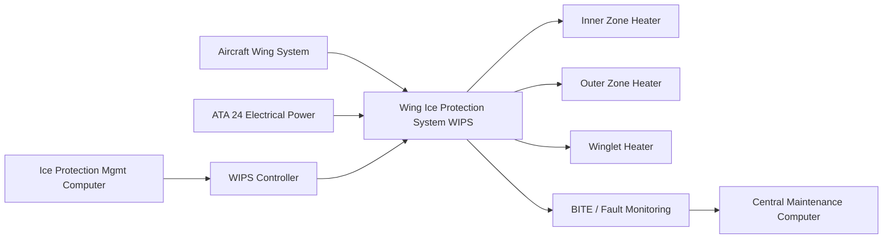
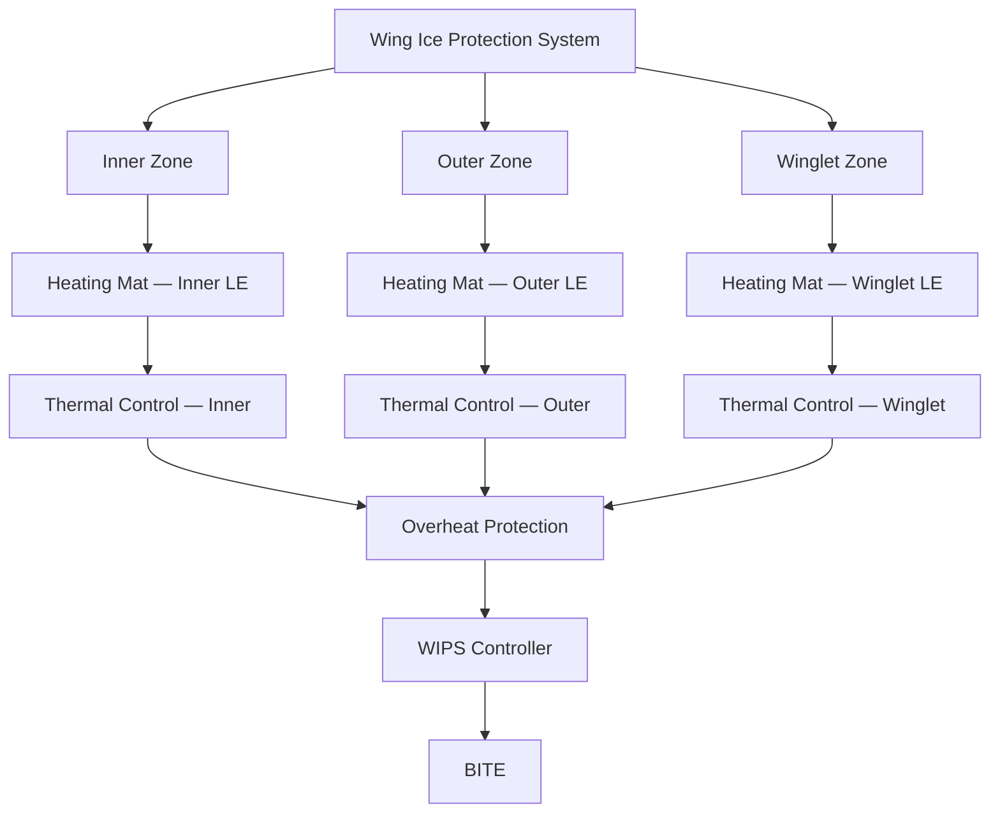
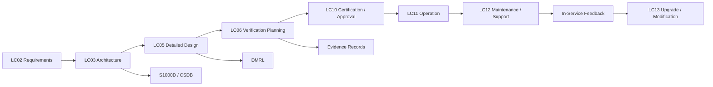

# 030-010 — Wing Ice Protection
### AMPEL360e eWTW · ATA 30-10 · Q+ATLANTIDE ATLAS Scaffold

---

## §0 Hyperlink Policy

All hyperlinks in this document are **relative links** unless they point to a published external standard. Links marked **TBD** indicate targets not yet assigned a stable path within the Q+ATLANTIDE repository. Cross-references to sibling ATA 30 documents use file-name relative links only. Do not invent or guess link targets not listed here.

---

## §1 Purpose

This document defines the Wing Ice Protection System (WIPS) for the **AMPEL360e eWTW** — a full-electric aircraft in which all wing leading-edge anti-icing is accomplished exclusively by **electrothermal heating mats** bonded within the composite wing leading-edge panels. There is no engine bleed-air system; the WIPS draws all thermal energy from the High-Voltage DC (HVDC) electrical buses managed by ATA 24 (Electrical Power). This document specifies the zone architecture, power distribution, cyclic de-icing sequencing, structural integration approach, thermal runaway protection logic, and the regulatory compliance basis for wing ice protection under CS-25 Appendix C and Appendix O.

---

## §2 Applicability

| Item | Value |
|---|---|
| Programme | AMPEL360e Wide Tube-and-Wing Family (eWTW) |
| ATA Sub-chapter | 30-10 — Wing Ice Protection |
| Aircraft Series | eWTW-100, eWTW-200 |
| Wing Configuration | Tube-and-wing, composite primary structure with CFRP leading-edge panels |
| WIPS Architecture | Electrothermal heating mats — cyclic de-icing / continuous anti-ice modes |
| Power Source | HVDC Bus A and Bus B (voltage TBD: 270 V DC or 540 V DC) |
| Certification Basis | CS-25 Appendix C; CS-25 Appendix O (SLD); FAR 25.1419 |
| Document Status | Programme-controlled scaffold — not yet approved for manufacture |

---

## §3 System / Function Overview

The AMPEL360e eWTW wing leading edge is constructed from carbon fibre reinforced polymer (CFRP) panels that extend from the wing root to the wingtip, including the winglet leading edge. Each panel contains one or more electrothermal heating mat elements laminated within the composite layup or adhesively bonded to the inner face of the leading-edge skin. The heating mats consist of etched-foil resistive elements embedded in a polyimide or PTFE film substrate, rated for continuous operation at the local HVDC supply voltage. The mat design must satisfy the minimum power density (W/cm²) required to maintain the leading-edge skin temperature above 0 °C across the stagnation line under the worst-case Appendix C icing condition, accounting for convective heat loss at the maximum design airspeed.

The WIPS operates in two primary thermal modes: **cyclic de-icing mode** and **continuous anti-ice mode**. In cyclic de-icing mode — the default energy-efficient mode — the WIPS controller energises each zone in sequence for a prescribed ON-time, allowing a thin ice layer to accrete on the leading edge before the heater melts the ice bond and aerodynamic forces shed the ice slab away from the surface. The cycle time and duty cycle for each zone are determined by the thermal mass of the leading-edge skin, the heater power density, the ambient temperature, and the liquid water content (LWC) derived from the ice detector and TAT inputs. In continuous anti-ice mode — selectable manually or triggered by specific icing conditions such as SLD detection — all zones are energised simultaneously at full power to prevent any ice formation. This mode has a higher electrical power demand and is managed by the IPMC in coordination with ATA 24 power management to ensure the electrical generation budget is not exceeded.

The WIPS is **not activated on the ground**. Ground icing operations (frost, ice, or snow on the wing) are addressed by external ground de-icing with Type I/IV fluids per ground operations procedures. The WIPS automatic activation logic includes an on-ground inhibit signal from the weight-on-wheels (WOW) switch, preventing inadvertent heater energisation during ground servicing.

---

## §4 Scope

### 4.1 Included

- Wing leading-edge electrothermal heating mats — inner zone, outer zone, and winglet zone
- WIPS controller (zone power switching, thermal control logic, overheat protection)
- HVDC power distribution from bus to WIPS controller and zone contactors
- Thermal sensors (thermocouples or PT100) embedded in each leading-edge zone
- Overheat protection circuitry (hardware-latching cutoff at upper temperature limit TBD)
- Cyclic de-icing sequencing algorithm and continuous anti-ice mode
- Interface with IPMC (ATA 30-70) for zone activation commands and status feedback
- Interface with ATA 24 for high-power bus allocation and load-shedding coordination
- Ground icing inhibit logic (WOW interlock)
- BITE for all WIPS heater zones and controller
- SLD extended coverage zone (Appendix O) — zone boundary definition (TBD)

### 4.2 Excluded

- Horizontal stabiliser ice protection (separate subsubject; not within scope of WIPS 030-10)
- Engine inlet and nacelle anti-icing (see 030-020)
- Ground de-icing with external fluid (ground operations documentation)
- Structural design of CFRP leading-edge panels (ATA 57 Structures)
- Anti-icing of fuel in wing tanks (ATA 28 Fuel)
- Lightning strike protection of wing leading edge (ATA 57 — shares leading-edge zone but separate system)

---

## §5 Architecture Description

- **Zone segmentation:** The wing leading edge is divided into six electrothermal heating zones per wing (twelve zones total): Zone 1 (inner, root section), Zone 2 (inner mid), Zone 3 (outer), Zone 4 (outer tip), Zone 5 (winglet lower), Zone 6 (winglet upper). Zone boundaries are driven by the stagnation line curvature, panel joints, and power distribution cabling run lengths. Zone segmentation minimises peak electrical load per switching event and limits the ice slab size shed during cyclic de-icing.

- **Power switching architecture:** Each heating zone is served by a solid-state power controller (SSPC) or electromechanical contactor (selection TBD at detailed design) mounted in the WIPS controller LRU. The WIPS controller receives DC power from dedicated HVDC bus feeders with circuit protection rated for the maximum zone current. The WIPS controller receives zone activation commands from the IPMC via a serial data bus (ARINC 429 or CAN-FD, programme-TBD) and executes the ON/OFF cycle independently without IPMC intervention on a cycle-by-cycle basis once the sequence is initiated.

- **Thermal runaway protection:** A hardware-independent overheat protection circuit within the WIPS controller monitors embedded zone temperature sensors. If any zone exceeds the defined upper temperature limit (TBD — approximately 80 °C for composite laminate compatibility), the circuit latches the zone contactor open and issues a fault signal to the IPMC regardless of the zone activation command state. Latching prevents auto-reset, requiring a maintenance ground reset after investigation. This protects the CFRP laminate from thermal degradation.

- **SLD mode operation:** When the IPMC asserts the SLD condition flag (derived from ice detector data and meteorological criteria per CS-25 Appendix O guidance), the WIPS controller switches from cyclic to continuous anti-ice mode and increases the heating zone extent to the Appendix O coverage boundary (TBD per CFD analysis). The IPMC simultaneously requests additional electrical generation capacity from ATA 24.

- **Failure mode — partial zone loss:** Loss of a single heating zone (open circuit or SSPC fault) results in an amber ECAM caution and degraded ice protection on that span section. The IPMC assesses whether continued flight in icing conditions is permissible using the remaining zone coverage, based on a criticality matrix defined during the safety assessment. Loss of all zones on one wing triggers a red warning and requires the crew to exit icing conditions.

---

## §6 Functional Breakdown

| Function ID | Function Title | Description | Zone / Component |
|---|---|---|---|
| F-001 | Inner Zone Cyclic De-Icing | Cyclic energisation of Zones 1–2 (inner leading edge) to melt ice bond and shed ice under aerodynamic forces | Zones 1, 2 — inner LE |
| F-002 | Outer Zone Cyclic De-Icing | Cyclic energisation of Zones 3–4 (outer leading edge) providing continuous icing protection across outer wing panel | Zones 3, 4 — outer LE |
| F-003 | Winglet Zone Anti-Icing | Cyclic or continuous heating of winglet leading-edge zones; SLD mode may require continuous | Zones 5, 6 — winglet LE |
| F-004 | Continuous Anti-Ice Mode | All zones simultaneously energised at full power in SLD or manually commanded conditions | All zones |
| F-005 | Overheat Protection | Hardware-latched zone cutoff on temperature exceedance; independent of software activation commands | WIPS controller thermal circuit |
| F-006 | Ground Icing Inhibit | WOW-signal-based inhibit preventing WIPS activation on ground to protect ground personnel | WIPS controller interlock |
| F-007 | BITE and Zone Monitoring | Current sense and temperature feedback for all zones; open-circuit and short-circuit detection | WIPS controller BITE |

---

## §7 System Context Diagram

---

## §8 Internal Functional Architecture

---

## §9 Lifecycle Traceability

---

## §10 Interfaces

| Interface ID | Interfacing System | ATA Chapter | Interface Type | Description |
|---|---|---|---|---|
| IF-010-001 | Electrical Power | ATA 24 | Power supply (HVDC) | HVDC bus feeds to WIPS zone contactors; load-shedding coordination signal from IPMC to power management |
| IF-010-002 | Ice Protection Management Computer | ATA 30-70 | Data (serial bus) | Zone activation commands, mode selection (cyclic/continuous/SLD), and zone status feedback between IPMC and WIPS controller |
| IF-010-003 | Central Maintenance Computer | ATA 45 | Data (ARINC 429) | BITE fault codes, zone temperature history, heater circuit resistance data uploaded to CMC |
| IF-010-004 | Indicating / ECAM | ATA 31 | Data (AFDX/ARINC 429) | WIPS system status, active zones, fault warnings and cautions displayed on ECAM EIS pages |
| IF-010-005 | Landing Gear / WOW | ATA 32 | Discrete signal | Weight-on-wheels signal prevents WIPS activation on ground |
| IF-010-006 | Wing Structure | ATA 57 | Physical/thermal | Heating mats bonded within or to CFRP leading-edge panels; thermal interface design must respect composite laminate temperature limits |

---

## §11 Operating Modes

| Mode | Designation | Conditions | WIPS Controller Action | Crew Indication |
|---|---|---|---|---|
| Cyclic De-Icing | CYCLIC | Ice detected; OAT ≤ +10 °C; aircraft in flight | Zone sequence 1→2→3→4→5→6 energised cyclically; ON-time and cycle period per certified schedule | WING ANTI ICE ON (blue) |
| Continuous Anti-Ice | CONT A/I | SLD mode or crew manual selection of continuous | All zones simultaneously energised at 100% duty cycle | WING ANTI ICE CONT (blue) |
| Standby — Armed | ARMED | Aircraft in flight; below icing threshold | All zones de-energised; ready for auto-activation on ice detection | WING ANTI ICE ARMED (white) |
| Degraded — Zone Fault | DEGRADED | One or more zone open/short circuit | Affected zone isolated; remaining zones continue cyclic sequence | WIPS ZONE FAULT (amber caution) |
| Ground Inhibit | INHIBIT | Weight-on-wheels switch GROUND | All zone activation commands inhibited | WIPS INHIBIT (white status) |
| Failure Safe State | FAIL-SAFE | WIPS controller failure or IPMC command loss | All zone contactors open (safe de-energised); crew notified | WIPS FAULT (red warning) |

---

## §12 Monitoring and Diagnostics

The WIPS controller provides full BITE coverage of all twelve heating zones (six per wing). Monitoring functions include:

- **Current sensing:** Each zone SSPC/contactor includes a hall-effect current sensor. The WIPS controller compares measured current against the expected value for the applied voltage and zone resistance. A deviation exceeding ±15% triggers an open-circuit or short-circuit fault flag. Sensitivity is sufficient to detect the loss of a single heater sub-element within a multi-element zone mat.
- **Temperature telemetry:** Embedded thermocouples (or PT100 RTDs) at the stagnation point and runback limit of each zone provide real-time temperature data. During cyclic de-icing, the controller verifies that zone temperature rises to the expected melt threshold within the specified ON-time; failure to reach threshold indicates reduced heater performance (degraded mat element or partial delamination).
- **Overheat latching:** If any zone temperature sensor exceeds the upper limit (TBD, target ~80 °C), the hardware overheat protection circuit latches the zone contactor open and logs an overheat event to CMC. The latch is not auto-resettable and requires a maintenance action.
- **Ground BITE test:** On crew request or pre-departure automatic check, the WIPS controller energises each zone at 10% power for 5 seconds and measures current and resistance. Results are logged to CMC and a GO/NO-GO status is presented on the ECAM maintenance page.
- **ECAM classification:** Zone faults are classified as CAUTION (amber) for single-zone failures, WARNING (red) for loss of all zones on one wing or WIPS controller failure, and STATUS (white) for nuisance faults or inhibit conditions.

---

## §13 Maintenance Concept

The WIPS is designed to minimise unscheduled maintenance while providing clear fault isolation to the LRU level:

- **Heating mat inspection:** The leading-edge composite panels are inspected for delamination, impact damage, or heater mat degradation at C-check intervals using thermographic inspection (infrared camera scan with zone energised at low power). Localised delamination of the mat from the skin is detectable as a hot-spot with reduced local heat flux to the outer surface. Thermographic baseline maps are established during production acceptance.
- **Resistance measurement:** The DC resistance of each zone is measured at line level using a calibrated micro-ohmmeter via a dedicated access connector on the wing lower surface. Resistance values are compared to the production baseline; a drift of more than ±10% triggers a zone investigation.
- **Leading-edge panel replacement:** If mat damage is confirmed beyond repair, the entire leading-edge panel is replaced as a structural assembly. Panel removal and replacement is a heavy maintenance task requiring wing jig access and composite repair shop capability.
- **WIPS controller LRU:** The WIPS controller is located in the wing root avionics bay and is accessible from a dedicated access panel on the lower wing surface. Replacement requires connector disconnection and four mounting fasteners. Post-replacement, a BITE ground test confirms correct zone identification and circuit integrity.
- **Scheduled task:** WIPS zone electrical resistance check — interval TBD, target C-check or 6,000 FH.

---

## §14 S1000D / CSDB Mapping

| Info Code | Title | DMC | Status |
|---|---|---|---|
| 040 | System Description — Wing Ice Protection | DMC-AMPEL360E-EWTW-030-10-040-A | Draft scaffold |
| 300 | Zone Inspection — Heating Mat Thermographic Check | DMC-AMPEL360E-EWTW-030-10-300-A | Not started |
| 400 | Fault Isolation — WIPS Zone Open/Short Circuit | DMC-AMPEL360E-EWTW-030-10-400-A | Not started |
| 520 | Remove — Leading-Edge Panel with Heating Mat | DMC-AMPEL360E-EWTW-030-10-520-A | Not started |
| 720 | Install — Leading-Edge Panel with Heating Mat | DMC-AMPEL360E-EWTW-030-10-720-A | Not started |
| 941 | Illustrated Parts Data — WIPS Heating Mat Zones | DMC-AMPEL360E-EWTW-030-10-941-A | Not started |

---

## §15 Footprints

### 15.1 Physical

The WIPS adds mass to the wing leading edge through the embedded heating mat elements (etched foil + polyimide film substrate, estimated 0.3–0.8 kg/m² depending on power density — TBD). The WIPS controller LRU is located in the wing root avionics bay, dimensions and mass TBD at detailed design. Power cabling from the HVDC bus runs within the wing front spar box, adding estimated mass TBD kg per wing.

### 15.2 Electrical / Data

| Circuit | Bus Source | Power Rating | Switching |
|---|---|---|---|
| WIPS Zone 1 — Inner | HVDC Bus A | TBD kW | SSPC or contactor in WIPS controller |
| WIPS Zone 2 — Inner Mid | HVDC Bus A | TBD kW | SSPC or contactor |
| WIPS Zones 3–4 — Outer | HVDC Bus B | TBD kW each | SSPC or contactor |
| WIPS Zones 5–6 — Winglet | HVDC Bus B | TBD kW | SSPC or contactor |
| WIPS Controller — Control Power | 28 V DC Essential | ~20 W | Protected by essential bus breaker |

### 15.3 Maintenance

Scheduled tasks: thermographic mat inspection (C-check or 6,000 FH TBD); zone resistance measurement (same interval); BITE ground test (pre-departure or A-check). Unscheduled: WIPS controller LRU replacement on BITE fault; leading-edge panel replacement on mat delamination confirmation.

### 15.4 Data

WIPS BITE data retained in CMC non-volatile memory: zone ON/OFF cycle log, temperature history, fault event log, resistance measurement history. Data downloadable via ATA 45 standard interface. Retention: 500 FH or 1,000 FC minimum.

---

## §16 Safety and Certification Considerations

| Regulation | Applicability | Compliance Method |
|---|---|---|
| CS-25 Appendix C | Wing leading-edge ice protection in continuous max and intermittent max icing envelopes | Thermal analysis (CFD + heat transfer), icing wind tunnel test on panel segments, natural icing flight test |
| CS-25 Appendix O | SLD icing (freezing drizzle MVD 100–500 µm; freezing rain) — extended zone coverage required | Extended zone boundary CFD analysis, SLD tanker flight test demonstration |
| CS-25.1419 | Automatic activation of WIPS on icing condition detection | IPMC auto-activation logic verification via HIIL and flight test; FHA/SSA per ARP 4761 |
| FAR 25.1419 | FAA harmonised requirement | Dual-authority compliance per joint EASA/FAA certification agreement |
| DO-160G Section 4 (Temperature) | Thermal mat and WIPS controller environmental qualification | Environmental qualification test programme for WIPS controller LRU |
| CS-25.581 / CS-25.954 | Lightning strike protection — composite wing leading edge with embedded heater mat | Lightning indirect effects test on panel specimens; mat design must survive Appendix H lightning zone |

---

## §17 Verification and Validation

| V&V Method | ID | Description | Applicable Functions | Status |
|---|---|---|---|---|
| Thermal Analysis | VV-010-001 | CFD-coupled heat-transfer analysis of all six leading-edge zones under worst-case Appendix C LWC, MVD, and OAT; validates power density requirements per zone | F-001, F-002, F-003 | Not started |
| Icing Wind Tunnel Test | VV-010-002 | Panel-level icing wind tunnel testing of inner and outer zone mats; measurement of ice accretion rate, shed-ice mass, and runback ice limit under cyclic de-icing protocol | F-001, F-002 | Not started |
| Structural / Thermal Compatibility Test | VV-010-003 | Qualification of heating mat bonded within CFRP layup; thermal cycling, overheat exposure, and peel strength testing per qualified composite repair standard | F-005 | Not started |
| HIIL Simulation | VV-010-004 | Hardware-in-the-loop test of WIPS controller with simulated zone thermal sensors and IPMC commands; validates cyclic sequence timing, overheat cutout, and BITE detection | F-001 through F-007 | Not started |
| Certification Flight Test — Natural Icing | VV-010-005 | Demonstration of ice-free leading edge across all zones in CS-25 Appendix C and Appendix O natural icing conditions; includes SLD tanker runs | F-001 through F-004 | Not started |

---

## §18 Glossary

| Term | Acronym | Definition |
|---|---|---|
| Wing Ice Protection System | WIPS | The electrothermal heating system applied to all wing leading-edge zones in the eWTW to prevent or remove ice accretion |
| Heating Mat | — | A thin flexible resistive heating element (etched foil on polyimide/PTFE substrate) bonded within or to the inner face of the CFRP wing leading-edge panel |
| Cyclic De-Icing | — | A mode in which heating zones are energised sequentially; ice accretes thinly, the heater melts the ice bond, and aerodynamic forces shed the ice slab |
| Electrothermal Element | — | The individual resistive conductor track within the heating mat that converts electrical energy to heat |
| Leading-Edge Zone | LE Zone | A defined span segment of the wing leading edge served by a single heating mat and dedicated power switching circuit |
| Power Density | W/cm² | The thermal power delivered per unit area of leading-edge surface; must exceed the minimum required to maintain surface temperature above 0 °C in icing conditions |
| Thermal Runaway Protection | — | A hardware-latching circuit that disconnects a heating zone if its temperature exceeds a defined upper limit, preventing composite laminate degradation |
| SLD Icing | — | Supercooled Large Droplet icing (CS-25 Appendix O); droplets with MVD > 50 µm requiring extended zone coverage compared to standard Appendix C protection |
| Solid-State Power Controller | SSPC | An electronic switching device used to energise and de-energise individual WIPS zones; provides current sensing and fault protection without mechanical contacts |

---

## §19 Citations

| Ref ID | Document | Version | Relevance |
|---|---|---|---|
| CIT-001 | CS-25 Appendix C — Atmospheric Icing Conditions (Continuous Maximum and Intermittent Maximum) | Amendment 27 | Primary icing certification envelope for wing anti-ice system design and verification |
| CIT-002 | CS-25 Appendix O — Supercooled Large Droplet Icing Conditions | Amendment 27 | SLD icing certification envelope; extended zone coverage requirements for WIPS |
| CIT-003 | FAR 25.1419 — Ice Protection | Amendment 25-147 | US certification requirement; WIPS automatic activation and redundancy requirements |
| CIT-004 | RTCA DO-160G — Environmental Conditions and Test Procedures for Airborne Equipment | Edition G | Environmental qualification of WIPS controller LRU |
| CIT-005 | AMPEL360e eWTW WIPS System Specification | TBD — programme document | Programme-level power density, zone layout, and certification flight test requirements for WIPS |

---

## §20 References

| Ref ID | Title | Document Number | Notes |
|---|---|---|---|
| REF-001 | 030-000 Ice and Rain Protection General | 030-000-Ice-and-Rain-Protection-General.md | Parent scaffold document; system boundary and IPMC architecture |
| REF-002 | 030-070 Ice Detection and Protection Control | 030-070-Ice-Detection-and-Protection-Control.md | IPMC architecture; zone activation commands and SLD mode flag |
| REF-003 | ATA 24 Electrical Power Architecture | TBD | HVDC bus allocation and power budget for WIPS high-power loads |
| REF-004 | ATA 57 Wing Structures | TBD | CFRP leading-edge panel structural design and temperature limits for heater mat integration |
| REF-005 | SAE ARP 4761 — Safety Assessment Process | ARP 4761 | FHA and SSA methodology for WIPS failure mode analysis |
| REF-ATA | ATA 30-10 — Wing Ice Protection | ATA iSpec 2200 | Reference SNS for content and task code conventions |

---

## §21 Open Issues

| OI ID | Issue | Owner | Target Resolution | Status |
|---|---|---|---|---|
| OI-001 | HVDC bus voltage for WIPS high-power circuits (270 V DC vs 540 V DC) drives heating mat element resistance design — not yet selected | ATA 24 / Q-MECHANICS | LC03 Architecture freeze | Open |
| OI-002 | Appendix O extended zone boundary on outer wing not defined — requires CFD SLD impingement analysis before mat design can be finalised | Q-AIR | LC05 Detailed Design | Open |
| OI-003 | Heating mat vendor and substrate material (polyimide vs PTFE) not selected; affects composite compatibility and lightning indirect effects performance | Q-STRUCTURES / procurement | LC05 Detailed Design | Open |
| OI-004 | Cyclic de-icing schedule (ON-time, cycle period per zone) requires icing wind tunnel correlation before flight test — test facility booking TBD | Q-MECHANICS / ORB-PMO | LC06 Verification Planning | Open |

---

## §22 Change Log

| Version | Date | Author | Description |
|---|---|---|---|
| 0.1.0 | 2026-05-09 | Q+ATLANTIDE ATLAS Authoring | Initial scaffold creation — all sections populated at programme-controlled-scaffold status |
