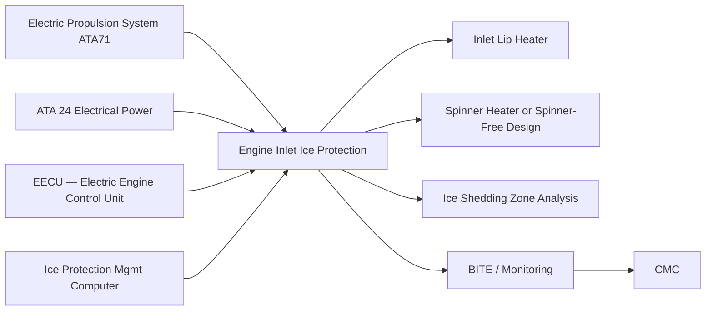
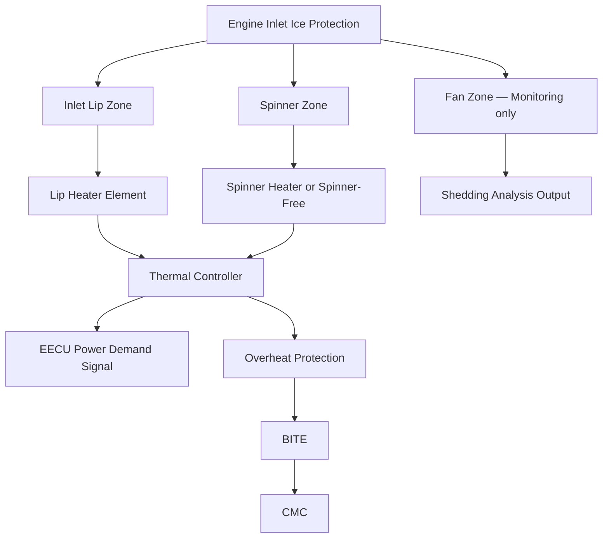
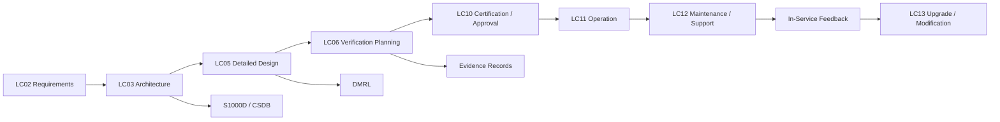

# 030-020 — Engine and Inlet Ice Protection
### [PROGRAMME-AIRCRAFT] [PROGRAMME-VARIANT] · ATA 30-20 · Q+ATLANTIDE ATLAS Scaffold

---

## §0 Hyperlink Policy

All hyperlinks in this document are **relative links** unless pointing to a published external standard. Links marked **TBD** indicate targets not yet assigned a stable path within the Q+ATLANTIDE repository. Cross-references to sibling ATA 30 documents use file-name relative links only. Do not invent or guess link targets.

---

## §1 Purpose

This document defines the agnostic ATLAS standard-level architecture context for `030-020 — Engine and Inlet Ice Protection`.

It describes the controlled scope, functions, interfaces, safety considerations, lifecycle traceability, and S1000D/CSDB mapping logic that programme implementations shall instantiate when this node is applicable.

This document is not a programme design baseline. Programme-specific capacities, locations, part numbers, effectivity, operating limits, maintenance references, and data module codes shall be defined only inside the applicable programme implementation branch.
## §2 Applicability

| Applicability Level | Rule |
|---|---|
| Standard taxonomy | Applies to the ATLAS node `<NODE>` |
| Programme implementation | Conditional; determined by programme architecture, trade studies, certification basis, and applicability model |
| Product configuration | Defined in the programme-specific configuration baseline |
| Effectivity | Defined in the programme CSDB / applicability layer |
| Non-applicability | Must be explicitly stated in the programme impact-study branch when excluded |
## §3 System / Function Overview

The [PROGRAMME-AIRCRAFT] [PROGRAMME-VARIANT] electric propulsion system presents a fundamentally different ice protection challenge from a gas turbine engine. There is no compressor stage to generate hot bleed air for inlet anti-icing, and the electric fan creates no significant aerodynamic heating at the inlet lip during ground or flight operation. Ice forming on the inlet lip can accrete and eventually shed as ice slabs or fragments into the rotating fan. Unlike a turbofan engine with combustion stages downstream, an electric motor fan has no inherent ice-ingestion tolerance mechanism from heat — the fan blades must be protected from ice impact damage, and ice shedding into the fan disk must be shown to be acceptable or prevented entirely. Therefore, the [PROGRAMME-VARIANT] adopts a **continuous anti-ice mode** for the inlet lip heater: the heater operates continuously in icing conditions, maintaining the inlet lip skin temperature above 0 °C at all times, so that no ice accretes and no shedding event can occur.

The nacelle inlet lip is fabricated from titanium alloy or aluminium (structural design TBD) and carries a circumferential electrothermal heater element bonded to the inner lip surface. The heater element is a brazed or bonded metal sheath heater, or a flexible foil element, operating at HVDC voltage directly or via a step-down converter (programme design choice TBD). The inlet lip heater is powered continuously throughout all flight phases in which icing conditions are detected or OAT is at or below +10 °C. A power demand signal from the EECU to the IPMC allows reduction of inlet heater power during specific high-demand electric motor phases (e.g., take-off at maximum thrust) if the power budget is exceeded, but only for periods not exceeding a certified duration that ensures no ice accretion occurs at the reduced power level. The inlet lip heater is not inhibited on the ground; it may be activated for ground icing operations if icing conditions exist while the aircraft is awaiting departure, subject to a maximum ground energisation time limit and personnel safety exclusion zone.

---

## §4 Scope

### 4.1 Included

- Inlet lip electrothermal heater — full circumference of each nacelle inlet
- Spinner anti-ice heater or spinner-free design justification (see §5)
- Fan blade ice accretion assessment and ice shedding analysis (risk assessment, not active protection)
- Engine Inlet Power Controller (EIPC) per nacelle
- HVDC power distribution from aircraft bus to EIPC and inlet lip heater
- Overheat protection for inlet lip heater (hardware-latching, temperature sensor in lip)
- Coordination with EECU for power demand management during high-thrust phases
- BITE for inlet lip heater circuit and EIPC
- Interface with IPMC for activation commands and status reporting
- Composite nacelle structural thermal compatibility assessment (heater installation on inlet lip)
- Fan blade ice shedding analysis per CS-E 790 and AC 20-147B

### 4.2 Excluded

- Fan blade de-icing or active fan blade anti-ice (not installed; analysis shows shedding risk acceptable or spinner-free design eliminates spinner ice source — TBD)
- Fan cowl and nacelle exterior ice protection (analysis shows no significant accretion on fan cowl exterior)
- Engine oil system freeze protection (ATA 71/79 scope)
- Ground de-icing of nacelle inlet with external fluid (ground operations)
- Thrust reverser ice protection (thrust reverser not installed on [PROGRAMME-VARIANT] — TBD)

---

## §5 Architecture Description

- **Continuous anti-ice mode — no shedding allowed:** Unlike wing WIPS which can operate in cyclic de-icing mode, the inlet lip heater operates in continuous anti-ice mode only. Any ice shed from the inlet lip that enters the fan disk could cause fan blade damage, rotor imbalance, or structural failure. The continuous anti-ice requirement drives a higher instantaneous electrical power demand for EIP compared with an equivalent bleed-air anti-ice system, but eliminates the ice ingestion risk entirely. This is the safety-critical design choice for [PROGRAMME-VARIANT] electric propulsion.

- **Spinner design — two architecture options under evaluation:** Option A is a **spinner anti-icing heater**: a carbon fibre spinner with an embedded electrothermal heater element, keeping the spinner nose temperature above 0 °C in icing conditions. Option B is a **spinner-free (or recessed spinner) design**: the electric motor shaft does not protrude beyond the fan plane into the airflow, eliminating the spinner as an ice-accreting surface. Option B is under structural and aerodynamic feasibility evaluation for the [PROGRAMME-VARIANT]. The architecture selection will be resolved at LC03 design freeze. Until then, both options are maintained in parallel in this scaffold.

- **Power coordination with EECU:** The EECU monitors electric motor bus current and thermal state. During take-off at maximum power, the combined inlet lip heater + motor load may approach the instantaneous electrical generation limit. The IPMC implements a short-duration (≤30 seconds) power deferral of the inlet lip heater at take-off, reducing heater power to 50% (warm-start level) while the motor is at maximum current. Analysis must show that 30 seconds at 50% power does not allow ice to accrete to a hazardous level starting from an ice-free, pre-heated inlet lip. This analysis is required as part of the EIP safety case.

- **Fan blade ice shedding analysis:** Even with continuous inlet lip anti-ice, supercooled droplets impinging on fan blade leading edges can accrete ice under certain conditions (fan blade rotation, temperature distribution on blade surface). A fan blade ice shedding analysis per AC 20-147B is required to demonstrate that shed ice from fan blades does not cause hazardous imbalance, structural failure, or downstream component damage. The analysis covers maximum shed ice mass, shed event timing, and fan disk response.

- **Composite nacelle thermal interface:** The nacelle inlet cowl structure is fabricated from composite materials (CFRP or GFRP — TBD). The electrothermal heater bonded to the inner face of the metallic inlet lip must not transmit temperatures that degrade the composite cowl structure or the adhesive bond between the lip and the cowl. A thermal break or heat sink design between the lip heater and the composite cowl is required.

---

## §6 Functional Breakdown

| Function ID | Function Title | Description | Zone / Component |
|---|---|---|---|
| F-001 | Inlet Lip Continuous Anti-Icing | Continuous energisation of the full-circumference inlet lip heater in icing conditions; maintains lip skin temperature above 0 °C | Inlet lip heater — all circumference |
| F-002 | Spinner Anti-Ice (Option A) | Continuous electrothermal heating of composite spinner nose to prevent ice accretion and shedding onto fan blades | Spinner heater element (if Option A selected) |
| F-003 | Spinner-Free Design Rationale (Option B) | Engineering justification that recessed or absent spinner eliminates spinner ice accretion source | Design analysis document — structural/aerodynamic |
| F-004 | Fan Zone Ice Monitoring | Monitoring of fan blade inlet airflow temperature and ice indicator status; no active blade anti-ice — monitoring only | Fan zone — EECU data channel |
| F-005 | Power Demand Coordination | EECU-to-IPMC signal for power deferral during take-off maximum thrust phase; partial heater power for ≤30 seconds | EIPC / EECU interface |
| F-006 | Overheat Protection | Hardware-latching thermal cutout if inlet lip temperature exceeds upper limit (TBD); protects composite nacelle cowl | EIPC hardware circuit |
| F-007 | BITE and Fault Monitoring | Current sense and temperature monitoring of inlet lip heater and EIPC; open/short circuit detection | EIPC BITE function |

---

## §7 System Context Diagram

---

## §8 Internal Functional Architecture

---

## §9 Lifecycle Traceability

---

## §10 Interfaces

| Interface ID | Interfacing System | ATA Chapter | Interface Type | Description |
|---|---|---|---|---|
| IF-020-001 | Electrical Power | ATA 24 | Power supply (HVDC) | HVDC bus feed to EIPC for inlet lip heater; bus load coordination with power management unit |
| IF-020-002 | Electric Propulsion / EECU | ATA 71 | Data (discrete + serial) | Power demand deferral signal from EECU to IPMC; EECU provides motor bus current and thrust status to inform EIP power management |
| IF-020-003 | Ice Protection Management Computer | ATA 30-70 | Data (ARINC 429 / CAN-FD) | Activation commands from IPMC to EIPC; heater status, fault flags, and temperature telemetry from EIPC to IPMC |
| IF-020-004 | Indicating / ECAM | ATA 31 | Data (AFDX / ARINC 429) | Inlet lip heater status, fault warnings (amber/red), and EIP advisory messages to ECAM EIS |
| IF-020-005 | Central Maintenance Computer | ATA 45 | Data (ARINC 429) | BITE fault codes, heater circuit log, temperature history from EIPC to CMC |
| IF-020-006 | Nacelle Structure | ATA 54 | Physical/thermal | Heater element bonded to inner face of titanium or aluminium inlet lip ring; thermal interface with adjacent composite cowl structure requires design clearance |

---

## §11 Operating Modes

| Mode | Designation | Conditions | EIPC Action | Crew Indication |
|---|---|---|---|---|
| Continuous Anti-Ice | ANTI ICE ON | Icing conditions detected AND aircraft in flight (or on ground if approved) | Inlet lip heater at 100% power; spinner heater at 100% (if Option A) | ENG ANTI ICE ON (blue advisory) |
| Power Deferral | DEFER | EECU power demand signal active (take-off max thrust ≤30 s) | Inlet lip heater at 50% warm-start level; IPMC monitors duration timer | ENG ANTI ICE DEFERRAL (white status) |
| Standby — Armed | ARMED | Aircraft in flight below icing threshold | Heater de-energised; ready for IPMC activation command | ENG ANTI ICE ARMED (white status) |
| Ground Anti-Ice | GND A/I | Ground icing conditions; crew selects ground anti-ice | Inlet lip heater energised at reduced power (ground cycle); personnel exclusion zone applies | GND ANTI ICE ON (blue) |
| Degraded — Heater Fault | DEGRADED | Inlet lip heater open circuit or EIPC fault on one nacelle | Affected nacelle heater isolated; crew notified; icing penetration restriction | ENG ANTI ICE FAULT (amber caution) |
| Failure Safe State | FAIL-SAFE | Total EIPC failure or loss of HVDC feed to EIPC | Heater de-energised; crew notified; exit icing conditions | ENG ANTI ICE FAIL (red warning) |

---

## §12 Monitoring and Diagnostics

The EIPC provides dedicated BITE coverage for the inlet lip heater circuit and the spinner heater (if Option A):

- **Current feedback:** The EIPC measures the DC current drawn by the inlet lip heater element during each energisation cycle. The expected current is computed from the known heater element resistance and applied voltage. An open-circuit fault (heater element fracture) is detected as near-zero current; a short-circuit fault (insulation failure) is detected as over-current with rapid thermal rise.
- **Temperature monitoring:** A thermocouple or RTD embedded in the inlet lip at the stagnation point provides real-time temperature feedback to the EIPC. The EIPC verifies that lip temperature rises to the target anti-ice threshold (typically +5 to +15 °C above ambient — TBD) within 60 seconds of heater activation in the worst-case icing condition. Failure to reach threshold within the specified time triggers a heater performance degradation fault.
- **Overheat protection:** If lip temperature exceeds the upper limit (TBD — ~120 °C for metal lip, ~80 °C composite adjacency limit), the EIPC hardware circuit latches the heater contactor open. This protects the bonded composite nacelle cowl and adjacent sealants from thermal degradation.
- **Power deferral timer:** The EIPC maintains a timer monitoring duration at 50% power. If the deferral exceeds the certified maximum duration (30 seconds TBD), the EIPC flags an IPMC override and forces full power restoration regardless of EECU demand signal, prioritising ice protection safety over motor power budget.
- **ECAM classification:** Single nacelle inlet heater fault: CAUTION (amber). Both nacelle inlet heaters failed: WARNING (red). Spinner heater fault (Option A): CAUTION (amber).

---

## §13 Maintenance Concept

- **Inlet lip heater inspection:** The inlet lip heater element is inspected at C-check intervals using a DC resistance measurement at an access connector on the inlet cowl. Element resistance values are compared to the production acceptance baseline; drift of more than ±10% triggers further investigation. Visual inspection of the heater bond line for delamination or moisture ingress is performed with the inlet cowl removed.
- **EIPC LRU replacement:** The EIPC is an avionics LRU in the nacelle avionics bay (or wing pylon, TBD). Replacement requires connector disconnection and four mounting fasteners. Post-replacement, a BITE ground test validates correct heater circuit recognition and fault-free status. EIPC configuration data (heater resistance baselines) must be loaded from the CMC or Portable Maintenance Device (PMD).
- **Spinner heater maintenance (Option A):** Spinner heater element condition is checked at every A-check using a resistance measurement at the spinner access connector. The spinner is removable for inspection without nacelle cowl removal. If the heater element fails, the spinner assembly is replaced as a unit.
- **Fan blade inspection following ice ingestion event:** If an ice ingestion event is suspected (e.g., vibration anomaly, ECAM imbalance advisory), a borescope inspection of fan blade leading edges is required before next flight. Fan blade ice damage assessment criteria are defined in the AMM.
- **Scheduled task:** Inlet lip heater resistance measurement — target C-check or 6,000 FH (TBD per MPD).

---

## §14 S1000D / CSDB Mapping

| Info Code | Title | DMC | Status |
|---|---|---|---|
| 040 | System Description — Engine Inlet Ice Protection | DMC-<PROGRAMME>-<VARIANT>-030-20-040-A | Draft scaffold |
| 300 | Inspection — Inlet Lip Heater Resistance and Bond Check | DMC-<PROGRAMME>-<VARIANT>-030-20-300-A | Not started |
| 400 | Fault Isolation — EIPC and Inlet Lip Heater Faults | DMC-<PROGRAMME>-<VARIANT>-030-20-400-A | Not started |
| 520 | Remove — Inlet Lip Heater Element | DMC-<PROGRAMME>-<VARIANT>-030-20-520-A | Not started |
| 720 | Install — Inlet Lip Heater Element | DMC-<PROGRAMME>-<VARIANT>-030-20-720-A | Not started |
| 941 | Illustrated Parts Data — Engine Inlet Ice Protection | DMC-<PROGRAMME>-<VARIANT>-030-20-941-A | Not started |

---

## §15 Footprints

### 15.1 Physical

Inlet lip heater element: full-circumference element bonded to inner lip surface; element mass estimated at TBD kg per nacelle. EIPC LRU: avionics bay or pylon location TBD; estimated mass TBD kg. Power cabling from HVDC bus to EIPC: run within nacelle pylon; mass TBD kg per nacelle.

### 15.2 Electrical / Data

| Circuit | Bus Source | Power Rating | Mode |
|---|---|---|---|
| Inlet Lip Heater — Nacelle 1 | HVDC Bus A | TBD kW | Continuous in icing conditions |
| Inlet Lip Heater — Nacelle 2 | HVDC Bus B | TBD kW | Continuous in icing conditions |
| Spinner Heater — Nacelle 1 (Option A) | HVDC Bus A | TBD kW | Continuous in icing conditions |
| Spinner Heater — Nacelle 2 (Option A) | HVDC Bus B | TBD kW | Continuous in icing conditions |
| EIPC Control Power — each nacelle | 28 V DC Essential | ~15 W | Continuous when aircraft powered |

### 15.3 Maintenance

Scheduled: inlet lip heater resistance check (C-check / 6,000 FH TBD); spinner heater resistance check A-check (Option A). Unscheduled: EIPC LRU replacement on BITE fault; fan blade borescope on suspected ice ingestion event.

### 15.4 Data

EIPC BITE data, heater temperature log, current history, and fault events retained in CMC. Data downloadable via ATA 45 interface. Fan blade ice shedding analysis output document retained in programme safety evidence record (TBD path).

---

## §16 Safety and Certification Considerations

| Regulation | Applicability | Compliance Method |
|---|---|---|
| CS-25.1419 | Automatic activation of engine inlet anti-ice; continuous protection in icing conditions | EIPC auto-activation via IPMC; analysis and flight test demonstration in icing conditions |
| CS-E 790 | Engine ice protection — inlet and spinner | Inlet lip thermal analysis, spinner design selection (Options A or B), fan blade shedding analysis |
| FAR 25.1419 | US counterpart to CS-25.1419 | Dual-authority compliance per joint EASA/FAA certification plan |
| AC 20-147B | Turbine engine and electric propulsion ice ingestion design guidelines | Fan blade ice shedding analysis; ice ingestion risk assessment per AC 20-147B methodology |
| DO-160G Section 4 | Environmental qualification of EIPC LRU | Temperature, vibration, humidity environmental qualification test programme |
| CS-25.1309 / ARP 4761 | Safety assessment — EIP failure conditions | FHA: loss of both nacelle inlet heaters in icing conditions assessed as Hazardous or Catastrophic; SSA required |

---

## §17 Verification and Validation

| V&V Method | ID | Description | Applicable Functions | Status |
|---|---|---|---|---|
| Thermal Analysis | VV-020-001 | Computational heat-transfer analysis of inlet lip heater at maximum CS-25 Appendix C LWC and minimum OAT; validates power density requirement for continuous anti-ice mode | F-001 | Not started |
| Ice Ingestion Assessment | VV-020-002 | Fan blade ice shedding analysis per AC 20-147B; assessment of maximum shed ice mass and ingestion consequences at maximum fan speed | F-004 | Not started |
| EIPC Environmental Qualification | VV-020-003 | DO-160G environmental test of EIPC LRU: temperature, vibration, humidity, EMI; verification of BITE detection thresholds | F-006, F-007 | Not started |
| HIIL Simulation | VV-020-004 | Hardware-in-the-loop test of EIPC with simulated IPMC commands, EECU power demand signal, and lip temperature sensor inputs; validates power deferral timer and overheat cutout | F-005, F-006 | Not started |
| Certification Flight Test — Natural Icing | VV-020-005 | Demonstration of ice-free inlet lip in CS-25 Appendix C icing conditions; post-flight borescope inspection for fan blade accretion; SLD tanker run if required by Appendix O | F-001, F-002 | Not started |

---

## §18 Glossary

| Term | Acronym | Definition |
|---|---|---|
| Electric Engine Control Unit | EECU | The control computer managing the electric motor drive system of each propulsion nacelle; equivalent to FADEC in a gas turbine context |
| Engine Inlet Ice Protection | EIP | The electrothermal system protecting the nacelle inlet lip and spinner from ice accretion on the [PROGRAMME-VARIANT] |
| Engine Inlet Power Controller | EIPC | The avionics LRU that switches and monitors electrical power to the inlet lip heater and spinner heater for each nacelle |
| Fan Blade Ice Shedding | — | The event in which ice accreted on a rotating fan blade leading edge is released due to centrifugal force, aerodynamic forces, or heater activation; the shed ice may impact downstream components |
| Ice Ingestion Risk | — | The probability and consequence of shed ice from the inlet lip or spinner entering the fan disk and causing blade damage or rotor imbalance |
| Inlet Lip Heater | — | The electrothermal element bonded to the inner circumferential surface of the nacelle inlet lip, providing continuous anti-icing in icing conditions |
| Nacelle Inlet Zone | — | The region from the inlet leading edge (lip) to the fan face, encompassing the lip, spinner, and fan leading-edge plane |
| Spinner Anti-Icing | — | Electrothermal heating of the rotating conical nose cap (spinner) forward of the fan to prevent ice accretion and resultant ice shedding onto fan blades |
| Spinner-Free Design | — | A nacelle configuration in which no protruding spinner is present in the airstream, eliminating spinner ice accretion as an ice source for fan ingestion |

---

## §19 Citations

| Ref ID | Document | Version | Relevance |
|---|---|---|---|
| CIT-001 | CS-25.1419 — Ice Protection | Amendment 27 | Automatic activation and design standard for engine inlet ice protection |
| CIT-002 | CS-E 790 — Engine Ice Protection | EASA CS-E Issue 1 Amdt 4 | Engine ice protection requirements applicable to electric propulsion inlet and fan design |
| CIT-003 | RTCA DO-160G — Environmental Conditions and Test Procedures for Airborne Equipment | Edition G | Environmental qualification of EIPC LRU |
| CIT-004 | AC 20-147B — Turbojet, Turboprop, Turboshaft, and Turbofan Engine Induction System Icing and Ice Ingestion | Rev B | Ice ingestion assessment methodology; ice shedding analysis guidance applicable to electric propulsion |
| CIT-005 | [PROGRAMME-AIRCRAFT] [PROGRAMME-VARIANT] Engine Inlet Ice Protection System Specification | TBD — programme document | Programme-level EIP power density, heater design, and EECU coordination requirements |

---

## §20 References

| Ref ID | Title | Document Number | Notes |
|---|---|---|---|
| REF-001 | 030-000 Ice and Rain Protection General | 030-000-Ice-and-Rain-Protection-General.md | Parent scaffold; system boundary, IPMC architecture, power budget overview |
| REF-002 | 030-070 Ice Detection and Protection Control | 030-070-Ice-Detection-and-Protection-Control.md | IPMC activation commands to EIPC; icing condition logic |
| REF-003 | ATA 71 Electric Propulsion System | TBD | EECU interface definition; power demand and motor thermal management |
| REF-004 | ATA 24 Electrical Power Architecture | TBD | HVDC bus allocation for EIP high-power loads; power deferral protocol |
| REF-005 | SAE ARP 4761 — Safety Assessment Process | ARP 4761 | FHA/SSA methodology for EIP failure mode analysis |
| REF-ATA | ATA 30-20 — Engine and Inlet Ice Protection | ATA iSpec 2200 | Reference SNS for content and task code conventions |

---

## §21 Open Issues

| OI ID | Issue | Owner | Target Resolution | Status |
|---|---|---|---|---|
| OI-001 | Spinner architecture (Option A heater vs Option B spinner-free) not selected — drives heater element design and EIPC output channel count | Q-AIR / ATA 71 | LC03 Architecture freeze | Open |
| OI-002 | Power deferral duration limit (30 s at 50% power) requires thermal analysis confirmation that inlet lip remains ice-free; analysis not yet initiated | Q-MECHANICS | LC05 Detailed Design | Open |
| OI-003 | Fan blade ice shedding analysis per AC 20-147B not yet scoped; requires fan blade geometry and rotation data from ATA 71 propulsion design | Q-AIR / ATA 71 | LC05 Detailed Design | Open |
| OI-004 | Inlet lip heater element technology (brazed metal sheath vs flexible foil) and HVDC voltage level (270 V vs 540 V) not yet selected; affects heater resistance and current rating | Q-MECHANICS / procurement | LC05 Detailed Design | Open |

---

## §22 Change Log

| Version | Date | Author | Description |
|---|---|---|---|
| 0.1.0 | 2026-05-09 | Q+ATLANTIDE ATLAS Authoring | Initial scaffold creation — all sections populated at programme-controlled-scaffold status |
