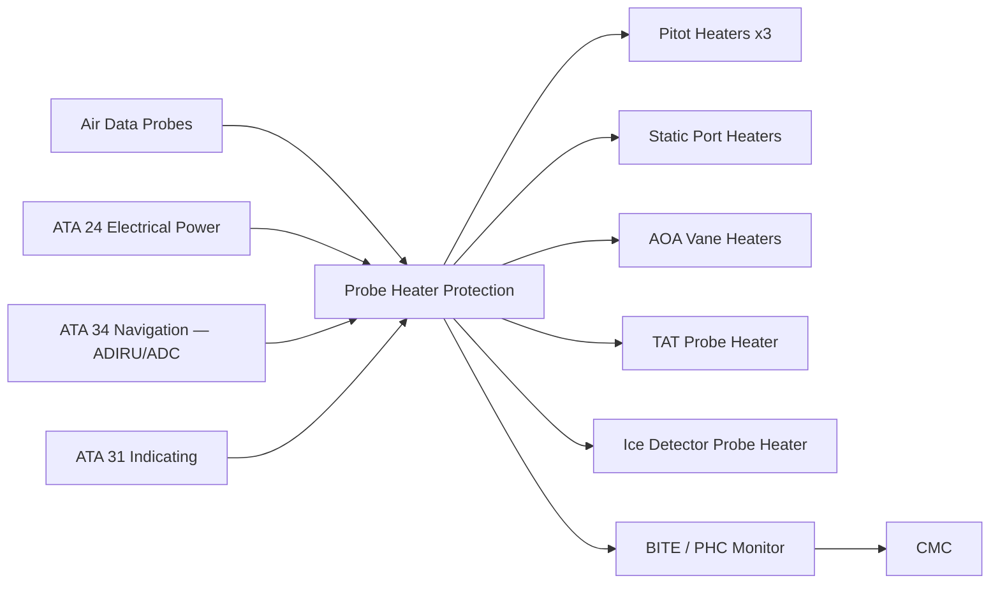
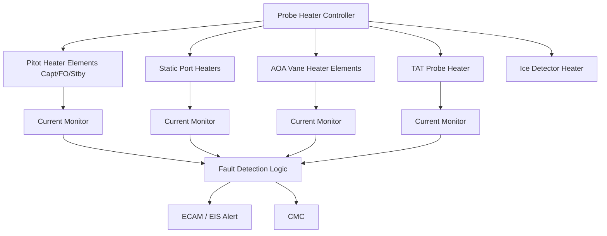
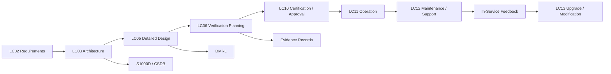

# 030-030 — Air Data and Sensor Ice Protection
### AMPEL360e eWTW · ATA 30-30 · Q+ATLANTIDE ATLAS Scaffold

---

## §0 Hyperlink Policy

All hyperlinks in this document are **relative links** unless pointing to a published external standard. Links marked **TBD** indicate targets not yet assigned a stable path within the Q+ATLANTIDE repository. Cross-references to sibling ATA 30 documents use file-name relative links only. Do not invent or guess link targets.

---

## §1 Purpose

This document defines the Air Data and Sensor Ice Protection system for the **AMPEL360e eWTW** — covering the electrothermal heating of all air data sensing probes and sensors whose contamination by ice accretion would degrade or cause erroneous air data outputs to the flight management, autopilot, and crew indication systems. The probes covered include: pitot tubes (Captain, First Officer, Standby), static ports (Captain, First Officer), Angle-of-Attack (AOA) vanes (Captain, First Officer), Total Air Temperature (TAT) probes (Captain, Standby), and ice detector probes. The applicable regulatory requirements are CS-25.1325 (airspeed indicating system), CS-25.1419 (ice protection), and FAR 25.1325. Probe heater integrity is safety-critical as loss of air data in icing conditions represents a Hazardous or Catastrophic failure condition.

---

## §2 Applicability

| Item | Value |
|---|---|
| Programme | AMPEL360e Wide Tube-and-Wing Family (eWTW) |
| ATA Sub-chapter | 30-30 — Air Data and Sensor Ice Protection |
| Probes Protected | Pitot tubes ×3, static ports (each side), AOA vanes ×2, TAT probes ×2, ice detector ×2 |
| Heater Controller | Probe Heater Controller (PHC) — dedicated LRU |
| Power Source | 28 V DC Essential Bus (probe heaters — always-on safety function) |
| Ground Heating | Pitot and AOA heaters energised at ground (low power) when aircraft powered |
| Certification Basis | CS-25.1325; CS-25.1419; FAR 25.1325; AC 25-12 |
| Document Status | Programme-controlled scaffold — not yet approved for manufacture |

---

## §3 System / Function Overview

Air data sensor heating is one of the highest-criticality electrothermal functions on any commercial aircraft. The pitot tube provides airspeed data to the Air Data and Inertial Reference Unit (ADIRU) and from there to the Primary Flight Display, Flight Management Computer, autopilot, and overspeed protection. Loss of a pitot tube to ice blockage — particularly a simultaneous loss of multiple probes — has been the causal factor in several Class A accidents. On the eWTW, with no bleed-air heating available for probe anti-icing, all probes rely entirely on electrothermal resistive heaters integral to the probe body. The heaters are connected to the 28 V DC Essential Bus so that they cannot be shed during electrical load-shedding events. Probe heaters are the only ATA 30 subsystem that is energised continuously whenever the aircraft is electrically powered — even before engine or APU start — and must not be inhibited on the ground except by a deliberate maintenance action.

The Probe Heater Controller (PHC) is a dedicated avionics LRU that monitors the current drawn by each probe heater circuit and computes the heater element resistance from the measured current and known bus voltage. The PHC compares computed resistance against the production acceptance baseline and raises a fault flag if the deviation exceeds ±15%, indicating element degradation, partial failure, or an open circuit. The PHC provides current monitoring data to the IPMC (via ARINC 429), which generates ECAM warnings and routes fault data to the CMC. On the ground, probe heaters operate at a reduced power level (typically 50% of flight power) to limit surface temperature and prevent burns to ground personnel working near the probe — personnel awareness notices and heater-on lighting are required in the aircraft ground-operation documentation. In flight, probe heaters operate at full power regardless of detected icing conditions, because rime ice can accrete on probes even at temperatures well above the standard icing envelope (e.g., during high humidity cold-soak conditions).

---

## §4 Scope

### 4.1 Included

- Pitot tube heater assemblies: Captain (Port), First Officer (Starboard), Standby (Port or Starboard — TBD) — three circuits total
- Static port heaters: Captain and F/O sets (fuselage static ports, each side of fuselage) — four circuits (two per side)
- AOA vane heater assemblies: Captain (Port), F/O (Starboard) — two circuits
- TAT probe heater assemblies: Captain and Standby — two circuits
- Ice detector probe heater assemblies: Primary and Standby — two circuits (ice detector probe heating is combined with ice detection function; see 030-070)
- Probe Heater Controller (PHC) LRU — current monitoring, fault detection, and heater switching
- 28 V DC Essential Bus distribution to PHC and each probe heater circuit
- Thermal lag correction interface between TAT probe and ADIRU (data interface, not a heater function)
- ADIRU/ADC heater monitoring interface (ATA 34 interface)
- BITE and fault monitoring for all probe heater circuits

### 4.2 Excluded

- ADIRU internal electronics heating (ATA 34 equipment environmental control)
- Ice detector probe logic and detection function (ATA 30-70 — probe heater circuit only is in scope here)
- Windshield heating (ATA 30-40)
- Drain mast heaters (ATA 30-50)
- GPS antenna heating if fitted (antenna heating may fall in ATA 23 or ATA 34 — TBD)

---

## §5 Architecture Description

- **Dedicated PHC with per-circuit monitoring:** Each of the thirteen heater circuits (3 pitot + 4 static + 2 AOA + 2 TAT + 2 ice detector) has its own current monitoring channel within the PHC. This allows the PHC to isolate faults to a specific probe and circuit, rather than reporting a generic "probe heat fail" message. The PHC outputs a per-circuit health status word to the IPMC and ECAM system.

- **Dual-bus architecture for critical probes:** The Captain pitot heater and the F/O pitot heater draw power from different 28 V DC feeder circuits within the Essential Bus to ensure that a single bus contactor or cable failure does not simultaneously disable two primary pitot channels. The Standby pitot heater is powered from the Battery Bus to ensure operation in a complete Essential Bus failure. This three-feeder architecture satisfies the requirement that no single failure can simultaneously disable two or more pitot channels.

- **Ground low-power mode with personnel hazard management:** When WOW switch indicates GROUND, the PHC reduces pitot and AOA heater power to approximately 40% of flight level to limit external surface temperature to below 60 °C — the burn threshold for incidental contact by ground personnel. A cockpit overhead panel heater-ON status light notifies crew that heaters are active. Ground personnel documentation must include warnings about probe surface temperatures.

- **TAT probe thermal lag correction:** The TAT probe heater introduces a small but measurable thermal self-heating error into the temperature measurement. The ADIRU applies a calibrated correction to the TAT probe output to account for heater-induced temperature offset, particularly at low airspeeds (below approximately 60 KIAS) where aerodynamic ram-rise is minimal. The correction factor is stored in the ADIRU software as a function of airspeed and heater power setting.

- **Fail-safe heater design:** Probe heater elements are designed to fail-open (open circuit) rather than fail-shorted. An open circuit is detectable by the PHC current monitor and results in loss of the probe heater (detectable, manageable failure) rather than a short circuit causing bus overload or fire risk. The heater element design and qualification must demonstrate fail-open behaviour through 10,000 thermal cycle endurance testing.

---

## §6 Functional Breakdown

| Function ID | Function Title | Description | Probe / Channel |
|---|---|---|---|
| F-001 | Captain Pitot Tube Heating | Continuous electrothermal heating of the Captain pitot tube assembly; prevents rime and glaze ice blockage of total pressure port | Captain pitot — Port side |
| F-002 | F/O Pitot Tube Heating | Continuous electrothermal heating of the First Officer pitot tube assembly | F/O pitot — Starboard side |
| F-003 | Standby Pitot Tube Heating | Continuous heating of Standby pitot; powered from Battery Bus for ultimate redundancy | Standby pitot — Battery Bus |
| F-004 | Static Port Heating | Electrothermal heating of fuselage static port inserts on both sides; prevents ice blockage of static pressure sense | Static ports — Port and Stbd |
| F-005 | AOA Vane Heating | Electrothermal heating of AOA vane pivot assemblies; prevents ice interference with vane freedom of movement | AOA — Captain and F/O |
| F-006 | TAT Probe Heating | Electrothermal heating of TAT probe housing; maintains probe recovery factor and prevents ice contamination of temperature measurement | TAT — Captain and Standby |
| F-007 | Ice Detector Probe Heating | Electrothermal heating of ice detector probe element; maintains vibrating-element free of ice between detection cycles | Ice Detector — Primary and Standby |
| F-008 | PHC Monitoring and BITE | Per-circuit current monitoring, resistance computation, fault detection, and ECAM fault reporting | PHC — all 13 channels |

---

## §7 System Context Diagram

---

## §8 Internal Functional Architecture

---

## §9 Lifecycle Traceability

---

## §10 Interfaces

| Interface ID | Interfacing System | ATA Chapter | Interface Type | Description |
|---|---|---|---|---|
| IF-030-001 | Electrical Power — Essential Bus | ATA 24 | Power supply (28 V DC) | 28 V DC Essential Bus feeds Captain and F/O pitot, all static, AOA, and TAT heaters; separate Battery Bus for Standby pitot |
| IF-030-002 | Air Data and Navigation — ADIRU | ATA 34 | Data (ARINC 429) | PHC outputs per-circuit health status to ADIRU; ADIRU applies TAT heater correction; ADIRU airspeed used to switch probe heat between ground-low and flight-high modes |
| IF-030-003 | Indicating / ECAM | ATA 31 | Data (ARINC 429 / discrete) | Probe heat fault warnings and cautions to ECAM; PROBE HEAT ON status advisory; individual probe fault identification message |
| IF-030-004 | Central Maintenance Computer | ATA 45 | Data (ARINC 429) | PHC BITE fault codes, per-circuit resistance history, and fault event log uploaded to CMC |
| IF-030-005 | Ice Detection and Control | ATA 30-70 | Data (ARINC 429) | Ice detector probe heater status from PHC to IPMC; IPMC may command PHC to raise probe heater power on icing condition confirmation |
| IF-030-006 | Landing Gear / WOW | ATA 32 | Discrete signal | WOW signal to PHC for ground-low power mode selection; prevents full-power operation on ground |

---

## §11 Operating Modes

| Mode | Designation | Conditions | PHC Action | Crew Indication |
|---|---|---|---|---|
| Ground Low Power | GND PROBE HT | Aircraft powered on ground; WOW = GROUND | All heaters at ~40% rated power; surface temperature < 60 °C | PROBE HEAT ON (white status) |
| Flight Normal | FLT PROBE HT | WOW = AIR; all circuits healthy | All heaters at 100% rated power; continuous energisation regardless of icing state | PROBE HEAT ON (blue advisory) |
| Flight Degraded — Single Fault | FLT DEGRADED | One probe heater open circuit; remaining circuits healthy | Affected circuit isolated; ECAM caution; remaining probes continue at 100% | PROBE HT FAULT — [probe ID] (amber caution) |
| Flight Degraded — Multiple Fault | MULTI FAULT | Two or more probe heaters failed | Affected circuits isolated; ECAM warning; crew advised to use backup instruments | PROBE HT MULTI FAULT (red warning) |
| Maintenance | MAINT | Ground maintenance mode; PHC commanded via CMC | PHC conducts resistance measurement on each circuit at 10% power; generates GO/NO-GO report | PROBE HT MAINT (white status) |
| Power Loss | UNPOWERED | 28 V DC Essential Bus fault | Pitot and AOA heaters de-energised; Standby pitot maintained on Battery Bus | PROBE HEAT FAIL (red warning) |

---

## §12 Monitoring and Diagnostics

The PHC provides individual circuit monitoring for all thirteen probe heater channels using current-sensing technology:

- **Per-circuit current measurement:** Each heater circuit has a precision hall-effect or shunt-based current sensor within the PHC. The PHC computes the effective heater element resistance R = V/I using the measured bus voltage (28 V DC ± tolerance) and current. The computed resistance is compared to the production baseline resistance stored in PHC non-volatile memory for each probe.
- **Open-circuit detection:** A current reading of less than 10% of the nominal value triggers an open-circuit fault flag within one power cycle (< 1 second). An open-circuit fault means loss of heating for that probe.
- **Partial element degradation:** A resistance drift of more than +20% of baseline (indicative of element wire fracture or bond degradation) triggers a MAINTENANCE REQUIRED advisory without immediate heating function loss. The probe continues to heat at reduced efficiency.
- **Short-circuit detection:** A current reading of more than 130% of nominal triggers an overcurrent fault. The PHC clamps the affected circuit and issues a CAUTION. The circuit is latched off to prevent bus overload.
- **TAT heater monitoring:** TAT probe heater current monitoring also includes a verification that the heater is not continuously energised at maximum power during ground low-speed taxi, which could induce a temperature measurement error large enough to affect fuel quantity or performance calculations.
- **ECAM integration:** Single probe fault: CAUTION (amber) with probe ID. Loss of Captain pitot OR F/O pitot: WARNING (red). Loss of Standby pitot in addition to one primary: WARNING (red), maximum severity.

---

## §13 Maintenance Concept

- **Probe replacement as LRU:** All pitot tube assemblies, AOA vane assemblies, and TAT probes are removable as individual LRUs at line maintenance level. Disconnection requires: remove mounting screws/nuts, disconnect electrical connector, remove probe. Replacement probes are pre-wired and are fitted with the correct electrical connector for the aircraft interface. Post-installation, the PHC resistance measurement is run to verify the new probe heater resistance is within the acceptance band.
- **Static port heater inspection:** Static port heater elements are embedded in the static port insert. The insert is replaceable at line level (typically with a dedicated tool to avoid distorting the fuselage hole). Static port heater resistance is measured via a dedicated test connector adjacent to each port.
- **PHC LRU replacement:** The PHC is located in the avionics bay. Replacement requires connector disconnection and rack mounting screw removal. Post-replacement, the PHC requires upload of the probe heater resistance baselines from the CMC or programme data loader. A BITE ground test confirms circuit recognition and fault-free status.
- **Scheduled task:** Probe heater resistance check and TAT heater correction verification — A-check interval (TBD per MPD). Probe visual external inspection (contamination, damage) — turnaround (pre-departure) check.

---

## §14 S1000D / CSDB Mapping

| Info Code | Title | DMC | Status |
|---|---|---|---|
| 040 | System Description — Air Data and Sensor Probe Heating | DMC-AMPEL360E-EWTW-030-30-040-A | Draft scaffold |
| 300 | Inspection — Probe Heater Resistance Check | DMC-AMPEL360E-EWTW-030-30-300-A | Not started |
| 400 | Fault Isolation — PHC Circuit Faults (Open/Short/Degraded) | DMC-AMPEL360E-EWTW-030-30-400-A | Not started |
| 520 | Remove — Pitot Tube Assembly | DMC-AMPEL360E-EWTW-030-30-520-A | Not started |
| 720 | Install — Pitot Tube Assembly | DMC-AMPEL360E-EWTW-030-30-720-A | Not started |

---

## §15 Footprints

### 15.1 Physical

Probe heater elements are integral to each probe assembly. No additional structure is required beyond the probe mounting provisions. PHC LRU: avionics bay, dimensions and mass TBD. Power wiring from Essential Bus to PHC and from PHC to each probe location runs in existing wire bundles along the fuselage nose and belly.

### 15.2 Electrical / Data

| Circuit | Bus Source | Rated Power (flight) | Ground Power |
|---|---|---|---|
| Captain Pitot Heater | 28 V DC Essential Bus A | ~200 W (TBD) | ~80 W |
| F/O Pitot Heater | 28 V DC Essential Bus B | ~200 W (TBD) | ~80 W |
| Standby Pitot Heater | 28 V DC Battery Bus | ~150 W (TBD) | ~60 W |
| Static Port Heaters (×4) | 28 V DC Essential Bus A/B | ~30 W each (TBD) | ~12 W each |
| AOA Vane Heaters (×2) | 28 V DC Essential Bus A/B | ~80 W each (TBD) | ~32 W each |
| TAT Probe Heaters (×2) | 28 V DC Essential Bus A/B | ~50 W each (TBD) | ~20 W each |
| Ice Detector Heaters (×2) | 28 V DC Essential Bus A/B | ~30 W each (TBD) | ~12 W each |

### 15.3 Maintenance

Scheduled: probe heater resistance check (A-check TBD); external probe visual check (turnaround). Unscheduled: probe replacement on resistance out-of-tolerance; PHC LRU replacement on BITE fault.

### 15.4 Data

PHC BITE data includes per-circuit resistance history, fault event timestamps, and ground test results. Retained in CMC non-volatile memory; downloadable via ATA 45 interface. Minimum retention 500 FH.

---

## §16 Safety and Certification Considerations

| Regulation | Applicability | Compliance Method |
|---|---|---|
| CS-25.1325 | Airspeed indicating system — probes must not be blocked by ice | Probe heater thermal analysis and qualification test; functional test in icing conditions |
| CS-25.1419 | Ice protection system — probe heaters part of overall ice protection | Demonstration of probe anti-icing in CS-25 Appendix C icing; PHC BITE redundancy analysis |
| FAR 25.1325 | US counterpart to CS-25.1325 | Dual-authority compliance |
| AC 25-12 | Guidance material for pitot/static system ice protection | Compliance demonstration methodology; sensor redundancy and separation requirements |
| DO-160G | PHC LRU environmental qualification | Temperature, vibration, humidity, EMI test programme for PHC |
| CS-25.1309 / ARP 4761 | Safety assessment — loss of multiple probe heaters is Catastrophic failure condition | FHA confirms Catastrophic classification; SSA defines redundancy and bus separation requirements |

---

## §17 Verification and Validation

| V&V Method | ID | Description | Applicable Functions | Status |
|---|---|---|---|---|
| Probe Thermal Analysis | VV-030-001 | Thermal analysis of pitot and AOA heater elements under worst-case Appendix C icing conditions; validates power required to prevent ice blockage of pressure port and vane movement restriction | F-001 through F-006 | Not started |
| Probe Heater Qualification Test | VV-030-002 | Environmental qualification of probe heater assemblies per DO-160G; includes thermal cycle endurance (10,000 cycles) to demonstrate fail-open failure mode | F-001 through F-007 | Not started |
| PHC HIIL Simulation | VV-030-003 | Hardware-in-the-loop test of PHC with simulated probe heater circuit impedances; validates open-circuit, short-circuit, and degraded-element fault detection thresholds | F-008 | Not started |
| Icing Certification Flight Test | VV-030-004 | Demonstration in natural icing conditions that all probes remain free of ice blockage throughout Appendix C envelope; verification of TAT correction factor in icing | F-001 through F-007 | Not started |
| Redundancy and Bus Separation Verification | VV-030-005 | Inspection and test confirming that Captain pitot, F/O pitot, and Standby pitot are connected to separate bus feeders and that no single bus or cable failure disables two or more pitot channels simultaneously | F-001, F-002, F-003 | Not started |

---

## §18 Glossary

| Term | Acronym | Definition |
|---|---|---|
| Air Data Computer | ADC | The processing unit (within ADIRU) that converts raw probe pressure and temperature measurements to calibrated airspeed, altitude, Mach, and TAT outputs |
| Air Data and Inertial Reference Unit | ADIRU | The combined inertial and air data sensor and processing system; receives pitot, static, and TAT inputs and outputs flight parameters to avionics systems |
| Angle of Attack | AOA | The angle between the aircraft chord line and the local airflow vector; measured by a rotating vane sensor whose freedom of movement must be maintained by the vane heater |
| Pitot Tube | — | A forward-facing probe that measures total pressure; the pressure port must remain ice-free at all times to provide valid airspeed data |
| Probe Heater Controller | PHC | The avionics LRU that distributes, monitors, and reports on the electrothermal heater circuits for all air data probes |
| Static Port | — | A flush orifice on the fuselage skin that senses ambient static pressure; ice blockage or contamination causes altimeter and airspeed errors |
| TAT Probe | — | Total Air Temperature probe; measures the stagnation temperature of the airflow; integral heater may introduce a small self-heating correction |
| Fail-Safe Heating | — | A probe heater design principle in which the element fails to the open-circuit state (detectable, no fire risk) rather than short-circuit state |
| Rime Ice Accretion on Probes | — | A form of ice accretion from small supercooled droplets that freeze on impact with probe surfaces, potentially blocking pressure ports or mechanically jamming moving surfaces |

---

## §19 Citations

| Ref ID | Document | Version | Relevance |
|---|---|---|---|
| CIT-001 | CS-25.1325 — Airspeed Indicating System | Amendment 27 | Probe ice protection requirement for pitot and static systems |
| CIT-002 | CS-25.1419 — Ice Protection | Amendment 27 | Probe heaters as part of overall ice protection system certification |
| CIT-003 | FAR 25.1325 — Airspeed Indicating System | Amendment 25-147 | US counterpart; dual-authority compliance |
| CIT-004 | AC 25-12 — Airspeed Indicating System Calibration | Rev — | Guidance on pitot/static system probe ice protection compliance demonstration |
| CIT-005 | AMPEL360e eWTW Air Data Probe Heating Specification | TBD — programme document | Programme-level probe heater power requirements, PHC architecture, and redundancy requirements |

---

## §20 References

| Ref ID | Title | Document Number | Notes |
|---|---|---|---|
| REF-001 | 030-000 Ice and Rain Protection General | 030-000-Ice-and-Rain-Protection-General.md | Parent scaffold; IPMC architecture and system power budget |
| REF-002 | 030-070 Ice Detection and Protection Control | 030-070-Ice-Detection-and-Protection-Control.md | IPMC interface to PHC; probe heat mode elevation on icing detection |
| REF-003 | ATA 34 Navigation and Air Data | TBD | ADIRU interface definition; TAT correction factor application |
| REF-004 | ATA 24 Electrical Power | TBD | 28 V DC Essential Bus and Battery Bus probe heater feeder allocation |
| REF-005 | RTCA DO-160G — Environmental Conditions and Test Procedures | Edition G | PHC LRU and probe assembly environmental qualification |
| REF-ATA | ATA 30-30 — Air Data and Sensor Ice Protection | ATA iSpec 2200 | SNS code and content convention reference |

---

## §21 Open Issues

| OI ID | Issue | Owner | Target Resolution | Status |
|---|---|---|---|---|
| OI-001 | Probe heater power levels (W) for pitot, AOA, TAT not yet calculated; thermal analysis required to determine minimum power for Appendix C compliance | Q-MECHANICS | LC05 Detailed Design | Open |
| OI-002 | TAT probe self-heating correction algorithm not yet defined for eWTW ADIRU software; requires calibration data from probe qualification tests | ATA 34 / Q-AIR | LC05 Detailed Design | Open |
| OI-003 | Standby pitot bus routing to Battery Bus not yet confirmed; wire harness separation from Essential Bus routes requires structural routing study | ATA 24 / Q-STRUCTURES | LC05 Detailed Design | Open |
| OI-004 | PHC DAL assignment (preliminary DAL B for pitot heater monitoring) requires FHA confirmation — FHA not yet initiated | ORB-PMO / Safety | LC06 Verification Planning | Open |

---

## §22 Change Log

| Version | Date | Author | Description |
|---|---|---|---|
| 0.1.0 | 2026-05-09 | Q+ATLANTIDE ATLAS Authoring | Initial scaffold creation — all sections populated at programme-controlled-scaffold status |
