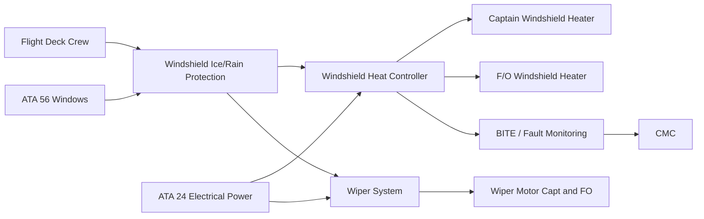
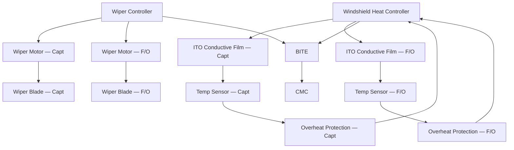
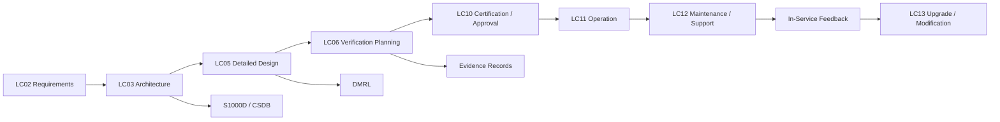

# 030-040 — Windshield and Window Ice/Rain Protection
### AMPEL360e eWTW · ATA 30-40 · Q+ATLANTIDE ATLAS Scaffold

---

## §0 Hyperlink Policy

All hyperlinks in this document are **relative links** unless pointing to a published external standard. Links marked **TBD** indicate targets not yet assigned a stable path within the Q+ATLANTIDE repository. Cross-references to sibling ATA 30 documents use file-name relative links only. Do not invent or guess link targets.

---

## §1 Purpose

This document defines the Windshield and Window Ice and Rain Protection system for the **AMPEL360e eWTW** flight deck. Crew forward visibility is a fundamental airworthiness and operational requirement. The eWTW provides windshield ice and rain protection through two independent functions: (1) **electrothermal heating** of the windshield panels using a transparent Indium Tin Oxide (ITO) or equivalent conductive film heater, managed by the Windshield Heat Controller (WHC), and (2) **mechanical wiper systems** for rain removal on the ground and at low-to-medium airspeeds in flight. The system satisfies CS-25.773 (crew visibility requirements) and CS-25.775 (windshield design). This document describes the WHC architecture, ITO film heater design, temperature control and overheat protection, wiper motor and drive design, defog and anti-ice modes, and the bird-strike qualification requirements for the heated windshield assembly.

---

## §2 Applicability

| Item | Value |
|---|---|
| Programme | AMPEL360e Wide Tube-and-Wing Family (eWTW) |
| ATA Sub-chapter | 30-40 — Windshield and Window Ice/Rain Protection |
| Windshield Panels | Captain (Port) and First Officer (Starboard) main windshield panels |
| Side Window Heating | Cockpit side windows — anti-fogging capability (TBD if active or passive) |
| Heating Technology | Transparent ITO (Indium Tin Oxide) conductive film or equivalent |
| Heater Controller | Windshield Heat Controller (WHC) — one per windshield panel, or dual-channel WHC |
| Wiper System | Electromechanical wiper motor, arm, and blade — Captain and F/O |
| Power Source | WHC: 115 V AC or 28 V DC (TBD); Wiper motor: 28 V DC |
| Certification Basis | CS-25.773; CS-25.775; FAR 25.773; AC 25.773-1 |
| Document Status | Programme-controlled scaffold — not yet approved for manufacture |

---

## §3 System / Function Overview

The eWTW flight deck windshield anti-icing and defog system uses a transparent conductive oxide film (ITO or equivalent) applied between the outer structural glass ply and the inner interlayer of the windshield laminate. When energised, the conductive film acts as a uniform area heater, raising the outer glass surface temperature to prevent ice formation (anti-ice mode) or removing condensation and mist from the inner glass surface (defog mode). The WHC manages the heater power to maintain a target temperature set-point appropriate for the operating condition: a higher set-point in icing conditions to keep the outer surface above 0 °C, and a lower set-point in defog mode to dissipate condensation without thermal shock risk to the laminate. The WHC receives ambient temperature data from the TAT/OAT channel and airspeed from the ADIRU to select the appropriate set-point schedule.

The windshield wiper system provides mechanical rain removal during ground taxi, approach, and low-speed segments. Each windshield panel has an independent wiper motor and arm/blade assembly. The wiper is driven by a 28 V DC permanent-magnet motor with a crank mechanism converting rotary motor output to oscillating wiper arm motion. Three speeds are available: intermittent (approximately 20 cycles/minute), low (approximately 40 cycles/minute), and high (approximately 60 cycles/minute — TBD). The wiper system includes an aerodynamic speed interlock that prevents wiper operation above a maximum airspeed limit (approximately VMO/2 or 250 KIAS — TBD) to prevent wiper arm aerodynamic lift-off, which would damage the blade, arm, or windshield. At airspeeds above the wiper speed limit, aerodynamic pressure and the heated windshield surface are sufficient to manage rain without wipers. The wiper park position (stowed at base of travel) is maintained by a position sensor that commands the motor to stop at the park switch signal rather than mid-swing.

---

## §4 Scope

### 4.1 Included

- Captain and F/O windshield ITO conductive film heater panels (structural and heating elements per ATA 56 boundary agreement)
- Windshield Heat Controller (WHC) — temperature control, overheat protection, anti-ice / defog mode selection
- Temperature sensors embedded in each windshield panel (inner ply thermocouple or NTC thermistor)
- Captain and F/O wiper motor assemblies
- Wiper arm and blade assemblies
- Wiper speed control module (intermittent / low / high)
- Wiper park position sensor and logic
- Aerodynamic speed interlock (wiper disable above Vmax_wiper)
- Rain repellent fluid system assessment (decision required: fit or no-fit — TBD at LC03)
- Crew overhead panel controls (windshield heat ON/OFF, defog/anti-ice selector, wiper speed selector)
- BITE for WHC and wiper motor circuits
- Interface with ATA 56 (Windows), ATA 24 (Electrical Power), ATA 34 (ADIRU airspeed)

### 4.2 Excluded

- Side window heating (heating TBD — see §3 note; passive anti-fog coating considered as alternative)
- Observer and sliding side window panels (ATA 56 structural scope)
- Rain sensing automation (not planned for eWTW baseline — wiper is manually controlled by crew)
- External windshield cleaning or polishing (ground operations)
- Windshield structural repair after bird strike (ATA 56 structural repair manual)

---

## §5 Architecture Description

- **ITO conductive film heater — uniform heating:** The ITO (Indium Tin Oxide) transparent conductive oxide layer is sputtered onto the inner face of the outer glass ply of the windshield laminate. ITO is electrically conductive with a sheet resistance in the range of 5–20 Ω/square (TBD per heater power density requirement). When connected to bus bars at the top and bottom edges of the panel, current flows uniformly across the film from bus bar to bus bar, producing uniform heating across the entire viewing area. This eliminates hot spots and cold strips that could cause thermal shock in the glass laminate.

- **WHC dual-mode temperature control:** The WHC operates in two primary thermal modes: **Anti-Ice Mode** (outer surface target temperature +5 °C to +10 °C above ambient — TBD) and **Defog Mode** (inner surface target temperature sufficient to prevent condensation without exceeding thermal shock limit). Mode selection is by crew on the overhead panel. The WHC uses a proportional integral (PI) temperature control law to regulate heater power via pulse-width modulation (PWM) of the bus supply.

- **Overheat protection — dual-layer:** Layer 1 is the software temperature limit within the WHC control law (e.g., +80 °C outer surface — TBD). Layer 2 is a hardware-wired overheat thermostat that disconnects the heater contactor at a higher temperature (e.g., +95 °C — TBD) independently of the WHC software. Thermal shock risk: rapid cycling between cold soak and full heating power can induce glass delamination. The WHC ramp rate is limited to TBD °C/minute to prevent thermal shock.

- **Bird-strike qualified heated windshield:** CS-25.775 and FAR 25.775 require the windshield to be designed to withstand the impact of a 1.8 kg (4 lb) bird at Vc or VD (design cruise or dive speed). The ITO film layer must not degrade the structural bird-strike performance of the windshield laminate. Bird-strike qualification testing is performed on the complete heated windshield assembly (with ITO film and bus bars installed) at the programme certification impact test facility.

- **Wiper aerodynamic interlock:** At airspeeds above Vmax_wiper (TBD — approximately 250 KIAS or VMO/2), aerodynamic lift forces on the wiper arm and blade exceed the motor torque capability, and the blade may lift off the windshield surface or be deflected, causing surface scoring. The WHC module (or a dedicated wiper control module) receives calibrated airspeed from the ADIRU and latches the wiper circuit open above Vmax_wiper. The interlock is automatically released when airspeed decreases below the limit.

---

## §6 Functional Breakdown

| Function ID | Function Title | Description | Component |
|---|---|---|---|
| F-001 | Windshield Anti-Ice — Captain | ITO conductive film heating of Captain windshield panel in anti-ice mode; maintains outer surface above 0 °C | WHC + ITO film — Captain |
| F-002 | Windshield Anti-Ice — F/O | ITO conductive film heating of F/O windshield panel in anti-ice mode | WHC + ITO film — F/O |
| F-003 | Windshield Defog — Captain and F/O | Reduced-power heating of both panels to dissipate condensation; lower temperature set-point than anti-ice | WHC — both panels |
| F-004 | Overheat Protection | Dual-layer protection: WHC software limit + hardware thermostat cutout; prevents glass laminate delamination | WHC hardware thermostat |
| F-005 | Wiper Operation — Captain | Electromechanical wiper at INT / LO / HI speed; park position control; aerodynamic speed interlock | Wiper motor and arm — Captain |
| F-006 | Wiper Operation — F/O | As F-005 for F/O windshield side | Wiper motor and arm — F/O |
| F-007 | Aerodynamic Speed Interlock | Wiper disable above Vmax_wiper; auto-release when airspeed decreases | Wiper control module / ADIRU link |
| F-008 | WHC BITE and Monitoring | Heater current monitoring, temperature sensor validity check, fault detection and ECAM reporting | WHC BITE function |

---

## §7 System Context Diagram

---

## §8 Internal Functional Architecture

---

## §9 Lifecycle Traceability

---

## §10 Interfaces

| Interface ID | Interfacing System | ATA Chapter | Interface Type | Description |
|---|---|---|---|---|
| IF-040-001 | Electrical Power | ATA 24 | Power supply | WHC bus supply (115 V AC or 28 V DC TBD); Wiper motor 28 V DC supply |
| IF-040-002 | Windows — Windshield Structure | ATA 56 | Physical/thermal | ITO conductive film is integral to windshield laminate; WHC electrical connections via bus bars embedded in windshield edge; structural qualification is shared boundary |
| IF-040-003 | Air Data / ADIRU | ATA 34 | Data (ARINC 429) | Calibrated airspeed from ADIRU to wiper control module for aerodynamic speed interlock; OAT from ADIRU to WHC for anti-ice/defog mode set-point scheduling |
| IF-040-004 | Indicating / ECAM | ATA 31 | Data (ARINC 429 / discrete) | WHC fault cautions and warnings to ECAM; wiper operation status; WINDSHIELD HEAT and WIPER system status pages |
| IF-040-005 | Central Maintenance Computer | ATA 45 | Data (ARINC 429) | WHC BITE fault codes, heater temperature history, wiper motor current log uploaded to CMC |
| IF-040-006 | Flight Controls — Overhead Panel | ATA 27 / Cockpit | Discrete | Crew windshield heat ON/OFF, mode selector (ANTI ICE / DEFOG), wiper speed selector (OFF / INT / LO / HI) panel inputs to WHC and wiper control |

---

## §11 Operating Modes

| Mode | Designation | Conditions | WHC / Wiper Action | Crew Indication |
|---|---|---|---|---|
| Anti-Ice Mode | ANTI ICE | Crew selects ANTI ICE or icing conditions detected | ITO film energised to outer surface target set-point (+5 to +10 °C above OAT, TBD); PI control active | WINDSHIELD HEAT ON (blue) |
| Defog Mode | DEFOG | Crew selects DEFOG; no icing conditions | ITO film at reduced power; inner surface temp target to prevent condensation | WINDSHIELD DEFOG ON (blue) |
| Wiper — Intermittent | WIPER INT | Crew selects INT; speed ≤ Vmax_wiper | Wiper cycles at ~20 cycles/min; park position command between cycles | WIPER INT (white status) |
| Wiper — Low | WIPER LO | Crew selects LO; speed ≤ Vmax_wiper | Wiper at ~40 cycles/min; continuous | WIPER LO (white status) |
| Wiper — High | WIPER HI | Crew selects HI; speed ≤ Vmax_wiper | Wiper at ~60 cycles/min; continuous | WIPER HI (white status) |
| Wiper Locked Out | WIPER LOCKOUT | Airspeed > Vmax_wiper | Wiper circuit inhibited; crew notified | WIPER OVERSPEED (amber) |
| Overheat Cutout | OHT CUTOUT | Panel temp ≥ WHC software limit | WHC reduces power to maintain set-point; if hardware limit reached, contactor opens | WINDSHIELD HEAT OVHT (amber) |
| Failure Safe | FAIL-SAFE | WHC failure or loss of bus supply | ITO film de-energised; crew notified; wiper inoperative | WINDSHIELD HEAT FAULT (red) |

---

## §12 Monitoring and Diagnostics

- **Heater current monitoring:** The WHC measures current drawn by each ITO film panel. An open circuit (film conductor fracture or bus bar disconnection) is detected as near-zero current; a short circuit as over-current with rapid temperature rise. Current monitoring operates continuously during heater energisation.
- **Temperature sensor monitoring:** The WHC monitors the embedded temperature sensor output for validity (signal within calibrated range, no stuck-at reading). An invalid temperature sensor reading causes the WHC to switch to a default conservative power level rather than shutting off heating entirely, maintaining some thermal protection while generating a CAUTION advisory.
- **Wiper motor current monitoring:** The wiper control module monitors motor current per sweep cycle. A current spike indicating blade jam or motor stall triggers a wiper stop command and CAUTION advisory. Absence of current with wiper commanded ON indicates an open motor circuit (motor failure or connector fault).
- **Park position sensor:** The park position proximity sensor confirms blade return to stowed position after each OFF command. Failure to reach the park position within a timeout triggers a WIPER FAULT advisory and commands the motor to attempt a park recovery sweep.
- **ECAM classification:** WHC fault: CAUTION (amber) for single panel fault; WARNING (red) for dual panel failure. Wiper fault: CAUTION (amber). Overheat: CAUTION (amber).

---

## §13 Maintenance Concept

- **Windshield panel replacement:** The windshield panel (with integral ITO heater film) is an LRU at the windshield assembly level. Replacement requires removal of the windshield outer frame fasteners, disconnection of the bus bar electrical connectors, and extraction of the panel. Panel replacement is a heavy maintenance task requiring windshield jig support and structural silicone resealing. Post-installation, WHC functional test confirms heater circuit continuity and film resistance within acceptance band.
- **WHC LRU replacement:** The WHC is an avionics bay LRU. Replacement requires connector disconnection and rack mounting. Post-replacement, load the WHC configuration (panel resistance baselines, set-point schedules) from CMC or programme data loader; perform BITE ground test.
- **Wiper blade replacement:** Wiper blades are a consumable item replaceable at every A-check or when blade streaking is reported. Blade replacement is a line maintenance task (no special tools). Blade life is approximately 200–400 FH or 12 months, whichever is sooner (TBD per programme wear test data).
- **Wiper motor replacement:** Wiper motor failure (detected by BITE) requires wiper cowl removal, motor connector disconnection, and motor arm unbolting. Motor replacement is a line-to-base maintenance task. Post-replacement, wiper sweep angle and park position sensor alignment are verified.
- **Scheduled task:** Wiper blade inspection and replacement — A-check or 12 months; WHC functional test — C-check.

---

## §14 S1000D / CSDB Mapping

| Info Code | Title | DMC | Status |
|---|---|---|---|
| 040 | System Description — Windshield Heat and Wiper System | DMC-AMPEL360E-EWTW-030-40-040-A | Draft scaffold |
| 300 | Inspection — Windshield Heater Film Resistance and Visual | DMC-AMPEL360E-EWTW-030-40-300-A | Not started |
| 400 | Fault Isolation — WHC and Wiper Motor Faults | DMC-AMPEL360E-EWTW-030-40-400-A | Not started |
| 520 | Remove — Windshield Panel Assembly | DMC-AMPEL360E-EWTW-030-40-520-A | Not started |
| 720 | Install — Windshield Panel Assembly | DMC-AMPEL360E-EWTW-030-40-720-A | Not started |
| 941 | Illustrated Parts Data — Windshield Heat and Wiper | DMC-AMPEL360E-EWTW-030-40-941-A | Not started |

---

## §15 Footprints

### 15.1 Physical

ITO conductive film: integral to windshield laminate; adds negligible mass. Bus bars: thin aluminium strips bonded to windshield edges; mass TBD. WHC LRU: avionics bay location TBD; mass TBD. Wiper motor assemblies: one per windshield panel, mounted in nose structure; mass TBD per motor.

### 15.2 Electrical / Data

| Circuit | Bus Source | Rated Power | Notes |
|---|---|---|---|
| Captain Windshield Heater | 115 V AC or 28 V DC (TBD) | TBD W | Continuous in anti-ice / defog mode |
| F/O Windshield Heater | 115 V AC or 28 V DC (TBD) | TBD W | Continuous in anti-ice / defog mode |
| Captain Wiper Motor | 28 V DC | ~50–150 W (TBD) | Intermittent |
| F/O Wiper Motor | 28 V DC | ~50–150 W (TBD) | Intermittent |
| WHC Control Power | 28 V DC Essential | ~10 W | Continuous when aircraft powered |

### 15.3 Maintenance

Scheduled: wiper blade inspection (A-check / 12 months); windshield heater film resistance check (C-check); WHC BITE test (C-check). Unscheduled: windshield panel replacement on film fracture; WHC replacement on BITE fault; wiper motor replacement on motor failure.

### 15.4 Data

WHC temperature history, heater current log, wiper motor current log, and BITE fault events stored in CMC. Data downloadable via ATA 45 interface. Retention minimum 500 FH.

---

## §16 Safety and Certification Considerations

| Regulation | Applicability | Compliance Method |
|---|---|---|
| CS-25.773 | Crew compartment view — windshield must be free of ice to provide adequate vision in all weather conditions | Thermal analysis of ITO film heater; in-icing flight test demonstrating ice-free windshield |
| CS-25.775 | Windshield design — must withstand 1.8 kg bird impact at Vc or VD | Bird-strike qualification test on complete assembled heated windshield panel including ITO film and bus bars |
| FAR 25.773 | US counterpart to CS-25.773 | Dual-authority compliance |
| AC 25.773-1 | Pilot compartment view — guidance material | Compliance methodology for visibility and windshield heating in icing conditions |
| DO-160G | Environmental qualification of WHC LRU and wiper motor | Temperature, vibration, humidity, EMI qualification test programme |
| CS-25.1309 / ARP 4761 | Safety assessment — dual panel heating failure in icing classified Hazardous | FHA and SSA; requires WHC to be dual-channel or panels on separate power sources |

---

## §17 Verification and Validation

| V&V Method | ID | Description | Applicable Functions | Status |
|---|---|---|---|---|
| ITO Film Thermal Analysis | VV-040-001 | Heat transfer analysis of ITO film panel at maximum CS-25 Appendix C icing condition; validates required film power density and bus bar design for uniform heating across the viewing area | F-001, F-002 | Not started |
| Bird-Strike Impact Test | VV-040-002 | Projectile impact test of heated windshield assembly (ITO film installed, with bus bars) at 1.8 kg / Vc per CS-25.775; demonstration of structural integrity post-impact | F-001, F-002 | Not started |
| Thermal Shock and Ramp-Rate Test | VV-040-003 | Laboratory test cycling windshield assembly between cold soak (−50 °C) and full heater power activation at the WHC-controlled ramp rate; demonstrates no delamination over 500 cycles | F-001, F-002, F-004 | Not started |
| Wiper Aerodynamic Qualification | VV-040-004 | Wind tunnel or flight test demonstration that wiper blade remains in contact with windshield surface up to Vmax_wiper without structural failure of arm or blade; validates lockout threshold | F-005, F-006, F-007 | Not started |
| WHC HIIL and BITE Verification | VV-040-005 | Hardware-in-the-loop test of WHC with simulated film resistance, temperature sensor inputs, and bus voltage; validates PI control, overheat cutout, and all BITE fault detection thresholds | F-004, F-008 | Not started |

---

## §18 Glossary

| Term | Acronym | Definition |
|---|---|---|
| Indium Tin Oxide | ITO | A transparent conductive oxide deposited as a thin film onto the inner face of the outer windshield glass ply; acts as a uniform area heater when energised |
| Conductive Film Heater | — | A transparent electrically conductive layer (ITO or equivalent) that converts electrical energy to heat across the full windshield viewing area |
| Windshield Heat Controller | WHC | The avionics LRU managing ITO film heater energisation, temperature set-point control, and overheat protection for both windshield panels |
| Defog Mode | — | A reduced-power heater mode targeting the inner glass surface temperature to dissipate condensation without applying full anti-ice power |
| Windshield Wiper | — | An electromechanical assembly consisting of motor, drive crank, articulated arm, and rubber blade, sweeping the windshield outer surface to remove rain and water |
| Rain Repellent | — | A chemical hydrophobic fluid applied to the windshield outer surface to cause water droplets to bead and roll off; applicability to eWTW not yet determined |
| Thermal Shock | — | Stress induced in glass laminate by a rapid temperature gradient caused by heater activation from cold-soak conditions; managed by WHC ramp-rate limiting |
| Bird-Strike Heated Windshield | — | A windshield assembly qualified to CS-25.775 bird-strike requirements with the ITO conductive film and bus bars installed; the film must not degrade bird-strike performance |
| Anti-Fogging | — | Prevention of condensation on the inner windshield surface; addressed by defog mode heating or passive hydrophilic coating |

---

## §19 Citations

| Ref ID | Document | Version | Relevance |
|---|---|---|---|
| CIT-001 | CS-25.773 — Pilot Compartment View | Amendment 27 | Crew visibility requirement; windshield must be ice-free in all icing conditions |
| CIT-002 | CS-25.775 — Windshield and Windows | Amendment 27 | Bird-strike qualification for heated windshield; structural and optical requirements |
| CIT-003 | FAR 25.773 — Pilot Compartment View | Amendment 25-147 | US counterpart; dual-authority compliance |
| CIT-004 | AC 25.773-1 — Pilot Compartment View | Rev — | Guidance on windshield heating compliance methodology |
| CIT-005 | AMPEL360e eWTW Windshield Heat and Wiper System Specification | TBD — programme document | Programme-level ITO film power density, WHC architecture, and wiper qualification requirements |

---

## §20 References

| Ref ID | Title | Document Number | Notes |
|---|---|---|---|
| REF-001 | 030-000 Ice and Rain Protection General | 030-000-Ice-and-Rain-Protection-General.md | Parent scaffold; system boundary and power budget |
| REF-002 | 030-060 Rain Removal and Water Runoff Management | 030-060-Rain-Removal-and-Water-Runoff-Management.md | Wiper system overlap with rain removal — boundary coordination required |
| REF-003 | ATA 56 Windows — Windshield Structural Design | TBD | ITO film integration within windshield laminate; structural and optical qualification |
| REF-004 | ATA 24 Electrical Power Architecture | TBD | Bus supply selection for WHC (115 V AC vs 28 V DC); bus allocation |
| REF-005 | RTCA DO-160G — Environmental Conditions and Test Procedures | Edition G | WHC LRU environmental qualification |
| REF-ATA | ATA 30-40 — Windshield and Window Ice Protection | ATA iSpec 2200 | SNS reference |

---

## §21 Open Issues

| OI ID | Issue | Owner | Target Resolution | Status |
|---|---|---|---|---|
| OI-001 | Bus supply voltage for WHC (115 V AC vs 28 V DC) affects ITO film sheet resistance design and bus bar current rating — not yet selected | ATA 24 / Q-MECHANICS | LC03 Architecture freeze | Open |
| OI-002 | Rain repellent fluid system (fit or no-fit decision) not yet made; if fitted, adds a reservoir, pump, and nozzle; if not fitted, wiper must manage heavy rain without repellent assist | Q-MECHANICS / ORB-PMO | LC03 Architecture freeze | Open |
| OI-003 | Vmax_wiper limit not yet defined; requires aerodynamic analysis of wiper arm lift-off forces at altitude and airspeed envelope | Q-AIR | LC05 Detailed Design | Open |
| OI-004 | Side window anti-fog provision (active heating vs passive hydrophilic coating) not yet determined; driven by crew visibility requirements analysis | Q-MECHANICS / crew factors | LC05 Detailed Design | Open |

---

## §22 Change Log

| Version | Date | Author | Description |
|---|---|---|---|
| 0.1.0 | 2026-05-09 | Q+ATLANTIDE ATLAS Authoring | Initial scaffold creation — all sections populated at programme-controlled-scaffold status |
