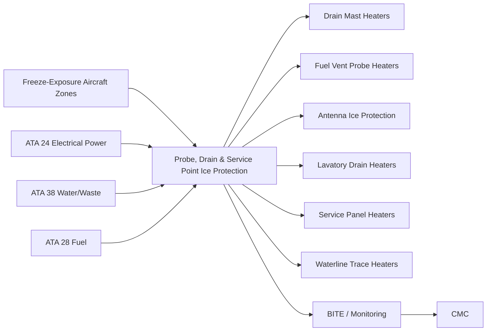
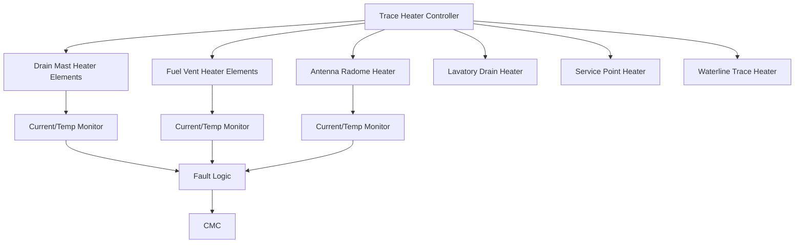
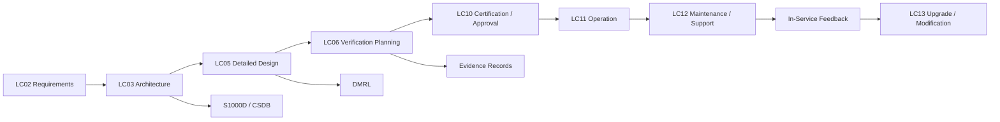

# 030-050 — Probe, Drain and Service Point Ice Protection
### [PROGRAMME-AIRCRAFT] [PROGRAMME-VARIANT] · ATA 30-50 · Q+ATLANTIDE ATLAS Scaffold

---

## §0 Hyperlink Policy

All hyperlinks in this document are **relative links** unless pointing to a published external standard. Links marked **TBD** indicate targets not yet assigned a stable path within the Q+ATLANTIDE repository. Cross-references to sibling ATA 30 documents use file-name relative links only. Do not invent or guess link targets.

---

## §1 Purpose

This document defines the agnostic ATLAS standard-level architecture context for `030-050 — Probe, Drain and Service Point Ice Protection`.

It describes the controlled scope, functions, interfaces, safety considerations, lifecycle traceability, and S1000D/CSDB mapping logic that programme implementations shall instantiate when this node is applicable.

This document is not a programme design baseline. Programme-specific capacities, locations, part numbers, effectivity, operating limits, maintenance references, and data module codes shall be defined only inside the applicable programme implementation branch.
## §2 Applicability

| Applicability Level | Rule |
|---|---|
| Standard taxonomy | Applies to the ATLAS node `<NODE>` |
| Programme implementation | Conditional; determined by programme architecture, trade studies, certification basis, and applicability model |
| Product configuration | Defined in the programme-specific configuration baseline |
| Effectivity | Defined in the programme CSDB / applicability layer |
| Non-applicability | Must be explicitly stated in the programme impact-study branch when excluded |
## §3 System / Function Overview

Aircraft drain masts, fuel vent probes, and service-point connections are exposed to ambient conditions throughout the flight envelope, including conditions well below 0 °C during cruise at high altitude (typically OAT −50 °C to −60 °C at FL350–FL390). Without freeze protection, water in drain masts can freeze and block the drain outlet, leading to water/waste overflow into the fuselage interior. Fuel vent probes that freeze over could cause vent blockage, resulting in fuel tank pressure differentials beyond structural limits. Service panel connectors exposed to sub-zero ground conditions in winter operations can accumulate frost or ice that prevents proper engagement.

On the [PROGRAMME-VARIANT], these concerns are addressed entirely by electrothermal means — there is no bleed-air or hot-air source for secondary thermal functions. Drain mast heaters are self-regulating PTC resistive elements bonded to the drain mast body; as ambient temperature drops, PTC resistance decreases and heat output increases automatically, providing proportional freeze protection without active control. Fuel vent probes use a similar approach. For antennas, a thin electrothermal film bonded beneath the radome exterior surface provides de-icing capability in environments where ice accretion on the radome could degrade antenna pattern or cause mechanical damage from ice shedding. Lavatory drain heaters prevent ice blockage of the drain line exit from the pressurised cabin zone into the cold aerodynamic belly area.

---

## §4 Scope

### 4.1 Included

- Water and waste drain mast heaters (fuselage belly drain masts discharging overboard)
- Fuel vent probe heaters (wing fuel tank vent outlets, NACA or ram-air vent openings)
- Antenna radome ice protection (ATC, VHF, VOR/ILS antennas — where applicable and where ice accretion risk analysis identifies a need)
- Lavatory drain line trace heaters (from cabin floor level to overboard drain exit)
- Toilet service panel and water service panel freeze protection (ground servicing connection points)
- Fresh-water fill line trace heaters (potable water supply lines in cold zones of under-floor structure)
- Grey-water holding tank freeze protection (ambient-exposed waste holding areas)
- Trace Heater Controller (THC) for non-PTC circuits requiring active switching
- Interface with ATA 38 (Water and Waste) and ATA 28 (Fuel) for functional boundary definition

### 4.2 Excluded

- Air data probe heaters (ATA 30-30)
- Windshield heaters (ATA 30-40)
- Cargo compartment heating (ATA 21)
- Fuel in tank freeze protection (ATA 28 — note: [PROGRAMME-VARIANT] fuel tank management for anti-gelling is a separate function from vent probe heating covered here)
- Ground service vehicle interface heating (not aircraft system responsibility)

---

## §5 Architecture Description

- **PTC self-regulating drain mast heaters:** The drain mast heaters use Positive Temperature Coefficient (PTC) polymer elements that self-regulate power output as a function of temperature. At −40 °C, the PTC element draws near-maximum current and provides maximum heat. At temperatures above 0 °C, the PTC element resistance increases sharply, reducing current and power output automatically. This eliminates the need for an active temperature controller for drain mast heating and provides inherent protection against overheating. PTC elements are continuous energised from the 28 V DC Non-Essential Bus whenever the aircraft is electrically powered and OAT is below a set threshold (or continuously — programme choice TBD).

- **Fuel vent probe heating — electrothermal sheath heater:** The fuel vent probes use a cartridge-type electrothermal sheath heater inside the vent tube. Unlike PTC drain mast heaters, the vent probe heaters operate at a fixed power level controlled by a dedicated output channel of the THC. The THC activates vent probe heaters when OAT is below +5 °C (TBD). Fuel vent probe heater failure (open circuit) is detectable by the THC current monitoring channel and generates a MAINTENANCE REQUIRED advisory. A failed vent probe heater does not immediately affect airworthiness, as the fuel vent is sized to handle a brief period of reduced heating before ice blockage becomes a concern in the worst-case icing profile.

- **Antenna radome ice protection — selected antennas only:** Ice accretion risk analysis (per the icing zones defined in CS-25 Appendix C) is used to identify antennas where radome ice accretion would degrade antenna gain below minimum navigation margins or where shed ice could damage adjacent structure. For identified antennas, a thin electrothermal film is bonded beneath the outer radome surface, energised by the THC in icing conditions. Antennas inside the pressurised fuselage (e.g., ATC transponder blade on belly) are assessed as lower risk due to aerodynamic heating at cruise; final antenna list requiring heating is TBD.

- **Waterline and lavatory drain trace heaters — regulated by OAT:** Potable water lines routed through under-floor structure below ambient exposure zones are protected by flexible electrothermal trace heater tapes adhesively bonded to the pipe outer surface. The THC activates these heaters when OAT drops below +2 °C (TBD). Lavatory drain line trace heaters are similarly controlled. Water system freeze protection heaters interface with ATA 38 for the zone definition and pipe routing.

- **Service panel heating — ground only function:** Service panel freeze protection (water fill panel, toilet service panel) is active only during ground operations at low ambient temperatures. The panels carry thin electrothermal strips or PTC elements beneath the panel cover, preventing the connector threads and valve stems from freezing solid. These heaters are powered from the Ground Service Bus and are de-energised when the aircraft is airborne.

---

## §6 Functional Breakdown

| Function ID | Function Title | Description | Component |
|---|---|---|---|
| F-001 | Drain Mast Freeze Protection | PTC self-regulating heater on each fuselage drain mast; prevents ice blockage of overboard water/waste discharge | Drain mast heaters — all locations |
| F-002 | Fuel Vent Probe Heating | Cartridge sheath heater in fuel tank vent tube outlets; prevents ice closure of vent, protecting fuel tank pressure | Fuel vent probe heaters — each wing vent |
| F-003 | Antenna Radome Ice Protection | Electrothermal film beneath selected antenna radomes; prevents ice accretion degrading antenna radiation pattern | Selected antenna radomes (TBD list) |
| F-004 | Lavatory Drain Trace Heating | Trace heater tape on lavatory drain line from cabin floor to overboard exit; prevents blockage from freezing | Lavatory drain line trace heaters |
| F-005 | Service Panel Freeze Protection | PTC or trace heater element on water fill and toilet service panel connectors and valve stems | Service panel heater strips |
| F-006 | Waterline Freeze Protection | Trace heater tape on potable water supply lines in cold under-floor zones; maintains water above 0 °C | Potable water line trace heaters |
| F-007 | Grey-Water Tank Freeze Protection | Trace heater on grey-water holding tank walls exposed to cold belly environment; prevents tank freezing | Grey-water tank trace heater |
| F-008 | THC Monitoring and BITE | Current monitoring of all THC-controlled circuits; PTC circuit continuity check; fault detection and MAINTENANCE advisory generation | THC BITE function |

---

## §7 System Context Diagram

---

## §8 Internal Functional Architecture

---

## §9 Lifecycle Traceability

---

## §10 Interfaces

| Interface ID | Interfacing System | ATA Chapter | Interface Type | Description |
|---|---|---|---|---|
| IF-050-001 | Electrical Power — 28 V DC | ATA 24 | Power supply | 28 V DC Non-Essential Bus and Ground Service Bus supply to THC and PTC drain mast elements |
| IF-050-002 | Water and Waste System | ATA 38 | Functional boundary | ATA 38 defines water and waste pipe routing and drain mast locations; ATA 30-50 provides thermal protection of those lines in cold zones |
| IF-050-003 | Fuel System | ATA 28 | Functional boundary | ATA 28 defines fuel vent probe locations; ATA 30-50 provides heater element for each vent probe; THC activation logic uses OAT from ADIRU |
| IF-050-004 | Central Maintenance Computer | ATA 45 | Data (ARINC 429) | THC BITE fault codes and current monitoring data uploaded to CMC; MAINTENANCE advisory generation |
| IF-050-005 | Ice Protection Management Computer | ATA 30-70 | Data (discrete/ARINC 429) | OAT signal from IPMC to THC for activation threshold control; THC status feedback to IPMC |
| IF-050-006 | Landing Gear / WOW | ATA 32 | Discrete signal | WOW signal enables Ground Service Bus supply for service panel heaters on ground only |

---

## §11 Operating Modes

| Mode | Designation | Conditions | THC / PTC Action | Crew or Maintenance Indication |
|---|---|---|---|---|
| Normal — OAT Cold | HEAT ON | OAT ≤ +5 °C (TBD); aircraft powered | THC activates fuel vent, antenna, waterline, lavatory drain heaters; PTC drain mast elements self-energise | DRAIN HT ON (white status) |
| Normal — OAT Warm | HEAT OFF | OAT > +5 °C (TBD) | THC de-activates temperature-controlled channels; PTC elements self-regulate to near-zero output | No indication required |
| Ground Service Panel | GND SVC HT | WOW = GROUND; ambient ≤ +2 °C | Ground Service Bus energises service panel heaters | GND SVC HT ON (white status) |
| Fault — Open Circuit | HEATER FAULT | THC detects open circuit on a monitored channel | Affected circuit isolated; MAINTENANCE advisory generated | DRAIN HT FAULT (amber advisory) |
| Maintenance Test | MAINT | CMC-commanded ground test | THC energises each circuit at 50% power for 5 s; current measured and logged | MAINT TEST IN PROGRESS |
| Power Loss | UNPOWERED | 28 V DC Non-Essential Bus lost | THC de-powered; PTC elements also de-energised; crew notified if in cold icing conditions | BUS FAULT — see ATA 24 |

---

## §12 Monitoring and Diagnostics

- **THC current monitoring:** For all actively controlled circuits (fuel vent heaters, antenna radome heaters, waterline heaters, lavatory drain heaters), the THC monitors current per circuit. An open-circuit fault is detected as near-zero current. A short-circuit fault is detected as over-current. Faults are classified as MAINTENANCE REQUIRED advisories (none of these failures are safety-critical in flight, but require correction before operations in known icing conditions).
- **PTC continuity check (drain masts):** PTC elements cannot be monitored for output power (self-regulating behaviour), but their electrical continuity is checked at regular intervals by the THC applying a test voltage and measuring current. An open PTC circuit indicates element failure.
- **OAT threshold management:** The THC receives OAT from the IPMC (from the ADIRU channel). If the OAT signal is invalid (sensor fault), the THC defaults to a conservative assumption that OAT is cold and holds all heaters energised until OAT signal is restored.
- **Post-flight report:** The THC generates a post-flight freeze protection summary logged to the CMC: total energisation time per circuit, peak current, any fault events. This supports trending analysis to detect element degradation before failure.
- **Fault classification:** All ATA 30-50 faults are classified as MAINTENANCE REQUIRED or STATUS advisories only — none are airworthiness-limiting in isolation. However, combination faults (e.g., fuel vent heater failed in known severe icing conditions) may require a crew advisory if the icing exposure risk is high.

---

## §13 Maintenance Concept

- **Drain mast replacement:** If a drain mast PTC element fails, the drain mast assembly is replaced as an LRU. Drain masts are external access from the aircraft belly with quick-release fasteners. Post-replacement, PTC element continuity is verified by THC ground test.
- **Fuel vent probe heater replacement:** The vent probe cartridge heater element is replaceable by accessing the wing vent probe from a wing access panel. The heater element is a cartridge inserted through the vent probe centre-body; replacement does not require fuel system opening.
- **Trace heater tape inspection and replacement:** Waterline and lavatory drain trace heater tapes are inspected for delamination, abrasion, or damage at C-check intervals. Damaged sections are replaced using approved heater tape repair kits per the AMM procedure, which includes splice connections and overmold sealing.
- **Antenna radome heater film:** Antenna radome heater film condition is inspected at C-check using a low-current resistance measurement at the radome connector. If the film resistance is out of tolerance, the radome assembly is replaced as an LRU.
- **THC LRU replacement:** The THC avionics LRU is replaced on BITE-identified failure. Post-replacement, the THC ground test verifies all circuit connections and channel functionality.
- **Scheduled task:** PTC element continuity check — C-check; trace heater tape visual inspection — C-check; THC BITE test — A-check (TBD per MPD).

---

## §14 S1000D / CSDB Mapping

| Info Code | Title | DMC | Status |
|---|---|---|---|
| 040 | System Description — Drain, Probe and Service Point Heating | DMC-<PROGRAMME>-<VARIANT>-030-50-040-A | Draft scaffold |
| 300 | Inspection — PTC Element Continuity and Trace Heater Condition | DMC-<PROGRAMME>-<VARIANT>-030-50-300-A | Not started |
| 400 | Fault Isolation — THC Circuit Faults (Open/Short Circuit) | DMC-<PROGRAMME>-<VARIANT>-030-50-400-A | Not started |
| 520 | Remove — Drain Mast Assembly | DMC-<PROGRAMME>-<VARIANT>-030-50-520-A | Not started |
| 720 | Install — Drain Mast Assembly | DMC-<PROGRAMME>-<VARIANT>-030-50-720-A | Not started |

---

## §15 Footprints

### 15.1 Physical

Drain mast heaters: integral to drain mast assemblies on fuselage belly; no additional structural provisions. Trace heater tapes: bonded to pipe outer surfaces; thin and low mass. THC LRU: avionics bay; dimensions and mass TBD. All heater elements are low-mass additions to existing system components.

### 15.2 Electrical / Data

| Circuit | Bus Source | Rated Power | Control |
|---|---|---|---|
| Drain Mast Heaters (×4 TBD) | 28 V DC Non-Essential | ~30–80 W each (PTC self-regulated) | Self-regulating PTC |
| Fuel Vent Probe Heaters (×4 TBD) | 28 V DC Non-Essential | ~20–50 W each (TBD) | THC OAT-controlled |
| Antenna Radome Heaters (TBD) | 28 V DC Non-Essential | ~15–40 W each (TBD) | THC OAT-controlled |
| Lavatory Drain Heaters (×2 TBD) | 28 V DC Non-Essential | ~20–40 W each (TBD) | THC OAT-controlled |
| Waterline Trace Heaters | 28 V DC Non-Essential | ~10–30 W per line (TBD) | THC OAT-controlled |
| Service Panel Heaters | 28 V DC Ground Service Bus | ~20 W each (TBD) | Ground only — WOW gate |

### 15.3 Maintenance

Scheduled: PTC element continuity — C-check; trace heater tape inspection — C-check; THC BITE test — A-check. Unscheduled: drain mast LRU replacement; vent probe cartridge replacement; trace heater section repair.

### 15.4 Data

THC BITE fault log, circuit current history, and energisation time log in CMC. Retention minimum 500 FH.

---

## §16 Safety and Certification Considerations

| Regulation | Applicability | Compliance Method |
|---|---|---|
| CS-25.1419 | Ice protection — where drain or vent icing would affect airworthiness (e.g., fuel vent blockage) | Thermal analysis of fuel vent probe heater; demonstration of vent-open condition throughout Appendix C envelope |
| AC 25-12 | Guidance on probe and drain anti-icing for certification | Compliance demonstration approach for drain mast and vent probe heating |
| CS-25.1591 / CS-25.1585 | Fuel system venting — vent must remain open throughout the flight envelope | Fuel vent probe heater thermal analysis and functional test in simulated icing |
| DO-160G | Environmental qualification of THC LRU | Temperature, vibration, humidity test programme |
| Programme Drain Heater Specification | TBD | Programme-specific temperature limits, PTC element performance, and test criteria |

---

## §17 Verification and Validation

| V&V Method | ID | Description | Applicable Functions | Status |
|---|---|---|---|---|
| Thermal Analysis — Fuel Vent | VV-050-001 | Thermal analysis of fuel vent probe heater vs CS-25 Appendix C worst-case icing; demonstrates vent remains open throughout icing encounter | F-002 | Not started |
| PTC Element Qualification Test | VV-050-002 | Lab characterisation of PTC heater element power-temperature curve vs drain mast duty; thermal soak test at −60 °C; cycle life test 10,000 cycles | F-001 | Not started |
| Trace Heater Adhesion and Durability | VV-050-003 | Bond strength and thermal cycle test of trace heater tape adhesive on water pipe substrate; vibration endurance test representative of under-floor environment | F-004, F-006, F-007 | Not started |
| THC Environmental Qualification | VV-050-004 | DO-160G environmental qualification of THC LRU; validates monitoring accuracy at temperature extremes | F-008 | Not started |
| Functional Ground Test — All Circuits | VV-050-005 | Ground functional test activating all THC-controlled circuits; current measurement and comparison to baseline; validation of OAT threshold logic using simulated OAT input | F-001 through F-008 | Not started |

---

## §18 Glossary

| Term | Acronym | Definition |
|---|---|---|
| Drain Mast Heater | — | A PTC or electrothermal element bonded to a drain mast body, preventing ice formation in the mast bore that would block overboard water or waste discharge |
| Fuel Vent Heater | — | A cartridge electrothermal element within the fuel tank vent probe, preventing ice closure of the vent outlet and maintaining tank pressure venting capability |
| Water System Drain Heater | — | A trace heater or PTC element on the lavatory drain line in the cold under-floor zone, preventing freeze blockage of the drain outlet |
| Antenna Radome De-Icing | — | Electrothermal film heating beneath an antenna radome surface, preventing ice accretion that would degrade the antenna radiation pattern or cause mechanical damage |
| Service Panel Heater | — | An electrothermal strip or PTC element beneath a ground service panel cover, preventing freeze-bonding of connector threads and valve stems in cold ground operations |
| Electrothermal Trace Heater | — | A flexible resistive heating tape or strip adhesively bonded to a pipe, wire bundle, or structural surface to maintain temperature above freezing |
| Waterline Freeze Protection | — | The set of trace heaters applied to potable water supply and drain lines in under-floor zones exposed to low ambient temperatures, preventing pipe rupture from ice expansion |
| Positive Temperature Coefficient | PTC | A self-regulating resistive material whose electrical resistance increases sharply above its Curie temperature, automatically limiting heat output and preventing overheating |
| Anti-Ice Strip | — | A thin electrothermal strip bonded to a surface edge or connector interface to prevent ice accumulation at that location |

---

## §19 Citations

| Ref ID | Document | Version | Relevance |
|---|---|---|---|
| CIT-001 | CS-25.1419 — Ice Protection | Amendment 27 | Applicable where icing could affect fuel vent or drain function with airworthiness impact |
| CIT-002 | AC 25-12 — Airspeed Indicating System Calibration | Rev — | Compliance methodology for secondary probe and drain heating |
| CIT-003 | [PROGRAMME-AIRCRAFT] [PROGRAMME-VARIANT] Drain Heater Specification | TBD — programme document | Programme-specific requirements for drain mast, vent probe, and waterline heating |
| CIT-004 | RTCA DO-160G — Environmental Conditions and Test Procedures | Edition G | THC LRU environmental qualification test programme |
| CIT-005 | S1000D Issue 5.0 — International Specification for Technical Publications | Issue 5.0 | CSDB data module structure for ATA 30-50 maintenance documentation |

---

## §20 References

| Ref ID | Title | Document Number | Notes |
|---|---|---|---|
| REF-001 | 030-000 Ice and Rain Protection General | 030-000-Ice-and-Rain-Protection-General.md | Parent scaffold; system boundary and power budget |
| REF-002 | ATA 38 Water and Waste System | TBD | Water and waste pipe routing, drain mast locations, and freeze protection zone definition |
| REF-003 | ATA 28 Fuel System | TBD | Fuel vent probe locations and vent size definition |
| REF-004 | ATA 24 Electrical Power — Non-Essential Bus | TBD | 28 V DC Non-Essential Bus allocation for trace heater loads |
| REF-005 | SAE ARP 4761 — Safety Assessment Process | ARP 4761 | Safety assessment for fuel vent probe heater failure modes |
| REF-ATA | ATA 30-50 — Probe, Drain and Service Point Ice Protection | ATA iSpec 2200 | SNS reference |

---

## §21 Open Issues

| OI ID | Issue | Owner | Target Resolution | Status |
|---|---|---|---|---|
| OI-001 | Antenna list requiring radome heating not yet defined — requires icing zone exposure analysis per ATA 23 / ATA 34 antenna locations | Q-AIR / ATA 23 | LC05 Detailed Design | Open |
| OI-002 | PTC element Curie temperature selection not yet finalised; must be compatible with 28 V DC bus voltage and drain mast material temperature limits | Q-MECHANICS / procurement | LC05 Detailed Design | Open |
| OI-003 | OAT threshold for THC activation (nominally +5 °C) requires validation against worst-case icing encounter onset altitude and temperature; not yet analysed | Q-AIR | LC05 Detailed Design | Open |
| OI-004 | Service panel heater power source (Ground Service Bus) vs Non-Essential Bus — classification and bus allocation not confirmed for each panel location | ATA 24 / Q-MECHANICS | LC03 Architecture freeze | Open |

---

## §22 Change Log

| Version | Date | Author | Description |
|---|---|---|---|
| 0.1.0 | 2026-05-09 | Q+ATLANTIDE ATLAS Authoring | Initial scaffold creation — all sections populated at programme-controlled-scaffold status |
