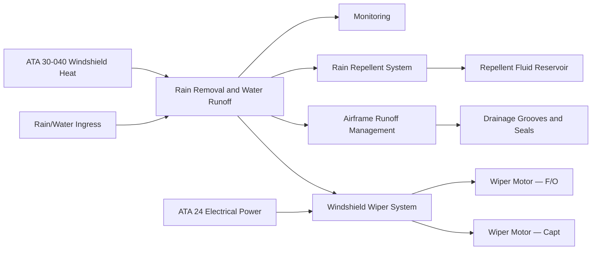
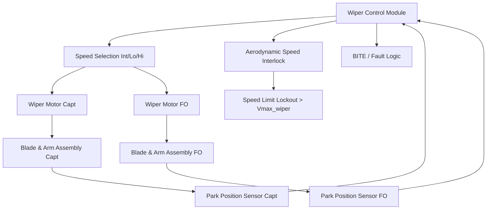
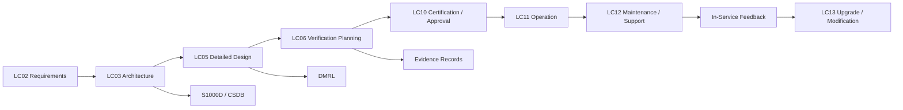

# 030-060 — Rain Removal and Water Runoff Management
### AMPEL360e eWTW · ATA 30-60 · Q+ATLANTIDE ATLAS Scaffold

---

## §0 Hyperlink Policy

All hyperlinks in this document are **relative links** unless pointing to a published external standard. Links marked **TBD** indicate targets not yet assigned a stable path within the Q+ATLANTIDE repository. Cross-references to sibling ATA 30 documents use file-name relative links only. Do not invent or guess link targets.

---

## §1 Purpose

This document defines the Rain Removal and Water Runoff Management system for the **AMPEL360e eWTW**. While the windshield electrothermal heating system (ATA 30-40) addresses ice formation on the flight deck windows, rain on the windshield during ground taxi, take-off roll, approach, and initial climb requires active mechanical removal to maintain the crew forward vision required by CS-25.773. This document covers the windshield wiper system design, wiper speed modes, aerodynamic speed interlock, park position control, rain repellent fluid system assessment, and the passive water runoff path design of the eWTW airframe — including drainage grooves, door and window seal design, and aerodynamic water dispersal at cruise speed.

---

## §2 Applicability

| Item | Value |
|---|---|
| Programme | AMPEL360e Wide Tube-and-Wing Family (eWTW) |
| ATA Sub-chapter | 30-60 — Rain Removal and Water Runoff Management |
| Wiper System | Two independent wiper motor/arm/blade assemblies (Captain and F/O) |
| Speed Modes | Intermittent (INT), Low (LO), High (HI), Park (PARK) |
| Aerodynamic Speed Limit | Vmax_wiper — TBD (nominally ~250 KIAS or VMO/2) |
| Rain Repellent | TBD — no-fit vs fit decision pending at LC03 |
| Water Runoff Design | Aerodynamic drainage grooves, door and window seals, aerodynamic dispersal at cruise |
| Interface | ATA 30-40 (windshield heating); ATA 24 (electrical power); ATA 34 (airspeed for interlock) |
| Certification Basis | CS-25.773; FAR 25.773; AC 25.773-1 |
| Document Status | Programme-controlled scaffold — not yet approved for manufacture |

---

## §3 System / Function Overview

Rain on the windshield of a commercial aircraft is a persistent hazard during the terminal phases of flight (approach and landing) and during ground operations in wet weather. At cruise altitudes, the aerodynamic boundary layer and the heated windshield surface together prevent rain film formation, and no mechanical rain removal is required above the wiper speed limit. Below the aerodynamic dispersal threshold, the windshield wiper provides the primary means of maintaining pilot forward visibility through the windshield in rain. The eWTW wiper system is an electromechanical tandem design, with independent wiper assemblies for the Captain and First Officer windshield panels. Each assembly consists of a 28 V DC permanent-magnet motor, a torque tube drive, a wiper arm with variable-pressure spring, and a rubber wiper blade rated for operation from −40 °C to +85 °C to prevent blade brittleness in cold conditions.

The wiper motor operates in three speed modes and a park mode. Speed selection is by crew from the overhead panel. The intermittent mode cycles the wiper at approximately 20 sweeps per minute with a dwell period at the park position, suitable for light rain. Low speed provides approximately 40 sweeps per minute for moderate rain. High speed provides approximately 60 sweeps per minute for heavy rain or approach in storm conditions. An aerodynamic speed interlock prevents wiper operation when the calibrated airspeed received from the ADIRU exceeds Vmax_wiper. Above this speed, dynamic pressure on the wiper arm and blade exceeds the wiper motor arm-hold torque capability, and the blade may lift off the windshield surface, causing aerodynamic flutter, blade or arm structural damage, and potential windshield scratching. When the interlock is active, the wiper is moved to the park position and held there by a latching relay, and the crew overhead panel selector is back-lit with an amber WIPER OVERSPEED advisory.

Water runoff from the windshield and fuselage nose section at airspeeds above the wiper speed limit is managed passively through aerodynamic design: the nose section contour and windshield frame geometry are designed to direct rain impact water droplets into the aerodynamic boundary layer, where they are swept rearward and away from the windshield viewing area. Drainage grooves machined into the lower windshield frame channel residual water film off the windshield lower edge before it can accumulate. Door and window seals on the flight deck door, side windows, and observer windows are designed to prevent water ingress from external rain into the pressurised structure.

---

## §4 Scope

### 4.1 Included

- Captain windshield wiper motor, drive mechanism, arm, blade, and park position sensor
- F/O windshield wiper motor, drive mechanism, arm, blade, and park position sensor
- Wiper control module (speed selection logic, aerodynamic speed interlock, park position control)
- Aerodynamic speed interlock using calibrated airspeed from ADIRU
- Wiper BITE (motor current monitoring, park position confirmation)
- Rain repellent fluid system assessment (fit / no-fit decision and architecture if fitted)
- Windshield frame drainage groove design (interface with ATA 56 / fuselage structure)
- Door and side-window seal water exclusion design (interface with ATA 52 Doors and ATA 56 Windows)
- Aerodynamic water runoff analysis of nose and flight-deck sections
- Crew overhead panel wiper controls

### 4.2 Excluded

- Windshield electrothermal heating (ATA 30-40 — heating is a prerequisite for rain runoff at cruise speed but is a separate function)
- Fuselage main cabin window seals (ATA 56 — not part of rain removal system)
- Landing gear bay drainage (ATA 32)
- Rain sensing for automatic wiper speed control (not planned for eWTW baseline)
- Cabin water ingress from galley or toilet overflows (ATA 38)

---

## §5 Architecture Description

- **Independent wiper assemblies for redundancy:** Captain and F/O wiper systems are fully independent. Each has its own motor, drive arm, blade, and motor power supply from separate 28 V DC circuits. A single wiper motor failure (detected by BITE as loss of park position confirmation or motor current anomaly) results in loss of that pilot's wiper only. The remaining pilot wiper continues to operate and provides minimum required windshield visibility per CS-25.773 requirements. Crew action: the affected pilot uses the operative wiper side as the primary visual reference for the approach.

- **Aerodynamic speed interlock — safety-critical design:** Wiper arm aerodynamic lift-off above Vmax_wiper is a potential source of windshield surface damage (scratching by a vibrating blade on a dry or semi-wet surface above the speed at which the blade can maintain contact). The interlock uses the ADIRU calibrated airspeed (IAS) input. If IAS exceeds Vmax_wiper, the wiper control module de-energises the motor drive relay and commands the motor to sweep to the park position. The interlock auto-releases when IAS decreases to Vmax_wiper − 10 KIAS (hysteresis band — TBD) to prevent hunting. The interlock cannot be overridden by crew action; it is a hard interlock not bypassable from the cockpit.

- **Park position mechanism:** The park position is defined as the wiper arm fully stowed at the lower edge of the wiper sweep arc, below the windshield lower vision line. A proximity switch or magnetic encoder at the motor drive arm confirms that the wiper is in the park position. If the park position is not confirmed within 5 seconds of a PARK command, the wiper control module attempts a slow reverse sweep to locate the park position (recovery sweep). If park position is still not achieved, a WIPER FAULT advisory is generated and the motor is de-energised to prevent blade vibration on a parked surface.

- **Rain repellent fluid system (no-fit vs fit):** A rain repellent system applies a hydrophobic chemical to the windshield outer surface, causing water to bead into discrete droplets that are dispersed aerodynamically at lower airspeeds than a plain glass surface. This can reduce wiper dependency and improve rain visibility at intermediate airspeeds. However, rain repellent fluids have maintenance cost (refilling reservoir), potential environmental concerns (disposal), and may not be compatible with all windshield coatings (ITO film surface interaction TBD). The eWTW programme has not yet made a fit/no-fit decision. If fitted, the rain repellent reservoir, pump, and spray nozzle are defined under ATA 30-60. If no-fit, the wiper must meet visibility requirements without repellent assistance.

- **Water runoff path design — passive drainage:** The eWTW nose section aerodynamic contour channels impact rainwater away from the windshield viewing area using a combination of: (a) frame drainage grooves machined into the lower windshield surround to prevent water pooling on the windshield lower sill, (b) an aerodynamic leading edge on the windshield wiper park position housing that deflects boundary layer water away from the parked wiper arm, and (c) door frame drainage channels on the cockpit access door and side-window lower frames that direct ingressing water to the fuselage lower drain path.

---

## §6 Functional Breakdown

| Function ID | Function Title | Description | Component |
|---|---|---|---|
| F-001 | Wiper Operation — Captain Intermittent | Captain wiper at ~20 cycles/min with park dwell; for light rain | Captain wiper motor + arm |
| F-002 | Wiper Operation — Captain Low | Captain wiper at ~40 cycles/min; for moderate rain | Captain wiper motor + arm |
| F-003 | Wiper Operation — Captain High | Captain wiper at ~60 cycles/min; for heavy rain | Captain wiper motor + arm |
| F-004 | Wiper Operation — F/O (all speeds) | F/O side wiper at INT / LO / HI; independent of Captain | F/O wiper motor + arm |
| F-005 | Aerodynamic Speed Interlock | Hard interlock preventing wiper operation above Vmax_wiper; auto-parks blade; not crew-bypassable | Wiper control module + ADIRU IAS |
| F-006 | Park Position Control | Command motor to park position on OFF or interlock; confirm park via position sensor; recovery sweep if park not achieved | Wiper control module + park position sensor |
| F-007 | Rain Repellent System (if fitted) | Reservoir, pump, and nozzle system applying hydrophobic fluid to windshield outer surface | Rain repellent assembly (TBD fit/no-fit) |
| F-008 | Passive Airframe Water Runoff | Drainage grooves, door seals, and aerodynamic nose contour directing rain water away from windshield viewing area and fuselage structural joints | Structural / aerodynamic design features |
| F-009 | Wiper BITE and Monitoring | Motor current monitoring, park position confirmation, fault detection, and CAUTION advisory generation | Wiper control module BITE |

---

## §7 System Context Diagram

---

## §8 Internal Functional Architecture

---

## §9 Lifecycle Traceability

---

## §10 Interfaces

| Interface ID | Interfacing System | ATA Chapter | Interface Type | Description |
|---|---|---|---|---|
| IF-060-001 | Electrical Power — 28 V DC | ATA 24 | Power supply | 28 V DC supply to Captain and F/O wiper motors and wiper control module; separate circuits |
| IF-060-002 | Air Data / ADIRU — Calibrated Airspeed | ATA 34 | Data (ARINC 429) | IAS from ADIRU to wiper control module for aerodynamic speed interlock; interlock activates above Vmax_wiper |
| IF-060-003 | Windshield Heating System | ATA 30-40 | Functional | Heated windshield surface reduces ice and rain film on glass, improving wiper effectiveness; heated surface temperature data not directly shared but heating status is coordinated |
| IF-060-004 | Indicating / ECAM | ATA 31 | Data (discrete / ARINC 429) | Wiper speed selection advisory (white status), WIPER OVERSPEED (amber), WIPER FAULT (amber) messages to ECAM |
| IF-060-005 | Central Maintenance Computer | ATA 45 | Data (ARINC 429) | Wiper motor current history, park position event log, and BITE fault codes uploaded to CMC |
| IF-060-006 | Windows and Doors Structure | ATA 56 / ATA 52 | Physical boundary | Drainage groove geometry in windshield frame (ATA 56); cockpit door and side-window seal water exclusion (ATA 52) — boundary definition required |

---

## §11 Operating Modes

| Mode | Designation | Conditions | Wiper Control Module Action | Crew Indication |
|---|---|---|---|---|
| OFF | PARK | Crew selects OFF | Motor sweeps to park position; park position confirmed; motor de-energised | WIPER OFF (no indication) |
| Intermittent | INT | Crew selects INT; IAS ≤ Vmax_wiper | Motor cycles at ~20 sweeps/min with park dwell between sweeps | WIPER INT (white status) |
| Low | LO | Crew selects LO; IAS ≤ Vmax_wiper | Motor runs continuously at ~40 sweeps/min | WIPER LO (white status) |
| High | HI | Crew selects HI; IAS ≤ Vmax_wiper | Motor runs continuously at ~60 sweeps/min | WIPER HI (white status) |
| Speed Interlock Active | OVERSPEED | IAS > Vmax_wiper regardless of crew selection | Motor commanded to park; selector position ignored; latch held until IAS < Vmax_wiper − hysteresis | WIPER OVERSPEED (amber) |
| Park Recovery | PARK RCVRY | Park position not confirmed after OFF or interlock command | Wiper control module initiates reverse sweep to locate park; second attempt | WIPER FAULT (amber if recovery fails) |
| Maintenance Test | MAINT | Ground maintenance; CMC commands test | Wiper cycles at LO for 10 sweeps; current and park sensor confirmed | MAINT — WIPER TEST |

---

## §12 Monitoring and Diagnostics

- **Motor current monitoring:** The wiper control module measures motor current during each sweep. Normal current profile has a characteristic shape: peak at start of sweep (static friction), plateau during sweep, and a spike at end-of-travel limit. Deviation from this profile indicates blade jam (over-current), mechanical binding (sustained over-current), or motor open circuit (zero current). These are classified as WIPER FAULT (amber caution).
- **Park position sensor:** A magnetic proximity sensor or Hall-effect encoder at the motor arm confirms park position. If park is not confirmed within 5 seconds of a park command, the recovery sweep is attempted. Failure to reach park after recovery generates a WIPER FAULT advisory and de-energises the motor.
- **Wiper blade wear detection (passive):** Blade wear is assessed by visual inspection at each A-check; no active blade wear sensor is fitted. Blade streaking or juddering reported by crew triggers an immediate line maintenance blade replacement.
- **ECAM classification:** Single wiper fault: CAUTION (amber) with side identification. Both wipers failed in rain condition: WARNING (red) — crew must divert or hold above cloud in IMC until repair.
- **Rain repellent system (if fitted) monitoring:** Fluid level sensor in reservoir generates a LOW REPELLENT advisory when fluid falls below minimum. Pump current monitoring detects pump failure.

---

## §13 Maintenance Concept

- **Wiper blade replacement:** Wiper blades are consumables. Replacement is a line maintenance task: remove blade securing clip, slide blade off arm track, fit new blade, confirm blade seat. Blade life: approximately 200–400 FH or 12 months (TBD per wear test). Blade replacement is the most frequent ATA 30-60 maintenance task.
- **Wiper motor and drive arm replacement:** Motor failure (BITE fault or confirmed by current test) requires wiper cowl panel removal, motor drive arm disconnection, and motor unbolting. Motor replacement at base maintenance level. Post-replacement, wiper sweep angle, park position sensor trigger point, and motor current profile are verified against baseline. Sweep angle adjustment is made via motor mounting slot adjustment.
- **Wiper control module replacement:** The wiper control module (if a separate LRU — or integrated with WHC per programme design TBD) is replaced as an LRU in the nose avionics bay. Post-replacement, all wiper functions are tested through the BITE ground test.
- **Rain repellent refill (if fitted):** Reservoir refilling is a turnaround servicing task. Repellent fluid type and refill procedure defined in the Aircraft Maintenance Manual (AMM).
- **Drainage groove inspection:** Flight deck window drainage grooves are inspected at A-check for sealant condition and blockage by debris. Blocked grooves are cleared using a non-metallic probe.

---

## §14 S1000D / CSDB Mapping

| Info Code | Title | DMC | Status |
|---|---|---|---|
| 040 | System Description — Rain Removal and Water Runoff | DMC-AMPEL360E-EWTW-030-60-040-A | Draft scaffold |
| 300 | Inspection — Wiper Blade, Arm, and Drainage Groove | DMC-AMPEL360E-EWTW-030-60-300-A | Not started |
| 400 | Fault Isolation — Wiper Motor and Control Module Faults | DMC-AMPEL360E-EWTW-030-60-400-A | Not started |
| 520 | Remove — Wiper Motor Assembly | DMC-AMPEL360E-EWTW-030-60-520-A | Not started |
| 720 | Install — Wiper Motor Assembly | DMC-AMPEL360E-EWTW-030-60-720-A | Not started |
| 941 | Illustrated Parts Data — Wiper System | DMC-AMPEL360E-EWTW-030-60-941-A | Not started |

---

## §15 Footprints

### 15.1 Physical

Two wiper motor assemblies mounted in nose structure above windshield lower frame; motor mass TBD each; arm length TBD. Wiper drive mechanism (torque tube or direct crank) mass TBD. Rain repellent reservoir (if fitted): TBD litre capacity, location in nose avionics bay.

### 15.2 Electrical / Data

| Circuit | Bus Source | Rated Power | Mode |
|---|---|---|---|
| Captain Wiper Motor | 28 V DC Bus A | ~50–150 W (TBD) | Intermittent |
| F/O Wiper Motor | 28 V DC Bus B | ~50–150 W (TBD) | Intermittent |
| Wiper Control Module | 28 V DC Essential | ~10 W | Continuous |
| Rain Repellent Pump (if fitted) | 28 V DC Non-Essential | ~20 W (TBD) | On demand |

### 15.3 Maintenance

Scheduled: wiper blade inspection / replacement — A-check or 12 months; drainage groove inspection — A-check; wiper motor current check — C-check. Unscheduled: blade replacement on crew squawk; motor replacement on BITE fault.

### 15.4 Data

Wiper motor current log, park position event history, interlock activation events, and BITE fault codes in CMC. Retention minimum 500 FH.

---

## §16 Safety and Certification Considerations

| Regulation | Applicability | Compliance Method |
|---|---|---|
| CS-25.773 | Crew compartment view — pilot must have clear forward view in precipitation | Wiper system functional demonstration in simulated rain; visibility test in heavy rain condition |
| FAR 25.773 | US counterpart | Dual-authority compliance |
| AC 25.773-1 | Pilot compartment view — rain protection guidance | Compliance methodology for windshield wiper and rain removal |
| DO-160G | Environmental qualification of wiper motors and control module | Temperature, vibration, humidity qualification; blade cold-temperature brittleness test at −40 °C |
| CS-25.775 | Windshield design — wiper must not damage windshield surface during operation or aerodynamic buffeting | Wiper blade contact pressure and surface hardness specification; aerodynamic qualification at Vmax_wiper |

---

## §17 Verification and Validation

| V&V Method | ID | Description | Applicable Functions | Status |
|---|---|---|---|---|
| Wiper Aerodynamic Qualification | VV-060-001 | Wind tunnel or flight test of wiper arm and blade assembly at Vmax_wiper; demonstration that blade maintains contact without structural failure or windshield scratching up to the interlock speed | F-005 | Not started |
| Rain Visibility Demonstration | VV-060-002 | Ground test or flight test in heavy rain conditions with wipers operating at HI speed; assessment of pilot forward visibility against CS-25.773 minimum requirements | F-001 through F-004 | Not started |
| Wiper Cold-Temperature Functional Test | VV-060-003 | Wiper system functional test at −40 °C soak; confirms blade flexibility retained, motor start torque adequate, and park position sensor functional | F-001 through F-006 | Not started |
| Aerodynamic Speed Interlock Verification | VV-060-004 | Software review and HIIL test of wiper control module; confirms interlock activates at Vmax_wiper ± tolerance and releases at hysteresis lower limit; confirms no crew override possible | F-005 | Not started |
| Wiper BITE Detection Test | VV-060-005 | Ground test injecting simulated motor open-circuit and over-current conditions into wiper control module; confirms CAUTION generation and CMC logging | F-009 | Not started |

---

## §18 Glossary

| Term | Acronym | Definition |
|---|---|---|
| Wiper Motor | — | A 28 V DC permanent-magnet electric motor converting electrical energy to rotary motion, driving the wiper arm via a crank mechanism |
| Wiper Blade | — | A flexible rubber element mounted on the wiper arm, maintaining contact with the windshield outer glass surface to sweep rain water off the field of view |
| Park Position | — | The stowed position of the wiper arm at the lower edge of the sweep arc, below the crew's primary forward vision line; confirmed by a proximity sensor |
| Rain Repellent Fluid | — | A hydrophobic chemical applied to the windshield outer glass surface to cause water to bead and roll off at lower airspeeds than plain glass; fit/no-fit TBD for eWTW |
| Water Runoff Path | — | The designed route by which rain water is directed away from critical surfaces (windshield, door seals, static ports) by airframe geometry, drainage grooves, and seals |
| Airframe Drainage Groove | — | A channel machined or formed into the windshield lower frame or door sill to capture and direct water film away from the windshield viewing area |
| Environmental Seal | — | A weather seal on cockpit doors, windows, and panels that prevents external rain ingress into the fuselage structure |
| Windshield Wiper Lock | — | The aerodynamic speed interlock preventing wiper operation above Vmax_wiper to protect the wiper assembly and windshield from aerodynamic damage |

---

## §19 Citations

| Ref ID | Document | Version | Relevance |
|---|---|---|---|
| CIT-001 | CS-25.773 — Pilot Compartment View | Amendment 27 | Forward visibility requirement in precipitation; baseline for wiper system performance criteria |
| CIT-002 | FAR 25.773 — Pilot Compartment View | Amendment 25-147 | US counterpart; dual-authority compliance requirement |
| CIT-003 | AC 25.773-1 — Pilot Compartment View | Rev — | Guidance material for rain removal and wiper system compliance demonstration |
| CIT-004 | RTCA DO-160G — Environmental Conditions and Test Procedures | Edition G | Wiper motor and wiper control module environmental qualification |
| CIT-005 | AMPEL360e eWTW Wiper System Specification | TBD — programme document | Programme-level wiper speed schedule, Vmax_wiper, blade qualification, and rain repellent decision |

---

## §20 References

| Ref ID | Title | Document Number | Notes |
|---|---|---|---|
| REF-001 | 030-040 Windshield and Window Ice/Rain Protection | 030-040-Windshield-and-Window-Ice-Rain-Protection.md | WHC and ITO film heating system — prerequisite for rain runoff at cruise speed |
| REF-002 | 030-000 Ice and Rain Protection General | 030-000-Ice-and-Rain-Protection-General.md | Parent scaffold; system boundary definition |
| REF-003 | ATA 56 Windows — Windshield Structural Design | TBD | Windshield frame drainage groove geometry and structural integration |
| REF-004 | ATA 24 Electrical Power — 28 V DC Bus | TBD | Wiper motor and control module bus allocation |
| REF-005 | ATA 34 Navigation — ADIRU | TBD | Calibrated airspeed source for aerodynamic speed interlock |
| REF-ATA | ATA 30-60 — Rain Removal and Water Runoff | ATA iSpec 2200 | SNS reference |

---

## §21 Open Issues

| OI ID | Issue | Owner | Target Resolution | Status |
|---|---|---|---|---|
| OI-001 | Vmax_wiper limit not yet defined; requires aerodynamic analysis of wiper arm lift-off forces across eWTW speed envelope and altitude range | Q-AIR | LC05 Detailed Design | Open |
| OI-002 | Rain repellent system fit / no-fit decision not yet made; decision requires assessment of ITO film surface chemical compatibility with rain repellent fluids | Q-MECHANICS / ATA 56 | LC03 Architecture freeze | Open |
| OI-003 | Wiper motor type (crank-driven arm vs pantograph) not yet selected; affects sweep angle uniformity and aerodynamic profile at high speed | Q-MECHANICS / procurement | LC05 Detailed Design | Open |
| OI-004 | Drainage groove geometry in windshield lower frame not yet defined; requires integration study between ATA 30-60 rain management and ATA 56 window structural frame design | Q-STRUCTURES / ATA 56 | LC05 Detailed Design | Open |

---

## §22 Change Log

| Version | Date | Author | Description |
|---|---|---|---|
| 0.1.0 | 2026-05-09 | Q+ATLANTIDE ATLAS Authoring | Initial scaffold creation — all sections populated at programme-controlled-scaffold status |
