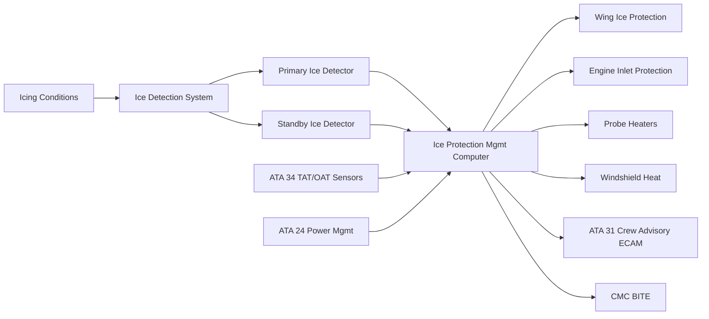
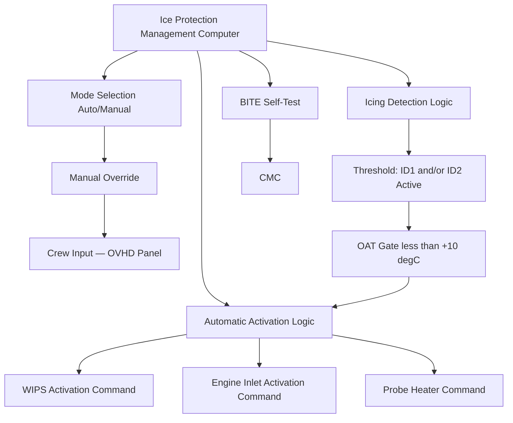
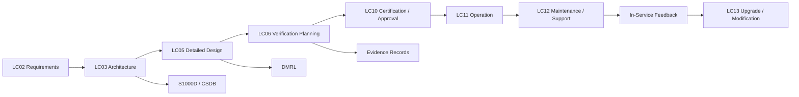

# 030-070 — Ice Detection and Protection Control
### [PROGRAMME-AIRCRAFT] [PROGRAMME-VARIANT] · ATA 30-70 · Q+ATLANTIDE ATLAS Scaffold

---

## §0 Hyperlink Policy

All hyperlinks in this document are **relative links** unless pointing to a published external standard. Links marked **TBD** indicate targets not yet assigned a stable path within the Q+ATLANTIDE repository. Cross-references to sibling ATA 30 documents use file-name relative links only. Do not invent or guess link targets.

---

## §1 Purpose

This document defines the agnostic ATLAS standard-level architecture context for `030-070 — Ice Detection and Protection Control`.

It describes the controlled scope, functions, interfaces, safety considerations, lifecycle traceability, and S1000D/CSDB mapping logic that programme implementations shall instantiate when this node is applicable.

This document is not a programme design baseline. Programme-specific capacities, locations, part numbers, effectivity, operating limits, maintenance references, and data module codes shall be defined only inside the applicable programme implementation branch.
## §2 Applicability

| Applicability Level | Rule |
|---|---|
| Standard taxonomy | Applies to the ATLAS node `<NODE>` |
| Programme implementation | Conditional; determined by programme architecture, trade studies, certification basis, and applicability model |
| Product configuration | Defined in the programme-specific configuration baseline |
| Effectivity | Defined in the programme CSDB / applicability layer |
| Non-applicability | Must be explicitly stated in the programme impact-study branch when excluded |
## §3 System / Function Overview

The ice detection and protection control function is the operational brain of the [PROGRAMME-VARIANT] ice protection system. Two ice detector probes — a Primary Ice Detector (ID1) and a Standby Ice Detector (ID2) — are mounted on the fuselage nose in locations with clear exposure to the airstream, validated to be representative of the icing conditions experienced by the critical ice-accreting surfaces (wing leading edge, engine inlet). The selected technology is the vibrating-element ice detector (representative type: Rosemount 871FA or equivalent), in which a magnetostrictive element is driven to vibrate at its natural frequency (~40 kHz). Ice accretion on the probe tip increases the element's mass, reducing the resonant frequency. When the frequency drops below a threshold value corresponding to a defined ice mass (accretion threshold), the detector outputs an ICE DETECTED discrete signal. The detector self-cycles a heater to shed the accreted ice and re-arms, providing a continuous icing condition monitor.

The IPMC receives ICE DETECTED signals from ID1 and ID2, OAT/TAT data from the ADIRU (via ATA 34), altitude and airspeed data, and crew input from the overhead panel. The IPMC executes a three-tier activation logic: (1) **automatic activation** — if ID1 OR ID2 outputs ICE DETECTED AND OAT is at or below the OAT gate threshold (+10 °C), the IPMC automatically activates all ice protection subsystems at their certified power levels without crew action; (2) **advisory with crew confirmation** — if conditions are ambiguous (e.g., OAT slightly above gate, single detector only, TAT indicates warm air mass), the IPMC generates an ICING CONDITIONS DETECTED advisory and illuminates an ANTI ICE overhead panel light without automatically activating, pending crew assessment; (3) **manual ON** — crew can activate the system at any time regardless of detector state, which is the expected mode when operating in forecast icing areas before detection occurs. The IPMC also manages power load arbitration, ensuring that the total instantaneous ice protection electrical load remains within the ATA 24 power budget during all activation states.

---

## §4 Scope

### 4.1 Included

- Primary Ice Detector (ID1) — vibrating-element sensor, fuselage nose location TBD
- Standby Ice Detector (ID2) — vibrating-element sensor, separate fuselage location TBD for independence
- Ice detector probe heater channels (as part of Probe Heater Controller — ATA 30-30)
- IPMC hardware and software — automatic activation logic, manual override, load arbitration, SLD mode flag, Appendix D ice crystal icing advisory
- Crew interface — overhead panel ANTI ICE pushbuttons (AUTO, MAN ON, OFF), ICING advisory light
- IPMC-to-WIPS controller interface (zone activation commands)
- IPMC-to-EIPC interface (engine inlet activation commands)
- IPMC-to-PHC interface (probe heater mode elevation commands)
- IPMC-to-WHC interface (windshield heat mode commands)
- IPMC-to-ECAM interface (crew advisories, warnings, and cautions)
- IPMC-to-CMC interface (fault codes, activation event logs, ice encounter records)
- OAT gate logic using ADIRU OAT/TAT channel
- SLD icing mode flag (Appendix O trigger)
- Ice crystal icing advisory (CS-25 Appendix D — crew advisory only, not automatic activation)

### 4.2 Excluded

- Individual subsystem controllers (WIPS controller, EIPC, PHC, WHC) — covered in their respective subsubject documents
- Ground de-icing operations — external fluid application; no IPMC involvement
- Ice detection for structural de-icing of horizontal stabiliser (if separate subsubject — TBD programme scope)
- Meteorological icing forecast data feed (not real-time aircraft system input on [PROGRAMME-VARIANT] baseline)

---

## §5 Architecture Description

- **Dual-channel ice detector architecture:** The use of two ice detectors (ID1 and ID2) at physically separated fuselage locations provides redundancy against single detector failure and improves coverage of the local icing condition. The IPMC activation logic can be configured for OR logic (activate if ID1 OR ID2 detects ice) or AND logic (require both to confirm before activation). For the [PROGRAMME-VARIANT], OR logic is the baseline automatic activation trigger, consistent with the conservatively safe approach required by CS-25.1419. If one detector fails, automatic activation capability is retained through the remaining detector; the crew is informed of the degraded detection configuration.

- **OAT gate — preventing spurious activation:** The OAT gate (+10 °C threshold) prevents spurious WIPS and EIP activation in warm, moist air masses where liquid water content is present but temperatures are too high for ice accretion on aircraft surfaces. Above the OAT gate, ice detector signals are suppressed from the automatic activation path (but logged). The OAT gate uses the TAT-derived OAT value from the ADIRU; if the OAT channel is invalid, the gate defaults to a conservative COLD state (gate assumed satisfied) to ensure activation is not prevented by a sensor failure.

- **SLD mode flag — Appendix O:** The IPMC asserts the SLD (Supercooled Large Droplet) mode flag when the combination of OAT, altitude, and ice detector output pattern (rapid cycling time, indicating large-droplet impingement) matches the SLD signature defined in the IPMC software. In SLD mode, the IPMC commands the WIPS controller to switch from cyclic to continuous heating and extends the heated zone boundary to the Appendix O coverage limit (TBD per CFD analysis). The SLD mode flag also triggers a specific ECAM advisory (SLD ICING CONDITIONS) to inform the crew.

- **Ice crystal icing — Appendix D advisory:** At altitudes above approximately FL220 in the presence of deep convective systems, ice crystal icing (ICI) conditions may be encountered. Ice crystal icing does not trigger the vibrating-element ice detectors (ice crystals bounce off without accreting on the probe tip at cruise conditions). The IPMC generates an ICI ADVISORY based on altitude and flight path proximity to convective weather (if weather radar input is available — TBD) or based on crew PIREP. ICI advisory activates crew notification only; it does not automatically activate electrothermal heaters (ice crystal accretion on airframe surfaces is a different phenomenon addressed by design margin and operational procedures).

- **Power load arbitration:** The IPMC maintains a real-time power demand model across all active ice protection zones. The total demand is communicated to the ATA 24 power management system, which confirms available generation capacity. If total demand would exceed available generation (e.g., during a reduced-generation single-bus state), the IPMC executes a pre-defined load-shedding priority sequence: probe heaters are maintained at highest priority (never shed); EIP maintained at high priority; WIPS zone priority sequence reduces to innermost zones only in severe degraded state.

---

## §6 Functional Breakdown

| Function ID | Function Title | Description | Component |
|---|---|---|---|
| F-001 | Primary Ice Detection | Continuous monitoring of icing conditions by vibrating-element probe ID1; outputs ICE DETECTED discrete | ID1 — Primary Ice Detector |
| F-002 | Standby Ice Detection | Redundant icing condition monitoring by ID2; outputs ICE DETECTED discrete; independent of ID1 | ID2 — Standby Ice Detector |
| F-003 | Automatic Activation Logic | IPMC executes automatic activation of all ice protection subsystems on ID1 OR ID2 signal AND OAT gate satisfied | IPMC activation logic |
| F-004 | Manual Override | Crew ON/OFF input from overhead panel overrides automatic logic; enables ice protection at crew discretion | IPMC / overhead panel interface |
| F-005 | OAT Gate | Suppresses automatic activation for OAT > +10 °C; defaults to COLD if OAT sensor invalid | IPMC OAT gate logic |
| F-006 | SLD Mode Flag | Asserts SLD mode on large-droplet signature detection; commands WIPS continuous mode and extended zone coverage | IPMC SLD logic |
| F-007 | Ice Crystal Icing Advisory | Generates ICI advisory for crew based on altitude and convective weather proximity; no automatic activation | IPMC ICI advisory |
| F-008 | Power Load Arbitration | Real-time power demand model; load-shedding priority sequence in degraded electrical states | IPMC power management |
| F-009 | ECAM Crew Advisory Management | Generates activation advisory (blue), warning (red), caution (amber) messages on ECAM per subsystem state and fault conditions | IPMC ECAM interface |

---

## §7 System Context Diagram

---

## §8 Internal Functional Architecture

---

## §9 Lifecycle Traceability

---

## §10 Interfaces

| Interface ID | Interfacing System | ATA Chapter | Interface Type | Description |
|---|---|---|---|---|
| IF-070-001 | Air Data / ADIRU — OAT and TAT | ATA 34 | Data (ARINC 429) | OAT/TAT temperature data and calibrated airspeed from ADIRU to IPMC for OAT gate logic, SLD signature analysis, and ICI altitude check |
| IF-070-002 | Electrical Power Management | ATA 24 | Data + Power | IPMC outputs total ice protection power demand to power management; receives available generation capacity; 28 V DC Essential Bus supplies IPMC control logic |
| IF-070-003 | WIPS Controller | ATA 30-10 | Data (ARINC 429 / CAN-FD) | Zone activation commands, cyclic/continuous/SLD mode selection, and zone status feedback between IPMC and WIPS controller |
| IF-070-004 | Engine Inlet Power Controller | ATA 30-20 | Data (ARINC 429 / CAN-FD) | Activation commands and power deferral coordination between IPMC and EIPC per nacelle |
| IF-070-005 | Indicating / ECAM | ATA 31 | Data (AFDX / ARINC 429) | ANTI ICE status, ICING DETECTED advisory, SLD advisory, ICI advisory, subsystem fault warnings and cautions to ECAM EIS |
| IF-070-006 | Central Maintenance Computer | ATA 45 | Data (ARINC 429) | Ice encounter logs, IPMC BITE results, activation event records, and fault codes to CMC |

---

## §11 Operating Modes

| Mode | Designation | Conditions | IPMC Action | Crew Indication |
|---|---|---|---|---|
| Auto Standby — Armed | ARMED | Powered in flight; no icing detected; OAT > gate | IPMC monitoring; subsystems in standby | ANTI ICE ARMED (white) |
| Auto Active | AUTO ON | ID1 or ID2 ICE DETECTED AND OAT ≤ gate | Activates WIPS cyclic, EIP continuous, probe heaters high power, WHC anti-ice mode | ANTI ICE ON AUTO (blue) |
| SLD Mode | SLD | SLD signature detected | Activates WIPS continuous mode + extended zone; EIP continues; specific SLD advisory | SLD ICING — ANTI ICE ON (blue + amber SLD) |
| Manual ON | MAN ON | Crew selects MAN ON regardless of detector state | Activates all subsystems as per auto-active state; IPMC maintains load management | ANTI ICE ON MAN (blue) |
| Degraded — ID1 Fault | DEGRADED DET | ID1 failed; ID2 operative | Automatic activation via ID2 only; crew notified of degraded detection | ANTI ICE DET DEGRADED (amber) |
| Degraded — Both IDs Fault | DEGRADED ALL | Both ID1 and ID2 failed | No automatic activation; crew must manually select MAN ON when in icing conditions | ICE DET FAIL — SELECT MAN (amber warning) |
| ICI Advisory | ICI ADV | High altitude + convective weather proximity | Advisory to crew only; no automatic activation | ICE CRYSTAL ICING AREA (white advisory) |

---

## §12 Monitoring and Diagnostics

- **IPMC self-test (BITE):** The IPMC performs a power-on self-test (POST) at each electrical power-up and a continuous background test during operation. POST verifies processor, memory, data bus communication, and discrete I/O channel functionality. Background test monitors the watchdog timer, verifies ARINC 429 data word reception from ADIRU and CMC, and confirms that ice detector discrete inputs are in valid states.
- **Ice detector probe self-test:** Each vibrating-element ice detector performs an internal self-test cycle at defined intervals (typically every 60 seconds when no ice is detected). The detector applies a test stimulus to its magnetostrictive element and verifies that the frequency response is within the calibrated range. A self-test failure generates a DETECTOR FAULT discrete output to the IPMC.
- **Activation event logging:** Every IPMC activation and deactivation event is logged with timestamp, trigger source (ID1, ID2, or manual), OAT at time of trigger, altitude, phase of flight, and duration. This provides a complete icing encounter history for post-flight analysis and certification evidence.
- **Load management monitoring:** The IPMC tracks the total ice protection power demand and any load-shedding events (zone deferrals). Load-shedding events are logged to CMC as advisory-level entries for maintenance trending.
- **ECAM classification:** ICE DET FAULT (single detector): CAUTION (amber). Both detectors failed: WARNING (red) — crew must select MAN ON. IPMC failed: WARNING (red) — crew must select individual subsystem manual controls (if fitted as backup).

---

## §13 Maintenance Concept

- **Ice detector replacement:** Each ice detector probe is an LRU replaced at line maintenance level. The probe is mounted on the fuselage nose with a quick-detach bayonet fitting or threaded mount; electrical connector disconnection is the primary task. Post-replacement, the IPMC performs a self-test confirm of the new detector and logs a DETECTOR REPLACED maintenance event.
- **IPMC replacement:** The IPMC is an avionics bay LRU (dual-channel or dual-redundant — TBD architecture). Replacement requires connector disconnection and rack unmounting. Post-replacement: upload IPMC software configuration and calibration data from CMC or programme data loader; perform BITE ground test including ice detector discrete verification, subsystem interface communication test, and activation logic functional test.
- **IPMC software update:** The IPMC hosts the automatic activation, load-shedding, SLD mode, and ICI advisory algorithms. Software updates are controlled as DAL B software modifications per DO-178C. All updates require post-installation regression test verification.
- **Ice detector heater check:** Ice detector probe heaters (part of PHC — ATA 30-30) are checked at A-check as part of the probe heater resistance measurement task.
- **Scheduled task:** IPMC BITE self-test confirmation — pre-departure or A-check; ice detector self-test result check via CMC — A-check.

---

## §14 S1000D / CSDB Mapping

| Info Code | Title | DMC | Status |
|---|---|---|---|
| 040 | System Description — Ice Detection and Protection Control | DMC-<PROGRAMME>-<VARIANT>-030-70-040-A | Draft scaffold |
| 300 | Inspection — Ice Detector Probe Visual and Self-Test Verification | DMC-<PROGRAMME>-<VARIANT>-030-70-300-A | Not started |
| 400 | Fault Isolation — IPMC Faults and Ice Detector Faults | DMC-<PROGRAMME>-<VARIANT>-030-70-400-A | Not started |
| 520 | Remove — Ice Detector Probe | DMC-<PROGRAMME>-<VARIANT>-030-70-520-A | Not started |
| 720 | Install — Ice Detector Probe | DMC-<PROGRAMME>-<VARIANT>-030-70-720-A | Not started |
| 941 | Illustrated Parts Data — IPMC and Ice Detectors | DMC-<PROGRAMME>-<VARIANT>-030-70-941-A | Not started |

---

## §15 Footprints

### 15.1 Physical

Two ice detector probes on fuselage nose: locations TBD (must be in representative icing exposure zone, away from boundary layer separation and probe heat interference). IPMC LRU: avionics bay, dimensions and mass TBD. Data bus wiring (ARINC 429 / CAN-FD): runs in existing avionics wire bundles.

### 15.2 Electrical / Data

| Circuit | Bus Source | Power | Notes |
|---|---|---|---|
| IPMC Control Logic | 28 V DC Essential Bus | ~30 W (TBD) | Continuous when aircraft powered |
| ID1 Probe + Heater | 28 V DC Essential Bus | ~30 W probe + ~30 W heater | Heater on PHC circuit |
| ID2 Probe + Heater | 28 V DC Essential Bus | ~30 W probe + ~30 W heater | Heater on PHC circuit |
| IPMC-to-WIPS Bus | ARINC 429 / CAN-FD | Data only | Commands zone controllers |
| IPMC-to-EIPC Bus | ARINC 429 / CAN-FD | Data only | Commands EIPC per nacelle |

### 15.3 Maintenance

Scheduled: IPMC BITE test (A-check); ice detector self-test check via CMC (A-check); ice detector probe visual inspection (turnaround). Unscheduled: ice detector LRU replacement on self-test failure; IPMC LRU replacement on BITE fault.

### 15.4 Data

IPMC logs: activation events, ice encounter records (OAT, altitude, duration), load-shedding events, detector self-test results. Retained in CMC non-volatile memory; minimum 1,000 FH retention.

---

## §16 Safety and Certification Considerations

| Regulation | Applicability | Compliance Method |
|---|---|---|
| CS-25.1419 | Automatic activation of ice protection on icing condition detection | IPMC activation logic design and verification; HIIL and flight test; FHA/SSA per ARP 4761 |
| FAR 25.1419 | US counterpart | Dual-authority compliance |
| AC 25-28 | Criteria for approval of flight into icing conditions | Guidance on ice detection system design and activation logic compliance |
| EUROCAE ED-103A | Minimum Operational Performance Standards for Ice Detection Systems | Ice detector probe qualification standard; self-test performance, detection threshold, detection latency |
| DO-178C | Software assurance for IPMC software (preliminary DAL B) | IPMC software development lifecycle; formal verification and testing per DAL B requirements |
| ARP 4754A | System development assurance — IPMC hardware and software integration | Development assurance at system level for IPMC |

---

## §17 Verification and Validation

| V&V Method | ID | Description | Applicable Functions | Status |
|---|---|---|---|---|
| Ice Detector Qualification | VV-070-001 | Qualification of ice detector probes per EUROCAE ED-103A; detection threshold, detection latency, self-test performance, and environmental qualification at temperature extremes | F-001, F-002 | Not started |
| IPMC HIIL Simulation | VV-070-002 | Hardware-in-the-loop test of IPMC with simulated ID1/ID2 inputs, OAT, and subsystem status; validates automatic activation, OAT gate logic, SLD mode flag, load-shedding, and manual override | F-003 through F-009 | Not started |
| IPMC Software Formal Verification | VV-070-003 | DO-178C DAL B formal verification activities for IPMC activation, SLD, OAT gate, and load-shedding software; structural coverage analysis | F-003, F-005, F-006, F-008 | Not started |
| Certification Flight Test — Natural Icing | VV-070-004 | Demonstration that IPMC automatically activates all subsystems within the specified detection latency on encountering Appendix C icing conditions in flight | F-003, F-004 | Not started |
| Detector Failure Mode Test | VV-070-005 | Ground test of IPMC response to simulated ID1 failure (single detector), ID2 failure, and both detectors failed; confirms crew advisory and degraded activation modes | F-001, F-002, F-003 | Not started |

---

## §18 Glossary

| Term | Acronym | Definition |
|---|---|---|
| Ice Detection Threshold | — | The ice mass on the vibrating-element probe at which the ICE DETECTED discrete output is asserted; determined by frequency drop from the dry resonant frequency |
| Ice Protection Management Computer | IPMC | The central avionics controller managing detection, activation, sequencing, power arbitration, and monitoring of all ATA 30 electrothermal ice protection zones in the [PROGRAMME-VARIANT] |
| Automatic Activation | — | The IPMC function that activates ice protection subsystems without requiring crew recognition or action, triggered by ice detector signal and OAT gate satisfaction |
| Ice Crystal Icing | ICI | A form of icing encountered at altitude in deep convective systems where ice crystals (not supercooled droplets) accrete in engine cores and probes; not detected by vibrating-element detectors |
| OAT Gate | — | A temperature threshold in the IPMC activation logic that prevents automatic activation above +10 °C OAT, where ice accretion on aircraft surfaces is not possible |
| Standby Ice Detector | ID2 | The redundant vibrating-element ice detector providing backup icing condition detection if the Primary Ice Detector (ID1) fails |
| Icing Envelope | — | The envelope of atmospheric icing conditions (temperature, LWC, MVD, altitude, horizontal extent) within which an aircraft must demonstrate safe operation; defined by CS-25 Appendix C and Appendix O |
| SLD Mode Flag | — | An IPMC software flag asserting Supercooled Large Droplet icing conditions, triggering extended WIPS zone coverage and continuous heating mode |
| Crew Advisory | — | An ECAM message generated by the IPMC to inform the crew of ice protection system status, icing conditions, or system fault; classified as advisory (blue), caution (amber), or warning (red) |

---

## §19 Citations

| Ref ID | Document | Version | Relevance |
|---|---|---|---|
| CIT-001 | CS-25.1419 — Ice Protection | Amendment 27 | Automatic activation requirement; ice detection system design standard |
| CIT-002 | FAR 25.1419 — Ice Protection | Amendment 25-147 | US certification counterpart; dual-authority compliance |
| CIT-003 | AC 25-28 — Criteria for Approval of Flight into Icing Conditions | Rev — | Guidance on IPMC activation logic compliance demonstration |
| CIT-004 | EUROCAE ED-103A — Minimum Operational Performance Standards for Ice Detection Systems | Edition A | Qualification standard for vibrating-element ice detector probes |
| CIT-005 | [PROGRAMME-AIRCRAFT] [PROGRAMME-VARIANT] IPMC System Specification | TBD — programme document | Programme-level IPMC architecture, activation logic, DAL assignment, and interface requirements |

---

## §20 References

| Ref ID | Title | Document Number | Notes |
|---|---|---|---|
| REF-001 | 030-000 Ice and Rain Protection General | 030-000-Ice-and-Rain-Protection-General.md | Parent scaffold; system boundary and power budget |
| REF-002 | 030-010 Wing Ice Protection | 030-010-Wing-Ice-Protection.md | WIPS zone activation interface with IPMC |
| REF-003 | 030-020 Engine and Inlet Ice Protection | 030-020-Engine-and-Inlet-Ice-Protection.md | EIPC activation interface with IPMC; power deferral coordination |
| REF-004 | RTCA DO-178C — Software Considerations in Airborne Systems | DO-178C | IPMC software development assurance (DAL B) |
| REF-005 | SAE ARP 4754A — Guidelines for Development of Civil Aircraft and Systems | ARP 4754A | IPMC system development assurance level allocation |
| REF-ATA | ATA 30-70 — Ice Detection and Protection Control | ATA iSpec 2200 | SNS reference |

---

## §21 Open Issues

| OI ID | Issue | Owner | Target Resolution | Status |
|---|---|---|---|---|
| OI-001 | IPMC architecture (dual-channel single LRU vs two separate LRUs) not yet selected — drives failure mode independence and DAL B allocation approach | Q-MECHANICS / ORB-PMO | LC03 Architecture freeze | Open |
| OI-002 | Ice detector probe locations on [PROGRAMME-VARIANT] nose not yet defined; requires icing exposure analysis to confirm detector response is representative of wing leading-edge icing | Q-AIR | LC05 Detailed Design | Open |
| OI-003 | SLD signature detection algorithm not yet defined; requires ED-103A-compliant SLD characterisation for the [PROGRAMME-VARIANT] probe installation location | Q-AIR / Q-MECHANICS | LC05 Detailed Design | Open |
| OI-004 | Ice crystal icing (Appendix D) advisory trigger — weather radar input availability on [PROGRAMME-VARIANT] baseline not yet confirmed; if no radar, ICI advisory relies on crew PIREP only | ATA 34 / Q-MECHANICS | LC03 Architecture freeze | Open |

---

## §22 Change Log

| Version | Date | Author | Description |
|---|---|---|---|
| 0.1.0 | 2026-05-09 | Q+ATLANTIDE ATLAS Authoring | Initial scaffold creation — all sections populated at programme-controlled-scaffold status |
