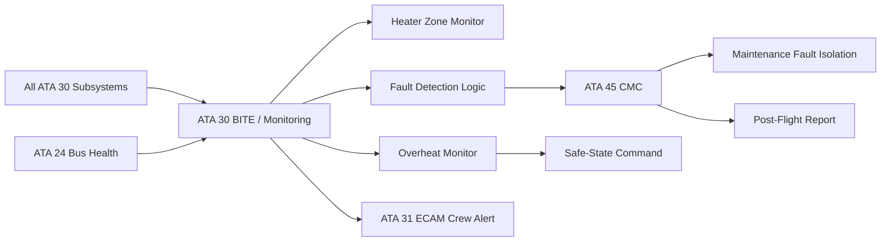
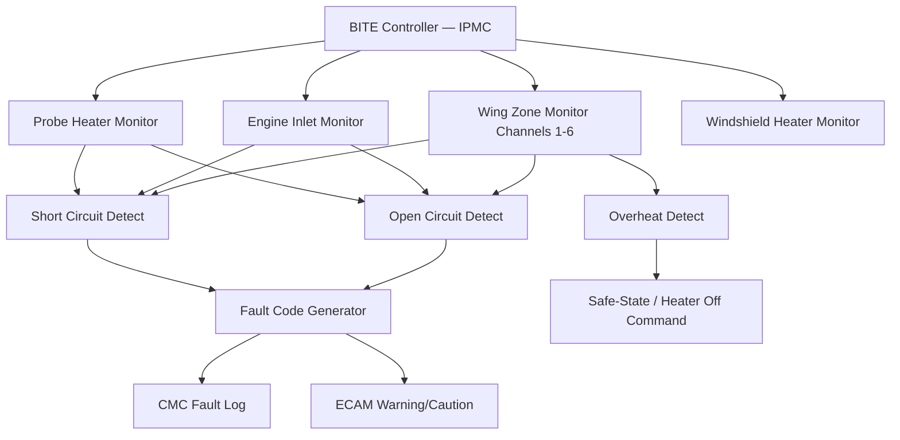
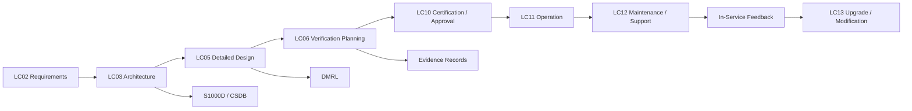

# 030-080 — Ice and Rain Monitoring, Diagnostics, and Control Interfaces
### [PROGRAMME-AIRCRAFT] [PROGRAMME-VARIANT] · ATA 30-80 · Q+ATLANTIDE ATLAS Scaffold

---

## §0 Hyperlink Policy

All hyperlinks in this document are **relative links** unless pointing to a published external standard. Links marked **TBD** indicate targets not yet assigned a stable path within the Q+ATLANTIDE repository. Cross-references to sibling ATA 30 documents use file-name relative links only. Do not invent or guess link targets.

---

## §1 Purpose

This document defines the agnostic ATLAS standard-level architecture context for `030-080 — Ice and Rain Monitoring, Diagnostics, and Control Interfaces`.

It describes the controlled scope, functions, interfaces, safety considerations, lifecycle traceability, and S1000D/CSDB mapping logic that programme implementations shall instantiate when this node is applicable.

This document is not a programme design baseline. Programme-specific capacities, locations, part numbers, effectivity, operating limits, maintenance references, and data module codes shall be defined only inside the applicable programme implementation branch.
## §2 Applicability

| Applicability Level | Rule |
|---|---|
| Standard taxonomy | Applies to the ATLAS node `<NODE>` |
| Programme implementation | Conditional; determined by programme architecture, trade studies, certification basis, and applicability model |
| Product configuration | Defined in the programme-specific configuration baseline |
| Effectivity | Defined in the programme CSDB / applicability layer |
| Non-applicability | Must be explicitly stated in the programme impact-study branch when excluded |
## §3 System / Function Overview

The ATA 30 monitoring and diagnostics architecture for the [PROGRAMME-VARIANT] is built on the principle that every electrothermal heater element in the ice protection system must be continuously monitored, its health reported to the crew within seconds of a fault occurring, and the fault logged to the CMC with sufficient detail to isolate the failed LRU without additional test equipment. The IPMC is the primary BITE aggregation point; it collects heater circuit health reports from the WIPS controller (wing zones 1–12), EIPC (engine inlet lip and spinner heaters per nacelle), PHC (all thirteen probe heater circuits), WHC (Captain and F/O windshield panels), and THC (drain mast and service-point heaters). The IPMC classifies each fault by type (open circuit, short circuit, overheat, current deviation, temperature sensor invalid) and severity (safety-critical, airworthiness-significant, maintenance-required), and routes the appropriate ECAM message and CMC fault code.

Overheat protection is a particularly important diagnostic function given the CFRP composite structure of the [PROGRAMME-VARIANT] wing leading edge and nacelle inlet cowl. The WIPS controller hardware-latches each zone contactor on temperature exceedance; the IPMC independently monitors zone temperature telemetry and generates an OVERHEAT WARNING on ECAM if any zone temperature rises above the first (software) threshold. The hardware latch activates at a higher second threshold. This dual-threshold architecture means that the IPMC software has the first opportunity to detect an overheat trend and alert the crew before the hardware latch activates and cuts the zone. If the hardware latch activates, the IPMC detects the zone going off (loss of current despite an activate command) and logs an OVERHEAT LATCH event to CMC, distinguishing it from a simple open-circuit fault and triggering a maintenance investigation before zone re-energisation.

---

## §4 Scope

### 4.1 Included

- BITE architecture for all ATA 30 heater zones: wing inner/outer/winglet (12 zones), engine inlet lip per nacelle (2 zones + spinner TBD), probe heaters (13 circuits), windshield heater panels (2), drain mast heaters, fuel vent heaters, waterline trace heaters (all THC-monitored circuits)
- Fault detection modes: open circuit, short circuit, current deviation (partial element degradation), temperature out-of-range, temperature sensor invalid, zone contactor not responding, SSPC overcurrent trip
- Dual-threshold overheat protection: software advisory threshold and hardware-latching cutoff threshold per heating zone
- ECAM crew alerting: WARNING (red), CAUTION (amber), ADVISORY (blue/white) — classification and message content for all ATA 30 fault conditions
- CMC fault code structure: ATA 30 prefix, zone identifier, fault type code, severity code, timestamp, flight-phase context
- Maintenance fault isolation logic: CMC-directed fault isolation procedure from fault code to LRU identification
- Post-flight report generation: ice encounter summary, heater zone activation log, fault event log, temperature history
- ATA 45 CMC interface for fault code storage, retrieval, and Portable Maintenance Device (PMD) download
- ATA 31 ECAM interface for all ATA 30 alert messages and system status pages
- Thermal runaway monitoring and composite structure protection logic

### 4.2 Excluded

- BITE within individual sub-controllers (WIPS controller internal BITE, EIPC internal BITE, PHC internal BITE) — these are specified in their respective subsubject documents; this document covers the aggregated IPMC BITE function and CMC/ECAM output layer
- ATA 24 electrical bus health monitoring (ATA 24 scope; contributes to ATA 30 fault context)
- Structural damage assessment following ice impact or thermal overload event (ATA 54/57 inspection scope)

---

## §5 Architecture Description

- **Hierarchical BITE aggregation:** Each sub-controller (WIPS, EIPC, PHC, WHC, THC) performs local first-level BITE — current sensing, temperature monitoring, contactor state verification — and reports a per-zone health word to the IPMC via the system data bus (ARINC 429 or CAN-FD). The IPMC performs second-level BITE aggregation: cross-correlation of zone faults, severity classification, redundancy assessment (does the fault leave any ice protection zone with no remaining heater coverage?), and routing to ECAM and CMC. This hierarchy allows the IPMC to assess whether a single zone fault degrades the system to an airworthiness-significant level or is merely a maintenance item.

- **Fault code structure:** ATA 30 fault codes are structured as: `30-[SS]-[ZZ]-[FT]-[SV]` where SS is the subsubject (10, 20, 30, 40, 50), ZZ is the zone or channel identifier (01–12 for WIPS zones, 01–02 for nacelles, 01–13 for probe channels), FT is the fault type (OC = open circuit, SC = short circuit, OHT = overheat, CUR = current deviation, TMP = temperature sensor fault), and SV is the severity (W = Warning, C = Caution, M = Maintenance). Example: `30-10-03-OC-C` = Wing Zone 3 Open Circuit Caution. The programme-specific fault code table is TBD and will be defined in the IPMC software specification at LC05.

- **Overheat protection — two-threshold design:** Each heater zone has two temperature thresholds. Threshold 1 (software advisory, TBD °C): the IPMC software detects rising zone temperature via zone temperature telemetry and generates an ECAM CAUTION advisory. The IPMC reduces heater power to the zone in a software-controlled thermal limit response. Threshold 2 (hardware latch, TBD °C, higher than Threshold 1): the WIPS controller or EIPC hardware overheat protection circuit latches the zone contactor open regardless of software activation command. The hardware latch cannot be reset by software; it requires a physical maintenance reset (ground access, fault investigation, and reset button or relay reset per AMM procedure). This two-threshold design protects composite airframe structure from thermal delamination caused by heater runaway due to mat delamination or thermal sensor failure.

- **Post-flight report (PFR) generation:** At the end of each flight (on weight-on-wheels transition to GROUND), the IPMC generates a structured Post-Flight Report containing: ice encounter summary (total icing time, peak icing condition, SLD flag events), heater zone activation events (zone, duration, mode), any overheat events, any BITE faults with fault code and context, and CMC maintenance recommendations. The PFR is stored in CMC non-volatile memory and is available for download via PMD within 5 minutes of aircraft landing. The PFR supports quick-turn maintenance decisions.

- **Control interfaces — crew overhead panel:** The crew interacts with the ATA 30 system through a dedicated section of the overhead panel. Controls include: ANTI ICE mode selector (AUTO / MAN ON / OFF), PROBE HEAT selector (AUTO / ON / OFF for ground override), WIPER speed selector (OFF / INT / LO / HI), and status lights for each subsystem (WIPS, EIP, PROBE HEAT, WINDSHIELD HEAT, WIPER). System status information is also presented on the ECAM System Display (SYS page) with a dedicated ATA 30 ice protection page showing all zone health states in schematic form.

---

## §6 Functional Breakdown

| Function ID | Function Title | Description | Component |
|---|---|---|---|
| F-001 | Heater Zone Current Monitoring | Per-zone current measurement in each sub-controller; open-circuit and short-circuit detection within one heating cycle | WIPS ctrl, EIPC, PHC, WHC, THC |
| F-002 | Heater Zone Temperature Monitoring | Zone temperature telemetry from embedded sensors; overheat threshold detection (two-threshold: software advisory + hardware latch) | IPMC temperature monitoring |
| F-003 | BITE Aggregation and Severity Classification | IPMC aggregates per-zone health words from all sub-controllers; classifies faults by severity and redundancy impact | IPMC BITE aggregation |
| F-004 | Dual-Threshold Overheat Protection | Software advisory at Threshold 1; hardware-latching contactor cutout at Threshold 2; hardware latch not software-resettable | WIPS ctrl OHP + IPMC |
| F-005 | ECAM Crew Alerting | Routes ATA 30 fault messages to ECAM — WARNING (red), CAUTION (amber), ADVISORY (blue); system status page schematic | IPMC ECAM interface |
| F-006 | CMC Fault Code Logging | Generates structured fault codes (ATA 30 prefix format) with zone ID, fault type, severity, timestamp, and flight-phase context; stored in CMC non-volatile memory | IPMC CMC interface |
| F-007 | Maintenance Fault Isolation | CMC-directed fault isolation procedure from fault code to LRU; cross-references to AMM tasks | CMC fault isolation logic |
| F-008 | Post-Flight Report Generation | Generates PFR at WOW GROUND transition; ice encounter summary, zone activation log, fault events, and maintenance recommendations | IPMC PFR function |
| F-009 | Thermal Runaway Detection | Detects rising zone temperature above Threshold 1 ahead of hardware latch; alerts crew and limits heater power to prevent composite laminate damage | IPMC thermal runaway monitor |

---

## §7 System Context Diagram

---

## §8 Internal Functional Architecture

---

## §9 Lifecycle Traceability

---

## §10 Interfaces

| Interface ID | Interfacing System | ATA Chapter | Interface Type | Description |
|---|---|---|---|---|
| IF-080-001 | WIPS Controller | ATA 30-10 | Data (ARINC 429 / CAN-FD) | Per-zone health words (current, temperature, contactor state, SSPC status) from WIPS controller to IPMC BITE aggregator |
| IF-080-002 | Engine Inlet Power Controllers | ATA 30-20 | Data (ARINC 429 / CAN-FD) | Nacelle 1 and 2 inlet heater current, temperature, and contactor state from EIPC to IPMC |
| IF-080-003 | Probe Heater Controller | ATA 30-30 | Data (ARINC 429) | Per-channel heater resistance, current status, and fault flags from PHC to IPMC |
| IF-080-004 | Indicating / Recording — ECAM | ATA 31 | Data (AFDX / ARINC 429) | ATA 30 fault messages (WARNING, CAUTION, ADVISORY) and ATA 30 system status page schematic data to ECAM |
| IF-080-005 | Central Maintenance System | ATA 45 | Data (ARINC 429 / Ethernet) | Fault codes, BITE event log, PFR, zone activation records, temperature history from IPMC to CMC; download via PMD |
| IF-080-006 | Electrical Power — Bus Health | ATA 24 | Data (discrete / ARINC 429) | Bus availability flags from power management system to IPMC; informs fault context when heater loss is due to bus failure vs heater element failure |

---

## §11 Operating Modes

| Mode | Designation | Conditions | BITE / Monitoring Action | Crew or Maintenance Indication |
|---|---|---|---|---|
| Normal Monitoring | MON ACTIVE | All systems powered; no faults | Background monitoring of all channels; PFR generation at WOW GROUND | No alert (system nominal) |
| Fault Detected — Maintenance | MAINT REQD | Non-airworthiness fault detected (e.g., drain mast heater OC) | Fault code logged to CMC; MAINTENANCE REQUIRED advisory | MAINT REQD (white advisory) |
| Fault Detected — Caution | CAUTION | Airworthiness-significant fault (e.g., single WIPS zone OC) | Fault code logged; ECAM CAUTION generated; crew informed | [Zone ID] FAULT (amber) |
| Fault Detected — Warning | WARNING | Safety-critical fault (e.g., all WIPS zones on one wing failed) | Fault code logged; ECAM WARNING generated; crew notified to exit icing | ANTI ICE FAIL (red) |
| Overheat Threshold 1 | OHT ALERT | Zone temperature ≥ Threshold 1 | IPMC reduces zone power; ECAM CAUTION; thermal runaway trend log | WING ZONE OHT (amber) |
| Overheat Threshold 2 | OHT LATCH | Zone temperature ≥ Threshold 2 | Hardware latch opens zone contactor; IPMC detects zone offline; logs OVERHEAT LATCH event | WING ZONE OHT LATCH (red) |
| Ground BITE Test | GND BITE | Maintenance-initiated ground test via CMC | IPMC commands each sub-controller to run ground BITE sequence; results logged to CMC; GO/NO-GO report | BITE RESULT: GO / NO-GO |

---

## §12 Monitoring and Diagnostics

The IPMC BITE architecture provides four layers of diagnostic capability:

**Layer 1 — Real-time current monitoring (cycle resolution):** Every heater activation cycle (ON-time) is accompanied by a current measurement in the sub-controller. Results are compared to expected values and health words are updated within 2 seconds of fault occurrence. This is the fastest diagnostic layer, capturing transient open or short circuits as they occur.

**Layer 2 — Temperature telemetry monitoring (continuous):** Zone temperature data from embedded thermocouples or RTDs is sampled by the IPMC at a minimum rate of 1 Hz. Temperature trends are tracked; rising temperature above Threshold 1 before the hardware latch activates is detectable within the IPMC software. This layer catches thermal runaway caused by mat delamination (which increases the thermal resistance to the outer skin and causes the heater element temperature to rise even at normal power levels) before structural damage occurs.

**Layer 3 — Historical trending (post-flight):** The IPMC accumulates zone resistance history (computed from current and voltage) across multiple flights. A slow drift in zone resistance (indicative of progressive mat element degradation or moisture ingress) is detectable from the trending data even before the deviation exceeds the real-time fault threshold. The trending data is available in the PFR and via CMC download.

**Layer 4 — Ground BITE test (pre-departure or maintenance):** On command, the IPMC performs a structured ground BITE test: each zone is energised at 10% power for 5 seconds; current and resistance are measured; results are compared to production baselines stored in CMC. Deviations of more than ±10% generate a MAINTENANCE REQUIRED advisory. This layer catches intermittent faults that do not manifest during flight monitoring. The ground BITE GO/NO-GO result is logged to CMC and is accessible to the crew via the ECAM maintenance page before departure.

---

## §13 Maintenance Concept

- **Fault code-driven maintenance:** All ATA 30 maintenance actions are initiated by CMC fault codes. The AMM contains a fault code lookup table mapped to fault isolation procedures (FIP). Each FIP specifies the sequence of checks to perform, the tools required (multi-meter, PMD, BITE ground test), and the LRU to replace if the checks confirm the fault.
- **Overheat latch reset procedure:** If a hardware overheat latch has activated (OVERHEAT LATCH event in CMC), the AMM procedure requires: (a) investigation of the thermal event (inspection of the affected zone for physical damage), (b) resistance measurement of the zone heater circuit, (c) inspection of zone temperature sensor for validity, (d) identification and correction of the root cause (delamination, mat damage, or temperature sensor failure), and (e) manual reset of the hardware latch relay via ground access before zone re-energisation is permitted.
- **CMC download and PFR review:** At each maintenance visit, the CMC data is downloaded to a PMD or ground station. The PFR is reviewed for trends: increasing fault frequency, temperature drift, or icing encounter accumulation that approaches material limits. These trends trigger proactive maintenance actions (e.g., thermographic inspection of WIPS zones before the resistance check interval).
- **ECAM page verification:** At each maintenance visit, the ATA 30 ECAM system status page is verified to show all zones as healthy (green) with no fault indicators. Any residual ECAM amber or white advisory is investigated before the aircraft is released for service.

---

## §14 S1000D / CSDB Mapping

| Info Code | Title | DMC | Status |
|---|---|---|---|
| 040 | System Description — ATA 30 Monitoring and Diagnostics | DMC-<PROGRAMME>-<VARIANT>-030-80-040-A | Draft scaffold |
| 400 | Fault Isolation — IPMC BITE and Heater Zone Faults | DMC-<PROGRAMME>-<VARIANT>-030-80-400-A | Not started |

---

## §15 Footprints

### 15.1 Physical

The ATA 30-80 monitoring function is implemented in the IPMC software and the distributed monitoring circuits of each sub-controller. No additional hardware LRUs are required beyond those defined in the individual subsystem documents. CMC interfaces use existing ARINC 429 or Ethernet infrastructure of ATA 45.

### 15.2 Electrical / Data

| Interface | Type | Data Rate | Protocol |
|---|---|---|---|
| IPMC to WIPS controller | Bidirectional serial | TBD | ARINC 429 or CAN-FD |
| IPMC to EIPC (per nacelle) | Bidirectional serial | TBD | ARINC 429 or CAN-FD |
| IPMC to PHC | Bidirectional serial | TBD | ARINC 429 |
| IPMC to WHC | Bidirectional serial | TBD | ARINC 429 |
| IPMC to CMC | Bidirectional | TBD | ARINC 429 / Ethernet |
| IPMC to ECAM | Unidirectional | TBD | AFDX / ARINC 429 |

### 15.3 Maintenance

BITE ground test: pre-departure or A-check. CMC data download and PFR review: each maintenance visit or as triggered by in-service fault code. Overheat latch reset: unscheduled, on overheat latch event.

### 15.4 Data

ATA 30 CMC data: fault event log (minimum 1,000 FH retention), zone temperature history, PFR archive (minimum 200 PFRs), zone resistance trend data. All data accessible via ATA 45 PMD download.

---

## §16 Safety and Certification Considerations

| Regulation | Applicability | Compliance Method |
|---|---|---|
| CS-25.1309 | Equipment, systems, and installations — failure condition classification and safety assessment | FHA and SSA for all ATA 30 fault conditions; BITE coverage adequate to detect each failure condition within the defined detection latency |
| FAR 25.1309 | US counterpart | Dual-authority compliance |
| ARP 4754A | System development assurance — IPMC BITE and monitoring software | DAL B development assurance for IPMC monitoring software; structural coverage of BITE test cases |
| ARP 4761 | Safety assessment — failure conditions and effects | FHA confirms that BITE detection meets CS-25.1309 requirements for each failure severity class |
| CS-25 AMC 25.1309 | Acceptable Means of Compliance for CS-25.1309 | BITE monitoring frequency and latency requirements derived from AMC 25.1309 guidance for each fault severity |

---

## §17 Verification and Validation

| V&V Method | ID | Description | Applicable Functions | Status |
|---|---|---|---|---|
| BITE Detection Threshold Verification | VV-080-001 | HIIL test injecting simulated open-circuit, short-circuit, and temperature deviation conditions into the IPMC via each sub-controller interface; confirms fault detection within specified latency and correct fault code generation | F-001, F-002, F-003, F-006 | Not started |
| Overheat Protection Two-Threshold Test | VV-080-002 | Hardware test energising a representative WIPS zone to Threshold 1 and Threshold 2 temperature; confirms software advisory at Threshold 1, hardware latch activation at Threshold 2, and correct ECAM messages | F-004, F-009 | Not started |
| PFR Content Verification | VV-080-003 | End-to-end test: simulate icing encounter in HIIL, including zone activation, fault event, and overheat advisory; verify PFR content matches all simulated events with correct timestamps | F-008 | Not started |
| CMC Fault Isolation Validation | VV-080-004 | Review and walkthrough of fault isolation procedures in CMC for all ATA 30 fault codes; confirm procedures lead to correct LRU identification for each simulated fault scenario | F-007 | Not started |
| ECAM Message Classification Review | VV-080-005 | Review of all ATA 30 ECAM messages against CS-25.1309 failure condition severity; confirm WARNING/CAUTION/ADVISORY classification is consistent with FHA failure condition assessment | F-005 | Not started |

---

## §18 Glossary

| Term | Acronym | Definition |
|---|---|---|
| Built-In Test Equipment | BITE | Hardware and software functions within an avionics LRU that perform self-test, monitor operational parameters, detect faults, and generate fault codes without external test equipment |
| Central Maintenance Computer | CMC | The aircraft-level avionics system (ATA 45) that collects, stores, and provides maintenance access to BITE fault codes and health data from all aircraft systems |
| Central Maintenance System | CMS | The overall maintenance information system encompassing the CMC, Portable Maintenance Device (PMD) interface, and ground station connectivity |
| ECAM | — | Electronic Centralised Aircraft Monitor; the crew alerting and system status display system (ATA 31) presenting ATA 30 ice protection status and fault messages |
| Fault Code | — | A structured identifier generated by the IPMC BITE on fault detection; contains subsubject, zone identifier, fault type, and severity to direct maintenance fault isolation |
| Heater Zone Monitoring | — | The per-circuit monitoring of current, temperature, and contactor state for each electrothermal heating zone in the [PROGRAMME-VARIANT] ice protection system |
| Open-Circuit Fault | OC | A fault in which electrical continuity of the heater element is lost (element fracture, connector break, or SSPC failure); detected as near-zero current on a commanded-ON circuit |
| Short-Circuit Fault | SC | A fault in which the heater element insulation fails, causing a low-resistance path to structure or between conductors; detected as over-current |
| Overheat Detection | OHT | The detection of a heater zone temperature above a defined threshold; triggers software advisory at Threshold 1 and hardware-latching cutout at Threshold 2 |
| Maintenance Message | — | An ECAM or CMC advisory indicating a non-airworthiness maintenance requirement; does not prevent dispatch but requires attention at the next maintenance opportunity |

---

## §19 Citations

| Ref ID | Document | Version | Relevance |
|---|---|---|---|
| CIT-001 | CS-25.1309 — Equipment, Systems, and Installations | Amendment 27 | Safety assessment requirements for ATA 30 failure conditions; BITE monitoring requirements |
| CIT-002 | FAR 25.1309 — Equipment, Systems, and Installations | Amendment 25-147 | US counterpart; dual-authority compliance |
| CIT-003 | SAE ARP 4754A — Guidelines for Development of Civil Aircraft and Systems | Rev A | Development assurance for IPMC BITE and monitoring system at DAL B |
| CIT-004 | SAE ARP 4761 — Guidelines and Methods for Conducting the Safety Assessment Process | Rev A | FHA and SSA methodology for ATA 30 monitoring system failure conditions |
| CIT-005 | [PROGRAMME-AIRCRAFT] [PROGRAMME-VARIANT] BITE and Diagnostics Specification | TBD — programme document | Programme-level BITE coverage requirements, fault code structure, and PFR content definition |

---

## §20 References

| Ref ID | Title | Document Number | Notes |
|---|---|---|---|
| REF-001 | 030-000 Ice and Rain Protection General | 030-000-Ice-and-Rain-Protection-General.md | Parent scaffold; system architecture overview |
| REF-002 | 030-070 Ice Detection and Protection Control | 030-070-Ice-Detection-and-Protection-Control.md | IPMC architecture; activation and fault state management |
| REF-003 | ATA 31 Indicating and Recording | TBD | ECAM interface definition; message format and display conventions |
| REF-004 | ATA 45 Central Maintenance System | TBD | CMC interface; fault code structure; PMD download protocol |
| REF-005 | CS AMC 25.1309 — Acceptable Means of Compliance | CS-25 Issue 1 | BITE latency and detection requirements derivation |
| REF-ATA | ATA 30-80 — Monitoring and Diagnostics | ATA iSpec 2200 | SNS reference |

---

## §21 Open Issues

| OI ID | Issue | Owner | Target Resolution | Status |
|---|---|---|---|---|
| OI-001 | ATA 30 fault code structure (format and enumeration) not yet defined at programme level; requires IPMC software specification to be initiated | Q-MECHANICS / ORB-PMO | LC05 Detailed Design | Open |
| OI-002 | Overheat threshold values (Threshold 1 and Threshold 2 in °C) for composite wing leading edge not yet defined; requires materials engineering input on CFRP Tg and bonding adhesive limits | Q-STRUCTURES | LC05 Detailed Design | Open |
| OI-003 | ATA 30 ECAM system status page layout and schematic content not yet defined; requires coordination with ATA 31 display management software team | ATA 31 / Q-MECHANICS | LC05 Detailed Design | Open |
| OI-004 | BITE monitoring data bus protocol (ARINC 429 vs CAN-FD) between IPMC and sub-controllers not yet selected; drives IPMC input card design and sub-controller communication interface | Q-MECHANICS / ATA 24 | LC03 Architecture freeze | Open |

---

## §22 Change Log

| Version | Date | Author | Description |
|---|---|---|---|
| 0.1.0 | 2026-05-09 | Q+ATLANTIDE ATLAS Authoring | Initial scaffold creation — all sections populated at programme-controlled-scaffold status |
