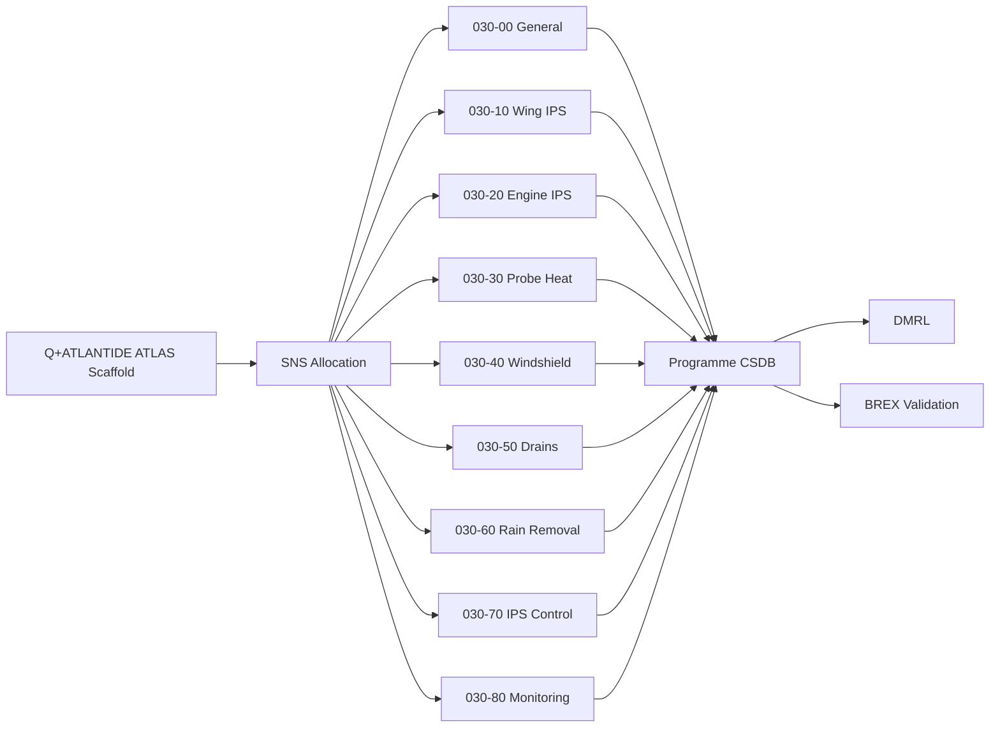
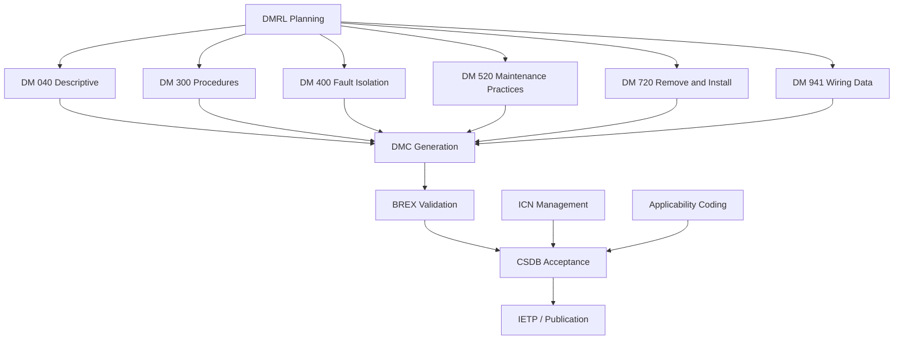
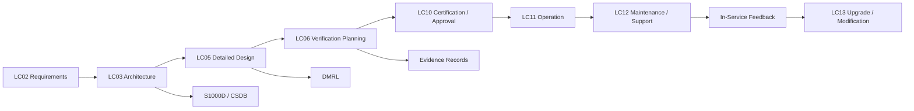

# 030-090 — S1000D CSDB Mapping and Traceability
### [PROGRAMME-AIRCRAFT] [PROGRAMME-VARIANT] · ATA 30-90 · Q+ATLANTIDE ATLAS Scaffold

---

## §0 Hyperlink Policy

All hyperlinks in this document are **relative links** unless pointing to a published external standard. Links marked **TBD** indicate targets not yet assigned a stable path within the Q+ATLANTIDE repository. Cross-references to sibling ATA 30 documents use file-name relative links only. Do not invent or guess link targets.

---

## §1 Purpose

This document defines the agnostic ATLAS standard-level architecture context for `030-090 — S1000D CSDB Mapping and Traceability`.

It describes the controlled scope, functions, interfaces, safety considerations, lifecycle traceability, and S1000D/CSDB mapping logic that programme implementations shall instantiate when this node is applicable.

This document is not a programme design baseline. Programme-specific capacities, locations, part numbers, effectivity, operating limits, maintenance references, and data module codes shall be defined only inside the applicable programme implementation branch.

## §2 Applicability

| Applicability Level | Rule |
|---|---|
| Standard taxonomy | Applies to the ATLAS node `<NODE>` |
| Programme implementation | Conditional; determined by programme architecture, trade studies, certification basis, and applicability model |
| Product configuration | Defined in the programme-specific configuration baseline |
| Effectivity | Defined in the programme CSDB / applicability layer |
| Non-applicability | Must be explicitly stated in the programme impact-study branch when excluded |

## §3 System / Function Overview

S1000D is the international specification for technical publications for civil and military products and equipment. For the [PROGRAMME-AIRCRAFT] [PROGRAMME-VARIANT] programme, all technical publications for systems within the scope of ATA iSpec 2200 — including ATA 30 Ice and Rain Protection — will be authored as S1000D Issue 5.0 Data Modules (DMs) and stored in a programme CSDB. The SNS (System / Subsystem / Subsubsystem) allocation is the foundation of the CSDB structure: it defines the four-part numerical identifier used in all DMCs (Data Module Codes) for the programme. For ATA 30, the SNS is structured as `030-[SS]-[SSS]` where `030` is the ATA 30 system code, `SS` is the two-digit subsubject code (00 through 80), and `SSS` is a three-digit optional detail code (normally `000` at the subsubject level).

The DMRL is the master list of all DMs required for the programme across all ATAs. The ATA 30 section of the DMRL specifies, for each subsubject, the set of DMs required (by information code — e.g., 040 for descriptive, 300 for procedural, 400 for fault isolation, 520 for maintenance practices, 720 for removal and installation), their authoring status, their S1000D applicability code, and the target delivery milestone (lifecycle phase). The BREX defines the business rules that constrain the XML structure, attribute values, and narrative conventions applicable to all ATA 30 DMs in the programme CSDB. BREX validation is a mandatory step before any DM is accepted into the CSDB.

---

## §4 Scope

### 4.1 Included

- SNS allocation table for all nine ATA 30 subsubjects (030-00 through 030-80)
- Recommended DM set per subsubject: information codes, DMC pattern, and content description
- DMRL planning status per subsubject: not started / scaffold available / in progress / issued
- BREX rules applicable to ATA 30 content: text restrictions, table conventions, illustration naming, applicability coding
- ICN guidance for ATA 30 figures: ICN numbering convention, raster vs vector preference, figure captioning
- Applicability coding structure: effectivity model (aircraft serial number or model variant), common base effectivity
- Pub Module concept: mapping of DMs to crew and maintenance publications

### 4.2 Excluded

- CSDB tool selection and procurement (programme management scope; TBD at LC03 architecture freeze)
- Authoring of individual DMs (each subsubject document provides the scaffold content from which DMs will be authored)
- S1000D conformance testing of the CSDB configuration (tool vendor scope)
- Illustrated Parts Catalog (IPC) data modules (ATA 04 scope, not ATA 30)

---

## §5 Architecture Description

- **DMC structure:** The [PROGRAMME-AIRCRAFT] [PROGRAMME-VARIANT] DMC follows the S1000D Issue 5.0 pattern: `DMC-[MI]-[SNS]-[DI]-[LI]-[IC]-[ICN]` where MI is the Model Identification Code (`[PROGRAMME-AIRCRAFT]-[PROGRAMME-VARIANT]`), SNS is the four-part numerical code derived from ATA 30 (`030-SS-000-A`), DI is the disassembly code (typically `00` for system-level), LI is the disassembly code variant (typically `A`), IC is the information code (040, 300, 400, etc.), and ICN is the information code variant (typically `A`). Example: `DMC-<PROGRAMME>-<VARIANT>-030-10-00-00A-040A-A` = Wing Ice Protection descriptive DM.

- **BREX constraints for ATA 30:** The programme BREX (TBD, not yet released) will enforce: (a) single-leading-pipe table format in provisional authoring (transitioning to S1000D `<table>` XML in CSDB); (b) prohibition of generic placeholder text in any DM accepted to the CSDB (all TBD items must be resolved before CSDB acceptance); (c) use of programme-approved applicability attributes (effectivity by model variant `[PROGRAMME-VARIANT]-100`, `[PROGRAMME-VARIANT]-200`, etc.); (d) use of ICN format `ICN-[PROGRAMME-AIRCRAFT]-[PROGRAMME-VARIANT]-030-[SS]-[NNN]-[format]`; (e) mandatory `<dmStatus>` workflow from `draft` → `inReview` → `reviewed` → `approved`; (f) `<applic>` coding for all variant-specific content (e.g., spinner Option A vs Option B).

- **Applicability coding:** The [PROGRAMME-VARIANT] applicability model uses aircraft model variant as the primary effectivity discriminator. Two model variants are currently planned: `[PROGRAMME-VARIANT]-100` (baseline, ~180 seats) and `[PROGRAMME-VARIANT]-200` (stretch, ~220 seats). ATA 30 content common to both variants uses `<applic>` `ALL`. Variant-specific content (e.g., differences in nacelle count, any wing geometry differences) uses `<applic>` `[PROGRAMME-VARIANT]-100` or `<applic>` `[PROGRAMME-VARIANT]-200`. At scaffold status, all ATA 30 content is authored as `ALL` pending variant design confirmation.

- **Pub Module concept:** The ATA 30 DMs will be assembled into the following Pub Modules: (1) AMM Chapter 30 — Aircraft Maintenance Manual chapter, containing all maintenance, fault isolation, and servicing DMs for ATA 30; (2) FCOM Chapter 30 — Flight Crew Operating Manual chapter, containing system description and abnormal/emergency procedure DMs; (3) TSM Chapter 30 — Troubleshooting Manual chapter, containing fault isolation DMs derived from IPMC fault codes; (4) IPC Chapter 30 — Illustrated Parts Catalog chapter (ATA 04 / S1000D spare parts data — out of scope for this document). Pub Module assembly rules are defined in the programme BREX.

- **Q+ATLANTIDE ATLAS → CSDB migration path:** The scaffold documents in Q+ATLANTIDE (this series of 10 markdown files) provide the requirements and architectural content from which S1000D DMs will be authored. The migration path is: scaffold content review (LC05 detailed design) → requirements freeze → DMRL finalisation → DM authoring in S1000D-compliant XML → BREX validation → CSDB acceptance → publication. The scaffold documents are not DMs themselves; they are programme-internal requirements and architecture documentation.

---

## §6 Functional Breakdown

| Function ID | Function Title | Description | Component |
|---|---|---|---|
| F-001 | SNS Allocation | Define and maintain the SNS code allocation for all ATA 30 subsubjects within the programme CSDB | DMRL custodian / ORB-PMO |
| F-002 | DMRL Management | Maintain the DMRL for ATA 30: required DMs, information codes, authoring status, delivery milestones | DMRL custodian |
| F-003 | BREX Authoring Rules | Define and enforce BREX business rules for ATA 30 content; validate each DM against BREX before CSDB acceptance | Tech Pubs lead |
| F-004 | ICN Management | Assign and track ICN numbers for all ATA 30 illustrations; manage illustration delivery from design teams | ICN custodian |
| F-005 | Applicability Coding | Apply `<applic>` codes to all variant-specific ATA 30 content; maintain applicability model as variant design matures | Tech Pubs / Q-MECHANICS |
| F-006 | Pub Module Assembly | Define assembly rules for ATA 30 DMs into AMM, FCOM, TSM Pub Modules; manage publication build | Tech Pubs lead |
| F-007 | ATLAS → CSDB Traceability | Maintain traceability from Q+ATLANTIDE scaffold documents to issued DMs; track which scaffold sections have been converted | DMRL custodian |

---

## §7 System Context Diagram

---

## §8 Internal Functional Architecture

---

## §9 Lifecycle Traceability

---

## §10 Interfaces

| Interface ID | Interfacing System | ATA Chapter | Interface Type | Description |
|---|---|---|---|---|
| IF-090-001 | Programme CSDB | ATA 00 (programme) | Data repository | All ATA 30 DMs authored in S1000D XML and stored in CSDB; BREX validation gate before acceptance |
| IF-090-002 | ATA 45 CMC BITE Data | ATA 45 | Data (fault code structure) | ATA 30 fault codes defined in 030-080 must be consistent with ATA 45 CMC data model; traceability between BITE spec and TSM DMs |
| IF-090-003 | Programme DMRL Tool | Programme management | Data (DMRL register) | ATA 30 DM entries in DMRL track authoring status, delivery milestone, and approval; linked to programme schedule |
| IF-090-004 | ATA iSpec 2200 | Industry standard | Reference | SNS codes for ATA 30 derived from ATA iSpec 2200 system breakdown; S1000D SNS allocation must be consistent |
| IF-090-005 | Q+ATLANTIDE ATLAS Scaffold | Programme ATLAS | Document traceability | This document and the 9 scaffold documents (030-000 through 030-080) are source material for DM authoring; traceability maintained in DMRL |

---

## §11 SNS Allocation Table — ATA 30 Full Coverage

| Subsubject | ATA 30 Code | S1000D SNS | Subsubject Title | Scaffold Document |
|---|---|---|---|---|
| 00 | 30-00 | 030-00-000 | Ice and Rain Protection — General | 030-000-Ice-and-Rain-Protection-General.md |
| 10 | 30-10 | 030-10-000 | Wing Ice Protection System (WIPS) | 030-010-Wing-Ice-Protection.md |
| 20 | 30-20 | 030-20-000 | Engine and Inlet Ice Protection | 030-020-Engine-and-Inlet-Ice-Protection.md |
| 30 | 30-30 | 030-30-000 | Air Data and Sensor Ice Protection | 030-030-Air-Data-and-Sensor-Ice-Protection.md |
| 40 | 30-40 | 030-40-000 | Windshield and Window Ice / Rain Protection | 030-040-Windshield-and-Window-Ice-Rain-Protection.md |
| 50 | 30-50 | 030-50-000 | Probe, Drain, and Service Point Ice Protection | 030-050-Probe-Drain-and-Service-Point-Ice-Protection.md |
| 60 | 30-60 | 030-60-000 | Rain Removal and Water Runoff Management | 030-060-Rain-Removal-and-Water-Runoff-Management.md |
| 70 | 30-70 | 030-70-000 | Ice Detection and Protection Control (IPMC) | 030-070-Ice-Detection-and-Protection-Control.md |
| 80 | 30-80 | 030-80-000 | Ice and Rain Monitoring, Diagnostics, and Control Interfaces | 030-080-Ice-and-Rain-Monitoring-Diagnostics-and-Control-Interfaces.md |

---

## §12 Recommended DM Set per Subsubject

For each ATA 30 subsubject, the following information-code-based DM set is recommended. The table shows the information code (IC), a brief content description, and the planning status for the DMRL (all currently "not started" at scaffold phase).

| SNS | IC 040 (Descriptive) | IC 300 (Procedures) | IC 400 (Fault Isolation) | IC 520 (Maint. Practices) | IC 720 (Remove / Install) |
|---|---|---|---|---|---|
| 030-00 | ATA 30 General System Description | General inspection / check | Not required | General maintenance practice | Not required |
| 030-10 | WIPS System Description | WIPS functional check | WIPS zone fault isolation | WIPS zone maintenance practice | Heater mat remove / install |
| 030-20 | EIP System Description | EIP functional check | Inlet heater fault isolation | Inlet heater maintenance practice | Inlet heater LRU remove / install |
| 030-30 | Probe Heater System Description | PHC functional check | Probe heater fault isolation | Probe heater maintenance practice | Probe heater element remove / install |
| 030-40 | Windshield Heater System Description | WHC functional check | Windshield heater fault isolation | Windshield heater maintenance practice | Windshield heater panel remove / install |
| 030-50 | Drain and Service Heater System Description | THC functional check | Drain heater fault isolation | Drain heater maintenance practice | Drain mast heater remove / install |
| 030-60 | Rain Removal System Description | Wiper functional check | Wiper fault isolation | Wiper maintenance practice | Wiper arm / motor remove / install |
| 030-70 | IPMC System Description | IPMC functional check | IPMC fault isolation | IPMC maintenance practice | IPMC LRU remove / install |
| 030-80 | Monitoring and Diagnostics Description | BITE ground test procedure | Heater zone fault isolation | CMC data download procedure | Not required |

---

## §13 DMRL Planning Status

| SNS | Subsubject Title | Scaffold Available | DM Authoring Status | Target Delivery Milestone |
|---|---|---|---|---|
| 030-00 | Ice and Rain Protection General | Yes (LC02/LC03 scaffold) | Not started | LC05 |
| 030-10 | Wing Ice Protection | Yes | Not started | LC05 |
| 030-20 | Engine and Inlet Ice Protection | Yes | Not started | LC05 |
| 030-30 | Air Data and Sensor Ice Protection | Yes | Not started | LC05 |
| 030-40 | Windshield and Window | Yes | Not started | LC05 |
| 030-50 | Probe, Drain, and Service Point | Yes | Not started | LC05 |
| 030-60 | Rain Removal | Yes | Not started | LC05 |
| 030-70 | Ice Detection and Control (IPMC) | Yes | Not started | LC05 |
| 030-80 | Monitoring and Diagnostics | Yes | Not started | LC05 |

---

## §14 BREX Rules for ATA 30 Content

The following BREX rules apply specifically to ATA 30 content in the programme CSDB. Full BREX is defined in BREX-[PROGRAMME-AIRCRAFT]-[PROGRAMME-VARIANT] (TBD).

| Rule ID | Rule Description | ATA 30 Context |
|---|---|---|
| BREX-030-001 | No bleed-air references permitted in ATA 30 DMs | The [PROGRAMME-VARIANT] has no engine bleed air; any DM referencing bleed air will fail BREX validation |
| BREX-030-002 | All heater power levels shall be stated with units (W or kW) and bus source | Required for safety and certification traceability in descriptive DMs |
| BREX-030-003 | Heater zone identifiers shall follow programme naming convention: WING-Ln-Zn (left), WING-Rn-Zn (right), EIP-NAC-n, PROBE-[function], WHC-[side], THC-[location] | Zone naming consistency across all ATA 30 DMs |
| BREX-030-004 | All TBD values in DMs accepted to CSDB must be resolved; TBD tokens are prohibited in approved DMs | TBD allowed in scaffold documents; prohibited in CSDB-accepted DMs |
| BREX-030-005 | Mermaid diagram syntax not permitted in S1000D DMs; all diagrams must be converted to ICN-referenced figures in accepted S1000D XML | Mermaid used in scaffold only; ICN-based SVG/raster required in CSDB |
| BREX-030-006 | Applicability coding `<applic>` required for all variant-specific content; baseline `ALL` for content common to both [PROGRAMME-VARIANT]-100 and [PROGRAMME-VARIANT]-200 | Variant design not yet confirmed; all content currently coded `ALL` |
| BREX-030-007 | Table format: S1000D `<table>` XML in CSDB; single-leading-pipe markdown in scaffold phase only | Scaffold uses markdown tables; CSDB uses S1000D CALS table XML |

---

## §15 ICN Guidance for ATA 30 Figures

| ICN Pattern | Format | Content | Assigned By |
|---|---|---|---|
| ICN-[PROGRAMME-AIRCRAFT]-[PROGRAMME-VARIANT]-030-00-001-[format] | SVG preferred / raster PNG fallback | ATA 30 system architecture overview / zone map | Tech Pubs lead |
| ICN-[PROGRAMME-AIRCRAFT]-[PROGRAMME-VARIANT]-030-10-[NNN]-[format] | SVG | Wing ice protection zone layout, heater mat geometry | Q-STRUCTURES / Design |
| ICN-[PROGRAMME-AIRCRAFT]-[PROGRAMME-VARIANT]-030-20-[NNN]-[format] | SVG | Engine inlet lip heater geometry, spinner configuration | Q-MECHANICS |
| ICN-[PROGRAMME-AIRCRAFT]-[PROGRAMME-VARIANT]-030-30-[NNN]-[format] | SVG | Probe locations on aircraft skin; PHC wiring schematic | Q-MECHANICS |
| ICN-[PROGRAMME-AIRCRAFT]-[PROGRAMME-VARIANT]-030-40-[NNN]-[format] | SVG | Windshield heater panel cross-section (ITO layers) | Q-STRUCTURES |
| ICN-[PROGRAMME-AIRCRAFT]-[PROGRAMME-VARIANT]-030-50-[NNN]-[format] | SVG | Drain mast locations; fuel vent heater installation | Q-MECHANICS |
| ICN-[PROGRAMME-AIRCRAFT]-[PROGRAMME-VARIANT]-030-60-[NNN]-[format] | SVG | Wiper system installation, arm travel arc | Q-MECHANICS |
| ICN-[PROGRAMME-AIRCRAFT]-[PROGRAMME-VARIANT]-030-70-[NNN]-[format] | SVG | IPMC architecture block diagram; ice detector locations | Q-MECHANICS |
| ICN-[PROGRAMME-AIRCRAFT]-[PROGRAMME-VARIANT]-030-80-[NNN]-[format] | SVG | BITE aggregation architecture; ECAM page schematic | Q-MECHANICS |

ICN assignments are TBD at scaffold phase; all ICN numbers above are placeholder patterns. The ICN custodian will assign production ICN numbers at LC05 when design drawings are released.

---

## §16 Applicability Coding Structure

| Code | Model Variant | Description | ATA 30 Applicability |
|---|---|---|---|
| [PROGRAMME-VARIANT]-100 | Baseline (180-seat) | Nominal wing span, standard nacelle count | Baseline WIPS zone count; all systems as described in scaffold documents |
| [PROGRAMME-VARIANT]-200 | Stretch (220-seat) | Extended fuselage, wing and empennage TBD | Any additional nacelle count or wing zone differences to be coded `[PROGRAMME-VARIANT]-200` |
| ALL | Both variants | Content applicable to all variants | All scaffold content currently coded `ALL` pending variant confirmation |

---

## §17 V&V — CSDB Mapping Verification

| V&V Method | ID | Description | Applicable Functions | Status |
|---|---|---|---|---|
| BREX Validation Run | VV-090-001 | Each DM submitted to CSDB is validated against BREX-[PROGRAMME-AIRCRAFT]-[PROGRAMME-VARIANT]; BREX validation report archived as evidence | F-003 | Not started |
| DMRL Review | VV-090-002 | Programme-level DMRL review at LC05 gate: all required DMs for ATA 30 present, authoring status updated, delivery milestones confirmed | F-002 | Not started |
| SNS Consistency Check | VV-090-003 | Cross-reference between ATA iSpec 2200 chapter 30 breakdown and programme SNS allocation; confirm no missing or duplicated SNS codes | F-001 | Not started |
| ICN Completeness Review | VV-090-004 | At DM issue for each subsubject: all referenced ICNs are assigned production numbers, figures are delivered, and ICN metadata in CSDB is complete | F-004 | Not started |
| Applicability Coding Review | VV-090-005 | Review of all ATA 30 DMs in CSDB for correct `<applic>` coding once variant design is confirmed; no unanticipated `ALL` codes where variant-specific content is required | F-005 | Not started |

---

## §18 Glossary

| Term | Acronym | Definition |
|---|---|---|
| Business Rules EXchange | BREX | An S1000D data module type that defines the business rules applicable to a project's technical publications, enforced by CSDB tooling during DM validation |
| Common Source Database | CSDB | The S1000D-defined data repository for all data modules, publication modules, and associated metadata for a programme's technical publications |
| Data Module | DM | The basic reusable unit of technical content in S1000D; a structured XML document with a unique Data Module Code (DMC) |
| Data Module Code | DMC | The unique identifier for an S1000D DM, structured as: Model ID, SNS, Disassembly Code, Information Code, and variant letter |
| Document Master Requirements List | DMRL | The programme-level register of all required DMs, their information codes, authoring status, and delivery milestones |
| Effectivity | — | The definition of which aircraft variants or serial numbers are affected by a particular data module or procedure |
| Illustration Control Number | ICN | The unique identifier assigned to each figure or illustration referenced in an S1000D DM; controls illustration delivery and version history |
| Information Code | IC | A three-digit S1000D code defining the type of technical content in a DM: 040 (descriptive), 300 (procedural), 400 (fault isolation), 520 (maintenance practices), 720 (remove/install), 941 (wiring) |
| Pub Module | — | An S1000D publication module that assembles selected DMs into a coherent publication (e.g., AMM chapter, FCOM chapter) |
| System / Subsystem / Subsubsystem Designation | SNS | The four-part numerical code in S1000D that identifies the system, subsystem, subsubsystem, and assembly for which a DM provides information; derived from ATA iSpec 2200 chapter breakdown |

---

## §19 Citations

| Ref ID | Document | Version | Relevance |
|---|---|---|---|
| CIT-001 | S1000D — International Specification for Technical Publications | Issue 5.0 | Foundation specification for DM structure, DMC format, BREX, ICN, and CSDB architecture for all [PROGRAMME-AIRCRAFT] [PROGRAMME-VARIANT] technical publications |
| CIT-002 | ATA iSpec 2200 — Information Standards for Aviation Maintenance | Current issue | ATA chapter / subchapter breakdown providing the SNS code source for all ATA 30 DMRL entries |
| CIT-003 | BREX-[PROGRAMME-AIRCRAFT]-[PROGRAMME-VARIANT] | TBD — programme document | Programme-specific Business Rules EXchange document defining CSDB authoring and validation rules for [PROGRAMME-AIRCRAFT] [PROGRAMME-VARIANT] |
| CIT-004 | ASD SX001D — S1000D North American Civil Aviation Business Rules | Current issue | Supplementary business rules for civil aviation S1000D projects; informs BREX development |
| CIT-005 | [PROGRAMME-AIRCRAFT] [PROGRAMME-VARIANT] DMRL — ATA 030 Section | TBD — programme document | The authoritative programme DMRL for ATA 30; defines required DMs, delivery milestones, and authoring assignments |

---

## §20 References

| Ref ID | Title | Document Number | Notes |
|---|---|---|---|
| REF-001 | 030-000 Ice and Rain Protection General | 030-000-Ice-and-Rain-Protection-General.md | Parent scaffold; SNS root for all ATA 30 DMs |
| REF-002 | 030-010 through 030-080 | All ATA 30 scaffold documents | Source scaffold documents for DM content authoring |
| REF-003 | ATA 45 CMS / CMC | TBD | Fault code structure referenced in ATA 30-80; TSM DMs map to CMC fault codes |
| REF-004 | S1000D Issue 5.0 Specification | S1000D Issue 5.0 | Primary reference for all CSDB structure, DMC format, and BREX schema |
| REF-005 | ATA iSpec 2200 | Current | SNS derivation source and ATA chapter breakdown |
| REF-ATA | ATA 30-90 — CSDB Mapping | ATA iSpec 2200 | SNS reference |

---

## §21 Open Issues

| OI ID | Issue | Owner | Target Resolution | Status |
|---|---|---|---|---|
| OI-001 | Programme CSDB tool not yet selected; DMRL cannot be loaded or validated until tool selection at LC03 | ORB-PMO | LC03 Architecture freeze | Open |
| OI-002 | BREX-[PROGRAMME-AIRCRAFT]-[PROGRAMME-VARIANT] not yet authored; BREX rules listed in this document are preliminary scaffold-level guidance only; formal BREX must be authored and validated against S1000D Issue 5.0 schema before CSDB acceptance | Tech Pubs lead | LC05 | Open |
| OI-003 | [PROGRAMME-VARIANT]-100 vs [PROGRAMME-VARIANT]-200 variant differences not yet defined; applicability coding for variant-specific ATA 30 content cannot be finalised; all content currently coded `ALL` | Q-MECHANICS / Programme | LC05 | Open |
| OI-004 | ICN assignment for all ATA 30 figures not yet initiated; ICN numbers listed in this document are placeholder patterns only; production ICN assignment requires design drawing release | ICN custodian / Q-MECHANICS | LC05 | Open |

---

## §22 Change Log

| Version | Date | Author | Description |
|---|---|---|---|
| 0.1.0 | 2026-05-09 | Q+ATLANTIDE ATLAS Authoring | Initial scaffold creation — all sections populated at programme-controlled-scaffold status |
