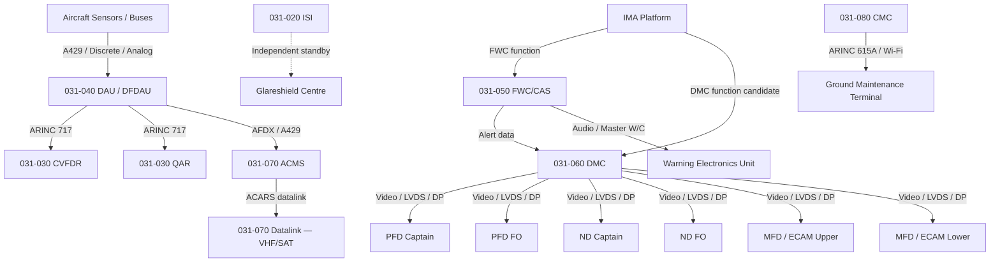
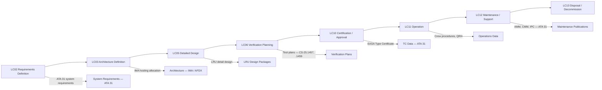

# 031-000 — Indicating and Recording Systems — General
### [PROGRAMME-AIRCRAFT] [PROGRAMME-VARIANT] · ATA 31 · Q+ATLANTIDE ATLAS Scaffold

---

## §0 Hyperlink Policy

All internal links in this document use relative paths from the current directory. External regulatory and standards references use anchor links defined in [§20 References](#20-references). Links marked **TBD** indicate targets not yet allocated within the CSDB or ATLAS hierarchy. Programme-level links traverse five directory levels (`../../../../../`) to reach the repository root. No absolute URLs are used for internal navigation.

---

## §1 Purpose

This document defines the agnostic ATLAS standard-level architecture context for `031-000 — Indicating and Recording Systems — General`.

It describes the controlled scope, functions, interfaces, safety considerations, lifecycle traceability, and S1000D/CSDB mapping logic that programme implementations shall instantiate when this node is applicable.

This document is not a programme design baseline. Programme-specific capacities, locations, part numbers, effectivity, operating limits, maintenance references, and data module codes shall be defined only inside the applicable programme implementation branch.
## §2 Applicability

| Applicability Level | Rule |
|---|---|
| Standard taxonomy | Applies to the ATLAS node `<NODE>` |
| Programme implementation | Conditional; determined by programme architecture, trade studies, certification basis, and applicability model |
| Product configuration | Defined in the programme-specific configuration baseline |
| Effectivity | Defined in the programme CSDB / applicability layer |
| Non-applicability | Must be explicitly stated in the programme impact-study branch when excluded |
## §3 System / Function Overview

ATA 31 on the [PROGRAMME-AIRCRAFT] [PROGRAMME-VARIANT] encompasses all systems responsible for acquiring, processing, displaying, recording, and transmitting flight and systems data to the crew, maintenance personnel, and ground operations. The architecture is fully digital with no analogue electromechanical display units on the primary instrument panel, consistent with current-generation glass-cockpit transport-category aircraft.

The IMA platform hosts several ATA 31 software functions — notably the Flight Warning Computer (FWC) function and potentially the DAU and ACMS functions — reducing physical LRU count while increasing integration complexity management requirements. The AFDX (Avionics Full Duplex Switched Ethernet, ARINC 664 Part 7) data network provides the primary interconnect between IMA, DMC, and display units, supplemented by ARINC 429 for legacy sensor interfaces.

A key [PROGRAMME-VARIANT]-specific consideration is the integration of electric propulsion monitoring parameters into the ATA 31 data acquisition, display, and recording functions. Battery State of Charge (SoC), motor torque and speed, inverter efficiency, and thermal management data are all fed into the DAU, displayed on ECAM system pages, recorded by the FDR (as supplementary parameters), and monitored by ACMS for trend analysis and predictive maintenance.

---

## §4 Scope

### 4.1 Included
- All primary flight deck display units (PFD, ND, MFD/ECAM) and their driving computers (DMC)
- Integrated Standby Instrument (ISI) — independent of main avionics bus
- Combined CVFDR (Flight Data Recorder + Cockpit Voice Recorder) and QAR
- Digital Flight Data Acquisition Unit (DFDAU/DAU) including parameter list management
- Flight Warning Computer (FWC) / Crew Alerting System (CAS) with ECAM integration
- Aircraft Condition Monitoring System (ACMS) and ACARS datalink reporting
- Central Maintenance Computer (CMC) / Onboard Maintenance System (OMS)
- S1000D CSDB mapping and publication traceability for ATA 31

### 4.2 Excluded
- Navigation sensors (ADIRU, ILS, TCAS, WXR) — covered by ATA 34
- Auto-flight computers (AFCS, FMS) — covered by ATA 22
- Communication systems (VHF, SATCOM hardware) — covered by ATA 23
- Aircraft Networks and Information Systems (EFB host, cabin IFE) — covered by ATA 46
- Central Maintenance System software when classified under ATA 45
- Electrical power generation and distribution — covered by ATA 24

---

## §5 Architecture Description

- **IMA-centric design**: Multiple ATA 31 functions (FWC, DAU, ACMS) are candidates for IMA hosting, reducing hardware LRU count.
- **AFDX backbone**: Primary data network (ARINC 664 Part 7) interconnects IMA, DMC, FMS, FWC, and display units at 100 Mbps full-duplex.
- **ARINC 429 legacy interface**: Retained for sensors and LRUs not yet migrated to AFDX (ADIRU outputs, ISI inputs, legacy transponders).
- **Dual/triple DMC redundancy**: Each DMC can drive any display unit in reversionary mode, ensuring no single-point loss of all flight information.
- **CVFDR aft-fuselage mounting**: Crash-survivable recorder positioned in the aft fuselage cone, per ED-112A structural and thermal survivability requirements.
- **Solid-state QAR**: Supplementary recorder accessible on ground via ARINC 615A data loader interface or wireless AGDL link.
- **Wireless ground link**: CMC data accessible to ground maintenance via certified Wi-Fi or AGDL interface, reducing turnaround time.
- **Electric propulsion integration**: Battery, motor, and inverter parameters added to DAU acquisition list and ECAM system pages beyond conventional ATA 31 scope.

---

## §6 Functional Breakdown

| Function ID | Function Title | Description | Applicable Subsystem |
|---|---|---|---|
| F-001 | Flight Deck Indicating and Control Panels | PFD, ND, MFD/ECAM display units; MCP/FCU; OHP | 031-010 |
| F-002 | Standby Instruments | ISI providing standby attitude, airspeed, altitude; standby compass | 031-020 |
| F-003 | Recording Systems | CVFDR (FDR+CVR), QAR, crash-survivable memory, ULB | 031-030 |
| F-004 | Data Acquisition and Concentration | DFDAU/DAU — ARINC 429/discrete/analog → ARINC 717 for FDR | 031-040 |
| F-005 | Central Warning, Caution, and Advisory | FWC/CAS — alert detection, classification, inhibition, ECAM | 031-050 |
| F-006 | Electronic Display and Indication Systems | DMC — symbol generation, display management, reversionary mode | 031-060 |
| F-007 | Automatic Data Reporting and ACMS | ACMS, ACARS datalink, exceedance detection, predictive maintenance | 031-070 |
| F-008 | Maintenance Recording and Diagnostic Interfaces | CMC/OMS — BITE consolidation, fault history, ARINC 615A | 031-080 |
| F-009 | S1000D CSDB Mapping and Traceability | SNS allocation, DMC codes, DMRL, BREX, publication hierarchy | 031-090 |

---

## §7 System Context Diagram

```mermaid
flowchart LR
    AC[[PROGRAMME-AIRCRAFT] [PROGRAMME-VARIANT] Aircraft] --> ATA31[ATA 31 — Indicating & Recording]
    ATA31 --> SUB010[031-010 Flight Deck Panels]
    ATA31 --> SUB020[031-020 Standby Instruments]
    ATA31 --> SUB030[031-030 Recording Systems]
    ATA31 --> SUB040[031-040 Data Acquisition]
    ATA31 --> SUB050[031-050 Warning/Caution/Advisory]
    ATA31 --> SUB060[031-060 Electronic Display]
    ATA31 --> SUB070[031-070 ACMS/ACARS]
    ATA31 --> SUB080[031-080 Maintenance Recording]
    ATA31 --> SUB090[031-090 S1000D Mapping]
    ATA24[ATA 24 Electrical Power] -->|HVDC / 28VDC power| ATA31
    ATA34[ATA 34 Navigation] -->|ADIRU, FMS, TCAS, ILS data| ATA31
    ATA22[ATA 22 Auto-Flight] -->|AFCS modes, AP status| ATA31
    ATA45[ATA 45 Maintenance System] -->|CMC boundary / BITE data| ATA31
    ATA49[ATA 49 APU / Ground Power] -->|Ground power for recorders| ATA31
    ATA71[ATA 71 Propulsion] -->|Motor/battery/inverter data| ATA31
    ATA31 -->|ACARS reports| GND[Ground Station / Airline Ops]
```

---

## §8 Internal Functional Architecture



---

## §9 Lifecycle Traceability



---

## §10 Interfaces

| Interface ID | System / Chapter | Interface Type | Data / Signal | Direction | Status |
|---|---|---|---|---|---|
| IF-031-001 | ATA 22 Auto-Flight | AFDX / ARINC 429 | AP/FD modes, FCU selections | ATA22 → ATA31 |  |
| IF-031-002 | ATA 24 Electrical Power | 28VDC / 115VAC / HVDC | Display power, recorder power | ATA24 → ATA31 |  |
| IF-031-003 | ATA 34 Navigation | ARINC 429 / AFDX | ADIRU air data, IRS attitude, FMS route | ATA34 → ATA31 |  |
| IF-031-004 | ATA 45 Maintenance | AFDX / ARINC 429 | BITE data to CMC | All ATA → ATA31-080 |  |
| IF-031-005 | ATA 49 APU | Discrete | Ground power available signal | ATA49 → ATA31 |  |
| IF-031-006 | ATA 71 Propulsion | AFDX / ARINC 429 | Motor torque, speed, battery SoC, inverter temp | ATA71 → ATA31 |  |
| IF-031-007 | ACARS / SATCOM | VHF datalink / RF | ACMS reports, maintenance pre-notification | ATA31 ↔ Ground |  |
| IF-031-008 | ATA 23 Communications | VHF ACARS bus | ACARS message formatting and transmission | ATA31 → ATA23 |  |

---

## §11 Operating Modes

| Mode ID | Mode Name | Description | Entry Condition | Exit Condition |
|---|---|---|---|---|
| OM-001 | Normal Display | All DMC and display units operational; all recording active | Power-on, all LRUs healthy | Any LRU failure or crew action |
| OM-002 | Degraded Display | One DMC failed; remaining DMC drives all displays in reversionary layout | DMC failure detected | DMC restored or manual reset |
| OM-003 | Standby Instrument | Main displays failed; ISI is primary flight reference; audio alerts via WEU | All main displays failed | Main displays restored |
| OM-004 | Ground / Maintenance | Aircraft on ground; all systems testable; CMC accessible; QAR downloadable | Weight-on-wheels + ground power | Engine start / flight mode |
| OM-005 | Recording Active | FDR and CVR recording; triggered by power-up, maintained through flight | Any electrical power | Intentional stop (CVR erase on ground) |

---

## §12 Monitoring and Diagnostics

All ATA 31 LRUs incorporate continuous Built-In Test Equipment (BITE) functions. The FWC (IMA-hosted) monitors its own software partition health via IMA health monitoring. The CMC consolidates BITE reports from all ATA 31 LRUs and all other aircraft systems. Diagnostic data is stored in non-volatile memory within each LRU and retrieved by the CMC via ARINC 429 or AFDX maintenance bus.

The display system incorporates display integrity monitoring: each DMC monitors the output signal integrity of connected display units. A failed display unit triggers an automatic reversionary switching sequence. The FDR includes its own continuous self-test, and a recorder status message is provided to the CMC and (in case of FDR failure) to the ECAM CAS as a caution alert per CS-25.1459(a)(4).

---

## §13 Maintenance Concept

ATA 31 LRUs are designed for Line Maintenance (Line Replaceable Units — LRU) replacement at Level 1/2 maintenance. Display units and the ISI are shelf-mounted with standard connectors. The CVFDR is accessible via an aft fuselage access panel. The QAR is accessed for data download via the ARINC 615A ground interface panel or wireless AGDL.

Software updates for IMA-hosted ATA 31 functions (FWC, DAU, ACMS) are performed via the ARINC 615A data loader or the wireless ground link under CMC control, with part number verification enforced. Scheduled maintenance tasks include: periodic test of recorder independence (per CS-25.1459), ISI battery test (annual or per AMM interval), and ULB battery replacement per manufacturer specification.

---

## §14 S1000D / CSDB Mapping

### 14.1 SNS to DMC Mapping

| SNS Code | Subsubject Title | DMC Prefix | Info Codes Planned | DMRL Status |
|---|---|---|---|---|
| 031-00 | General | DMC-<PROGRAMME>-<VARIANT>-031-00 | 040, 300, 400 |  |
| 031-10 | Flight Deck Indicating & Control Panels | DMC-<PROGRAMME>-<VARIANT>-031-10 | 040, 300, 400, 520, 720 |  |
| 031-20 | Standby Instruments | DMC-<PROGRAMME>-<VARIANT>-031-20 | 040, 300, 400, 520, 720 |  |
| 031-30 | Recording Systems | DMC-<PROGRAMME>-<VARIANT>-031-30 | 040, 300, 400, 520, 720, 941 |  |
| 031-40 | Data Acquisition & Concentration | DMC-<PROGRAMME>-<VARIANT>-031-40 | 040, 300, 400, 520, 720 |  |
| 031-50 | Central Warning, Caution & Advisory | DMC-<PROGRAMME>-<VARIANT>-031-50 | 040, 300, 400, 520 |  |
| 031-60 | Electronic Display & Indication | DMC-<PROGRAMME>-<VARIANT>-031-60 | 040, 300, 400, 520, 720 |  |
| 031-70 | Automatic Data Reporting & ACMS | DMC-<PROGRAMME>-<VARIANT>-031-70 | 040, 300, 400, 520 |  |
| 031-80 | Maintenance Recording & Diagnostics | DMC-<PROGRAMME>-<VARIANT>-031-80 | 040, 300, 400, 520 |  |
| 031-90 | S1000D CSDB Mapping | DMC-<PROGRAMME>-<VARIANT>-031-90 | 040 |  |

### 14.2 Information Code Definitions

| Info Code | Description | Applicable to ATA 31 |
|---|---|---|
| 040 | Description (system description, function) | All SNS |
| 300 | Operation (normal, abnormal, emergency procedures) | 031-10, 031-20, 031-30, 031-50, 031-60 |
| 400 | Maintenance procedures (inspection, test, adjustment) | All SNS |
| 520 | Troubleshooting (fault isolation) | 031-10, 031-20, 031-30, 031-40, 031-50, 031-60, 031-70, 031-80 |
| 720 | Removal and installation | 031-10, 031-20, 031-30, 031-40, 031-60 |
| 941 | Illustrated Parts Data (IPD) | 031-30 |

---

## §15 Footprints

### 15.1 Physical Footprint
- PFD/ND/MFD display units: Instrument panel cut-outs per ARINC 600 / programme-defined bezel dimensions
- CVFDR: Aft fuselage mounting location (Zone 318, TBD), access panel aft pressure bulkhead
- QAR: Avionics bay, standard ARINC 600 rack position, 3-MCU form factor (TBD)
- ISI: Glareshield centre panel, self-illuminated, independent mounting

### 15.2 Electrical / Data Footprint
- Power: 28VDC essential bus (display units, ISI), 28VDC hot battery bus (CVFDR independent power), HVDC feed via PDU for IMA platform
- Data: AFDX (ARINC 664 Pt7) — 100 Mbps to display units and IMA; ARINC 429 — high-speed (100 kbps) and low-speed (12.5 kbps) for sensors; ARINC 717 — recorder data bus (1024 or 2048 wps)

### 15.3 Maintenance Footprint
- Line maintenance LRU replacement: display units (tool-free quick-release per programme), CVFDR (standard aft access), QAR (avionics bay access)
- Ground support equipment: ARINC 615A data loader, portable maintenance terminal (MCDU or EFB)
- Scheduled maintenance intervals: per programme AMM Task Cards (TBD per MRB)

### 15.4 Data Footprint
- FDR retention: minimum 25 hours of flight data (per CS-25.1459)
- CVR retention: minimum 2 hours of audio (per CS-25.1457)
- QAR: high-capacity solid-state storage, minimum 2000 hours or per airline requirement
- CMC fault history: minimum 1000 fault messages with flight phase context
- ACMS: solid-state storage, volume TBD per programme ACMS data requirements

---

## §16 Safety and Certification Considerations

| Requirement | Source | Description | Compliance Approach | Status |
|---|---|---|---|---|
| CS-25.1301 | EASA CS-25 | Function and installation — all instruments must perform their intended function | LRU qualification per DO-160G; software per DO-178C |  |
| CS-25.1303 | EASA CS-25 | Flight and navigation instruments — pilot's panel mandatory set | PFD design compliance (airspeed, altitude, attitude, heading) |  |
| CS-25.1307 | EASA CS-25 | Standby instruments — independent of main avionics bus | ISI with independent battery and separate pitot-static |  |
| CS-25.1322 | EASA CS-25 | Warning, caution, and advisory lights — priority and inhibition | FWC/CAS design per SAE ARP 4102/7 |  |
| CS-25.1457 | EASA CS-25 | Cockpit Voice Recorder — 2-hour minimum, 4-channel audio | CVFDR certification per ED-112A |  |
| CS-25.1459 | EASA CS-25 | Flight Data Recorder — 25-hour minimum, 88+ parameters | CVFDR and DFDAU qualification |  |

---

## §17 Verification and Validation

| V&V ID | Requirement | Method | Success Criterion | Status |
|---|---|---|---|---|
| VV-031-001 | CS-25.1303 — flight instruments | Analysis + Ground Test + Flight Test | All mandatory parameters displayed correctly on PFD |  |
| VV-031-002 | CS-25.1307 — standby instruments | Analysis + Ground Test | ISI operates independently on battery power with all main avionics off |  |
| VV-031-003 | CS-25.1457 — CVR | Analysis + Ground Test | 2-hour audio retention verified; 4-channel confirmed |  |
| VV-031-004 | CS-25.1459 — FDR | Analysis + Ground Test | 25-hour retention, 88+ parameters, accuracy per spec |  |
| VV-031-005 | CS-25.1322 — CAS alerts | Analysis + Simulation + Flight Test | Alert priority, inhibition, and audio levels verified |  |
| VV-031-006 | Reversionary display mode | Ground Test + Flight Test | Loss of one DMC results in correct reversionary display within 1 s |  |

---

## §18 Glossary

| Term | Acronym | Definition |
|---|---|---|
| Integrated Modular Avionics | IMA | Shared computing platform hosting multiple avionics software applications on common hardware modules |
| Display Management Computer | DMC | Computer responsible for symbol generation and routing of display data to cockpit display units |
| Primary Flight Display | PFD | Main cockpit display showing attitude, airspeed, altitude, vertical speed, and flight director |
| Navigation Display | ND | Cockpit display showing horizontal situation, route, terrain, weather, and traffic data |
| Multifunction Display | MFD | Cockpit display used for system synoptic pages, ECAM messages, and flight information |
| Electronic Centralised Aircraft Monitor | ECAM | System monitoring and alerting function displaying system status and crew alert messages |
| Flight Warning Computer | FWC | Computer (or IMA function) that processes system data and generates crew alerts |
| Crew Alerting System | CAS | The complete system for detecting, classifying, and displaying alerts to the crew |
| Flight Data Recorder | FDR | Crash-survivable device recording flight parameters per regulatory requirements |
| Cockpit Voice Recorder | CVR | Crash-survivable device recording cockpit audio per regulatory requirements |
| Combined CVFDR | CVFDR | Single LRU combining FDR and CVR functions in one crash-survivable unit |
| Quick Access Recorder | QAR | Non-crash-survivable recorder providing easy-access flight data for operational monitoring |
| Digital Flight Data Acquisition Unit | DFDAU/DAU | Unit that acquires and concentrates sensor data and formats it for the FDR |
| Aircraft Condition Monitoring System | ACMS | System that monitors aircraft parameters and generates operational and maintenance reports |
| Aircraft Communication Addressing and Reporting System | ACARS | Datalink system for transmitting short messages between aircraft and ground stations |
| Central Maintenance Computer | CMC | Computer consolidating BITE data from all aircraft systems for maintenance personnel |
| Integrated Standby Instrument | ISI | Independent standby unit providing attitude, airspeed, and altitude with own power supply |
| Underwater Locator Beacon | ULB | Acoustic beacon attached to recorders that activates on water immersion |
| Avionics Full Duplex Switched Ethernet | AFDX | Deterministic Ethernet network (ARINC 664 Part 7) used as primary avionics data bus |
| State of Charge | SoC | Battery charge level expressed as a percentage of total capacity |

---

## §19 Citations

| Citation ID | Source | Title / Description | Relevance |
|---|---|---|---|
| CIT-031-001 | EASA | CS-25 Book 1, Subpart F — Equipment | Primary certification standard for ATA 31 |
| CIT-031-002 | EUROCAE | ED-12C (DO-178C) — Software Considerations in Airborne Systems | Applicable to all ATA 31 software functions |
| CIT-031-003 | EUROCAE | ED-14G (DO-160G) — Environmental Conditions and Test Procedures | Applicable to all ATA 31 LRU qualification |
| CIT-031-004 | EUROCAE | ED-112A — Minimum Operational Performance Specification for Crash Protected Airborne Recorder Systems | CVFDR qualification standard |
| CIT-031-005 | SAE | ARP 4102/7 — Flight Deck Alerting System | CAS/FWC design guidance |
| CIT-031-006 | ARINC | ARINC 664 Part 7 — Aircraft Data Network (AFDX) | Avionics network standard |
| CIT-031-007 | ARINC | ARINC 717 — Flight Data Recorder System | FDR data bus standard |
| CIT-031-008 | ICAO | Annex 6 — Operation of Aircraft (FDR/CVR requirements) | Operational regulatory basis |

---

## §20 References

| Ref ID | Document | Title | Version / Date | Link |
|---|---|---|---|---|
| REF-031-001 | EASA CS-25 | Certification Specifications for Large Aeroplanes | Amendment 27 | [CS-25](https://www.easa.europa.eu/document-library/certification-specifications/cs-25) |
| REF-031-002 | EUROCAE ED-12C | Software Considerations in Airborne Systems and Equipment Certification | 2011 | [ED-12C](https://eurocae.net/) |
| REF-031-003 | EUROCAE ED-14G | Environmental Conditions and Test Procedures for Airborne Equipment | 2012 | [ED-14G](https://eurocae.net/) |
| REF-031-004 | EUROCAE ED-112A | Minimum Operational Performance Specification for Crash Protected Airborne Recorder Systems | 2013 | [ED-112A](https://eurocae.net/) |
| REF-031-005 | SAE ARP 4102/7 | Aerospace Recommended Practice — Flight Deck Alerting System | 2014 | [ARP 4102](https://www.sae.org/) |
| REF-031-006 | ARINC 717 | Flight Data Recorder System | 2003 | [ARINC 717](https://aviation-ia.com/) |
| REF-031-007 | ARINC 664 Pt7 | Aircraft Data Network — Avionics Full Duplex Switched Ethernet | 2009 | [ARINC 664](https://aviation-ia.com/) |
| REF-031-008 | ICAO Annex 6 | Operation of Aircraft — Part I | 12th Edition | [ICAO Annex 6](https://www.icao.int/) |
| REF-031-009 | S1000D | International Specification for Technical Publications | Issue 5.0 | [S1000D](https://s1000d.org/) |

---

## §21 Open Issues

| Issue ID | Description | Owner | Priority | Target Date | Status |
|---|---|---|---|---|---|
| OI-031-001 | IMA hosting allocation for FWC function — DAL B partition sizing and SWaP not yet defined | Systems Architect | High | LC03 |  |
| OI-031-002 | DAL assignment for display management software (DMC) — pending FHA for loss-of-all-display scenario | Safety Engineer | High | LC03 |  |
| OI-031-003 | Electric propulsion parameter list for FDR supplement — not yet defined; requires coordination with ATA 71/80 | Systems Engineer | High | LC05 |  |
| OI-031-004 | CSDB tool selection for ATA 31 publications — procurement not yet initiated | Publications Manager | Medium | LC05 |  |
| OI-031-005 | Wireless ground maintenance link standard (AGDL vs Wi-Fi) — not yet decided | Avionics Architect | Medium | LC03 |  |
| OI-031-006 | BREX document for ATA 31 publications not yet created | S1000D Data Manager | Medium | LC05 |  |

---

## §22 Change Log

| Revision | Date | Author | Description of Change |
|---|---|---|---|
| 0.1.0 | 2026-05-09 | ATLAS Scaffold Generator | Initial scaffold creation — all sections populated with programme-specific content; marked DRAFT |

 This document is a programme-controlled scaffold. All content is subject to review by the responsible system expert before formal issue.
