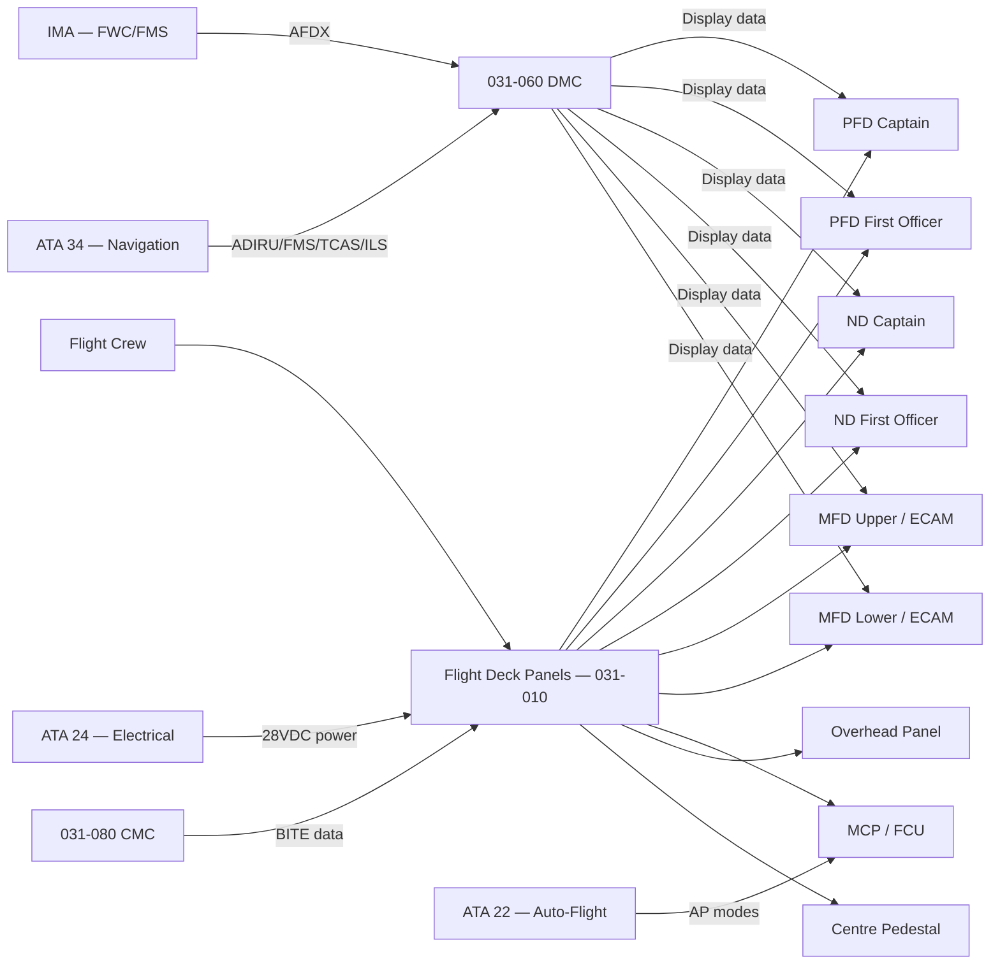
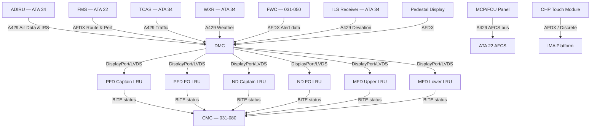
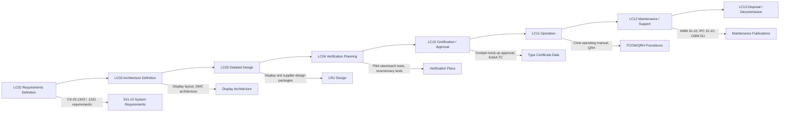

# 031-010 — Flight Deck Indicating and Control Panels
### [PROGRAMME-AIRCRAFT] [PROGRAMME-VARIANT] · ATA 31 · Q+ATLANTIDE ATLAS Scaffold

---

## §0 Hyperlink Policy

All internal links use relative paths from the current directory. External regulatory and standards references use anchor links defined in [§20 References](#20-references). Links marked **TBD** indicate targets not yet allocated. Programme-level links traverse five directory levels (`../../../../../`). No absolute URLs are used for internal navigation.

---

## §1 Purpose

This document defines the agnostic ATLAS standard-level architecture context for `031-010 — Flight Deck Indicating and Control Panels`.

It describes the controlled scope, functions, interfaces, safety considerations, lifecycle traceability, and S1000D/CSDB mapping logic that programme implementations shall instantiate when this node is applicable.

This document is not a programme design baseline. Programme-specific capacities, locations, part numbers, effectivity, operating limits, maintenance references, and data module codes shall be defined only inside the applicable programme implementation branch.
## §2 Applicability

| Applicability Level | Rule |
|---|---|
| Standard taxonomy | Applies to the ATLAS node `<NODE>` |
| Programme implementation | Conditional; determined by programme architecture, trade studies, certification basis, and applicability model |
| Product configuration | Defined in the programme-specific configuration baseline |
| Effectivity | Defined in the programme CSDB / applicability layer |
| Non-applicability | Must be explicitly stated in the programme impact-study branch when excluded |
## §3 System / Function Overview

The flight deck display and control panel system provides the crew with all information necessary to operate the aircraft safely in all phases of flight. PFDs present the primary flight parameters (attitude direction indicator / ADI, airspeed indicator / ASI, altitude, vertical speed, flight director commands, ILS deviations, and auto-flight mode annunciations) in a standardised format compliant with CS-25.1303. The Navigation Displays present the horizontal situation (moving map, programmed route, traffic, terrain, and weather overlay).

The two MFD/ECAM displays function as system monitoring screens, presenting engine/propulsion data (upper ECAM position), system synoptic pages (hydraulic, fuel, electric, ECS, flight controls, propulsion), and crew alerting messages from the Flight Warning Computer (FWC). The lower ECAM additionally serves as a flexible multifunction page for weather radar display, performance calculations, and maintenance messages when the aircraft is on ground.

The MCP/FCU panel on the glareshield provides direct mode selection for the auto-flight system (altitude, speed, heading/track, vertical speed, and approach mode engagement). This panel is a high-criticality component subject to CS-25.1302 (Installed Systems and Equipment for Use by the Flightcrew) and must provide clear mode feedback to prevent mode confusion. The final configuration (physical panel vs glass-panel FCU) is pending the human factors evaluation.

---

## §4 Scope

### 4.1 Included
- PFD display unit LRU (×2): captain and first officer instrument panels
- ND display unit LRU (×2): captain and first officer instrument panels
- MFD/ECAM upper display unit LRU (×1): centre instrument panel upper position
- MFD/ECAM lower display unit LRU (×1): centre instrument panel lower position
- MCP/FCU glareshield panel: auto-flight mode selection and target value setting
- OHP touch module (or conventional panel — TBD): systems management, lighting, and annunciators
- Centre pedestal display module: propulsion/thrust management, secondary system controls
- Display unit power distribution panels and bezel assemblies
- Annunciator light LRUs (master warning, master caution, fire handles, gear indicators)

### 4.2 Excluded
- Display Management Computer (DMC) — covered under 031-060
- Flight Warning Computer / CAS function — covered under 031-050
- FMS / MCDU display interface — covered under ATA 22
- Navigation sensors feeding display — covered under ATA 34
- ADIRU computers — covered under ATA 34
- Standby Instrument (ISI) — covered under 031-020

---

## §5 Architecture Description

- **Six-screen glass cockpit**: 2× PFD, 2× ND, 2× MFD/ECAM driven by redundant DMCs via AFDX / DisplayPort-class interface
- **AMLCD technology**: Active Matrix Liquid Crystal Display, minimum 6×8 inch (TBD — supplier dependent), high-brightness (1500 nit minimum) for sunlight readability
- **Wide viewing angle**: minimum ±60° horizontal, ±30° vertical for shared crew view
- **Automatic brightness control**: ambient light sensor per display unit with fail-safe to manual mode
- **Reversionary capability**: any DMC can drive any display unit; automatic switchover on LRU failure within 1 second
- **Touch-OHP module (TBD)**: projected-capacitive touch LCD for overhead panel; conventional discrete push-button as fallback if human factors study requires
- **MCP/FCU**: dedicated hardware panel on glareshield with tactile rotary selectors and push-button mode engagement; or glass-panel FCU (TBD)
- **AFDX interconnect**: display data routed over ARINC 664 Part 7 network from DMC to display units; ARINC 429 for legacy FCU/autopilot interfaces
- **Electric propulsion ECAM page**: dedicated synoptic page for battery SoC, motor output, inverter status, and charging state (novel vs conventional ECAM layout)

---

## §6 Functional Breakdown

| Function ID | Function Title | Description | Applicable Subsystem |
|---|---|---|---|
| F-001 | PFD Display and ADI/ASI/ALT Presentation | Presents attitude, airspeed, altitude, VSI, flight director, and ILS deviation to each pilot | PFD display unit, DMC |
| F-002 | ND Display and Horizontal Situation | Presents moving map, route, terrain, weather, and traffic (TCAS) to each pilot | ND display unit, DMC |
| F-003 | ECAM Upper System Monitoring | Presents propulsion parameters (upper half) and alert summary; driven from FWC | MFD upper display, DMC, FWC |
| F-004 | ECAM Lower Synoptic Page Management | Presents selected system synoptic pages and crew alerting procedure text | MFD lower display, DMC |
| F-005 | MCP/FCU Mode Selection | Provides crew interface for auto-flight altitude, speed, heading, vertical speed selection | MCP/FCU panel, ATA 22 AFCS |
| F-006 | OHP Panel Annunciator and System Switch | Controls aircraft systems via overhead panel switches or touch module; annunciates system states | OHP module |
| F-007 | Centre Pedestal Engine/System Display | Presents propulsion management controls and secondary system status | Pedestal display, DMC |
| F-008 | BITE and Panel Fault Detection | Continuous self-monitoring of display units, MCP, OHP; reports to CMC | All display LRUs, CMC |

---

## §7 System Context Diagram

---

## §8 Internal Functional Architecture

---

## §9 Lifecycle Traceability

---

## §10 Interfaces

| Interface ID | System / Chapter | Interface Type | Data / Signal | Direction | Status |
|---|---|---|---|---|---|
| IF-031-010-001 | ATA 22 Auto-Flight (AFCS) | ARINC 429 | Auto-pilot modes, FD command bars, altitude/speed/heading targets | ATA22 ↔ ATA31 |  |
| IF-031-010-002 | ATA 22 FMS | AFDX | Route data, VNAV profile, performance data for ND and PFD | ATA22 → ATA31 |  |
| IF-031-010-003 | ATA 24 Electrical | 28VDC | Display unit and panel power supply | ATA24 → ATA31 |  |
| IF-031-010-004 | ATA 27 Flight Controls | ARINC 429 / Discrete | Spoiler/flap/slat position for PFD indication | ATA27 → ATA31 |  |
| IF-031-010-005 | ATA 34 ADIRU | ARINC 429 | Air data (CAS, altitude, VSI) and inertial (attitude, heading) | ATA34 → ATA31 |  |
| IF-031-010-006 | ATA 34 TCAS | ARINC 429 | Traffic advisories and resolution advisories for ND/PFD | ATA34 → ATA31 |  |
| IF-031-010-007 | ATA 34 ILS/VOR | ARINC 429 | ILS deviation for PFD display | ATA34 → ATA31 |  |
| IF-031-010-008 | 031-050 FWC | AFDX | Crew alerting messages and alert state for ECAM display | 031-050 → ATA31 |  |
| IF-031-010-009 | 031-060 DMC | AFDX / DisplayPort | Formatted symbol data to display units | 031-060 → ATA31 |  |
| IF-031-010-010 | 031-080 CMC | ARINC 429 / AFDX | BITE status from display units to CMC | ATA31 → 031-080 |  |

---

## §11 Operating Modes

| Mode ID | Mode Name | Description | Entry Condition | Exit Condition |
|---|---|---|---|---|
| OM-001 | Normal | All 6 display units active; all data sources feeding correctly; full information presented | Power-on, all LRUs healthy | Any failure or crew action |
| OM-002 | Reversionary (one DMC failed) | Remaining DMC drives all displays in a predefined reversionary layout prioritising flight data | DMC failure detected (< 1 s auto) | DMC restored / crew resets |
| OM-003 | Single Display Unit Failed | DMC redistributes pages across remaining 5 displays; crew alert generated | Display unit BITE failure | Display unit replaced |
| OM-004 | Manual Brightness | Crew manually controls brightness of individual displays via DCP | Crew selects manual brightness | Auto mode reselected |
| OM-005 | Standby | Main displays all failed; ISI is primary reference; audio alerts via WEU | All 6 DU BITE failures | Aircraft on ground, power restored |

---

## §12 Monitoring and Diagnostics

Each display unit incorporates continuous BITE monitoring of its own video interface, backlight, and touchscreen (where fitted). Faults are transmitted to the CMC via ARINC 429 or AFDX within 2 seconds of fault detection. The DMC monitors the video output integrity of each display unit and triggers automatic reversionary mode upon detection of a display unit failure. An ECAM caution is generated for any display unit failure in flight. The OHP touch module reports touchscreen fault status to the CMC; a failed OHP module results in the crew using the physical backup controls where provided per the design (TBD per OHP architecture decision).

---

## §13 Maintenance Concept

Display units are Line Replaceable Units (LRU) with quick-release panel mounting (tool-free, TBD per supplier standard). No calibration is required after replacement — the DMC downloads display unit configuration automatically upon power-up. The MCP/FCU is an LRU replaced at line maintenance with connector removal only. The OHP module (if touch-screen type) is LRU-replaced via standard panel disconnection. Post-replacement BIT test is initiated via the CMC. Software updates to display unit firmware are performed via the ARINC 615A data loader under CMC control. Planned maintenance tasks include periodic brightness check per AMM interval (TBD) and visual inspection of display bezel and panel surface.

---

## §14 S1000D / CSDB Mapping

### 14.1 SNS to DMC Mapping

| SNS Code | Subsubject | DMC Prefix | Info Codes Planned | DMRL Status |
|---|---|---|---|---|
| 031-10 | Flight Deck Indicating & Control Panels | DMC-<PROGRAMME>-<VARIANT>-031-10 | 040, 300, 400, 520, 720 |  |
| 031-10-01 | PFD Display Units | DMC-<PROGRAMME>-<VARIANT>-031-10-01 | 040, 720, 941 |  |
| 031-10-02 | ND Display Units | DMC-<PROGRAMME>-<VARIANT>-031-10-02 | 040, 720, 941 |  |
| 031-10-03 | MFD/ECAM Display Units | DMC-<PROGRAMME>-<VARIANT>-031-10-03 | 040, 720, 941 |  |
| 031-10-04 | MCP/FCU Panel | DMC-<PROGRAMME>-<VARIANT>-031-10-04 | 040, 300, 400, 720 |  |
| 031-10-05 | Overhead Panel Module | DMC-<PROGRAMME>-<VARIANT>-031-10-05 | 040, 300, 400, 720 |  |

### 14.2 Information Code Definitions (031-10)

| Info Code | Description | Notes |
|---|---|---|
| 040 | System description — display layout, LRU list, architecture | For AMM and FCOM basis |
| 300 | Operation — normal operation, reversionary procedures, brightness control | For FCOM / QRH |
| 400 | Maintenance — periodic inspection, functional test | For AMM |
| 520 | Troubleshooting — fault code interpretation, display fault isolation | For FRM / TSM |
| 720 | Removal and installation — LRU R&R procedures | For AMM |

---

## §15 Footprints

### 15.1 Physical Footprint
- PFD: 2 units, centre instrument panel, captain and FO positions; bezel dimensions TBD (target 8×10 inch active area)
- ND: 2 units, outboard instrument panel positions; same form factor as PFD (TBD)
- MFD/ECAM: 2 units, centre pedestal forward; dimensions TBD
- MCP/FCU: glareshield centre panel; width spans full glareshield between PFDs (TBD)
- OHP: full overhead panel surface; touch-module configuration TBD

### 15.2 Electrical / Data Footprint
- Power: 28VDC non-essential bus for display units (with automatic load-shedding per CS-25.1309); 28VDC essential bus for at least one PFD per side
- Data: DisplayPort or LVDS from DMC to each display unit; AFDX 100 Mbps for display data from IMA/DMC; ARINC 429 for legacy MCP/AFCS interface
- Weight budget: TBD per supplier selection; target less than 35 kg total for all 6 display units + MCP + OHP

### 15.3 Maintenance Footprint
- Tool-free LRU replacement for display units (target < 15 minutes per unit)
- Avionics bay access not required for flight deck display unit replacement
- OHP module: tool-required panel removal (TBD per design)
- Software load: ARINC 615A or wireless, CMC-controlled, part number verification required

### 15.4 Data Footprint
- Display unit BITE data: stored locally in each DU and transmitted to CMC on request
- Reversionary mode event log: stored in DMC non-volatile memory
- Configuration file: display unit format management data stored in DMC; auto-downloaded to replacement DU on power-up

---

## §16 Safety and Certification Considerations

| Requirement | Source | Description | Compliance Approach | Status |
|---|---|---|---|---|
| CS-25.1301 | EASA CS-25 | All instruments must perform their intended function | LRU qualification per DO-160G, software per DO-178C |  |
| CS-25.1303(b) | EASA CS-25 | Mandatory flight instrument set on each pilot's panel | PFD design — attitude, airspeed, altitude, VSI, heading |  |
| CS-25.1321 | EASA CS-25 | Pilot's field of view — all primary instruments visible without excessive head movement | Cockpit mock-up HF evaluation; FAA ACO review |  |
| CS-25.1302 | EASA CS-25 | Installed systems and equipment for use by flight crew — mode awareness | MCP/FCU human factors evaluation; mode annunciation design |  |
| CS-25.1309 | EASA CS-25 | Equipment, systems, and installations — failure condition analysis | DMC failure analysis; reversionary mode assessment |  |

---

## §17 Verification and Validation

| V&V ID | Requirement | Method | Success Criterion | Status |
|---|---|---|---|---|
| VV-031-010-001 | CS-25.1303 mandatory instrument set | Analysis + Iron Bird + Flight Test | All mandatory PFD parameters correctly displayed in all flight phases |  |
| VV-031-010-002 | CS-25.1321 — pilot field of view | Cockpit mock-up measurement + HF evaluation | All primary instruments within pilot reach and visibility envelope |  |
| VV-031-010-003 | CS-25.1309 — DMC failure | Analysis + Iron Bird test | Loss of one DMC: reversionary within 1 s; no loss of flight info |  |
| VV-031-010-004 | Reversionary mode — display redistribution | Iron Bird + Simulator | Correct page redistribution on single display unit failure |  |
| VV-031-010-005 | OHP touch function accuracy | Ground test | All OHP functions achievable within 1 touch operation in normal crew gloves |  |

---

## §18 Glossary

| Term | Acronym | Definition |
|---|---|---|
| Flight Control Unit | FCU | Panel on glareshield providing auto-flight mode and target value selection (Airbus-style designation) |
| Mode Control Panel | MCP | Panel on glareshield providing auto-flight mode and target value selection (Boeing-style designation) |
| Overhead Panel | OHP | Panel above the crew seats providing systems management controls and annunciators |
| Primary Flight Display | PFD | Main display showing attitude, airspeed, altitude, vertical speed, flight director, and ILS deviation |
| Navigation Display | ND | Display showing horizontal situation, moving map, route, terrain, weather, and traffic |
| Multifunction Display | MFD | Display used for system synoptic pages, ECAM messages, and secondary information |
| Electronic Centralised Aircraft Monitor | ECAM | System monitoring display and crew alerting format |
| Engine Indication and Crew Alerting System | EICAS | Boeing-style equivalent to ECAM |
| Display Management Computer | DMC | Computer that drives and manages cockpit display units |
| Active Matrix Liquid Crystal Display | AMLCD | Display technology used for all [PROGRAMME-VARIANT] cockpit displays |
| Annunciator | — | Discrete indicator light (or touch icon) that informs crew of a system state |
| Reversionary Mode | — | Backup display configuration activated automatically when a primary display unit or DMC fails |
| Display Control Panel | DCP | Panel allowing crew to select display source and adjust brightness |

---

## §19 Citations

| Citation ID | Source | Title / Description | Relevance |
|---|---|---|---|
| CIT-031-010-001 | EASA | CS-25 Subpart F §1303 — Flight and Navigation Instruments | Mandatory instrument set for PFD |
| CIT-031-010-002 | EASA | CS-25 Subpart F §1321 — Arrangement and Visibility | Pilot field of view requirements |
| CIT-031-010-003 | EASA | CS-25 Subpart F §1302 — Installed Systems for Flightcrew Use | MCP/FCU human factors |
| CIT-031-010-004 | EUROCAE | ED-14G (DO-160G) — Environmental Qualification | All display LRU qualification |
| CIT-031-010-005 | EUROCAE | ED-12C (DO-178C) — Software Considerations | DMC and display format management software |

---

## §20 References

| Ref ID | Document | Title | Version | Link |
|---|---|---|---|---|
| REF-031-010-001 | EASA CS-25 | Certification Specifications for Large Aeroplanes | Amdt 27 | [CS-25](https://www.easa.europa.eu/) |
| REF-031-010-002 | EUROCAE ED-14G | Environmental Conditions and Test Procedures for Airborne Equipment | 2012 | [ED-14G](https://eurocae.net/) |
| REF-031-010-003 | EUROCAE ED-12C | Software Considerations in Airborne Systems | 2011 | [ED-12C](https://eurocae.net/) |
| REF-031-010-004 | ARINC 664 Pt7 | Aircraft Data Network — AFDX | 2009 | [ARINC 664](https://aviation-ia.com/) |
| REF-031-010-005 | SAE ARP 5289 | Electronic Cockpit Displays — Qualification | 2016 | [ARP 5289](https://www.sae.org/) |
| REF-031-010-006 | 031-000 | Indicating and Recording Systems — General | 0.1.0 | [031-000](./031-000-Indicating-and-Recording-General.md) |

---

## §21 Open Issues

| Issue ID | Description | Owner | Priority | Target Date | Status |
|---|---|---|---|---|---|
| OI-031-010-001 | OHP touch vs conventional push-button decision pending human factors study | Human Factors Lead | High | LC03 |  |
| OI-031-010-002 | MCP/FCU physical panel vs glass-panel touchscreen FCU decision pending | Avionics Architect | High | LC03 |  |
| OI-031-010-003 | Display unit supplier selection (size: 8×10 vs 6×8 inch) not yet decided | Procurement | High | LC03 |  |
| OI-031-010-004 | Reversionary mode layout definition (which pages on which displays) not yet baselined | Display System Engineer | Medium | LC05 |  |
| OI-031-010-005 | Electric propulsion ECAM synoptic page format definition not started | Systems Engineer | Medium | LC05 |  |

---

## §22 Change Log

| Revision | Date | Author | Description of Change |
|---|---|---|---|
| 0.1.0 | 2026-05-09 | ATLAS Scaffold Generator | Initial scaffold creation — all sections populated; marked DRAFT |

 This document is a programme-controlled scaffold. All content is subject to review by the responsible system expert before formal issue.
