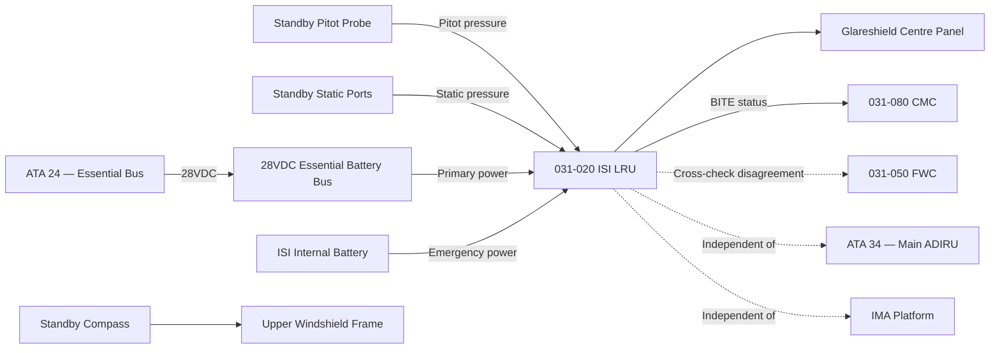
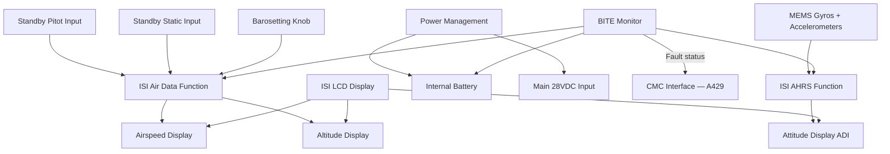
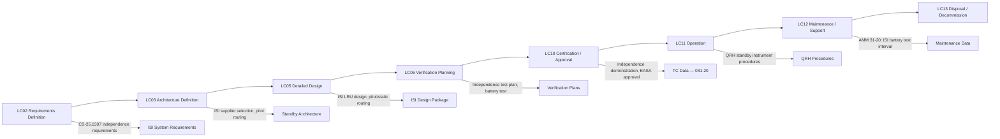

# 031-020 — Independent and Standby Indicating Systems
### [PROGRAMME-AIRCRAFT] [PROGRAMME-VARIANT] · ATA 31 · Q+ATLANTIDE ATLAS Scaffold

---

## §0 Hyperlink Policy

All internal links use relative paths from the current directory. External regulatory and standards references use anchor links defined in [§20 References](#20-references). Links marked **TBD** indicate targets not yet allocated. Programme-level links traverse five directory levels (`../../../../../`). No absolute URLs are used for internal navigation.

---

## §1 Purpose

This document defines the agnostic ATLAS standard-level architecture context for `031-020 — Independent and Standby Indicating Systems`.

It describes the controlled scope, functions, interfaces, safety considerations, lifecycle traceability, and S1000D/CSDB mapping logic that programme implementations shall instantiate when this node is applicable.

This document is not a programme design baseline. Programme-specific capacities, locations, part numbers, effectivity, operating limits, maintenance references, and data module codes shall be defined only inside the applicable programme implementation branch.
## §2 Applicability

| Applicability Level | Rule |
|---|---|
| Standard taxonomy | Applies to the ATLAS node `<NODE>` |
| Programme implementation | Conditional; determined by programme architecture, trade studies, certification basis, and applicability model |
| Product configuration | Defined in the programme-specific configuration baseline |
| Effectivity | Defined in the programme CSDB / applicability layer |
| Non-applicability | Must be explicitly stated in the programme impact-study branch when excluded |
## §3 System / Function Overview

The ISI provides the last-resort flight reference for the crew in the event that all main display units and their driving computers fail. It is the only display that is powered independently of the main avionics network and can operate on battery power alone. The ISI contains its own AHRS (solid-state MEMS gyros and accelerometers), air data computer function (barometric altimeter and airspeed computation from standby pitot/static), and internal LCD display.

The standby compass is a purely passive magnetic instrument, providing heading reference without any electrical power. It is subject to compass swing calibration during aircraft build and after any maintenance that may affect the magnetic environment in its vicinity. Deviation card must be posted adjacent to the compass per regulatory requirements.

A standby radio altimeter display (if required by [PROGRAMME-VARIANT] operational requirements) would be driven by a dedicated radio altimeter receiver separate from the main radio altimeter systems. The need for a dedicated standby radio altimeter display versus relying on the ISI (which does not incorporate a radio altimeter function) is subject to the safety assessment and operational requirements definition currently in progress (see Open Issues).

---

## §4 Scope

### 4.1 Included
- ISI LRU: self-contained AHRS, air data, LCD display, internal battery
- Standby pitot probe (dedicated, separate from main ADC probes)
- Standby static ports (dedicated, separate from main ADC static system)
- Standby magnetic compass (wet or dry type — TBD)
- Standby radio altimeter display (if fitted — TBD)
- ISI internal battery and charger circuit
- ISI mounting tray and glareshield interface

### 4.2 Excluded
- Main ADIRU and ADC — covered under ATA 34
- Main pitot and static system — covered under ATA 34
- Main PFD display units — covered under 031-010
- DMC — covered under 031-060
- Radio altimeter transceivers (main system) — covered under ATA 34

---

## §5 Architecture Description

- **ISI self-containment**: All flight reference functions (AHRS, ADC, display) integrated in one LRU — no dependence on any external computer
- **Independent pitot/static**: Dedicated standby pitot probe and static ports with separate routing to ISI; no cross-connection with main ADC probes
- **Independent power**: ISI powered from 28VDC essential battery bus and internal rechargeable battery (minimum 30 min operation)
- **Battery monitoring**: ISI reports battery charge state to CMC; low battery generates a maintenance advisory
- **Continuous cross-check**: ISI attitude and air data cross-checked against main ADIRU outputs; disagreement triggers crew advisory via FWC
- **Standby compass**: Magnetically compensated wet compass or flux-gate type (TBD); mounted upper windshield frame; deviation card posted
- **ISI display format**: Fixed format (not configurable) — ADI, ASI, altimeter on single LCD panel; crew cannot reformat or select alternative pages

---

## §6 Functional Breakdown

| Function ID | Function Title | Description | Applicable System |
|---|---|---|---|
| F-001 | Standby Attitude (Pitch and Roll) | AHRS-based attitude indication on ISI LCD, independent of main ADIRU | ISI AHRS function |
| F-002 | Standby Airspeed | Air data computation from standby pitot; displayed on ISI LCD | ISI ADC function |
| F-003 | Standby Altitude | Barometric altitude from standby static; baroset knob on ISI | ISI ADC function |
| F-004 | Standby Compass / Heading | Magnetic heading from wet compass or flux-gate compass mounted in windshield frame | Standby compass LRU |
| F-005 | Standby Radio Altitude | Radio altimeter height below ~2500 ft AGL (if standby RA display fitted) | Standby RA display (TBD) |
| F-006 | Independent Power Supply Management | ISI internal battery charge management; monitoring and reporting to CMC | ISI battery subsystem |
| F-007 | ISI BITE and Self-Test | Continuous internal monitoring; crew-initiated ground self-test; BITE fault to CMC | ISI BITE function |

---

## §7 System Context Diagram

---

## §8 Internal Functional Architecture

---

## §9 Lifecycle Traceability

---

## §10 Interfaces

| Interface ID | System / Chapter | Interface Type | Data / Signal | Direction | Status |
|---|---|---|---|---|---|
| IF-031-020-001 | ATA 24 Essential Battery Bus | 28VDC | Primary electrical power to ISI | ATA24 → ISI |  |
| IF-031-020-002 | ATA 34 Standby Pitot | Pneumatic | Standby pitot total pressure | Standby pitot → ISI |  |
| IF-031-020-003 | ATA 34 Standby Static | Pneumatic | Standby static pressure | Standby static → ISI |  |
| IF-031-020-004 | 031-080 CMC | ARINC 429 | BITE fault data from ISI | ISI → CMC |  |
| IF-031-020-005 | 031-050 FWC | AFDX / Discrete | ISI disagree advisory trigger | ISI → FWC |  |
| IF-031-020-006 | 031-010 (physical) | Mechanical | ISI mounting on glareshield centre position | Physical interface |  |

---

## §11 Operating Modes

| Mode ID | Mode Name | Description | Entry Condition | Exit Condition |
|---|---|---|---|---|
| OM-001 | Active (Normal) | ISI operating on main bus power; cross-checking against main ADIRU | Aircraft powered, all buses healthy | Power loss or ISI failure |
| OM-002 | Alert (Disagree) | ISI attitude or air data disagrees with main PFD; advisory displayed on ISI LCD | ISI vs ADIRU disagreement > threshold | Disagreement resolved |
| OM-003 | Standby (Primary Reference) | Main PFDs failed; ISI is primary flight reference for crew; remains on main bus power | All main PFDs failed | Main PFDs restored |
| OM-004 | Battery-Powered | ISI operating on internal battery only; total aircraft electrical failure | Main bus power loss | Main bus power restored |
| OM-005 | Ground Test | Crew-initiated ISI self-test; all functions verified; BITE results displayed | Ground only + maintenance access | Test complete / pass / fail |

---

## §12 Monitoring and Diagnostics

The ISI performs continuous internal BITE monitoring covering the AHRS function (gyro drift, accelerometer health), air data function (pitot/static pressure transducer health), LCD display health, and internal battery charge state. Fault status is reported to the CMC via ARINC 429 at regular intervals. A failed AHRS or ADC function is displayed as a red cross over the affected parameter on the ISI LCD display, providing immediate crew awareness.

Battery charge monitoring: the ISI reports battery state of charge to the CMC. A battery charge below the serviceable threshold (TBD — typically 80% of rated capacity for 30-min reserve) generates a maintenance advisory, schedulable for the next ground check. Battery replacement interval is defined in the AMM (TBD — typically 2 years or per manufacturer specification).

A crew-initiated ground self-test is available from the cockpit (procedure in AMM 31-20). The self-test exercises all ISI internal functions including a brief battery power-only test (30-second duration), and reports pass/fail via the CMC and an ISI-local display indication.

---

## §13 Maintenance Concept

The ISI is an LRU replaced at line maintenance. No calibration of the AHRS or ADC is required after replacement — the ISI contains all calibration data internally. Battery replacement is performed by removing the ISI LRU and following the CMM (Component Maintenance Manual) battery replacement procedure (TBD). Post-installation, a mandatory ground self-test per AMM is required to confirm ISI serviceability before return to service.

The standby pitot probe and static ports require periodic cleaning and check for obstruction per AMM. The probe heating element (if fitted on standby pitot) is checked during the periodic pitot heat functional test. Standby compass swing is performed after any maintenance that alters the magnetic environment within 1 m of the compass; a deviation table is updated and posted adjacent to the compass per AMM procedure.

---

## §14 S1000D / CSDB Mapping

### 14.1 SNS to DMC Mapping

| SNS Code | Subsubject | DMC Prefix | Info Codes Planned | DMRL Status |
|---|---|---|---|---|
| 031-20 | Independent and Standby Indicating Systems | DMC-<PROGRAMME>-<VARIANT>-031-20 | 040, 300, 400, 520, 720 |  |
| 031-20-01 | ISI LRU | DMC-<PROGRAMME>-<VARIANT>-031-20-01 | 040, 400, 520, 720 |  |
| 031-20-02 | Standby Compass | DMC-<PROGRAMME>-<VARIANT>-031-20-02 | 040, 400, 520 |  |
| 031-20-03 | Standby Pitot and Static | DMC-<PROGRAMME>-<VARIANT>-031-20-03 | 040, 400, 520 |  |

### 14.2 Information Code Definitions (031-20)

| Info Code | Description | Notes |
|---|---|---|
| 040 | System description — ISI architecture, independence rationale | AMM/FCOM basis |
| 300 | Operation — standby instrument use procedures, battery-powered flight | QRH/FCOM |
| 400 | Maintenance — ISI ground test, battery check, compass swing | AMM tasks |
| 520 | Troubleshooting — ISI disagree fault, BITE codes | FRM/TSM |
| 720 | Removal and installation — ISI LRU R&R, standby pitot probe | AMM |

---

## §15 Footprints

### 15.1 Physical Footprint
- ISI: Single LRU, glareshield centre position; approximately 4×4 inch bezel (TBD per supplier); mounted between captain and FO positions
- Standby pitot probe: port or starboard fuselage nose area (separate from main probes), zone TBD
- Standby static ports: fuselage positions separate from main static system, zone TBD
- Standby compass: upper centre windshield frame, accessible to both pilots

### 15.2 Electrical / Data Footprint
- Power: 28VDC from essential battery bus (normal); internal battery (emergency, 30 min min)
- Data: ARINC 429 output to CMC (BITE); discrete output to FWC (disagree signal); pneumatic interface to standby pitot/static
- Battery: internal sealed rechargeable battery (lithium-ion or NiMH — TBD per supplier)

### 15.3 Maintenance Footprint
- ISI LRU: tool-free replacement (TBD per supplier; typically bayonet mount); no post-installation calibration
- Battery: replaced per CMM; interval per AMM (TBD — target 2 years or 80% capacity threshold)
- Standby pitot: cleaned per AMM interval; probe heat check per functional test schedule
- Compass swing: performed after magnetic-affecting maintenance; deviation card posted

### 15.4 Data Footprint
- ISI non-volatile BITE log: last 50 fault events stored internally; downloaded via CMC
- Battery charge state: transmitted to CMC at power-up and on request
- Compass swing deviation data: posted deviation table (physical card) + stored in aircraft maintenance record

---

## §16 Safety and Certification Considerations

| Requirement | Source | Description | Compliance Approach | Status |
|---|---|---|---|---|
| CS-25.1307(a) | EASA CS-25 | Standby instruments mandatory; independent of main avionics bus | ISI on independent battery bus + internal battery; separate pitot/static |  |
| CS-25.1303(b)(1) | EASA CS-25 | Magnetic compass mandatory | Standby wet or flux-gate compass fitted; deviation card posted |  |
| AMC 25.1307 | EASA AMC | ISI independence from main avionics power bus | Analysis + ground test demonstrating ISI operation with all main buses de-powered |  |
| CS-25.1309 | EASA CS-25 | Equipment failure condition analysis — standby instrument failure | FHA for ISI failure — expected minor failure condition (main PFDs available) |  |
| EUROCAE ED-14G | EUROCAE | Environmental qualification of ISI LRU | ISI qualified to ED-14G applicable categories (temperature, vibration, humidity) |  |

---

## §17 Verification and Validation

| V&V ID | Requirement | Method | Success Criterion | Status |
|---|---|---|---|---|
| VV-031-020-001 | CS-25.1307 — standby instrument independence | Analysis + Ground Test | ISI operates correctly on internal battery with ALL main avionics buses de-energised |  |
| VV-031-020-002 | CS-25.1307 — standby pitot/static independence | Analysis | Standby pitot/static lines confirmed not cross-connected to main ADC probes |  |
| VV-031-020-003 | CS-25.1303 — standby compass visibility | Cockpit mock-up | Compass readable from both crew seated positions without excessive head movement |  |
| VV-031-020-004 | ISI battery — 30-minute reserve | Ground Test | ISI operates on internal battery for 30 minutes minimum under worst-case temperature |  |
| VV-031-020-005 | ISI accuracy — attitude | Ground Test + Flight Test | ISI attitude within ±2° of reference during steady flight (or per supplier MOPS) |  |
| VV-031-020-006 | ISI accuracy — airspeed and altitude | Ground Test (pitot-static rig) | ISI airspeed within ±5 kt and altitude within ±50 ft of reference (per MOPS) |  |

---

## §18 Glossary

| Term | Acronym | Definition |
|---|---|---|
| Integrated Standby Instrument | ISI | Self-contained LRU providing standby attitude, airspeed, and altitude, independent of main avionics |
| Integrated Standby Instrument System | ISIS | Alternative designation for ISI used by some manufacturers |
| Attitude and Heading Reference System | AHRS | System providing aircraft attitude (pitch/roll) and heading using inertial sensors |
| Standby Airspeed | — | Airspeed indication derived from dedicated standby pitot probe, independent of main ADC |
| Standby Altimeter | — | Barometric altitude derived from dedicated standby static ports, independent of main ADC |
| Barometric Setting | Baroset | Altimeter datum reference pressure set by the crew (QNH or STD) |
| Pitot-Static System | — | System of probes and tubing providing total and static pressure for air data computation |
| Standby Compass | — | Magnetic compass (wet or flux-gate type) providing heading reference without electrical power dependency |
| Radio Altimeter | RA | Radar-based system measuring true height above ground; standby RA display may be fitted if required |
| Independent Power Supply | — | Electrical supply not shared with main avionics; includes internal battery as last-resort power source |
| Disagree Alert | — | Alert generated when ISI data differs from main ADIRU data beyond a defined threshold |
| Compass Swing | — | Calibration procedure to determine and correct magnetic compass deviation errors |
| Deviation Card | — | Table posted adjacent to compass showing residual deviation errors after compass swing |

---

## §19 Citations

| Citation ID | Source | Title / Description | Relevance |
|---|---|---|---|
| CIT-031-020-001 | EASA | CS-25 §1307(a) — Miscellaneous Equipment (standby instruments) | Primary regulatory requirement |
| CIT-031-020-002 | EASA | AMC 25.1307 — Acceptable Means of Compliance for standby instruments | ISI independence design guidance |
| CIT-031-020-003 | EASA | CS-25 §1303(b)(1) — Magnetic Compass | Standby compass requirement |
| CIT-031-020-004 | EUROCAE | ED-14G (DO-160G) — Environmental Qualification | ISI LRU environmental qualification |
| CIT-031-020-005 | EUROCAE | ED-12C (DO-178C) — Software Considerations | ISI AHRS and ADC software assurance |

---

## §20 References

| Ref ID | Document | Title | Version | Link |
|---|---|---|---|---|
| REF-031-020-001 | EASA CS-25 | Certification Specifications for Large Aeroplanes — §1307 | Amdt 27 | [CS-25](https://www.easa.europa.eu/) |
| REF-031-020-002 | EASA AMC 25.1307 | AMC to CS-25 §1307 — Standby Instruments | Current | [EASA AMC](https://www.easa.europa.eu/) |
| REF-031-020-003 | EUROCAE ED-14G | Environmental Conditions and Test Procedures for Airborne Equipment | 2012 | [ED-14G](https://eurocae.net/) |
| REF-031-020-004 | EUROCAE ED-12C | Software Considerations in Airborne Systems | 2011 | [ED-12C](https://eurocae.net/) |
| REF-031-020-005 | 031-000 | Indicating and Recording Systems — General | 0.1.0 | [031-000](./031-000-Indicating-and-Recording-General.md) |

---

## §21 Open Issues

| Issue ID | Description | Owner | Priority | Target Date | Status |
|---|---|---|---|---|---|
| OI-031-020-001 | ISI supplier selection not yet started | Procurement | High | LC03 |  |
| OI-031-020-002 | Standby compass type — wet compass vs flux-gate not decided | Avionics Architect | Medium | LC03 |  |
| OI-031-020-003 | Standby radio altitude display — requirement TBD; pending operational requirements review | Systems Engineer | Medium | LC02 |  |
| OI-031-020-004 | ISI disagree alert threshold values not yet defined | Systems Safety | Medium | LC05 |  |
| OI-031-020-005 | Battery capacity and replacement interval not yet defined (depends on ISI supplier) | Avionics Engineer | Low | LC05 |  |

---

## §22 Change Log

| Revision | Date | Author | Description of Change |
|---|---|---|---|
| 0.1.0 | 2026-05-09 | ATLAS Scaffold Generator | Initial scaffold creation — all sections populated; marked DRAFT |

 This document is a programme-controlled scaffold. All content is subject to review by the responsible system expert before formal issue.
