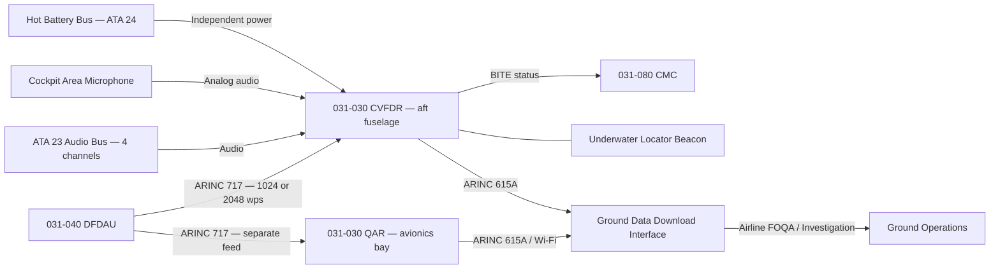
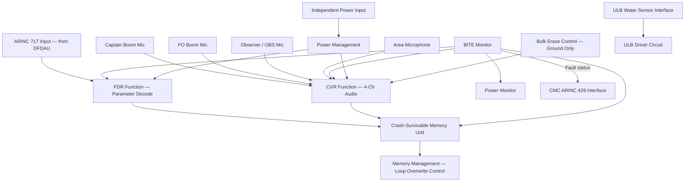
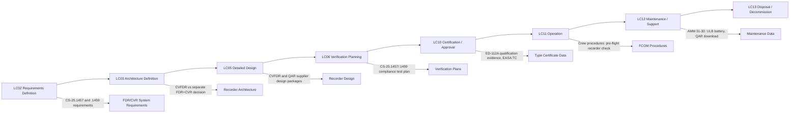

# 031-030 — Recording Systems
### [PROGRAMME-AIRCRAFT] [PROGRAMME-VARIANT] · ATA 31 · Q+ATLANTIDE ATLAS Scaffold

---

## §0 Hyperlink Policy

All internal links use relative paths from the current directory. External regulatory and standards references use anchor links defined in [§20 References](#20-references). Links marked **TBD** indicate targets not yet allocated. Programme-level links traverse five directory levels (`../../../../../`). No absolute URLs are used for internal navigation.

---

## §1 Purpose

This document defines the agnostic ATLAS standard-level architecture context for `031-030 — Recording Systems`.

It describes the controlled scope, functions, interfaces, safety considerations, lifecycle traceability, and S1000D/CSDB mapping logic that programme implementations shall instantiate when this node is applicable.

This document is not a programme design baseline. Programme-specific capacities, locations, part numbers, effectivity, operating limits, maintenance references, and data module codes shall be defined only inside the applicable programme implementation branch.
## §2 Applicability

| Applicability Level | Rule |
|---|---|
| Standard taxonomy | Applies to the ATLAS node `<NODE>` |
| Programme implementation | Conditional; determined by programme architecture, trade studies, certification basis, and applicability model |
| Product configuration | Defined in the programme-specific configuration baseline |
| Effectivity | Defined in the programme CSDB / applicability layer |
| Non-applicability | Must be explicitly stated in the programme impact-study branch when excluded |
## §3 System / Function Overview

The CVFDR is mounted in the aft fuselage pressure zone, specifically positioned to maximise survivability in post-crash scenarios. The aft fuselage location is chosen because accident statistics show it is the most commonly intact structure in survivable impact accidents. The recorder is attached via quick-release mounting (to allow post-accident retrieval) and is equipped with an Underwater Locator Beacon (ULB) that activates automatically upon water immersion. The ULB emits an acoustic pulse at 37.5 kHz detectable at depths up to 6000 m for a minimum of 30 days.

The FDR function within the CVFDR records a minimum of 25 hours of flight data at the input word rate from the DFDAU (ARINC 717 bus). The parameter set includes all mandatory parameters per CS-25.1459 Appendix M, plus supplementary parameters as defined by the programme (including electric propulsion parameters — list TBD). Data is stored in a solid-state non-volatile memory module within the crash-protected memory unit (CSMU). The CVR function records four channels of cockpit audio — captain's boom microphone, first officer's boom microphone, observer boom microphone (if applicable), and area microphone — for a minimum of 2 hours on a continuous loop.

The QAR is located in the avionics bay for easy ground access. It receives the ARINC 717 data stream from the DFDAU (a separate feed from the CVFDR feed to ensure independence) and stores data at full fidelity for the duration of each flight. Data capacity is typically sufficient for 2000+ flight hours before requiring download. The QAR data is downloaded by ground maintenance or operations staff via the ARINC 615A interface panel or a wireless AGDL link, without requiring access to the CVFDR.

---

## §4 Scope

### 4.1 Included
- CVFDR LRU: combined crash-survivable FDR + CVR, aft fuselage mounted, ARINC 717 input, 4-channel audio input
- Crash-Survivable Memory Unit (CSMU) within CVFDR
- Underwater Locator Beacon (ULB) attached to CVFDR
- QAR LRU: solid-state, avionics bay mounted, ARINC 717 input
- Cockpit area microphone (mounted in cockpit ceiling or overhead panel)
- Crew boom microphone interfaces (from ATA 23 audio system)
- ARINC 717 wiring from DFDAU to CVFDR and to QAR
- Independent power supply wiring for CVFDR
- ARINC 615A ground interface for QAR download

### 4.2 Excluded
- DFDAU/DAU — covered under 031-040
- Boom microphones and audio panel — covered under ATA 23 (Communications)
- ACMS — covered under 031-070
- Recorder monitoring via CMC — covered under 031-080
- Electric propulsion sensors providing data to DFDAU — covered under ATA 71/80

---

## §5 Architecture Description

- **CVFDR — combined unit**: single LRU combining FDR (ARINC 717 input) and CVR (4-channel audio input); eliminates separate FDR and CVR installations
- **ED-112A crash survivability**: CSMU withstands impact shock (3400 g), penetration (226 kg from 3 m), static crush (22.25 kN), high temperature (1100°C/60 min), low temperature fire (260°C/10 h), seawater immersion (6000 m/30 days), fresh water immersion
- **ULB integrated**: 37.5 kHz ULB mounted on CVFDR exterior; water-activated; 30-day minimum battery life; 6000 m depth rating
- **Bulk erase inhibit**: CVR bulk erase function disabled in flight; available on ground only with engines off (dual-crew action per AMM)
- **QAR — separate, non-crash-survivable**: solid-state recorder in avionics bay; ARINC 717 input parallel to CVFDR; accessible via ARINC 615A or wireless AGDL
- **Independent CVFDR power**: CVFDR powered from dedicated independent bus and hot battery bus, maintaining recording during electrical failures; independent of avionics main bus
- **Pre-takeoff test**: CVFDR performs automatic ground self-test on power-up; status reported via CMC; crew advisory if recorder fails

---

## §6 Functional Breakdown

| Function ID | Function Title | Description | Applicable Component |
|---|---|---|---|
| F-001 | Flight Parameter Recording (FDR) | Records ARINC 717 data stream (88+ parameters, 25 hours) in CSMU | CVFDR — FDR function |
| F-002 | Cockpit Audio Recording (CVR) | Records 4-channel cockpit audio on 2-hour continuous loop in CSMU | CVFDR — CVR function |
| F-003 | Crash-Survivable Memory Management | Manages non-volatile CSMU storage, record continuity, power-off retention | CVFDR CSMU |
| F-004 | QAR High-Speed Data Recording | Records full ARINC 717 data stream (25+ hours per QAR capacity) | QAR |
| F-005 | Underwater Locator Beacon (ULB) Activation | ULB activates automatically on water immersion; 37.5 kHz acoustic signal | ULB on CVFDR |
| F-006 | Recorder Independent Power Supply | CVFDR powered from independent hot battery bus; maintains recording during avionics bus failures | CVFDR power input |
| F-007 | Bulk Erase Inhibit Logic | Prevents CVR bulk erase in flight; permits on ground with engines off via dual crew/maintenance action | CVFDR control logic |

---

## §7 System Context Diagram

---

## §8 Internal Functional Architecture

---

## §9 Lifecycle Traceability

---

## §10 Interfaces

| Interface ID | System / Chapter | Interface Type | Data / Signal | Direction | Status |
|---|---|---|---|---|---|
| IF-031-030-001 | 031-040 DFDAU | ARINC 717 | Flight parameter data to CVFDR | DFDAU → CVFDR |  |
| IF-031-030-002 | 031-040 DFDAU | ARINC 717 | Flight parameter data to QAR (separate feed) | DFDAU → QAR |  |
| IF-031-030-003 | ATA 23 Audio | Analog audio / 4-wire | 4-channel cockpit audio to CVR | ATA23 → CVFDR |  |
| IF-031-030-004 | ATA 24 Hot Battery Bus | 28VDC | Independent power to CVFDR | ATA24 → CVFDR |  |
| IF-031-030-005 | 031-080 CMC | ARINC 429 | BITE status from CVFDR and QAR | CVFDR/QAR → CMC |  |
| IF-031-030-006 | ATA 45 Ground Interface | ARINC 615A | QAR data download; CVFDR status readout | Ground → QAR/CVFDR |  |
| IF-031-030-007 | 031-070 ACMS | ARINC 717 | ACMS may share ARINC 717 stream from DFDAU | DFDAU → ACMS |  |

---

## §11 Operating Modes

| Mode ID | Mode Name | Description | Entry Condition | Exit Condition |
|---|---|---|---|---|
| OM-001 | Normal Recording | FDR and CVR both recording; CVFDR self-test OK | Aircraft powered; CVFDR serviceability confirmed | Any failure or intentional stop |
| OM-002 | Pre-Takeoff BITE Test | CVFDR performs 5-minute ground power-up self-test; status reported to CMC and crew | Aircraft on ground, power applied | Test complete (pass/fail) |
| OM-003 | CVR Bulk Erase | Crew or maintenance erases CVR audio; requires aircraft on ground, engines off, dual action | Ground only, maintenance procedure | Erase complete |
| OM-004 | ULB Active | ULB transmits 37.5 kHz acoustic signal following water immersion activation | Water immersion sensor triggered | Battery exhausted (30+ days) |
| OM-005 | QAR Download | QAR data downloaded to ground terminal via ARINC 615A or wireless; CVFDR continues recording | Aircraft on ground, ground interface connected | Download complete |
| OM-006 | Recorder Failure | CVFDR or QAR BITE failure; ECAM caution generated; MEL action required | BITE fault detected | LRU replaced; post-maintenance test |

---

## §12 Monitoring and Diagnostics

The CVFDR performs continuous self-monitoring of FDR data integrity (ARINC 717 word synchronisation, parity), CVR audio signal level (all 4 channels), CSMU health, power supply integrity, and ULB battery status. Fault status is reported to the CMC via ARINC 429 within 5 seconds of detection. A CVFDR failure generates an ECAM caution alerting the crew that the recorder is unserviceable; the aircraft is then subject to MEL dispatch restrictions (typically limited to 2 flight days before mandatory repair, per approved MEL).

The QAR performs similar self-monitoring and reports to the CMC. QAR faults do not generate an ECAM caution (the QAR is not a mandatory safety-critical system) but are reported as maintenance messages accessible via the CMC ground maintenance interface.

Ground maintenance staff perform a post-installation functional test per AMM 31-30 after any recorder replacement. The test verifies data recording on the FDR (by playing back a short test sequence from the DFDAU in ground test mode) and audio recording on the CVR (by monitoring area microphone and crew interphone during the test).

---

## §13 Maintenance Concept

The CVFDR is an LRU replaced at base maintenance (the aft fuselage mounting location requires specific access equipment). On-aircraft maintenance is limited to CVFDR connector inspection, mounting check, and ULB battery replacement. ULB battery replacement interval is per manufacturer specification (typically 6 years or upon expiration of the battery date code). QAR is accessible in the avionics bay for LRU replacement at line maintenance. QAR data download is performed without LRU removal via the ground interface panel.

A mandatory periodic test of the complete recording chain (DFDAU to CVFDR and QAR) is required per the AMM at an interval to be defined by the MRB (Maintenance Review Board) process. This test verifies parameter accuracy by comparing DFDAU output with known reference values and confirming CVFDR records the expected values. The CVR audio channel check is performed as part of the pre-flight check procedure in the FCOM.

---

## §14 S1000D / CSDB Mapping

### 14.1 SNS to DMC Mapping

| SNS Code | Subsubject | DMC Prefix | Info Codes Planned | DMRL Status |
|---|---|---|---|---|
| 031-30 | Recording Systems | DMC-<PROGRAMME>-<VARIANT>-031-30 | 040, 300, 400, 520, 720, 941 |  |
| 031-30-01 | CVFDR LRU | DMC-<PROGRAMME>-<VARIANT>-031-30-01 | 040, 400, 520, 720, 941 |  |
| 031-30-02 | QAR LRU | DMC-<PROGRAMME>-<VARIANT>-031-30-02 | 040, 400, 520, 720, 941 |  |
| 031-30-03 | ULB | DMC-<PROGRAMME>-<VARIANT>-031-30-03 | 040, 400 |  |
| 031-30-04 | Cockpit Area Microphone | DMC-<PROGRAMME>-<VARIANT>-031-30-04 | 040, 400, 720 |  |

### 14.2 Information Code Definitions (031-30)

| Info Code | Description | Notes |
|---|---|---|
| 040 | System description — CVFDR/QAR architecture, regulatory basis | AMM/FCOM |
| 300 | Operation — pre-flight recorder check, CVR erase procedure | QRH/FCOM |
| 400 | Maintenance — ULB battery replacement, QAR download, recorder test | AMM |
| 520 | Troubleshooting — recorder BITE fault isolation | FRM/TSM |
| 720 | Removal and installation — CVFDR R&R, QAR R&R, area mic | AMM |
| 941 | Illustrated Parts Data | IPC |

---

## §15 Footprints

### 15.1 Physical Footprint
- CVFDR: aft fuselage, zone 318 (TBD); quick-release mount; ULB attached exterior; access via aft fuselage panel
- QAR: avionics bay, standard ARINC 600 rack, 3 MCU (TBD); accessible without special equipment
- Cockpit area microphone: overhead panel or cockpit ceiling, within 0.5 m of crew positions

### 15.2 Electrical / Data Footprint
- CVFDR power: 28VDC from dedicated hot battery bus; independent of main avionics bus; total power consumption TBD (typical 25–35 W)
- CVFDR data: ARINC 717 (1024 or 2048 wps from DFDAU); 4-channel audio input; ARINC 429 BITE output to CMC
- QAR data: ARINC 717 input (parallel feed from DFDAU); ARINC 615A or wireless AGDL output for download
- Total wiring harness: TBD per aircraft routing study (aft routing from avionics bay to CVFDR location)

### 15.3 Maintenance Footprint
- CVFDR access: aft fuselage access panel, base maintenance level; requires panel removal tooling
- QAR access: avionics bay, line maintenance accessible
- ULB battery replacement: CVFDR removal required; CMM procedure; interval per manufacturer (target 6 years)
- Functional test period: TBD per MRB; expected 24 months or 3000 flight hours

### 15.4 Data Footprint
- CVFDR FDR storage: minimum 25 hours at 1024 wps; solid-state CSMU; data survives power interruption
- CVFDR CVR storage: minimum 2 hours on continuous overwrite loop; 4-channel audio
- QAR storage: solid-state; minimum 2000 flight hours capacity (TBD per supplier)

---

## §16 Safety and Certification Considerations

| Requirement | Source | Description | Compliance Approach | Status |
|---|---|---|---|---|
| CS-25.1457 | EASA CS-25 | CVR: 2-hour minimum, 4-channel audio, crash-survivable | CVFDR qualified to ED-112A; 4-ch audio verified |  |
| CS-25.1459 | EASA CS-25 | FDR: 25-hour minimum, 88+ parameters, crash-survivable, independent power | CVFDR with CSMU and hot battery bus; parameter list per CS-25 App M |  |
| EUROCAE ED-112A | EUROCAE | Crash-survivable recorder MOPS | CVFDR supplier qualification evidence per ED-112A |  |
| ICAO Annex 6 | ICAO | FDR and CVR required for commercial operations | Compliance by installation of CS-25.1457/.1459 compliant CVFDR |  |
| CS-25.1459(a)(4) | EASA CS-25 | FDR failure indication to crew (ECAM caution) | CVFDR BITE fault generates ECAM caution via CMC and FWC |  |

---

## §17 Verification and Validation

| V&V ID | Requirement | Method | Success Criterion | Status |
|---|---|---|---|---|
| VV-031-030-001 | CS-25.1459 — FDR 25-hour retention | Analysis + Ground Test | FDR records 25 hours at 1024 wps; CSMU verified; data readable post-test |  |
| VV-031-030-002 | CS-25.1457 — CVR 2-hour retention, 4-channel | Ground Test | CVR records 2 hours of 4-channel audio; all channels verified with known test audio |  |
| VV-031-030-003 | CS-25.1459 — independent power supply | Analysis + Ground Test | CVFDR records correctly with all main avionics buses de-energised |  |
| VV-031-030-004 | ED-112A crash survivability | Supplier qualification test | CVFDR CSMU qualification test report per ED-112A |  |
| VV-031-030-005 | ULB function | Ground Test | ULB activates on water immersion simulation; 37.5 kHz signal detected |  |
| VV-031-030-006 | CS-25.1459 — 88+ parameter minimum | Analysis | Parameter list verified against CS-25 Appendix M checklist |  |

---

## §18 Glossary

| Term | Acronym | Definition |
|---|---|---|
| Flight Data Recorder | FDR | Crash-survivable device recording aircraft flight parameters for accident investigation |
| Cockpit Voice Recorder | CVR | Crash-survivable device recording cockpit audio for accident investigation |
| Combined CVFDR | CVFDR | Single LRU integrating both FDR and CVR functions in one crash-survivable unit |
| Digital Flight Data Recorder | DFDR | Alternative designation for a solid-state FDR (as opposed to magnetic tape DFDR) |
| Quick Access Recorder | QAR | Non-crash-survivable recorder providing easy access to flight data for operational monitoring |
| ARINC 717 | — | Standard serial digital bus used to transmit flight data from DFDAU to FDR (Harvard biphase, 1024 or 2048 wps) |
| ARINC 767 | — | Alternative/enhanced FDR data standard (may apply for future [PROGRAMME-VARIANT] FDR if very high parameter counts required) |
| Crash-Survivable Memory Unit | CSMU | The internal protected memory module within the CVFDR that must survive crash conditions |
| Underwater Locator Beacon | ULB | Acoustic pinger activated by water immersion, emitting 37.5 kHz signal for post-crash location |
| Bulk Erase | — | Function to erase all CVR audio content; restricted to ground, engines off; cannot be performed in flight |
| Digital Flight Data Acquisition Unit | DFDAU | Unit that acquires and formats aircraft parameter data for the FDR |
| FOQA | — | Flight Operations Quality Assurance — airline programme for safety and efficiency monitoring using QAR data |

---

## §19 Citations

| Citation ID | Source | Title / Description | Relevance |
|---|---|---|---|
| CIT-031-030-001 | EASA | CS-25 §1457 — Cockpit Voice Recorders | Primary CVR regulatory requirement |
| CIT-031-030-002 | EASA | CS-25 §1459 — Flight Data Recorders | Primary FDR regulatory requirement |
| CIT-031-030-003 | EUROCAE | ED-112A — MOPS for Crash Protected Airborne Recorder Systems | CVFDR qualification standard |
| CIT-031-030-004 | ICAO | Annex 6 — Operation of Aircraft | Operational FDR/CVR requirement |
| CIT-031-030-005 | ARINC | ARINC 717 — Flight Data Recorder System | FDR data bus standard |

---

## §20 References

| Ref ID | Document | Title | Version | Link |
|---|---|---|---|---|
| REF-031-030-001 | EASA CS-25 | Certification Specifications — §1457 CVR, §1459 FDR, Appendix M | Amdt 27 | [CS-25](https://www.easa.europa.eu/) |
| REF-031-030-002 | EUROCAE ED-112A | MOPS for Crash Protected Airborne Recorder Systems | 2013 | [ED-112A](https://eurocae.net/) |
| REF-031-030-003 | ICAO Annex 6 | Operation of Aircraft — Part I | 12th Ed | [ICAO](https://www.icao.int/) |
| REF-031-030-004 | ARINC 717 | Flight Data Recorder System | 2003 | [ARINC 717](https://aviation-ia.com/) |
| REF-031-030-005 | 031-040 | Data Acquisition and Concentration | 0.1.0 | [031-040](./031-040-Data-Acquisition-and-Concentration.md) |

---

## §21 Open Issues

| Issue ID | Description | Owner | Priority | Target Date | Status |
|---|---|---|---|---|---|
| OI-031-030-001 | CVFDR vs separate CVR+FDR final configuration decision pending mass/SWaP trade-off | Avionics Architect | High | LC03 |  |
| OI-031-030-002 | QAR ground interface standard — ARINC 615A vs wireless AGDL vs USB not decided | Systems Engineer | Medium | LC03 |  |
| OI-031-030-003 | ULB battery replacement interval — pending supplier data; target 6 years | Avionics Engineer | Low | LC05 |  |
| OI-031-030-004 | Electric propulsion supplementary FDR parameter list not yet defined — requires ATA 71/80 coordination | Systems Engineer | High | LC05 |  |
| OI-031-030-005 | ARINC 717 word rate (1024 vs 2048 wps) — depends on final parameter count; pending parameter list | Systems Engineer | Medium | LC05 |  |

---

## §22 Change Log

| Revision | Date | Author | Description of Change |
|---|---|---|---|
| 0.1.0 | 2026-05-09 | ATLAS Scaffold Generator | Initial scaffold creation — all sections populated; marked DRAFT |

 This document is a programme-controlled scaffold. All content is subject to review by the responsible system expert before formal issue.
