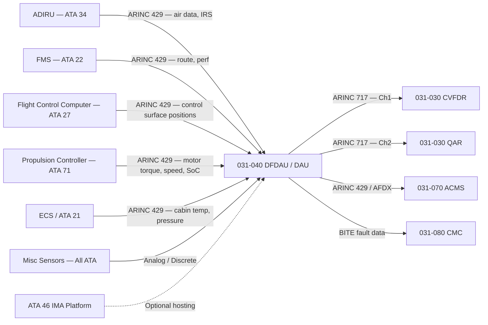
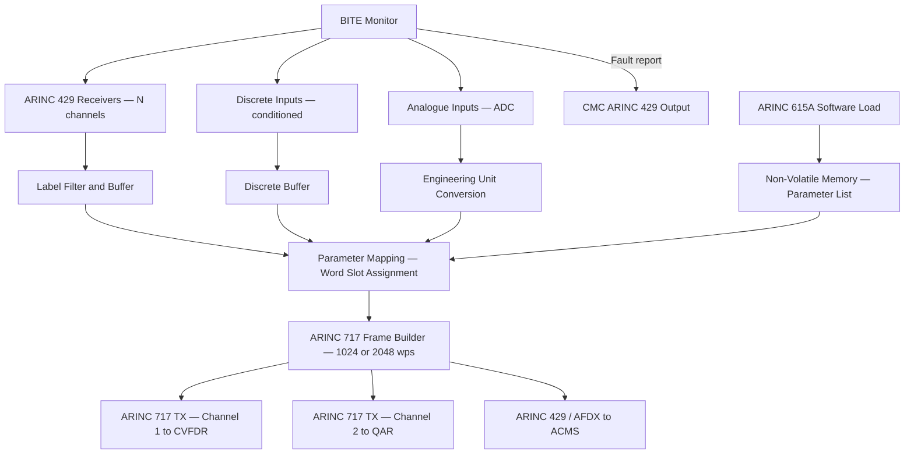
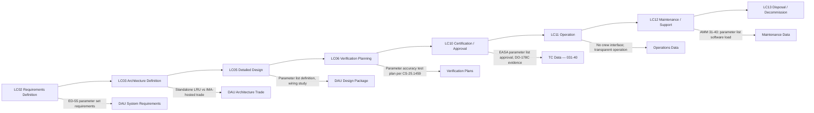

# 031-040 — Data Acquisition and Concentration
### AMPEL360e eWTW · ATA 31 · Q+ATLANTIDE ATLAS Scaffold

---

## §0 Hyperlink Policy

All internal links use relative paths from the current directory. External regulatory and standards references use anchor links defined in [§20 References](#20-references). Links marked **TBD** indicate targets not yet allocated. Programme-level links traverse five directory levels (`../../../../../`). No absolute URLs are used for internal navigation.

---

## §1 Purpose

This document describes the Data Acquisition and Concentration function for the AMPEL360e eWTW aircraft, implemented by the Digital Flight Data Acquisition Unit (DFDAU) or Data Acquisition Unit (DAU). The DFDAU/DAU acquires, concentrates, and formats flight parameter data from all aircraft systems into a single ARINC 717 serial digital data stream for input to the CVFDR, QAR, and ACMS. It is the central node through which all recorded flight data passes and is therefore subject to EUROCAE ED-55 (Requirements for Long Term Data Recording for Commercial Air Transport) for parameter set compliance.

The DFDAU on a conventional commercial transport aircraft is typically a standalone LRU in the avionics bay. On the eWTW, there is a programme-level architecture decision pending on whether the DAU function should be implemented as a standalone LRU or hosted as a software application on the IMA platform. Hosting on IMA would reduce hardware LRU count and potentially allow more flexible parameter management, but requires a formal DAL (Design Assurance Level) assessment and a dedicated IMA partition. The standalone LRU option is lower integration risk and is the baseline assumption until the LC03 trade study is completed.

The DFDAU acquires data from multiple interface types: ARINC 429 digital buses (from ADIRU, FMS, engine/propulsion controllers, flight control computers), discrete inputs (switch states, valve position indicators, gear positions), and analogue inputs (temperature, pressure, and position sensors not available on digital buses). The unit converts all inputs to engineering units, maps them to ARINC 717 words, and transmits a continuous data stream at 1024 or 2048 words per second (word rate to be defined based on final parameter count — see Open Issues).

A critical eWTW-specific extension of the conventional DFDAU function is the acquisition of electric propulsion parameters. Battery State of Charge, motor shaft torque, motor speed (RPM), inverter operating temperature, inverter efficiency, and regenerative braking energy recovery are all parameters not found in conventional aircraft FDR datasets but are essential for eWTW accident investigation and FOQA analysis. These parameters must be added to the mandatory parameter set in coordination with ATA 71/80.

---

## §2 Applicability

| Attribute | Value |
|---|---|
| Programme | AMPEL360e Wide Tube-and-Wing (eWTW) |
| ATA Chapter / Subsubject | 31-40 — Data Acquisition and Concentration |
| Aircraft Variant | eWTW-100 (baseline), eWTW-100ER |
| Certification Basis | CS-25 (EASA), FAR Part 25 (FAA bilateral) |
| S1000D SNS | 031-40 |
| DMC Prefix | DMC-AMPEL360E-EWTW-031-40 |
| Effectivity | All MSN from MSN 001 |

---

## §3 System / Function Overview

The DFDAU/DAU acts as the flight data aggregator for the entire aircraft. It connects to all major avionics and systems buses, acquires the parameters required by CS-25.1459 Appendix M (mandatory parameters), plus supplementary parameters defined by the programme for ACMS and operational monitoring purposes. The DFDAU outputs a continuous ARINC 717 data stream that is distributed simultaneously to the CVFDR, the QAR, and optionally to the ACMS for real-time analysis.

The DFDAU architecture is built around a multi-channel ARINC 429 receiver front-end (capable of receiving up to 64+ ARINC 429 labels per channel from multiple transmitters), a discrete input conditioning module (for switch states and analog-to-digital converters), and an ARINC 717 transmitter output stage. The unit performs engineering unit conversion (scaling raw digital values or analog voltages to engineering units — knots, feet, degrees, pounds) and maps converted values to specific ARINC 717 word positions as defined in the parameter list.

In the context of the eWTW, the DAU may also serve as the primary data aggregation point for the ACMS. The ACMS function (031-070) requires access to a broad set of aircraft parameters including some that are not in the mandatory FDR set. The DAU can provide these supplementary parameters on additional ARINC 717 channels or via an ARINC 429 / AFDX output to the ACMS. This integration avoids duplication of acquisition logic across the DFDAU and ACMS.

---

## §4 Scope

### 4.1 Included
- DFDAU/DAU LRU (or IMA-hosted function — TBD): all acquisition, concentration, formatting, and transmission logic
- ARINC 429 receiver front-end (multiple channels — count TBD per wiring study)
- Discrete signal conditioning (switch state acquisition, position sensor interfaces)
- Analogue input module (temperature sensors, pressure transducers, position sensors not on digital buses)
- ARINC 717 transmitter (output to CVFDR, QAR, and ACMS)
- Parameter list management (mapping of acquired values to ARINC 717 word positions)
- Engineering unit conversion and scaling
- DFDAU BITE and data validity monitoring

### 4.2 Excluded
- CVFDR and QAR (consumers of ARINC 717 output) — covered under 031-030
- ACMS function — covered under 031-070
- Sensors and avionics LRUs providing source data — covered under their respective ATA chapters
- IMA platform hardware — covered under ATA 46

---

## §5 Architecture Description

- **Multi-channel ARINC 429 front-end**: receives data from ADIRU (high-speed, 100 kbps), FMS, flight control computers, propulsion controllers, environmental control, and other systems; up to 64 ARINC 429 labels per channel
- **Discrete conditioning**: debounced discrete inputs for switch states (WOW, gear position, flap/slat gate, engine/motor start) and valve position feedback
- **Analogue input**: 12-bit or higher resolution ADCs for temperature, pressure, and position sensors not available on digital buses; signal conditioning with overvoltage protection
- **ARINC 717 output**: Harvard biphase serial output at 1024 wps (baseline) or 2048 wps (if parameter count exceeds 1024-word frame capacity); dual outputs — one to CVFDR, one to QAR
- **Engineering unit conversion**: all acquired raw values converted to engineering units per parameter list lookup table; conversion coefficients configurable by software load
- **Parameter list in non-volatile memory**: parameter mapping table stored in DFDAU NVM; updated via ARINC 615A software load; version control enforced
- **IMA-hosted candidate**: DAU function may be hosted in IMA platform as software application (DAL C anticipated); decision pending LC03 trade study

---

## §6 Functional Breakdown

| Function ID | Function Title | Description | Applicable Component |
|---|---|---|---|
| F-001 | Analogue Parameter Acquisition | Acquires temperature, pressure, position sensor signals via ADC; converts to engineering units | DAU analogue input module |
| F-002 | Discrete Signal Acquisition | Acquires and debounces switch states, valve position, WOW, gear, flap/slat position | DAU discrete input module |
| F-003 | ARINC 429 Bus Data Concentration | Receives multiple ARINC 429 channels; extracts required labels; buffers data | DAU ARINC 429 receiver |
| F-004 | ARINC 717 Output Formatting | Maps acquired data to ARINC 717 words; formats frame; transmits to CVFDR and QAR | DAU ARINC 717 transmitter |
| F-005 | Engineering Unit Conversion and Scaling | Applies calibration and scaling factors to all acquired raw values | DAU processor function |
| F-006 | BITE and Data Validity Monitoring | Monitors all input channels; detects failed sensors, lost ARINC 429 buses; reports to CMC | DAU BITE function |
| F-007 | IMA Partition Hosting (if applicable) | DAU software application hosted on IMA platform in a dedicated partition with defined interfaces | IMA platform + DAU SW |

---

## §7 System Context Diagram

---

## §8 Internal Functional Architecture

---

## §9 Lifecycle Traceability

---

## §10 Interfaces

| Interface ID | System / Chapter | Interface Type | Data / Signal | Direction | Status |
|---|---|---|---|---|---|
| IF-031-040-001 | ATA 34 ADIRU | ARINC 429 (high-speed) | Air data (CAS, altitude, VSI, TAT, angle of attack) and IRS (attitude, heading) | ADIRU → DAU |  |
| IF-031-040-002 | ATA 22 FMS | ARINC 429 | Route data, fuel quantity, performance parameters | FMS → DAU |  |
| IF-031-040-003 | ATA 27 Flight Controls | ARINC 429 | Control surface positions (aileron, elevator, rudder, spoilers) | FCC → DAU |  |
| IF-031-040-004 | ATA 71 Propulsion | ARINC 429 | Motor torque, speed, inverter temp, battery SoC | Propulsion → DAU |  |
| IF-031-040-005 | ATA 32 Landing Gear | Discrete | Weight-on-wheels, gear position, brake pressure | LG → DAU |  |
| IF-031-040-006 | All ATA (analogue sensors) | Analogue / 0–5V / 4–20 mA | Temperature, pressure, position sensors not on digital bus | Sensors → DAU |  |
| IF-031-040-007 | 031-030 CVFDR | ARINC 717 | Formatted flight parameter data stream to FDR | DAU → CVFDR |  |
| IF-031-040-008 | 031-030 QAR | ARINC 717 | Formatted flight parameter data stream to QAR | DAU → QAR |  |
| IF-031-040-009 | 031-070 ACMS | ARINC 429 / AFDX | Supplementary parameter data to ACMS | DAU → ACMS |  |
| IF-031-040-010 | 031-080 CMC | ARINC 429 | BITE fault status from DAU | DAU → CMC |  |
| IF-031-040-011 | ATA 46 IMA (if hosted) | AFDX / IMA partition interface | IMA hosting of DAU software function | IMA ↔ DAU |  |

---

## §11 Operating Modes

| Mode ID | Mode Name | Description | Entry Condition | Exit Condition |
|---|---|---|---|---|
| OM-001 | Normal Acquisition | All input channels active; full parameter set acquired; ARINC 717 transmitted at nominal word rate | Aircraft powered, all buses healthy | Any failure or power-off |
| OM-002 | Ground Test Mode | DAU operates with reduced parameter set; test values injected on selected channels; used for FDR check | Ground only, maintenance mode active | Ground test complete |
| OM-003 | Degraded — Partial Bus Failure | One or more ARINC 429 inputs lost; DAU continues with valid channels; failed channel flagged in ARINC 717 stream | ARINC 429 bus failure detected | Failed bus restored |
| OM-004 | IMA-Hosted Mode (if applicable) | DAU function running as IMA software partition; same functional behaviour as standalone LRU | IMA platform healthy, partition active | IMA failure — fallback TBD |
| OM-005 | Software Load | Parameter list or firmware update via ARINC 615A; recording suspended during load | Ground, ARINC 615A connected | Load complete; integrity verified |

---

## §12 Monitoring and Diagnostics

The DFDAU/DAU continuously monitors all input channels for data validity. ARINC 429 word freshness (label timeout), analogue input range (out-of-range detection), and discrete input state consistency are all monitored. A detected input failure is flagged in the ARINC 717 output stream using the parameter status field (as defined in the ARINC 717 standard), allowing post-flight analysis software to identify corrupted or missing parameters in the FDR data.

The DAU BITE also monitors its own ARINC 717 output using a loopback check (where hardware permits) and reports overall system health to the CMC via a dedicated ARINC 429 maintenance bus. A DAU failure is classified as a high-priority maintenance event (MEL restrictive) since a failed DFDAU renders the FDR unserviceable, which is a regulatory dispatch limitation per MEL.

---

## §13 Maintenance Concept

If the DAU is a standalone LRU, it is replaced at line maintenance via standard connector removal in the avionics bay. No calibration is required after replacement — all calibration and configuration data is stored in the parameter list software loaded into the replacement DAU via ARINC 615A. The parameter list software has a formal version control process with approval authority defined in the programme Software Management Plan.

If DAU is IMA-hosted, software updates are managed via the IMA ARINC 615A software load process under CMC control. Part number verification is enforced; loading an incorrect parameter list version is detected and rejected by the loader integrity check.

A periodic ground test of the complete acquisition chain is recommended per MRB (interval TBD). This test verifies correct parameter scaling by injecting known values at sensor inputs and comparing the resulting ARINC 717 output word values.

---

## §14 S1000D / CSDB Mapping

### 14.1 SNS to DMC Mapping

| SNS Code | Subsubject | DMC Prefix | Info Codes Planned | DMRL Status |
|---|---|---|---|---|
| 031-40 | Data Acquisition and Concentration | DMC-AMPEL360E-EWTW-031-40 | 040, 300, 400, 520, 720 |  |
| 031-40-01 | DFDAU/DAU LRU | DMC-AMPEL360E-EWTW-031-40-01 | 040, 400, 520, 720 |  |
| 031-40-02 | Parameter List Management | DMC-AMPEL360E-EWTW-031-40-02 | 040, 400 |  |

### 14.2 Information Code Definitions (031-40)

| Info Code | Description | Notes |
|---|---|---|
| 040 | System description — DAU architecture, parameter list, ARINC 717 output | AMM basis |
| 300 | Operation — DAU ground test mode procedure | FCOM/AMM |
| 400 | Maintenance — DAU software load, ground test | AMM |
| 520 | Troubleshooting — BITE codes, failed channel isolation | FRM/TSM |
| 720 | Removal and installation — DAU LRU R&R | AMM |

---

## §15 Footprints

### 15.1 Physical Footprint
- DAU LRU (if standalone): avionics bay, ARINC 600 standard rack, 4–6 MCU form factor (TBD per supplier)
- IMA-hosted (if selected): no additional LRU; IMA platform hosts DAU software partition in existing MCM

### 15.2 Electrical / Data Footprint
- Power: 28VDC essential bus (typical 15–25 W for standalone DAU)
- Inputs: ARINC 429 — up to 20 high-speed (100 kbps) + 20 low-speed (12.5 kbps) channels (TBD per wiring study); analogue — up to 64 channels; discrete — up to 128 channels
- Outputs: 2× ARINC 717 (1024 or 2048 wps) to CVFDR and QAR; 1× ARINC 429 or AFDX to ACMS; 1× ARINC 429 to CMC

### 15.3 Maintenance Footprint
- Parameter list software load: ARINC 615A data loader, ~2 minutes (TBD)
- Standalone DAU LRU replacement: tool-free (TBD); post-replacement software load and ground test required
- No analogue calibration on-aircraft; calibration embedded in parameter list software

### 15.4 Data Footprint
- Parameter list: non-volatile storage in DAU; version-controlled software part number; size TBD
- BITE event log: minimum 100 events stored in DAU NVM; readable via CMC

---

## §16 Safety and Certification Considerations

| Requirement | Source | Description | Compliance Approach | Status |
|---|---|---|---|---|
| EUROCAE ED-55 | EUROCAE | FDR parameter set requirements | Parameter list compliance checked against ED-55 parameter table |  |
| CS-25.1459 Appendix M | EASA CS-25 | Mandatory FDR parameters — minimum 88 parameters, accuracy requirements | Parameter list review against CS-25 Appendix M; accuracy verified by ground test |  |
| DAL C (anticipated) | ARP 4754A / DO-178C | DAU function — failure leads to loss of FDR recording (Major failure condition) | Software development per DO-178C DAL C |  |
| CS-25.1301 | EASA CS-25 | Equipment must perform its intended function | DAU LRU qualification per DO-160G |  |

---

## §17 Verification and Validation

| V&V ID | Requirement | Method | Success Criterion | Status |
|---|---|---|---|---|
| VV-031-040-001 | CS-25.1459 Appendix M — parameter accuracy | Ground Test (signal injection) | Each mandatory parameter within accuracy limits per CS-25.1459 Appendix M spec |  |
| VV-031-040-002 | ED-55 parameter set completeness | Analysis | All ED-55 mandatory parameters present in parameter list and correctly mapped |  |
| VV-031-040-003 | ARINC 717 output continuity | Ground Test | ARINC 717 output continuous; no missed frames for 1 hour duration ground test |  |
| VV-031-040-004 | Degraded mode — partial bus failure | Ground Test | DAU continues ARINC 717 output on remaining channels; failed channels flagged |  |
| VV-031-040-005 | Electric propulsion parameters | Ground Test | Battery SoC, motor torque/speed, inverter temp recorded correctly vs reference |  |

---

## §18 Glossary

| Term | Acronym | Definition |
|---|---|---|
| Digital Flight Data Acquisition Unit | DFDAU | Unit that acquires flight parameters from multiple sources and formats them for the FDR |
| Data Acquisition Unit | DAU | Alternative or simplified designation for DFDAU; may refer to IMA-hosted implementation |
| ARINC 429 | — | Standard serial digital bus used for avionics data communication (Harvard biphase, 100 or 12.5 kbps) |
| ARINC 717 | — | Serial digital bus transmitting FDR data from DFDAU to recorder (Harvard biphase, 1024 or 2048 wps) |
| ARINC 767 | — | Enhanced FDR data standard for very high parameter count applications |
| IMA | — | Integrated Modular Avionics — shared computing platform potentially hosting DAU function |
| Data Concentration | — | Process of collecting data from multiple sources and combining into one formatted output stream |
| Engineering Unit Conversion | — | Process of converting raw digital or analogue sensor values to meaningful physical units (knots, feet, degrees) |
| Word Rate | wps | Words per second — rate at which ARINC 717 data words are transmitted (1024 or 2048 wps) |
| ED-55 | — | EUROCAE document defining FDR parameter set requirements for commercial air transport |
| Parameter List | — | Document and configuration file defining which parameters are recorded and their ARINC 717 word positions |
| Label | — | 8-bit identifier in an ARINC 429 word that defines the type of data being transmitted |

---

## §19 Citations

| Citation ID | Source | Title / Description | Relevance |
|---|---|---|---|
| CIT-031-040-001 | EUROCAE | ED-55 — Requirements for Long Term Data Recording | DAU parameter set compliance standard |
| CIT-031-040-002 | EASA | CS-25 §1459 Appendix M — FDR Parameter Requirements | Mandatory parameter accuracy and list |
| CIT-031-040-003 | ARINC | ARINC 717 — Flight Data Recorder System | FDR data bus standard |
| CIT-031-040-004 | ARINC | ARINC 429 — Digital Information Transfer System | DAU input bus standard |
| CIT-031-040-005 | EUROCAE | ED-12C (DO-178C) — Software Considerations | DAU software development assurance |

---

## §20 References

| Ref ID | Document | Title | Version | Link |
|---|---|---|---|---|
| REF-031-040-001 | EUROCAE ED-55 | Requirements for Long Term Data Recording for Commercial Air Transport | 1990 | [ED-55](https://eurocae.net/) |
| REF-031-040-002 | EASA CS-25 | CS-25 §1459 and Appendix M | Amdt 27 | [CS-25](https://www.easa.europa.eu/) |
| REF-031-040-003 | ARINC 717 | Flight Data Recorder System | 2003 | [ARINC 717](https://aviation-ia.com/) |
| REF-031-040-004 | ARINC 429 | Digital Information Transfer System | 2004 | [ARINC 429](https://aviation-ia.com/) |
| REF-031-040-005 | 031-030 | Recording Systems | 0.1.0 | [031-030](./031-030-Recording-Systems.md) |

---

## §21 Open Issues

| Issue ID | Description | Owner | Priority | Target Date | Status |
|---|---|---|---|---|---|
| OI-031-040-001 | DAU as standalone LRU vs IMA-hosted function — architecture trade study not yet completed | Systems Architect | High | LC03 |  |
| OI-031-040-002 | ARINC 717 word rate (1024 vs 2048 wps) — depends on final parameter count; parameter list not frozen | Systems Engineer | High | LC05 |  |
| OI-031-040-003 | Electric propulsion parameter list for FDR — not yet defined; requires ATA 71/80 inputs | Systems Engineer | High | LC05 |  |
| OI-031-040-004 | DAU ARINC 429 channel count — wiring study not yet initiated | Avionics Engineer | Medium | LC05 |  |
| OI-031-040-005 | DAL assignment for DAU function (C vs B) pending FHA and system safety analysis | Safety Engineer | High | LC03 |  |

---

## §22 Change Log

| Revision | Date | Author | Description of Change |
|---|---|---|---|
| 0.1.0 | 2026-05-09 | ATLAS Scaffold Generator | Initial scaffold creation — all sections populated; marked DRAFT |

 This document is a programme-controlled scaffold. All content is subject to review by the responsible system expert before formal issue.
