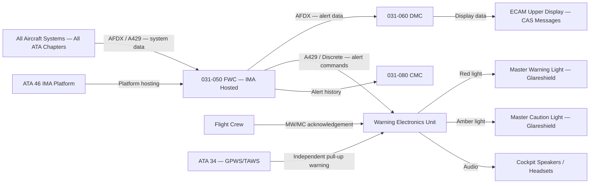
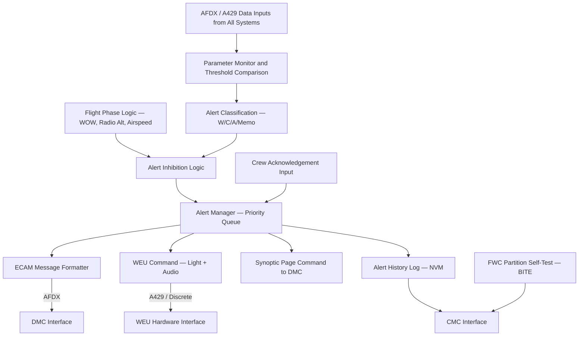
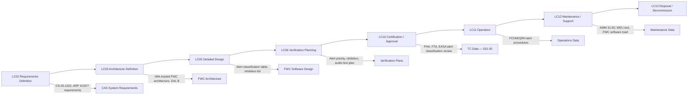

# 031-050 — Central Warning, Caution, and Advisory System
### [PROGRAMME-AIRCRAFT] [PROGRAMME-VARIANT] · ATA 31 · Q+ATLANTIDE ATLAS Scaffold

---

## §0 Hyperlink Policy

All internal links use relative paths from the current directory. External regulatory and standards references use anchor links defined in [§20 References](#20-references). Links marked **TBD** indicate targets not yet allocated. Programme-level links traverse five directory levels (`../../../../../`). No absolute URLs are used for internal navigation.

---

## §1 Purpose

This document defines the agnostic ATLAS standard-level architecture context for `031-050 — Central Warning, Caution, and Advisory System`.

It describes the controlled scope, functions, interfaces, safety considerations, lifecycle traceability, and S1000D/CSDB mapping logic that programme implementations shall instantiate when this node is applicable.

This document is not a programme design baseline. Programme-specific capacities, locations, part numbers, effectivity, operating limits, maintenance references, and data module codes shall be defined only inside the applicable programme implementation branch.
## §2 Applicability

| Applicability Level | Rule |
|---|---|
| Standard taxonomy | Applies to the ATLAS node `<NODE>` |
| Programme implementation | Conditional; determined by programme architecture, trade studies, certification basis, and applicability model |
| Product configuration | Defined in the programme-specific configuration baseline |
| Effectivity | Defined in the programme CSDB / applicability layer |
| Non-applicability | Must be explicitly stated in the programme impact-study branch when excluded |
## §3 System / Function Overview

The FWC software function continuously monitors data from all aircraft systems via the AFDX network and ARINC 429 buses. Each monitored parameter is compared against defined alert thresholds. When a threshold exceedance is detected, the FWC classifies the condition into the appropriate alert level, applies flight-phase-based inhibition logic, and generates the corresponding crew alert. Alert presentation consists of: a message displayed on the ECAM upper display (driven by the DMC based on FWC data), a coloured Master Warning or Master Caution light on the glareshield, and an audio tone from the WEU.

The WEU (Warning Electronics Unit) is a dedicated hardware LRU that generates the physical warning outputs: Master Warning light (red), Master Caution light (amber), and audio tones (continuous repetitive chime for warnings, single chime for cautions). The WEU is not hosted on IMA and remains a standalone hardware unit to ensure that warning light and audio generation are independent of the IMA software environment. This hardware independence ensures that even an IMA platform failure does not prevent basic warning indications.

Alert inhibition is implemented as a flight-phase logic within the FWC. The takeoff inhibit phase (active from 80 kt groundspeed to 400 ft AGL after takeoff) suppresses a defined list of non-critical cautions that could distract the crew from monitoring the takeoff. The landing inhibit phase (active below 400 ft AGL on approach to landing) suppresses a further defined list. The specific lists of inhibited cautions are derived from the functional hazard analysis (FHA) and are subject to regulator review during the certification process.

---

## §4 Scope

### 4.1 Included
- FWC software function (IMA-hosted, DAL B): alert detection, classification, inhibition logic, ECAM page generation commands
- WEU LRU: Master Warning light, Master Caution light, audio tone generation (chime, voice callout if applicable)
- Alert classification table: all aircraft systems alert definitions, thresholds, inhibition list
- Alert inhibition logic: takeoff inhibit, landing inhibit, abnormal phase logic
- ECAM message format and priority management (upper display CAS window)
- Alert acknowledgement and reset logic
- FWC BITE self-monitoring
- [PROGRAMME-VARIANT]-specific electric propulsion alert set

### 4.2 Excluded
- Display unit hardware — covered under 031-010
- DMC (symbol generation and display routing) — covered under 031-060
- Individual system BITE detection (each ATA system detects its own faults) — covered per ATA chapter
- Stall warning and GPWS/TAWS (dedicated systems) — covered under ATA 34 / ATA 22
- TCAS alerting — covered under ATA 34

---

## §5 Architecture Description

- **IMA-hosted FWC**: software application on IMA platform; DAL B; dedicated partition with memory protection and time partitioning; cannot be interrupted by lower DAL functions
- **Redundant FWC partitions**: dual or triple FWC partitions (one per IMA cabinet — TBD); comparison logic ensures alert consistency
- **WEU hardware LRU**: standalone hardware unit independent of IMA; generates Master Warning/Caution lights and audio tones; powered from essential bus
- **Alert distribution**: FWC sends alert data to DMC via AFDX for ECAM display, and to WEU via ARINC 429 / discrete for lights and audio
- **Four-level alert hierarchy**: Warning (red), Caution (amber), Advisory (blue), Memo (green)
- **Inhibition logic**: flight-phase-gated suppression of defined non-critical cautions; emergency alerts never inhibited
- **Electric propulsion alerts**: dedicated alert set for battery, motor, inverter, propulsion mode conditions; integrated into standard CAS display hierarchy
- **Alert history log**: all alerts with timestamps and flight phase context stored in non-volatile memory; readable by CMC for maintenance analysis

---

## §6 Functional Breakdown

| Function ID | Function Title | Description | Applicable Component |
|---|---|---|---|
| F-001 | Alert Detection and Classification | Monitors all system parameters; compares against thresholds; classifies Warning/Caution/Advisory/Memo | FWC IMA function |
| F-002 | Master Warning Light and Audio Tone | Generates red Master Warning light flash and continuous tone for Level 1 alerts | WEU |
| F-003 | Master Caution Light and Single Chime | Generates amber Master Caution light and single chime for Level 2 alerts | WEU |
| F-004 | CAS Message Display on ECAM | Sends structured alert messages to DMC for ECAM upper display presentation | FWC → DMC → ECAM |
| F-005 | Alert Inhibition by Flight Phase | Applies takeoff and landing inhibit logic to non-critical cautions | FWC inhibition logic |
| F-006 | Crew Acknowledgement and Alert Management | Manages alert acknowledgement (Master W/C button cancel), alert queue prioritisation | FWC + WEU |
| F-007 | ECAM Synoptic Page Generation Commands | Sends commands to DMC to display system synoptic page associated with active alert | FWC → DMC |
| F-008 | FWC BITE and Self-Monitoring | Monitors FWC partition health; reports failures to CMC; generates degraded mode alert | FWC partition self-test |

---

## §7 System Context Diagram

---

## §8 Internal Functional Architecture

---

## §9 Lifecycle Traceability

---

## §10 Interfaces

| Interface ID | System / Chapter | Interface Type | Data / Signal | Direction | Status |
|---|---|---|---|---|---|
| IF-031-050-001 | All ATA chapters (system data) | AFDX / ARINC 429 | System parameter data for alert detection | All systems → FWC |  |
| IF-031-050-002 | ATA 71 Propulsion | AFDX / ARINC 429 | Battery SoC, motor fault, inverter status | ATA71 → FWC |  |
| IF-031-050-003 | 031-060 DMC | AFDX | Alert messages and ECAM synoptic page commands | FWC → DMC |  |
| IF-031-050-004 | WEU (hardware) | ARINC 429 / Discrete | Master Warning/Caution light commands, audio commands | FWC → WEU |  |
| IF-031-050-005 | Crew (glareshield) | Discrete | Master Warning/Caution acknowledge button inputs | Crew → WEU → FWC |  |
| IF-031-050-006 | 031-080 CMC | AFDX / ARINC 429 | Alert history and FWC BITE data | FWC → CMC |  |
| IF-031-050-007 | ATA 46 IMA Platform | IMA partition interface | FWC software partition hosting | IMA ↔ FWC |  |
| IF-031-050-008 | ATA 24 Electrical | 28VDC | WEU power supply | ATA24 → WEU |  |

---

## §11 Operating Modes

| Mode ID | Mode Name | Description | Entry Condition | Exit Condition |
|---|---|---|---|---|
| OM-001 | Normal | All alerts monitored and presented; no phase inhibition active | In-flight, no special phase | Entry into inhibit phase |
| OM-002 | Takeoff Inhibit | Non-critical cautions suppressed; above 80 kt to 400 ft AGL; all Warnings active | Groundspeed > 80 kt | 400 ft AGL after takeoff |
| OM-003 | Landing Inhibit | Non-critical cautions suppressed; below 400 ft AGL on approach | 400 ft AGL descent below threshold | Aircraft on ground (WOW) |
| OM-004 | Abnormal / Emergency | All inhibitions removed; all alerts active regardless of flight phase | Emergency alert detected | Condition cleared |
| OM-005 | Ground Maintenance | All alerts testable via CMC; simulated flight phase for test | Aircraft on ground, maintenance mode | Maintenance mode exit |
| OM-006 | Degraded FWC | One FWC partition failed; remaining partition provides full function | FWC partition BITE failure | Partition restored / IMA reboot |

---

## §12 Monitoring and Diagnostics

The FWC software partition performs continuous self-monitoring of its data inputs (AFDX frame arrival, ARINC 429 label freshness), its internal processing health (partition watchdog), and its output integrity (command confirmation from WEU). A failed FWC partition is detected within the IMA health management cycle and reported to the CMC. A FWC BITE failure generates a Master Caution on the remaining functional FWC partition (via WEU) and a maintenance message on the ECAM lower display.

The WEU performs hardware self-test of its light driver circuits (lamp current monitoring) and audio output circuits (output impedance monitoring). A failed WEU bulb or circuit generates a maintenance advisory via the CMC. The alert history log — storing all alerts with timestamps, flight phase, and crew acknowledgement data — is available to maintenance personnel via the CMC ground interface.

---

## §13 Maintenance Concept

The WEU is an LRU replaced at line maintenance. Post-replacement, a functional test per AMM 31-50 verifies all Master Warning and Master Caution light channels and all audio tone outputs. The FWC software function, being IMA-hosted, is updated via the IMA ARINC 615A software load process. Updates to the FWC alert classification table (addition or modification of alert thresholds) are treated as software changes requiring DAL B change management and re-verification per DO-178C.

The alert inhibition list is a configuration parameter within the FWC software; any changes to the inhibition list require a software modification, change impact analysis, and EASA approval for the affected alert categories.

---

## §14 S1000D / CSDB Mapping

### 14.1 SNS to DMC Mapping

| SNS Code | Subsubject | DMC Prefix | Info Codes Planned | DMRL Status |
|---|---|---|---|---|
| 031-50 | Central Warning, Caution, and Advisory | DMC-<PROGRAMME>-<VARIANT>-031-50 | 040, 300, 400, 520 |  |
| 031-50-01 | FWC Software Function | DMC-<PROGRAMME>-<VARIANT>-031-50-01 | 040, 400, 520 |  |
| 031-50-02 | Warning Electronics Unit (WEU) | DMC-<PROGRAMME>-<VARIANT>-031-50-02 | 040, 400, 520, 720 |  |
| 031-50-03 | Alert Classification Table | DMC-<PROGRAMME>-<VARIANT>-031-50-03 | 040 |  |

### 14.2 Information Code Definitions (031-50)

| Info Code | Description | Notes |
|---|---|---|
| 040 | System description — FWC architecture, alert hierarchy, WEU | AMM / FCOM basis |
| 300 | Operation — alert response procedures, Master W/C acknowledgement | FCOM / QRH |
| 400 | Maintenance — WEU test, FWC software load, alert inhibit test | AMM |
| 520 | Troubleshooting — spurious alert, missing alert, WEU fault isolation | FRM |

---

## §15 Footprints

### 15.1 Physical Footprint
- FWC: IMA-hosted — no dedicated LRU; hosted in IMA cabinet (avionics bay, zone TBD)
- WEU: standalone LRU, avionics bay or instrument panel rear, ARINC 600 form factor (TBD)
- Master Warning lights: glareshield, captain and FO positions (2× red, 1 per pilot)
- Master Caution lights: glareshield, captain and FO positions (2× amber, 1 per pilot)
- Cockpit speaker: overhead panel centre, for audio tones

### 15.2 Electrical / Data Footprint
- WEU power: 28VDC essential bus; essential bus ensures WEU operates during avionics load-shedding
- FWC: IMA platform power (no additional LRU power); AFDX for data interfaces
- WEU data: ARINC 429 from IMA (FWC commands); discrete outputs to light assemblies; audio output to speakers/headsets

### 15.3 Maintenance Footprint
- WEU: line LRU replacement; AMM functional test required post-replacement
- Master Warning / Caution light assemblies: lamp replacement per AMM; periodic lamp check (pre-flight crew procedure)
- FWC software: ARINC 615A load via IMA; CMC-controlled; part number verification enforced

### 15.4 Data Footprint
- Alert history log: minimum 1000 alert events with timestamp, flight phase, duration; stored in IMA NVM; readable by CMC
- FWC configuration (alert classification table): NVM in IMA; software-controlled; version-tracked

---

## §16 Safety and Certification Considerations

| Requirement | Source | Description | Compliance Approach | Status |
|---|---|---|---|---|
| CS-25.1322 | EASA CS-25 | Warning, caution, and advisory lights — colour, priority, inhibition logic | FWC alert hierarchy per CS-25.1322; inhibition logic reviewed by EASA |  |
| SAE ARP 4102/7 | SAE | Design guidance for flight deck alerting systems | FWC design reviewed against ARP 4102/7 |  |
| DAL B (FWC) | ARP 4754A / DO-178C | FWC failure — loss of all alerts classified as Hazardous (DAL B requirement) | FWC software developed to DO-178C DAL B |  |
| ARP 4754A | SAE | Development assurance for systems and equipment | FWC function integrated into aircraft-level PSSA/SSA |  |
| CS-25.1309 | EASA CS-25 | Loss of crew alerting — Hazardous failure condition | Dual FWC partition; WEU independent of IMA |  |

---

## §17 Verification and Validation

| V&V ID | Requirement | Method | Success Criterion | Status |
|---|---|---|---|---|
| VV-031-050-001 | CS-25.1322 — alert colour and priority | Analysis + Simulator | Correct colour (red/amber/blue/green) and priority order confirmed in all scenarios |  |
| VV-031-050-002 | Alert inhibition logic — takeoff phase | Simulator + Iron Bird | Non-inhibited cautions not suppressed; inhibited cautions correctly suppressed 80 kt to 400 ft |  |
| VV-031-050-003 | Alert inhibition — Warning alerts never inhibited | Simulator | All Warning-level alerts generated correctly during takeoff and landing inhibit phases |  |
| VV-031-050-004 | WEU audio tone levels | Ground Test | Audio tone levels within regulatory and ARP 4102/7 limits at crew ear position |  |
| VV-031-050-005 | FWC partition failure — degraded mode | Iron Bird | Failure of one FWC partition: remaining partition maintains full alert function |  |
| VV-031-050-006 | Electric propulsion alerts | Ground Test | All [PROGRAMME-VARIANT]-specific propulsion alerts generated correctly with simulated fault conditions |  |

---

## §18 Glossary

| Term | Acronym | Definition |
|---|---|---|
| Crew Alerting System | CAS | Complete system for detecting, classifying, and presenting aircraft condition alerts to the flight crew |
| Flight Warning Computer | FWC | Computer (or IMA software function) that processes system data and generates crew alerts |
| Warning Electronics Unit | WEU | Dedicated hardware LRU that generates physical Master Warning/Caution lights and audio tones |
| Electronic Centralised Aircraft Monitor | ECAM | Display system presenting system status and crew alert messages; generic name used for [PROGRAMME-VARIANT] |
| Alert Inhibition | — | Suppression of defined non-critical alerts during high-workload flight phases (takeoff, landing) |
| Master Warning | — | Red light (per pilot) and continuous tone indicating a Level 1 Warning condition requiring immediate action |
| Master Caution | — | Amber light (per pilot) and single chime indicating a Level 2 Caution condition requiring crew awareness |
| Advisory | — | Level 3 alert displayed in blue; no audio; requires crew awareness but no immediate action |
| Memo | — | Level 4 status indication in green; normal aircraft state information |
| Design Assurance Level | DAL | Level of rigour in development required to meet safety objectives (A = highest, E = lowest) |
| Functional Hazard Analysis | FHA | Systematic identification and classification of aircraft-level failure conditions and their effects |
| AFDX | — | Avionics Full Duplex Switched Ethernet (ARINC 664 Part 7) — main avionics data network |
| Synoptic Page | — | ECAM system diagram page showing component status for the system associated with an active alert |
| Chime | — | Audio tone generated for Caution-level alerts (single chime) |
| Takeoff Inhibit | — | Alert inhibition active from 80 kt groundspeed to 400 ft AGL after liftoff |

---

## §19 Citations

| Citation ID | Source | Title / Description | Relevance |
|---|---|---|---|
| CIT-031-050-001 | EASA | CS-25 §1322 — Warning, Caution, and Advisory Lights | Primary alert system regulation |
| CIT-031-050-002 | SAE | ARP 4102/7 — Flight Deck Alerting System | FWC design guidance |
| CIT-031-050-003 | SAE | ARP 4754A — Development of Civil Aircraft and Systems | FWC system-level development assurance |
| CIT-031-050-004 | EUROCAE | ED-12C (DO-178C) — Software Considerations | FWC DAL B software development |
| CIT-031-050-005 | EASA | CS-25 §1309 — Equipment Failure Condition Analysis | Loss of all alerts failure condition analysis |

---

## §20 References

| Ref ID | Document | Title | Version | Link |
|---|---|---|---|---|
| REF-031-050-001 | EASA CS-25 | Certification Specifications — §1322, §1309 | Amdt 27 | [CS-25](https://www.easa.europa.eu/) |
| REF-031-050-002 | SAE ARP 4102/7 | Aerospace Recommended Practice — Flight Deck Alerting System | 2014 | [ARP 4102](https://www.sae.org/) |
| REF-031-050-003 | SAE ARP 4754A | Development of Civil Aircraft and Systems | 2010 | [ARP 4754A](https://www.sae.org/) |
| REF-031-050-004 | EUROCAE ED-12C | Software Considerations in Airborne Systems | 2011 | [ED-12C](https://eurocae.net/) |
| REF-031-050-005 | 031-060 | Electronic Display and Indication Systems | 0.1.0 | [031-060](./031-060-Electronic-Display-and-Indication-Systems.md) |

---

## §21 Open Issues

| Issue ID | Description | Owner | Priority | Target Date | Status |
|---|---|---|---|---|---|
| OI-031-050-001 | Alert inhibition list definition — which cautions inhibited during takeoff/landing — pending systems safety analysis | Safety Engineer | High | LC05 |  |
| OI-031-050-002 | FWC DAL assignment — B vs A — pending aircraft-level FHA completion | Safety Engineer | High | LC03 |  |
| OI-031-050-003 | Audio tone frequency and character definitions — not yet specified; requires human factors review | Human Factors Lead | Medium | LC05 |  |
| OI-031-050-004 | Electric propulsion alert set — thresholds and classification not yet defined | Propulsion System Engineer | High | LC05 |  |
| OI-031-050-005 | Dual vs triple FWC partition count on IMA — SWaP allocation pending IMA architecture trade | Systems Architect | Medium | LC03 |  |

---

## §22 Change Log

| Revision | Date | Author | Description of Change |
|---|---|---|---|
| 0.1.0 | 2026-05-09 | ATLAS Scaffold Generator | Initial scaffold creation — all sections populated; marked DRAFT |

 This document is a programme-controlled scaffold. All content is subject to review by the responsible system expert before formal issue.
